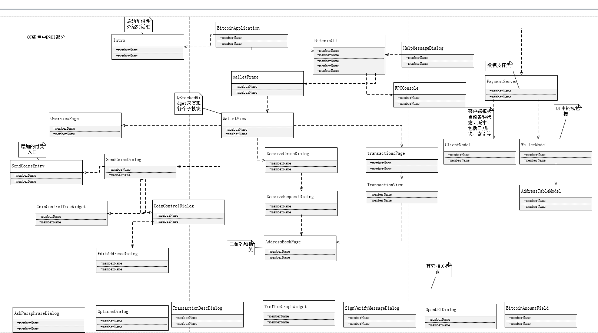

# Qt钱包的UI类图
QT的钱包部分划成两部分来画类图，这样会更清晰一些，先处理UI的部分，钱包整体可以大致划分为三个部分：闪屏和相关介绍；主程序界面；后台操作接口。
 
先把类图画上：
 

 
整体上来说，界面上有四个部分，即 **概况,发送，接收和交易记录** 。其使用一个QStackedWidget控件来实现四个页面的加载。
然后再通过一个公用的WalletView来实现实际界面的生成和转换。其中一些细节性的对话框只是列了出来，没有详细展开。
