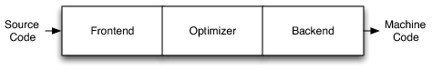
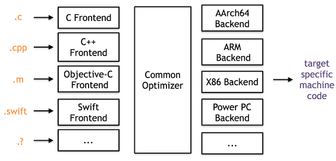
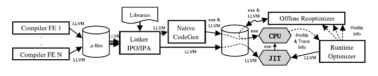
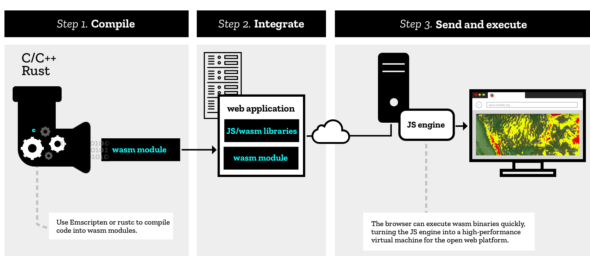
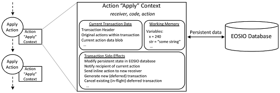
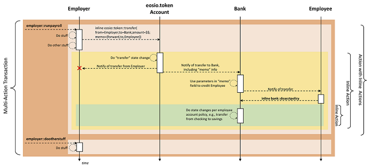
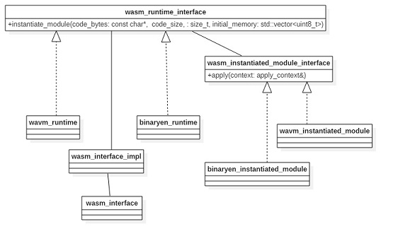

# EOS智能合约和虚拟机分析
EOS虚拟机同经典的EVM，是EOS中运行智能合约的容器，但是从设计上讲它与EOS.IO是分离的。进</br>
一步脚本语言和虚拟机的技术设计与EOS.IO分离。从宏观来讲任何语言或者虚拟机，只要满足条件适</br>
合沙盒模式运行，同时满足一定的运行效率，都可以通过满足EOS.IO提供的API来加入到EOS.IO的消</br>
息传递过程中。以下为github上官方的说明：</br>
>The EOS.IO software will be first and foremost a platform for coordinating</br>
 the delivery of authenticated messages (called Actions) to accounts. The details </br>
 of scripting language and virtual machine are implementation specific details</br>
 that are mostly independent from the design of the EOS.IO technology. Any </br>
 language or virtual machine that is deterministic and properly sandboxed with</br>
 sufficient performance can be integrated with the EOS.IO software API.

本文就EOSIO中的智能合约和虚拟机进行分析来从更加全面的角度来看EOS是如何构建和实现。
<!-- TOC START min:1 max:7 link:true update:true -->
- [EOS智能合约和虚拟机分析](#eos)
  - [相关背景知识](#)
    - [LLVM相关内容](#llvm)
      - [LLVM架构概述](#llvm-1)
      - [LLVM IR介绍与分析](#llvm-ir)
        - [LLVM IR格式](#llvm-ir-1)
        - [LLVM IR指令集](#llvm-ir-2)
        - [LLVM IR类型系统](#llvm-ir-3)
        - [LLVM IR内存模型](#llvm-ir-4)
        - [LLVM IR函数调用](#llvm-ir-5)
        - [LLVM IR示例](#llvm-ir-6)
      - [LLVM JIT介绍与分析](#llvm-jit)
        - [LLVM JIT实现原理](#llvm-jit-1)
        - [LLVM JIT代码示例](#llvm-jit-2)
    - [WebAssembly相关内容](#webassembly)
      - [WebAssembly概述](#webassembly-1)
      - [WebAssembly格式介绍与分析](#webassembly-2)
        - [WebAssembly WAST格式介绍](#webassembly-wast)
        - [WebAssembly WASM格式介绍](#webassembly-wasm)
      - [WASM运行介绍与分析](#wasm)
  - [EOS智能合约分析](#eos-1)
    - [EOS智能合约概览](#eos-2)
    - [EOS智能合约模型和执行流程](#eos-3)
      - [EOS智能合约与Action](#eosaction)
      - [EOS智能合约执行流程](#eos-4)
        - [inline Communication](#inline-communication)
        - [Deferred Communication](#deferred-communication)
        - [执行流程示例](#-1)
    - [EOS智能合约示例说明](#eos-5)
    - [EOS智能合约相关工具](#eos-6)
  - [EOS虚拟机分析](#eos-7)
    - [EOS虚拟机概览](#eos-8)
    - [EOS虚拟机实现思路分析](#eos-9)
    - [EOS虚拟机架构概述](#eos-10)
    - [EOS虚拟机实现与分析](#eos-11)
      - [EOS虚拟机核心接口](#eos-12)
      - [EOS虚拟机架构应用层](#eos-13)
        - [EOS虚拟机客户端合约部署](#eos-14)
        - [EOS虚拟机服务端合约部署](#eos-15)
        - [EOS虚拟机服务端合约的调用执行](#eos-16)
      - [EOS虚拟机Module IR生成](#eosmodule-ir)
      - [VirtualMachine实例化](#virtualmachine)
      - [Binaryen底层解释器](#binaryen)
        - [ModuleInstance的创建](#moduleinstance)
        - [Appply接口的实现和调用](#appply)
        - [CallFunction的实现](#callfunction)
      - [WAVM底层解释器](#wavm)
        - [ModuleInstance的生成](#moduleinstance-1)
        - [Apply接口实现和调用](#apply)
        - [InvokeFunction的实现](#invokefunction)
  - [总结](#-2)

<!-- TOC END -->

## 相关背景知识
### LLVM相关内容
**LLVM相关技术的理解对于我们深入理解EOS虚拟机的运行机制至关重要**，所以必要的LLVM的相关知</br>
识在这里是需要的。同时LLVM作为一个成熟的编译器后端实现，无论从架构还是相关设计思想以及相</br>
关的工具的实现都是值得学习的。
#### LLVM架构概述
概括来讲LLVM项目是一系列分模块、可重用的编译工具链。它提供了一种代码良好的中间表示(IR)，</br>
LLVM实现上可以作为多种语言的后端，还可以提供与语言无关的优化和针对多种CPU的代码生成功能。</br>
最初UIUC的Chris Lattner主持开发了一套称为LLVM(Low Level Virtual Machine)的编译器工具库套</br>
件，但是后来随着LLVM的范围的不断扩大，则这个简写并不代表底层虚拟机的含义，而作为整个项目</br>
的正式名称使用，并一直延续至今。所以现在的LLVM并不代表Low Level Virtual Machine。
>The LLVM Project is a collection of modular and reusable compiler and toolchain</br>
technologies. Despite its name, LLVM has little to do with traditional virtual machines.</br>
The name "LLVM" itself is not an acronym; it is the full name of the project.

LLVM不同于传统的我们熟知的编译器。传统的静态编译器（如gcc）通常将编译分为三个阶段，分别</br>
由三个组件来完成具体工作，分别为前端、优化器和后端，如下图所示。</br>
</br>
LLVM项目在整体上也分为三个部分，同传统编译器一致，如下图所示，不同的语言的前端，统一的</br>
优化器，以及针对不同平台的机器码生成。从图2我们也可以得到启发，如果想实现一门自定义的</br>
语言，目前主要的工作可以集中在如何实现一个LLVM的前端上来。</br>
</br>
LLVM的架构相对于传统编译器更加的灵活，有其他编译器不具备的优势，从LLVM整体的流程中我</br>
们就可以看到这一点，如下图所示为LLVM整体的流程，编译前端将源码编译成LLVM中间格式的文</br>
件，然后使用LLVM Linker进行链接。Linker执行大量的链接时优化，特别是过程间优化。链接得</br>
到的LLVM code最终会被翻译成特定平台的机器码，另外LLVM支持JIT。本地代码生成器会在代码</br>
生成过程中插入一些轻量级的操作指令来收集运行时的一些信息，例如识别hot region。运行时收</br>
集到的信息可以用于离线优化，执行一些更为激进的profile-driven的优化策略，调整native code</br>
以适应特定的架构。</br>
</br>
从图中我们也可以得出LLVM突出的几个优势：
* 持续的程序信息，每个阶段都可以获得程序的信息内容
* 离线代码生成，产生较高的可执行程序
* 便捷profiling及优化，方便优化的实施
* 透明的运行时模型
* 统一，全程序编译

#### LLVM IR介绍与分析
根据编译原理可知，编译器不是直接将源语言翻译为目标语言，而是翻译为一种“中间语言”，即</br>
"IR"。之后再由中间语言，利用后端程序翻译为目标平台的汇编语言。由于中间语言相当于一款编</br>
译器前端和后端的“桥梁”，不同编译器的中间语言IR是不一样的，IR语言的设计直接会影响到编</br>
译器后端的优化工作。LLVM IR官方介绍见：http://llvm.org/docs/LangRef.html</br>

##### LLVM IR格式
>The LLVM code representation is designed to be used in three different forms: as an </br>
in-memory compiler IR, as an on-disk bitcode representation (suitable for fast loading</br>
by a Just-In-Time compiler), and as a human readable assembly language representation.</br>
This allows LLVM to provide a powerful intermediate representation for efficient compiler</br>
transformations and analysis, while providing a natural means to debug and visualize the</br>
transformations.

由上诉的引用得知目前LLVM IR提供三种格式，分别是内存里面的IR模型，存储在磁盘上的二进制</br>
格式，存储在磁盘上的文本可读格式。三者本质上没有区别，其中二进制格式以bc为文件扩展名，</br>
文本格式以ll为文件扩展名。除了以上两个格式文件外，和IR相关的文件格式还有s和out文件，这</br>
两种一个是由IR生成汇编的格式文件，一个是生成的可执行文件格式（linux下如ELF格式），
* bc结尾，LLVM IR文件，二进制格式，可以通过lli执行
* ll结尾，LLVM IR文件，文本格式，可以通过lli执行
* s结尾，本地汇编文件
* out, 本地可执行文件

以上几种不同文件的转化图如下所示，整体上我们可以看一下这几种格式的转化关系，同时从中</br>
我们也可以看出工具clang、llvm-dis、llvm-as等工具的作用和使用。</br>
</br>
中间语言IR的表示，一般是按照如下的结构进行组织的由外到内分别是：</br>
* 模块（Module）
* 函数（Function）
* 代码块（BasicBlock）
* 指令（Instruction）

模块包含了函数，函数又包含了代码块，后者又是由指令组成。除了模块以外，所有结构都是从</br>
值产生而来的。如下为一个ll文件的片段，从中可以简单的看出这种组织关系。</br>
```c++
; ModuleID = 'main.ll'
source_filename = "main.c"
target datalayout = "e-m:e-i64:64-f80:128-n8:16:32:64-S128"
target triple = "x86_64-unknown-linux-gnu"

; Function Attrs: noinline nounwind uwtable
define i32 @add(i32, i32) #0 {
  %3 = alloca i32, align 4
  %4 = alloca i32, align 4
  store i32 %0, i32* %3, align 4
  store i32 %1, i32* %4, align 4
  %5 = load i32, i32* %3, align 4
  %6 = load i32, i32* %4, align 4
  %7 = add nsw i32 %5, %6
  ret i32 %7
}

```
##### LLVM IR指令集
指令集的分类大致可以分为基于栈的，基于运算器的还有基于寄存器的，基于栈的和基于寄存器</br>
的虚拟机目前是比较常见的，两种不同之处主要在运行效率，指令集大小和性能三个方面。LLVM</br>
IR采用的是基于寄存器的满足RISC架构以及load/store模式，也就是说只能通过将load和store</br>
指令来进行CPU和内存间的数据交换。LLVM IR指令集拥有普通CPU一些关键的操作，屏蔽掉了</br>
一些和机器相关的一些约束。LLVM提供了足够多的寄存器来存储基本类型值，寄存器是为SSA形</br>
式（静态单态赋值），这种形式的UD链（use-define chain, 赋值代表define, 使用变量代表use）</br>
便于优化。LLVM指令集仅包含31条操作码。LLVM中的内存地址没有使用SSA形式，因为内存地</br>
址有可能会存在别名或指针指向，这样就很难构造出来一个紧凑可靠的SSA表示。在LLVM中一个</br>
function就是一组基本块的组合，一个基本块就是一组连续执行的指令并以中指指令结束</br>
（包括branch, return, unwind, 或者invoke等），中止指令指明了欲跳转的目的地址。</br>

##### LLVM IR类型系统
LLVM的类型系统为语言无关。每一个SSA寄存器或者显示的内存对象都有其对应的类型。这些类</br>
型和操作码一起表明这个操作的语义，这些类型信息让LLVM能够在低层次code的基础上进行一</br>
些高层次的分析与转换,LLVM IR包含了一些语言共有的基本类型，并给他们一些预定义的大小，</br>
从8bytes到64bytes不等,基本类型的定义保证了LLVM IR的移植性。同时LLVM又包含了四种复杂</br>
类型，pointer，arrays， structures和functions。这四种类型足够表示现有的所有语言类型。为</br>
了支持类型转换，LLVM提供了一个cast操作来实现类型的转换，同时为了支持地址运算，LLVM</br>
提供了getelementptr的命令。LLVM中的许多优化都是基于地址做的（后续的总结再分析）。

##### LLVM IR内存模型
LLVM提供特定类型的内存分配，可以使用malloc指令在堆上分配一个或多个同一类型的内存对象，</br>
free指令用来释放malloc分配的内存（和C语言中的内存分配类似）。另外提供了alloca指令用于</br>
在栈上分配内存对象，该内存对象在通常在函数结尾会被释放。统一内存模型，所有能够取地址的</br>
对象都必须显示分配。局部变量也要使用alloca来显示分配,没有隐式地手段来获取内存地址，这就</br>
简化了关于内存的分析。

##### LLVM IR函数调用
LLVM中对普通函数调用，LLVM提供了call指令来调用附带类型信息的函数指针。这种抽象屏蔽了</br>
机器相关的调用惯例。还有一个不能忽略的就是异常处理，在LLVM中，LLVM提供了invoke和</br>
unwind指令。invoke指令指定在栈展开的过程中必须要执行的代码，例如栈展开的时候需要析构</br>
局部对象等。而unwind指令用于抛出异常并执行栈展开的操作。栈展开的过程会被invoke指令停</br>
下来，执行catch块中的行为或者执行在跳出当前活动记录之前需的操作。执行完成后继续代码执</br>
行或者继续栈展开操作。注意像C++的RTTI则由C++自己的库处理，LLVM并不负责。

##### LLVM IR示例
下面我们编写一个简短的程序并编译成LLVM IR的形式来看LLVM的IR的具体格式和结构如下为一</br>
段程序，保存为main.c</br>
```c
#include <stdio.h>
int add(int a, int b)
{
    return (a + b);
}
int main(int argc, char** argv)
{
    add(3, 5);
    return 0;
}
```
我们使用命令***clang -o0 -emit-llvm main.c -S -o main.ll***编译生成ll文件，ll文件为文本可见</br>
文件，内容如下：</br>
```c++
; ModuleID = 'main.c'
source_filename = "main.c"
target datalayout = "e-m:e-i64:64-f80:128-n8:16:32:64-S128"
target triple = "x86_64-unknown-linux-gnu"
//函数特征如inline
; Function Attrs: noinline nounwind uwtable
define i32 @add(i32, i32) #0 {    //@代表是全局属性 i32为数据类型
%3 = alloca i32, align 4          //申请空间存放变量，%为局部属性
%4 = alloca i32, align 4          //3,4用来存放传入的参数,aling为位宽
store i32 %0, i32* %3, align 4    //将传入的参数放到是对应的存储位置
store i32 %1, i32* %4, align 4
%5 = load i32, i32* %3, align 4   //将参数存到待运算的临时变量中
%6 = load i32, i32* %4, align 4
%7 = add nsw i32 %5, %6           //执行具体的相加操作
ret i32 %7                        //最后返回结果
}
; Function Attrs: noinline nounwind uwtable
define i32 @main(i32, i8**) #0 {
%3 = alloca i32, align 4
%4 = alloca i32, align 4
%5 = alloca i8**, align 8
store i32 0, i32* %3, align 4
store i32 %0, i32* %4, align 4
store i8** %1, i8*** %5, align 8
%6 = call i32 @add(i32 3, i32 5)
ret i32 0
}
```
以上代码不难发现函数add的展开中有部分临时变量的浪费，更为简洁的表达可以如下,当然</br>
际的优化到什么程度要看后续的具体的实现。
```
%3 = add nsw i32 %1, %0
ret i32 %3
```

#### LLVM JIT介绍与分析
JIT技术Just-In-Time Compiler，是一种动态编译中间代码的方式，根据需要，在程序中编</br>
译并执行生成的机器码，能够大幅提升动态语言的执行速度。LLVM设计上考虑了解释执行</br>
的功能,这使它的IR可以跨平台去使用，代码可以方便地跨平台运行，同时又具有编译型语言</br>
的优势，非常的方便。像Java语言，.NET平台等，广泛使用JIT技术，使得程序达到了非常</br>
高的执行效率，逐渐接近原生机器语言代码的性能。
##### LLVM JIT实现原理
JIT引擎的工作原理并没有那么复杂，本质上是将原来编译器要生成机器码的部分要直接写</br>
入到当前的内存中，然后通过函数指针的转换，找到对应的机器码并进行执行。实际编写</br>
过程中往往需要处理例如内存的管理，符号的重定向，处理外部符号等问题。实现一个LLVM</br>
的字节码(bc)的解释器其实并不复杂最好的实例就是LLVM自身的解释器lli,其总共不超过</br>
800行代码实现了一个LLVM的字节码解释器，其源代码的github地址为：</br>
https://github.com/llvm-mirror/llvm/blob/master/tools/lli/lli.cpp</br>

##### LLVM JIT代码示例
下面就以LLVM源代码中的例子来解释LLVM-JIT是如何使用和运行的，在这之前，我们需</br>
要明确llvm中常用的语句表达结构为module-->function-->basicblock-->instruction</br>
-->operator</br>我们主要分析源代码example/HowToUseJIT部分的代码，主要代码片段如下：</br>
该例子中在内存中创建了一个LLVM的module,这个module包含如下两个function:</br>
```c++
int add1(int x) {
  return x+1;
}
int foo() {
  return add1(10);
}
```
针对以上两个函数，创建LLVM内存中IR中间格式的代码如下：</br>
```C++
//首先包含llvm JIT需要的相关头文件
#include "llvm/ADT/STLExtras.h"
#include "llvm/ExecutionEngine/ExecutionEngine.h"
#include "llvm/ExecutionEngine/GenericValue.h"
...............
...............
#include "llvm/Support/raw_ostream.h"
#include <algorithm>
#include <cassert>
#include <memory>
#include <vector>
using namespace llvm;

int main() {
  InitializeNativeTarget(); //初始化本地执行环境，和具体的机器相关
  LLVMContext Context;      //定义一个LLVM的上下文变量
  //创建一个module对象，以便后续我们可以把function放入其中
  //这里这个module对象的名字是text,关联的上下文为上面声明
  std::unique_ptr<Module> Owner = make_unique<Module>("test", Context);
  Module* M = Owner.get();
  //创建add1函数对象，并把该对象加入到module中，
  Function* Add1F = cast<Function>(M->getOrInsertFunction(
                                  "add1",  //函数的名字为add1
                                  Type::getInt32Ty(Context),//函数的参数为int32
                                  Type::getInt32Ty(Context))); //函数的返回值为int32
  //创建一个块，并把块关联到add1函数上，注意函数的最后一个参数
  BasicBlock* BB = BasicBlock::Create(Context, "EntryBlock", Add1F);
  //创建一个basic block的builder,这个builder的工作就是将instructions添加到
  //basic block中去
  IRBuilder<> builder(BB);
  //获得一个指向常量数字1的指针
  Value* One = builder.getInt32(1);
  //获得指向函数add1第一个参数的指针
  assert(Add1F->arg_begin() != Add1F->arg_end()); // 确保有参数
  Argument* ArgX = &* Add1F->arg_begin();          // 获得参数指针
  ArgX->setName("AnArg");        
      // 设置参数名称，便于后续的查找
  //创建加1的指令,并把指令放入到块的尾部
  Value* Add = builder.CreateAdd(One, ArgX);
  //创建返回指令, 至此add1的函数已经创建完毕
  builder.CreateRet(Add);
  //创建函数foo
  Function* FooF = cast<Function>(M->getOrInsertFunction(
                                  "foo", Type::getInt32Ty(Context)));
  BB = BasicBlock::Create(Context, "EntryBlock", FooF);
  //通知builder关联到一个新的block上
  builder.SetInsertPoint(BB);
  Value* Ten = builder.getInt32(10);
  //创建一个函数的调用，并把参数传递进去
  CallInst* Add1CallRes = builder.CreateCall(Add1F, Ten);
  Add1CallRes->setTailCall(true);
  //创建返回结果
  builder.CreateRet(Add1CallRes);
  // 创建JIT引擎，创建参数为上下文
  ExecutionEngine* EE = EngineBuilder(std::move(Owner)).create();
  outs() << "We just constructed this LLVM module:\n\n" << * M;
  outs() << "\n\nRunning foo: ";
  outs().flush();
  //调用函数foo
  std::vector<GenericValue> noargs;
  GenericValue gv = EE->runFunction(FooF, noargs);
  //获得函数返回值
  outs() << "Result: " << gv.IntVal << "\n";
  delete EE;
  //关闭LLVM虚拟机
  llvm_shutdown();
  return 0;
}
```


以上代码在内存中创建了LLVM IR,并调用LLVM JIT的执行引擎运行代码，从中我们得到启</br>
发是如果我们借助LLVM JIT运行我们的合约代码，我们就需要将合约代码最终转化为LLVM</br>
能识别的中间代码IR上，下面将一步一步的分析EOS中是如何利用LLVM-JIT技术实现的虚</br>
拟机运行。


### WebAssembly相关内容
#### WebAssembly概述
WASM在浏览器中运行的效果和Java语言在浏览器上的表现几近相同的时候，但是WASM</br>
不是一种语言，确切的说WASM是一种技术方案，该技术方案允许应用诸如C、C++这种</br>
编程语言编写运行在web浏览其中的程序。更加细节的去讲，WASM是一种新的字节码格</br>
式，是一种全新的底层二进制语法。突出的特点就是精简，加载时间短以及高速的执行模</br>
型。还有一点比较重要，那就是它设计为web多语言编程的目标文件格式。具体可见官网</br>
相关介绍：https://webassembly.org/</br>


#### WebAssembly格式介绍与分析
WebAssembly同LLVM的IR类似，提供两种格式，分别为可读的文本格式wast和二进</br>
制格式wasm,两者最终是等价的，可以通过工具wast2wasm完成wast到wasm的格式转</br>
而工具wasm2wast则执行这一过程的返作用。
##### WebAssembly WAST格式介绍
为了能够让人阅读和编辑WebAssembly，wasm二进制格式提供了相应的文本表示。这</br>
是一种用来在文本编辑器、浏览器开发者工具等工具中显示的中间形式。下面将用基本</br>
语法的方式解释了这种文本表示是如何工作的以及它是如何与它表示的底层字节码。

无论是二进制还是文本格式，WebAssembly代码中的基本单元是一个模块。在文本格式</br>
中，一个模块被表示为一个S-表达式。S-表达式是一个非常古老和非常简单的用来表示树</br>
的文本格式。具体介绍：https://en.wikipedia.org/wiki/S-expression 因此，我们可以</br>
把一个模块想象为一棵由描述了模块结构和代码的节点组成的树。与编程语言的抽象语</br>
法树不同的是，WebAssembly的树是平坦的，也就是大部分包含了指令列表。树上的</br>
每个一个节点都有一对括号包围。括号内的第一个标签表示该节点的类型，其后跟随的</br>
是由空格分隔的属性或孩子节点列表。因此WebAssembly的S表达式结构大概如下所示：</br>
>(module (memory 1) (func))

上面的表达式的含义是模块module包含两个孩子节点，分别是属性为1的内存节点，和</br>
函数func节点。从上面我们知道一个空的模块定义为`module`，那将一个空的模块转化为</br>
wasm将是什么格式，如下所示：</br>
>0000000: 0061 736d              ; WASM_BINARY_MAGIC</br>
0000004: 0d00 0000              ; WASM_BINARY_VERSION

WebAssembly模块中的所有代码都是包含函数里面。函数的结构如下所示：</br>
```c++
( func [signature] [locals] [body] )
```
* signature 函数的签名声明函数的参数和返回值
* local 局部变量，声明了具体的类型
* body 为函数体，一个低级的的指令的线性列表

关于数据类型这里简单说明一下，wasm目前有四种可用的数据类型，分别为i32 i64 f32 f64</br>
关于**签名**我们来看一个签名的具体例子，如下所示表示函数需要两个参数，均为i32类型, </br>
返回值是一个f64类型，参数可以看成是函数调用过程中传递过来的实参初始化后的局部变量。</br>
```c++
(func (param i32) (param i32) (result f64) ... )
```
关于**局部变量**这里需要注意两个操作：get_local和set_local，先看下面的例子：
```c++
(func (param i32) (param f32) (local f64) get_local 0 get_local 1 get_local 2)
```
* get_local 0会得到i32类型的参数
* get_local 1会得到f32类型的参数
* get_local 2会得到f64类型的局部变量

为了便于识记，可以定义变量名的方式来取代索引的方式，具体如下：</br>
```c++
(func (param $p1 i32) (param $p2 f32) (local $loc i32) …)
```
关于**函数体**，在具体介绍函数体之前，我们要明确的一点是，虽然wasm被设计成高效执行</br>
的代码，但是最后wasm的执行依然是一个栈式机器定义的，下面我们参考如下代码：</br>
```c++
(func (param $p i32) ..get_local $p get_local $p i32.add)
```
上面函数的功能概括为i+i，即计算表达是$p+$p的结果，结果将放在最后运行的栈的顶部。</br>
现在我们完整的写出一个module，该module就包含上述的功能，具体的S表达式如下：</br>
```c++
(module
  (func (param $lhs i32) (param $rhs i32) (result i32)
    get_local $lhs
    get_local $rhs
    i32.ad
  )
)
```
上面的描述似乎缺少了什么，那就我们如何才能使用这个函数，于是涉及到函数的导出和调用。</br>
wasm中是通过export来完成导出的，通过call关键字来完成函数调用的，如下一个更加复杂</br>
的例子:
```c++
(module
  (func $getNum (result i32)
    i32.const 42)
  (func (export "getPlus") (result i32)
    call $getNum
    i32.const 1
    i32.add
  )
)
```
函数运行最后的结果在栈顶保存43这个元素，注意其中的(export "getPlus")也可以通过如下的</br>
方式`(export "getPlus" (func $getPlus))`的方式导出。最后一个问题wasm如何导入函数？</br>
下面我们看一个具体的例子 ：
```c++
(module</br>
  (import "console" "log" (func $log (param i32)))
  (func (export "logIt")
    i32.const 13
    call $log))
```
WebAssembly使用了两级命名空间，这里的导入语句是说我们要求从console模块导入log函</br>
数。导出的logIt函数使用call指令调用了导入的函数。</br>
**小结:** 到目前为止我们熟悉了wast的具体格式，关于wast中的外部内存使用，表格等高级内容</br>
可以单独去了解。
##### WebAssembly WASM格式介绍
wasm为WebAssembly的二进制格式，可以通过工具wast2wasm将wast转化为wasm格式，下</br>
面将如下wast转化为wasm, 命令为`wat2wasm simple.wast -o simple.wasm`</br>
上述工具的地址为：https://github.com/WebAssembly/wabt/</br>
```c++
(module
  (func $getNum (result i32)
    i32.const 42)
  (func (export "getPlus") (result i32)
    call $getNum
    i32.const 1
    i32.add
  )
)
```
虽然编译好的二进制文件没有办法进行直观的读取，但是可以借助wat2wasm工具进行查看其</br>
verbose的输出，命令为：`./wat2wasm test.wat -v`输出结果为如下，通过对如下字节流的理</br>
我们可以清晰看到wasm的二进制流格式是什么样的，以及它是如何运行的。基于以下的代码我</br>
可以自己构建一个wasm的解析引擎，引擎需要使用寄存器的设计加上栈的运行控制。
```c++
0000000: 0061 736d                                 ; WASM_BINARY_MAGIC
0000004: 0100 0000                                 ; WASM_BINARY_VERSION
; section "Type" (1)
0000008: 01                                        ; section code
0000009: 00                                        ; section size (guess)
000000a: 01                                        ; num types
; type 0
000000b: 60                                        ; func
000000c: 00                                        ; num params
000000d: 01                                        ; num results
000000e: 7f                                        ; i32
0000009: 05                                        ; FIXUP section size
; section "Function" (3)
000000f: 03                                        ; section code
0000010: 00                                        ; section size (guess)
0000011: 02                                        ; num functions
0000012: 00                                        ; function 0 signature index
0000013: 00                                        ; function 1 signature index
0000010: 03                                        ; FIXUP section size
; section "Export" (7)
0000014: 07                                        ; section code
0000015: 00                                        ; section size (guess)
0000016: 01                                        ; num exports
0000017: 07                                        ; string length
0000018: 6765 7450 6c75 73                        getPlus  ; export name
000001f: 00                                        ; export kind
0000020: 01                                        ; export func index
0000015: 0b                                        ; FIXUP section size
; section "Code" (10)
0000021: 0a                                        ; section code
0000022: 00                                        ; section size (guess)
0000023: 02                                        ; num functions
; 上面的代码基本上都声明和签名，如下代码才是真正的函数体代码
; function body 0
0000024: 00                                        ; func body size (guess)
0000025: 00                                        ; local decl count
0000026: 41                                        ; i32.const
0000027: 2a                                        ; i32 literal
0000028: 0b                                        ; end
0000024: 04                                        ; FIXUP func body size
; function body 1
0000029: 00                                        ; func body size (guess)
000002a: 00                                        ; local decl count
000002b: 10                                        ; call
000002c: 00                                        ; function index
000002d: 41                                        ; i32.const
000002e: 01                                        ; i32 literal
000002f: 6a                                        ; i32.add
0000030: 0b                                        ; end
0000029: 07                                        ; FIXUP func body size
0000022: 0e                                        ; FIXUP section size
```
这里我们要注意一点是wasm中不同section是有一定的排序的，具体的顺序如下
```c+++
user                       0
type                       1
import                     2
functionDeclarations       3  
table                      4
memory                     5
global                     6
export                     7
start                      8
elem                       9
functionDefinitions        10
data                       11
```
#### WASM运行介绍与分析
wasm目前主要的应用领域在于web应用，对于EOS其将作为智能合约的最终格式，其目前运行</br>
在WAVM上，其机制不同于目前浏览的运行和调用方式。首先我们先简单了解一下wasm是如</br>
在浏览器中运行，而WAVM的运行时分析将在EOS虚拟机中进行。</br>
浏览器运行的示例:https://webassembly.org/getting-started/developers-guide/ </br>
这里可以看到利用emcc的工具生成的最终代码，其中主要有wasm文件，js胶水文件和html </br>
调用文件。</br>

## EOS智能合约分析
### EOS智能合约概览
EOS中的智能合约概括的来讲就是对多个输入来组织商议输出的过程，EOS中的合约不仅仅</br>
可以实现例如转账的这种经济行为，也可以描述游戏规则。EOS中的合约作为注册在EOS区</br>
块链上的应用程序并最终运行在EOS的节点上。EOS的智能合约定义了相关的接口，这些接</br>
口包含action,数据结构和相关的参数，同时智能合约实现这些接口，最后被编译成二进制格</br>
式，在EOS中为wasm，节点负责解析字节码来执行对应的智能合约。对于区块链而言，最</br>
终存储的是智能合约的交易(transactions)。
### EOS智能合约模型和执行流程
EOS中的智能合约由两个部分组成分别为action集合和类型的定义：
* action集合，定义和实现了智能合约的行为和功能
* 类型定义，定义了合约需要的内容和数据结构

#### EOS智能合约与Action
EOS中的action操作构建与一个消息架构之上，客户端通过发送消息来触发action的执行，</br>
我们知道智能合约最终的存储形式是一个transaction，那transaction和action之间是什么关</br>
系，在这里一个transaction包含至少一个action，而一个action代表的是大一的操作。如下为</br>
一个包含多个action的transaction。对于如下的transaction，当其中所有的action都成功的</br>
时候，这个transaction才算成功。如果一个transaction成功后，则其receipt生成，但是此时</br>
并不代表transaction已经确认，只是说明确认的概率大一些
```c++
{
  "expiration": "...",
  "region": 0,
  "ref_block_num": ...,
  "ref_block_prefix": ...,
  "net_usage_words": ..,
  "kcpu_usage": ..,
  "delay_sec": 0,
  "context_free_actions": [],
  "actions": [{
      "account": "...",
      "name": "...",
      "authorization": [{
          "actor": "...",
          "permission": "..."
        }
      ],
      "data": "..."
    }, {
      "account": "...",
      "name": "...",
      "authorization": [{
          "actor": "...",
          "permission": "..."
        }
      ],
      "data": "..."
    }
  ],
  "signatures": [
    ""
  ],
  "context_free_data": []
}
```
EOS的智能合约提供一个action handler来完成对action的请求，每次一个action执行在实现</br>
上通过调用apply方法，EOSIO通过创建一个apply的上下文来辅助action的执行，如下的图</br>
说明一个apply上下文的关键元素。</br>


从全局的角度看，EOS区块链中的每个节点将获得智能合约中每个action的一个拷贝，在</br>
所有节点的运行状态中，一些节点在执行智能合约的实际工作，而一些节点在做交易的验</br>
证，因此对于一个合约来说能比较重要的一点就是知道当前运行的实际的上下文是什么,</br>
也就是说目前处在哪个阶段，在这里上下文的标识被记录在action的上下文中来完成上面</br>
的工作，如上面图所示这个上下文标识包括三个部分，分别是reciver，code和action。</br>
receiver表示当前处理这个action的账户，code代表授权了这个合约账户，而action是</br>
当前运行的action的ID。</br>
根据上面我们知道transaction和action的关系，如果一个transaction失败，所有在这个</br>
transaction中的action的计算结果都需要被回滚，在一个action上下文中一个关键的数据</br>
成员就是当前的transaction数据，它包含以下几个部分：</br>
* transaction的头
* 包含transaction中所有的原始的action的容器，容器已经排好序
* 包含transaction中的上下文无关的action的容器
* 一个可以删节的上下文无关的数据，这部分数据是被合约定义的，以一个二进制长</br>
对象集合提供
* 对上述二进制长对象的索引

在EOS中每个action执行的时候都会重新的申请一块新的内存，每个action上下文中的变量是</br>
私有的，即使在同一个transaction中的action，他们的变量也是不可以共享，唯一的一种方式</br>
来共享变量就是通过持久化数据到EOS的数据库中，这些可以通过EOSIO的持久化API来实现。
#### EOS智能合约执行流程
EOS中的智能合约彼此可以进行通讯，例如一个合约调用另外的合约来完成相关操作来完成当</br>
前的transaction，或者去触发一个当前transaction的scope外的一个外来的transaction。</br>
EOS中支持两种不基本的通讯模型，分别是inline和deferred两种，典型的在当前transaction</br>
中的操作是inline的方式的action的实例，而被触发的一个将要执行的transaction则是一个deferred</br>
action的实例。在智能合约之间的通讯我们可以看做是异步的。
##### inline Communication
Inline的通讯模式主要体现在对需要执行的action的请求过程直接采用调用的方式，Inline方式</br>
下的action在同一transaction的scope和认证下，同时action被组织起来用于执行当前的transaction</br>
Inline action可以被看做是transaction的嵌套，如果transaction的任何一个部分执行失败，那么</br>
inline action也只会在transaction的剩下部分展开, 调用inline action不会产生任何对外的通知</br>
无论其中是成功还是失败，综上也就是说inline action的作用范围是在一个transaction中的。

##### Deferred Communication
Deferred的通讯模式采用的是通过通知另一个节点transaction的方式来实现的。一个Deferred</br>
actions一般会稍后调用，对于出块生产者来说并不保证其执行。对于创造Deferred action的</br>
transaction来说它只能保证是否创建和提交成功，对于是否执行成功与否无法保证。对于一个</br>
Deferred action来说其携带合约的验证信息进行传递。特殊的一个transaction可以取消一个</br>
deferred的transaction。
##### 执行流程示例
如下如未EOS wiki上给出的一个包含inline action的transaction的执行流程。</br>
</br>

从图中我们可以看到，这个transaction中有两个inline action，分别是
* employer::runpayroll
* employer::dootherstuff

由上面的图，我们可以很清晰的知道，action通过调用inline action并递归的调用最后来完成</br>
整个transactio的执行。同上对于上面的一个转账发薪酬的场景也可以通过Deferred的方式</br>
来完成，如下图所示:</br>
</br>
### EOS智能合约示例说明
EOS智能合约一般用c++语言实现，可以通过工具来进行编译成最后的智能合约二进制码，一</br>
段典型的智能合约代码如下：
```c++
#include <eosiolib/eosio.hpp>

using namespace eosio;

class hello : public eosio::contract {
  public:
      using contract::contract;
      /// @abi action
      void hi( account_name user ) {
         print( "Hello, ", name{user} );
      }
};

EOSIO_ABI( hello, (hi) )
```
对于每一个智能合约而言，其必须提供一个apply的接口，这个接口函数需要监听所有输入的aciton</br>
并作出对应的动作，apply用recevier，code和action来过来输入并执行特定的操作。形式如下:</br>
```c++
if (code == N(${contract_name}) {
   // your handler to respond to particular action
}
```
EOS中的的宏EOSIO_ABI屏蔽了底层实现的细节，宏展开如下所示：
```c++
#define EOSIO_ABI( TYPE, MEMBERS ) \
extern "C" { \
   void apply( uint64_t receiver, uint64_t code, uint64_t action ) { \
      auto self = receiver; \
      if( action == N(onerror)) { \
         eosio_assert(code == N(eosio), \
         "onerror action's are only valid from the \"eosio\" system account"); \
      } \
      if( code == self || action == N(onerror) ) { \
         TYPE thiscontract( self ); \
         switch( action ) { \
            EOSIO_API( TYPE, MEMBERS ) \
         } \
         /* does not allow destructor of thiscontract to run: eosio_exit(0); * / \
      } \
   } \
} \

```
其中EOSIO_ABI的宏定义如下：
```c++
#define EOSIO_API( TYPE,  MEMBERS ) \
   BOOST_PP_SEQ_FOR_EACH( EOSIO_API_CALL, TYPE, MEMBERS )
```
我们继续展开宏EOSIO_API_CALL如下:
```c++
#define EOSIO_API_CALL( r, OP, elem ) \
   case ::eosio::string_to_name( BOOST_PP_STRINGIZE(elem) ): \
      eosio::execute_action( &thiscontract, &OP::elem ); \
      break;
```
这样我们就明确一个只能合约被调用的时候最后是如何反应到代码层面进行路由调用的。</br>
### EOS智能合约相关工具
由上文我们知道一个智能合约源文件大概的样子，现在我们来看一下如何生成EOS虚拟机支持的格</br>
式。EOS虚拟机目前支持加载wast和wasm两种格式的智能合约。现在看下EOS中智能合约是如何</br>
构建的，如下代码为tools/eosiocpp.in中关于合约的编译脚本，其中省略部分非关键代码：</br>
```shell
function build_contract {    
($PRINT_CMDS; @WASM_CLANG@ -emit-llvm -O3 --std=c++14 --target=wasm32 -nostdinc \
  -nostdlib -nostdlibinc -ffreestanding -nostdlib -fno-threadsafe-statics -fno-rtti \
  -fno-exceptions -I ${EOSIO_INSTALL_DIR}/include \
  -I${EOSIO_INSTALL_DIR}/include/libc++/upstream/include \
  -I${EOSIO_INSTALL_DIR}/include/musl/upstream/include \
  -I${BOOST_INCLUDE_DIR} \
  -I $filePath \
  -c $file -o $workdir/built/$name)

  ($PRINT_CMDS; @WASM_LLVM_LINK@ -only-needed -o $workdir/linked.bc $workdir/built/* \
    ${EOSIO_INSTALL_DIR}/usr/share/eosio/contractsdk/lib/eosiolib.bc \
    ${EOSIO_INSTALL_DIR}/usr/share/eosio/contractsdk/lib/libc++.bc \
    ${EOSIO_INSTALL_DIR}/usr/share/eosio/contractsdk/lib/libc.bc
  )
  ($PRINT_CMDS; @WASM_LLC@ -thread-model=single --asm-verbose=false -o \
    $workdir/assembly.s $workdir/linked.bc)
  ($PRINT_CMDS; ${EOSIO_INSTALL_DIR}/bin/eosio-s2wasm -o $outname -s \
    16384 $workdir/assembly.s)
  ($PRINT_CMDS; ${EOSIO_INSTALL_DIR}/bin/eosio-wast2wasm $outname \
    ${outname%.*}.wasm -n)
}
```
由上述的代码可知，智能合约的编译主要过程如下：
* 利用clang以wasm32为目标，生成中间文件bc
* 利用LLVM-link链接上一个步骤生成bc文件和标准库bc文件生成link.bc文件
* 利用LLVM的llc生成s汇编文件assembly.s
* 应用eosio-s2wasm工具讲s文件转化为wast文件
* 应用eosio-wast2wasm工具将wast文件转化为最终的wast文件

通过以上的步骤我们就生成了一个以wasm为格式的智能合约，上面一共经历了5个步骤才将我们的</br>
源文件变异成wasm，其实还可以应用开源工具emcc来编译，但是该工具并不是针对智能合约设计</br>
工具比较庞大，我们把没有应用emcc的wasm的生成方案统一称为wasm without emcc。</br>
由于上述的编译过程很复杂，这里需要分析说明一下为什么采用这种方式？</br>
>The Runtime is the primary consumer of the byte code. It provides an API for </br>
instantiating WebAssembly modules and calling functions exported from them. </br>
To instantiate a module, it initializes the module's runtime environment </br>
(globals, memory objects, and table objects), translates the byte code into LLVM</br>
IR, and uses LLVM to generate machine code for the module's functions.

由上文我们得知，WAVM是将wasm或者wast文件转化为LLVM的IR表示，然后通过LLVM运行代码来实现</br>
最后的程序运行，那么问题来了，***对于智能合约，为什么我们不直接用clang生成bc文件，然后修改</br>
lli(前文介绍过代码不超过800行)来实现虚拟机呢？*** 个人分析主要有以下几个原因：
* 如果EOS定义智能合约二进制格式为bc，文本方式为ll，也就是对标wasm和wast个人觉得利用lli</br>
没有问题，关键受限于LLVM。
* 处于对未来的考虑，毕竟对wasm支持的解释容器比较多，方便多种虚拟机的接入，但是目前看大多数</br>
容器都是浏览器js引擎，因此解决js胶水代码仍然是个问题，所以寻求一个wasm的虚拟机目前看WAVM</br>
比较合适
* WAVM实现了wasm的虚拟机，而且EOS也声称不提供虚拟机，也就是说wasm的选型限制了以上的工具链</br>

这里还有个重要的文件生成，那就是abi的文件的构建，这个的实现也在eosiocpp.in中，abi这里的</br>
作用是什么？就是它会描述一个合约对外暴露的接口，具体为JSON格式，用户可以通过eosc工具构建</br>
合适的message来调用对应的接口。eosiocpp中generate_abi的部分代码如下：
```
  ${ABIGEN} -extra-arg=-c -extra-arg=--std=c++14 -extra-arg=--target=wasm32 \
  -extra-arg=-nostdinc -extra-arg=-nostdinc++ -extra-arg=-DABIGEN \
  -extra-arg=-I${EOSIO_INSTALL_DIR}/include/libc++/upstream/include \
  -extra-arg=-I${EOSIO_INSTALL_DIR}/include/musl/upstream/include \
  -extra-arg=-I${BOOST_INCLUDE_DIR} \
  -extra-arg=-I${EOSIO_INSTALL_DIR}/include -extra-arg=-I$context_folder \
  -extra-arg=-fparse-all-comments -destination-file=${outname} -verbose=0 \
  -context=$context_folder $1 --}}
```
最后通过二进制工具cleos来部署智能合约，例如：
```c++
 cleos set contract eosio build/contracts/eosio.bios -j -p eosio
```
* 第一个eosio为账户
* 第二个eosio为权限
* -j 以json输出结果
* build/contracts/eosio.bios 为智能合约所在目录

同时可以通过cleos工具来推送action测试contract，例如如下命令：
```c++
cleos push action eosio.token create '{"issuer":"eosio", "maximum_supply":"
1000000000.0000 EOS", "can_freeze":0, "can_recall":0, "can_whitelist":0}'
-j -p eosio.token
```
* esoio.token为contract
* create为action
* 后面json格式的为具体的数据
* -p为指定权限

小结：EOS智能合约通过复杂的工具链最后生成wasm或者wast，并配合abi文件最后进行分发到EOS</br>
系统中去。

## EOS虚拟机分析
EOS在技术白皮书中指明并不提供具体的虚拟机实现，任何满足沙盒机制的虚拟机都可以运行在EOSIO</br>
中，源代码层面，EOS提供了一种虚拟机的实现，虚拟机以wasm为输入，利用相关的技术完成代码的</br>
快速执行。
### EOS虚拟机概览
EOS虚拟机代码实现来自WAVM，参见具体的文件发现其基本上都是wasm-jit目录下的内容从项目信</br>
息可以看出其是fork AndrewScheidecker/WAVM的实现，这个也是为啥很多人瞧不起EOS虚拟机的</br>
原因，但是Andrew Scheidecker本人主要在提交代码，所以对他下结论为时尚早，作者</br>
Andrew Scheidecker是虚幻引擎的主要贡献者，代码质量至少能有所保障。</br>
首先是EOS虚拟机的代码，在github上有两个地方可以查看到EOS中虚拟机的代码分别为：</br>
* https://github.com/EOSIO/eos
* https://github.com/EOSIO/WAVM

其中eos目录下为这个EOS的代码其中虚拟机部分主要存在于如下几个关键的目录下：
* libraries/chain，主要是定义虚拟机相关接口
* libraries/wasm-jit，主要是智能合约执行的实现
* contracts目录下，为相关的ABI辅助源代码

>This is a standalone VM for WebAssembly. It can load both the standard binary</br>
format, and the text format defined by the WebAssembly reference interpreter.</br>
For the text format, it can load both the standard stack machine syntax and </br>
the old-fashioned AST syntax used by the reference interpreter, and all of the</br>
testing commands

由上述的描述我们可以知道WAVM支持两种的输入分别是二进制的输入和文本格式的输入,对应的具</br>
体的格式是wasm和wast。参见WAVM使用说明如下：
>The primary executable is wavm:</br>
Usage: wavm [switches] [programfile] [--] [arguments]</br>
  in.wast|in.wasm		Specify program file (.wast/.wasm)</br>
  -f|--function name		Specify function name to run in module rather than main</br>
  -c|--check			Exit after checking that the program is valid</br>
  -d|--debug			Write additional debug information to stdout</br>
  --				Stop parsing arguments</br>

由上我们得知EOS的智能合约支持两种格式分别就是上文描述的wasm和wast。</br>
### EOS虚拟机实现思路分析
EOS在智能合约目标格式选择上应该做过一定的考虑，对于wasm的选择可能出于社区支持和实现上</br>
的双重考虑，这点在采用LLVM-JIT技术就有所体现。EOS在选择如何实现虚拟机的方案上采用的是</br>
开放的态度，即如白皮书所讲。EOS为了使项目完整，需要提供一个的虚拟机。首先选定wasm不仅</br>
仅是因为支持的大厂比较多，还有出于多语言支持的考虑，敲定wasm目标格式后痛苦的事情就来了</br>
目前需要一个能执行他的虚拟机容器,目前都是浏览器支持，落地就是JS的解析引起支持，如果用JS</br>
解析引擎，工程量大，发布还要附带js胶水代码加麻烦的还有结果如何安全获取。于是需要的是一个</br>
wasm的执行的轻量级虚拟机，WAVM成了首选，多亏AndrewScheidecker之前写过一个这样的项</br>
目，于是直接Fork，加些接口就完成了implementation。***从另外一个角度看*** 如果不考虑生态的问题，</br>
LLVM中的bc也可以作为智能合约的语言，通过修改lli来完成虚拟机的实现，而且工程实践更加简单，</br>
但是问题就是和LLVM绑定了，虚拟机只能和LLVM混，这个限制太大。

### EOS虚拟机架构概述
EOS虚拟机面对的编译的智能合约格式为wasm或者wast两种格式，这两种格式本质上没有区别，那么</br>
如何解析这两种格式并执行内部的相关指令就称为虚拟机主要考虑的问题，EOS的实现思路如下：
* 将wasm转化为LLVM能识别的IR中间语言。
* 借助LLVM-JIT技术来实现IR的语言的运行。

这里有两个关键点，一个是如何将wasm格式文件转化为IR中间文件，第二个就是如何保证IR的相关</br>
运行时环境的维护。以下几个章节将解释相关的问题。

### EOS虚拟机实现与分析
#### EOS虚拟机核心接口
我们先High Level的看一下EOS虚拟机是如何响应外部执行需求的，这个主要体现在对外接</br>
层面EOS虚拟机接口对外暴露虚拟机实例创建和合约执行入口，具体声明在如下路径文件中</br>
***libraries/chain/inlcude/eosio/chain/webassembly/runtime_interface.hpp***</br>
文件中主要对外暴露了两个接口，分别为instantiate_module和apply,分别声明在两个不同</br>
的类中，如下为接口的具体声明：</br>
```c++
class wasm_instantiated_module_interface {
public:
  virtual void apply(apply_context& context) = 0;
  virtual ~wasm_instantiated_module_interface();
};
class wasm_runtime_interface {
public:
  virtual std::unique_ptr<wasm_instantiated_module_interface>
  instantiate_module(const char* code_bytes,
                     size_t code_size,
                     std::vector<uint8_t> initial_memory) = 0;
  virtual ~wasm_runtime_interface();
};
```
接口apply实现在文件\libraries\chain\include\eosio\chain\webassembly\wavm.hpp中</br>
接口instantiate_module实现在\libraries\chain\webassembly\wavm.hpp中</br>
接口**apply**的实现如下代码所示：</br>
```c++
void apply(apply_context& context) override {
  //组织参数列表
  //这里需要说明一下每个被分发的action通过scope就是account和
  //function就是name来定义的
  vector<Value> args = {
    Value(uint64_t(context.receiver)),//当前运行的代码
    Value(uint64_t(context.act.account)),//action中的账户
    Value(uint64_t(context.act.name))};//action的名称
  call("apply", args, context);
}
```
下面来看call具体执行的逻辑功能，这里我们将看到运行在虚拟机上的代码是如何启动的。</br>这里我们*一行一行*来进行分析：</br>
```c++
void call(
  const string &entry_point, //函数入口点，例如：main是一个exe的入口
  const vector <Value> &args, //函数参数列表
  apply_context &context) {//需要执行的具体的内容
  try {
    //首先根据entry_point（这里为apply)获取到传入的代码中是否有名字为
    //entry_point的object,通俗的讲就是根据函数名找到函数指针
    FunctionInstance* call = asFunctionNullable(
                      getInstanceExport(_ instance,entry_point));
    if( !call )//如果没有找到函数的入口在直接返回，注意此处无异常
      return;
    //检查传入的参数个数和函数需要的个数是否相等，注意为什么没有检查类型
    //因为由上述函数apply得知类型均为uint_64,内部对应类型IR::ValuType::i64
    FC_ASSERT( getFunctionType(call)->parameters.size() == args.size() );

    //获得内存实例，在一个wavm_instantiated_modules中，内存实例是被重用的，
    //但是在wasm的实例中将不会看到getDefaultMemeory()
    MemoryInstance* default_mem = getDefaultMemory(_ instance);
    if(default_mem) {
      //重置memory的大小为初始化的大小，然后清零内存
      resetMemory(default_mem, _ module->memories.defs[0].type);
      char* memstart = &memoryRef<char>(getDefaultMemory(_ instance), 0);
      memcpy(memstart, _ initial_memory.data(), _ initial_memory.size());
    }
    //设置运行上下文的内存和执行的上下文信息
    the_running_instance_context.memory = default_mem;
    the_running_instance_context.apply_ctx = &context;
    //重置全局变量
    resetGlobalInstances(_ instance);
    //调用module的起始函数，这个函数做一些环境的初始化工作
    //其在instantiateModule函数中被设置
    runInstanceStartFunc(_ instance);
    //invoke call(上面已经指向apply函数的地址了)
    Runtime::invokeFunction(call,args);
  } catch( const wasm_exit& e ) {
  } catch( const Runtime::Exception& e ) {
    FC_THROW_EXCEPTION(wasm_execution_error,"cause: ${cause}\n${callstack}",
    ("cause", string(describeExceptionCause(e.cause)))
    ("callstack", e.callStack));
  } FC_CAPTURE_AND_RETHROW()
}
```
上述代码中通过call寻找entry_point名字的函数，这里为apply，注意上一个主题中EOSIO_ABI</br>
的展开中为apply函数的实现，如下：
```c++
#define EOSIO_ABI( TYPE, MEMBERS ) \
extern "C" { \
   void apply( uint64_t receiver, uint64_t code, uint64_t action ) { \
      auto self = receiver; \
      if( action == N(onerror)) { \
         eosio_assert(code == N(eosio), \

```
**总结**：上面通过接口的了解和代码的阅读分析快速的从比较高的视角看到EOS虚拟机执行</br>
的大体过程，下面我们就从细节上来了解EOS虚拟的采用的技术和最后是如何应用在EOS系统中的。
#### EOS虚拟机架构应用层
我们这里将EOS虚拟机关于智能合约部署以及虚拟机外层调用逻辑统一称为虚拟机应用层，现在分别进行</br>
说明，先从虚拟机的外围了解其整体的工作流程。
##### EOS虚拟机客户端合约部署
首先看命令行工具***cleos是如何将智能合约发送给EOSIO程序***的，具体的代码见文件:</br>
eosio\eos\programs\cleos\main.cpp。如下代码片段为添加命令行参数。</br>
```c++
auto contractSubcommand = setSubcommand->add_subcommand(
  "contract",
  localized("Create or update the contract on an account"));
contractSubcommand->add_option(
  "account",
  account,
  localized("The account to publish a contract for"))
  ->required();
contractSubcommand->add_option(
  "contract-dir",
  contractPath,
  localized("The path containing the .wast and .abi"))
  ->required();
contractSubcommand->add_option(
  "wast-file",
  wastPath,
  localized("The file containing the contract WAST or WASM relative to contract-dir"));
auto abi = contractSubcommand->add_option(
  "abi-file,-a,--abi",
  abiPath,
  localized("The ABI for the contract relative to contract-dir"));
```
上述的命令为set命令的子命令，现在看一下命令是如何发送出去的，主要在如下两个回调函数</br>
* set_code_callback
* set_abi_callback

两个回调函数，我们以set_code_callback分析是如何运行的，关键代码如下：
```c++
actions.emplace_back( create_setcode(account, bytes(wasm.begin(), wasm.end()) ) );
if ( shouldSend ) {
  std::cout << localized("Setting Code...") << std::endl;
  send_actions(std::move(actions), 10000, packed_transaction::zlib);
}
```
如上代码知道其是调用send_actions将智能合约的相关信息已一个action的形式发送出去，</br>
而send_actions将调用push_action函数，最后push_action将调用关键函数call代码如下:</br>
```c++
fc::variant call( const std::string& url,
  const std::string& path,
  const T& v ) {
try {
  eosio::client::http::connection_param * cp =
  new eosio::client::http::connection_param((std::string&)url, (std::string&)path,
  no_verify ? false : true, headers);
  return eosio::client::http::do_http_call( *cp, fc::variant(v) );
}
}
```
由上可知客户端最后通过http的方式将部署智能合约的代码发送到了EOSIO上。注意其中的url具体为</br>
```c++
const string chain_func_base = "/v1/chain";
const string push_txn_func = chain_func_base + "/push_transaction";
```
##### EOS虚拟机服务端合约部署
上面我们了解了合约是如何通过客户端传递到服务端的，现在我们重点分析一下服务端是如何部署</br>
或者更加准确的说存储合约的。我们重点分析一下nodeos（eosio\eos\programs\nodeos）是如何</br>
处理push_transaction的，先看其主函数关键片段：
```c++
if(!app().initialize<chain_plugin, http_plugin, net_plugin, producer_plugin>
  (argc, argv))
return INITIALIZE_FAIL;
initialize_logging();
ilog("nodeos version ${ver}", \
  ("ver", eosio::utilities::common::itoh(static_cast<uint32_t>(app().version()))));
ilog("eosio root is ${root}", ("root", root.string()));
app().startup();
app().exec();
```
主要注册了chain,http,net和producer几个插件，我们先看chain_api_plugin的关键实现：
```c++
auto ro_api = app().get_plugin<chain_plugin>().get_read_only_api();
auto rw_api = app().get_plugin<chain_plugin>().get_read_write_api();

app().get_plugin<http_plugin>().add_api(
CHAIN_RO_CALL(get_info, 200l),
CHAIN_RO_CALL(get_block, 200),
CHAIN_RO_CALL(get_account, 200),
CHAIN_RO_CALL(get_code, 200),
CHAIN_RO_CALL(get_table_rows, 200),
CHAIN_RO_CALL(get_currency_balance, 200),
CHAIN_RO_CALL(get_currency_stats, 200),
CHAIN_RO_CALL(get_producers, 200),
CHAIN_RO_CALL(abi_json_to_bin, 200),
CHAIN_RO_CALL(abi_bin_to_json, 200),
CHAIN_RO_CALL(get_required_keys, 200),
CHAIN_RW_CALL_ASYNC(push_block, chain_apis::read_write::push_block_results, 202),
CHAIN_RW_CALL_ASYNC(push_transaction, \
  chain_apis::read_write::push_transaction_results, 202),
CHAIN_RW_CALL_ASYNC(push_transactions, \
  chain_apis::read_write::push_transactions_results, 202) \
)
```
我们下一步具体详细的看一下http_plugin中的add_api的具体实现代码如下：
```c++
void add_api(const api_description& api) {
  for (const auto& call : api)
    add_handler(call.first, call.second);
}
void http_plugin::add_handler(const string& url, const url_handler& handler) {
  ilog( "add api url: ${c}", ("c",url) );
  //注册api函数，可以参看asio的pos示例
  app().get_io_service().post([=](){
  my->url_handlers.insert(std::make_pair(url,handler));
});
}
```
由上面的函数我们得知，对url（例如/push_transactions)的请求通过注册的机制放入asio中。</br>
我们来看一下处理http请求的函数的关键代码，片段如下：
```c++
auto handler_itr = url_handlers.find( resource );
if( handler_itr != url_handlers.end()) {
con->defer_http_response();
  //这里将数据传递给了api相关的函数
  handler_itr->second( resource, body, [con]( auto code, auto&& body ) {
  con->set_body( std::move( body ));
  con->set_status( websocketpp::http::status_code::value( code ));
  con->send_http_response();
} );
}
```
**小结** 由上面的代码分析，我们基本清楚了一个请求过来是如何关联到具体的api函数的，下面</br>
我们来看一下如何实现合约的部署。
我们先回到如下的代码片段，看具体处理函数是如何运行的</br>
```c++
CHAIN_RW_CALL_ASYNC(push_transaction, \
  chain_apis::read_write::push_transaction_results, 202),

```
将对应的宏进行展开如下：
```c++
#define CHAIN_RW_CALL_ASYNC(call_name, call_result, http_response_code) \
  CALL_ASYNC(chain, rw_api, chain_apis::read_write, call_name, call_result, http_response_code)
```
继续进行展开为如下的lamda表达式函数。
```c++
#define CALL_ASYNC(api_name, api_handle, api_namespace, call_name, call_result, \
  http_response_code) \
{std::string("/v1/" #api_name "/" #call_name), \
   [this, api_handle](string, string body, url_response_callback cb) \
   mutable { \
     if (body.empty()) body = "{}"; \
     api_handle.call_name(\
       fc::json::from_string(body).as<api_namespace::call_name ## _ params>(),\
         [cb, body](const fc::static_variant<fc::exception_ptr, call_result>& result){\
            if (result.contains<fc::exception_ptr>()) {\
               try {\
                  result.get<fc::exception_ptr>()->dynamic_rethrow_exception();\
               } catch (...) {\
                  http_plugin::handle_exception(#api_name, #call_name, body, cb);\
               }\
            } else {\
               cb(http_response_code, result.visit(async_result_visitor()));\
            }\
         });\
   }\
}
```
由上述的关键代码，我们对应得到具体处理的函数cb为函数rw_api,下面我们来看一下chain_pulgin</br>
下的rw_api的具体实现，由如下的代码片段我们得知关键处理的类为read_write+
```c++
chain_apis::read_write chain_plugin::get_read_write_api() {
   return chain_apis::read_write(chain());
}
```
我们现在看一下类chain_apis::read_write中push_transaction的具体实现，
```c++
void read_write::push_transaction(const read_write::push_transaction_params& params,
   next_function<read_write::push_transaction_results> next) {
   try {
      .............
      .............
      //关键处理在get_method方法所获得的具体的处理函数
      app().get_method<incoming::methods::transaction_async>()(
        pretty_input,//输入数据
        true,
        [this, next](const fc::static_variant<fc::exception_ptr,
          transaction_trace_ptr>& result) -> void{
         if (result.contains<fc::exception_ptr>()) {
           //执行函数next
            next(result.get<fc::exception_ptr>());
         } else {
            auto trx_trace_ptr = result.get<transaction_trace_ptr>();
            try {
               fc::variant pretty_output;
               pretty_output = db.to_variant_with_abi(*trx_trace_ptr);
               chain::transaction_id_type id = trx_trace_ptr->id;
               //执行next函数
               next(read_write::push_transaction_results{id, pretty_output});
            } CATCH_AND_CALL(next);
         }
      });
}}    
```
我们来看一下`incoming::methods::transaction_async`对应的具体的处理函数：
```c++
namespace methods {
 // synchronously push a block/trx to a single provider
 using block_sync            = method_decl<chain_plugin_interface,
 void(const signed_block_ptr&), first_provider_policy>;
 using transaction_async     = method_decl<chain_plugin_interface,
 void(const packed_transaction_ptr&, bool, next_function<transaction_trace_ptr>),
 first_provider_policy>;
}
```
这里重点关注method_decl（声明在libraries/appbase/include/appbase/method.h)下。
其原型为：
```c++
//@tparam Tag - API specific discriminator used to distinguish between otherwise
// identical method signatures
//@tparam FunctionSig - the signature of the method
//@tparam DispatchPolicy - dispatch policy that dictates how providers
//for a method are accessed defaults to @ref first_success_policy
template< typename Tag, typename FunctionSig,
          template <typename> class DispatchPolicy = first_success_policy>
struct method_decl {
  using method_type = method<FunctionSig, DispatchPolicy<FunctionSig>>;
  using tag_type = Tag;
};
```
最后我们回到开始的`get_method<incoming::methods::transaction_async>`来看下其具体做了</br>
什么，参看文件为eos/libraries/appbase/include/appbase/application.hpp
```c++
//fetch a reference to the method declared by the passed in type.  This will
//construct the method on first access.  This allows loose and deferred
//binding between plugins
//@tparam MethodDecl - @ref appbase::method_decl
//@return reference to the method described by the declaration

template<typename MethodDecl>
auto get_method() ->
std::enable_if_t<is_method_decl<MethodDecl>::value, typename MethodDecl::method_type&>
{
  //我们展开后得到method_type的类型为incoming::methods::method_decl::
  //method<void(const packed_transaction_ptr&, bool, next_function<transaction_trace_ptr>),
  //first_provider_policy>, 这个类型看似比较复杂，但是抓住关键就是函数签名
  //void(const packed_transaction_ptr&, bool , next_function<transaction_trace_ptr>)
  //
  using method_type = typename MethodDecl::method_type;
  auto key = std::type_index(typeid(MethodDecl));
  auto itr = methods.find(key);
  if (itr != methods.end()) {
    //这里我们得到了具体的函数，那么下一步就是看函数如何运行的。
    return * method_type::get_method(itr->second);
  } else {
    methods.emplace(std::make_pair(key, method_type::make_unique()));
    return  * method_type::get_method(methods.at(key));
  }
}
```
通过上面的代码我们可以得出结论关键的transaction处理函数原型如下：</br>
`void(const packed_transaction_ptr&, bool , next_function<transaction_trace_ptr>)`</br>
按图索骥，于是我们找到了producer_plugin.cpp的实现，在函数plugin_initialize的结尾处我们</br>
看到如下的代码:
```c++
my->_incoming_transaction_async_provider = app().
  get_method<incoming::methods::transaction_async>().register_provider([this](
    //注意此处的函数的签名
    const packed_transaction_ptr& trx,
    bool persist_until_expired,
    next_function<transaction_trace_ptr> next) -> void {
      return my->on_incoming_transaction_async(trx, persist_until_expired, next );
});
```
这里是将具体处理的函数进行注册到具体的关联的type上，那么下一步我们就着重分析函数：</br>
`on_incoming_transaction_async`就可以了。其实现在文件producer_plugin.cpp中。其中</br>
关键函数代码为：
```c++
auto send_response = [this, &trx, &next](const fc::static_variant<fc::exception_ptr,
  transaction_trace_ptr>& response) {
  next(response);
  if (response.contains<fc::exception_ptr>()) {
    _ transaction_ack_channel.publish(std::pair<fc::exception_ptr, packed_transaction_ptr>
      (response.get<fc::exception_ptr>(), trx));
  } else {
    //将数据发入到channel中，具体的订阅者将会进行处理。
    _ transaction_ack_channel.publish(std::pair<fc::exception_ptr, packed_transaction_ptr>
      (nullptr, trx));
  }
};
```
上面的transaction_ack_channel由net_plugin进行订阅，这点我们可以理解，主要是发送ack返回消息。 </br>
进一步在函数on_incoming_transaction_async中如下代码对transaction进行了处理：
```c++
//调用chain的push_transaction来处理transaction,
auto trace = chain.push_transaction(std::make_shared<transaction_metadata>(*trx), deadline);
if (trace->except) {
  if (failure_is_subjective(*trace->except, deadline_is_subjective)) {
    _ pending_incoming_transactions.emplace_back(trx, persist_until_expired, next);
  } else {
    auto e_ptr = trace->except->dynamic_copy_exception();
    send_response(e_ptr);
  }
}
```
跟踪代码最后我们知道chain的类型为eosio::chain::controller,具体见文件:</br>
eos\libraries\chain\include\eosio\chain\controller.h,代码如下：
```c++
transaction_trace_ptr controller::push_transaction(const transaction_metadata_ptr& trx,
  fc::time_point deadline,
  uint32_t billed_cpu_time_us ) {
  //其中my的类型为controller_impl,
  return my->push_transaction(trx, deadline, false, billed_cpu_time_us);
}
```
最后我们看一下controller_impl中的具体是如何实现push_transaction的，关键的代码如下，注意</br>
其中的具体的注释：
```c++
transaction_trace_ptr push_transaction( const transaction_metadata_ptr& trx,
                                        fc::time_point deadline,
                                        bool implicit,
                                        uint32_t billed_cpu_time_us)
{
  try {
    //首先生成transaction的context上下文，    
    transaction_context trx_context(self, trx->trx, trx->id);
    trx_context.deadline = deadline;
    trx_context.billed_cpu_time_us = billed_cpu_time_us;
    trace = trx_context.trace;
    try {
      ......
      //检查actor是否有在黑名单中的
      if (trx_context.can_subjectively_fail &&
          pending->_block_status == controller::block_status::incomplete ) {
        check_actor_list( trx_context.bill_to_accounts );
      }
      //进行权限检查
      trx_context.delay = fc::seconds(trx->trx.delay_sec);
      if(!self.skip_auth_check() && !implicit ) {
        authorization.check_authorization(
        trx->trx.actions,
        trx->recover_keys( chain_id ),
        {},
        trx_context.delay,
        [](){}
        false
        );
      }
      //执行transaction 这里是关键的步骤，这里将涉及到具体的transaction是如何继续
      //往下走的
      trx_context.exec();
      trx_context.finalize();
      emit(self.applied_transaction, trace);

      trx_context.squash();
      restore.cancel();
      .....
      //此处省略和本次介绍无关的代码
   } catch (const fc::exception& e) {
      trace->except = e;
      trace->except_ptr = std::current_exception();
   }
   return trace;
  } FC_CAPTURE_AND_RETHROW((trace))
}
```
我们先重点看下transaction_context的exec函数是如何实现的，关键代码片段如下，从中我们可以</br>
看到action的相关延迟处理逻辑，以及对是否是上下文无关的处理。
```c++
if( apply_context_free ) {
  for( const auto& act : trx.context_free_actions ) {
    trace->action_traces.emplace_back();
    dispatch_action( trace->action_traces.back(), act, true );
  }
}
//有延迟的函数被认定为上下文相关
if( delay == fc::microseconds() ) {
  for( const auto& act : trx.actions ) {
    trace->action_traces.emplace_back();
    dispatch_action( trace->action_traces.back(), act );
  }
} else {
  schedule_transaction();
}
```
我们看下dispacth是如何进行分发action的，这里需要注意，我们上一步关注的实体还是transaction,</br>
这里已经细化到action，后面将看到具体是如何处理的，例如inline action的处理。
```c++
void transaction_context::dispatch_action(
  action_trace& trace,//trance跟踪
  const action& a, //传入的action
  account_name receiver, //account 其值为a.account
  bool context_free, //是否上下文无关
  uint32_t recurse_depth ) { //递归的层数，这里用于inline action的递归调用
   //生成apply_context对象
   apply_context  acontext( control, * this, a, recurse_depth );
   acontext.context_free = context_free;
   acontext.receiver     = receiver;//这里设置了账户，来自action
   try {
      acontext.exec();//关键函数，执行apply操作
   } catch( ... ) {
      trace = move(acontext.trace);
      throw;
   }
   trace = move(acontext.trace);
}
```
我们来看一下apply_context的exec的具体执行流程，如下代码所示。我们可以看到其中递归的调用</br>
但是在递归调用之前调用了exec_one函数，这个最终的关键：</br>
```c++
_notified.push_back(receiver);
trace = exec_one();//关键函数
.......//此处省略非重要代码
for ( const auto& inline_action : _ cfa_inline_actions ) {
  trace.inline_traces.emplace_back();
  trx_context.dispatch_action( trace.inline_traces.back(),
    inline_action,
    inline_action.account,
    true, recurse_depth + 1 );
}
//还是上下文无关的分开处理
for ( const auto& inline_action : _ inline_actions ) {
  trace.inline_traces.emplace_back();
  trx_context.dispatch_action( trace.inline_traces.back(),
  inline_action,
  inline_action.account,
  false, recurse_depth + 1 );
}
```
我们继续展开最后的函数exec_one函数，其涉及到智能合约的关键代码片段如下：
```c++
const auto &a = control.get_account(receiver);
  privileged = a.privileged;
  //这里有两种不同的过程要进行处理，分别是native的和传入的，
  //更加准确的是系统的和智能合约的两种不同的形式
  auto native = control.find_apply_handler(receiver, act.account, act.name);
  if( native ) {
     if( trx_context.can_subjectively_fail && control.is_producing_block() ) {
        control.check_contract_list( receiver );
        control.check_action_list( act.account, act.name );
     }
     (* native)(* this);
  }
  //如果说其code大于0，并且账户费系统并且非setcode则执行
  if( a.code.size() > 0 &&
    !(act.account == config::system_account_name &&
      act.name == N(setcode) && receiver == config::system_account_name) )
  {
     if( trx_context.can_subjectively_fail && control.is_producing_block() ) {
        control.check_contract_list( receiver );
        control.check_action_list( act.account, act.name );
     }
     try {
        //最后执行的apply函数
        //调用具体的apply函数进行执行
        control.get_wasm_interface().apply(a.code_version, a.code, *this);
     } catch ( const wasm_exit& ){}
  }
```
这里我们先分析**find_apply_handler**的过程，首先我们先找到具体的handler注册的机制</br>
具体见文件eosio\eos\libraries\chain\controller.cpp
```c++
void set_apply_handler( account_name receiver, account_name contract,
  action_name action, apply_handler v ) {
  //具体实现为一个map数据结构
  apply_handlers[receiver][make_pair(contract,action)] = v;
}
在controller_impl的初始化函数中，我们看到如下代码片段,到此我们看到了我们的set contract</br>
实际上是调用了系统的一个预设的合约或者说是函数。
```c++
#define SET_APP_HANDLER( receiver, contract, action) \
   set_apply_handler( #receiver, #contract, #action, \
     &BOOST_PP_CAT(apply_, BOOST_PP_CAT(contract, BOOST_PP_CAT(_ ,action) ) ) )

   SET_APP_HANDLER( eosio, eosio, newaccount );
   SET_APP_HANDLER( eosio, eosio, setcode );
   SET_APP_HANDLER( eosio, eosio, setabi );
   SET_APP_HANDLER( eosio, eosio, updateauth );
   SET_APP_HANDLER( eosio, eosio, deleteauth );
   SET_APP_HANDLER( eosio, eosio, linkauth );
   SET_APP_HANDLER( eosio, eosio, unlinkauth );
```
这里我们看apply_contract_action的具体实现，代码在eosio\eos\libraries\chain\eosio_contract.cpp</br>
中，这个文件定义了系统的contract的具体实现，关键代码片段如下：
```c++

auto& db = context.db;
//这里set_code的具体格式如下
//struct setcode {
//   account_name     account;
//   uint8_t          vmtype = 0;
//   uint8_t          vmversion = 0;
//   bytes            code;
//}
auto  act = context.act.data_as<setcode>();
context.require_authorization(act.account);
fc::sha256 code_id; /// default ID == 0
if( act.code.size() > 0 ) {
   //计算具体的code_id
   code_id = fc::sha256::hash( act.code.data(), (uint32_t)act.code.size() );
   wasm_interface::validate(context.control, act.code);
}
const auto& account = db.get<account_object,by_name>(act.account);
int64_t code_size = (int64_t)act.code.size();
int64_t old_size  = (int64_t)account.code.size() * config::setcode_ram_bytes_multiplier;
int64_t new_size  = code_size * config::setcode_ram_bytes_multiplier;
//检查前后的code的版本
FC_ASSERT( account.code_version != code_id,
  "contract is already running this version of code" );
//将code更新到db中
db.modify( account, [&]( auto& a ) {
  a.last_code_update = context.control.pending_block_time();
  a.code_version = code_id;
  a.code.resize( code_size );
  if( code_size > 0 )
     memcpy(a.code.data(), act.code.data(), code_size );

  });
}
```
**小结** 最后我们看到了我们的合约代码被更新到对应的account中去，也就是智能合约账户中去。</br>
##### EOS虚拟机服务端合约的调用执行
在**EOS虚拟机核心接口**一章中我们了解到调用虚拟机执行智能合约的接口函数为apply,通过上面</br>
的分析我们得知在执行action的时候我们发现在exec_one中有如下代码片段：
```c++
try {
   //最后执行的apply函数
   //调用具体的apply函数进行执行
   control.get_wasm_interface().apply(a.code_version, a.code, *this);
} catch ( const wasm_exit& ){}
```
这样我们就能整体的把握了具体的流程，代替顺序如下：
* transaction分发到nodeos
* nodeos验证transaction然后进行执行
* 由于transaction是由action组成的，所以最终落到具体的action上
* 在执行（exec_one）中调用apply的接口将具体的合约传递到虚拟机去执行
我们现在看一下wasm_interface的apply的实现：
```c++
void wasm_interface::apply( const digest_type& code_id,
  const shared_string& code,
  apply_context& context ) {
  my->get_instantiated_module(code_id, code, context.trx_context)->apply(context);
}
```
其中get_instantiated_module的实现在wasm_interface_private.hpp中，具体如下：
```c++
auto it = instantiation_cache.find(code_id);
//如果内部没有该智能合约的缓存则进行创建
if(it == instantiation_cache.end()) {
  auto timer_pause = fc::make_scoped_exit([&](){
    trx_context.resume_billing_timer();
  });
  trx_context.pause_billing_timer();
  IR::Module module;
  try {
      //加载wasm二进制序列化对象
      Serialization::MemoryInputStream stream((const U8*)code.data(), code.size());
      WASM::serialize(stream, module);
      module.userSections.clear();
   } catch(const Serialization::FatalSerializationException& e) {
      EOS_ASSERT(false, wasm_serialization_error, e.message.c_str());
   } catch(const IR::ValidationException& e) {
      EOS_ASSERT(false, wasm_serialization_error, e.message.c_str());
   }
   //执行相关的注入代码
   wasm_injections::wasm_binary_injection injector(module);
   injector.inject();

   std::vector<U8> bytes;
   try {
      Serialization::ArrayOutputStream outstream;
      WASM::serialize(outstream, module);
      bytes = outstream.getBytes();
   } catch(const Serialization::FatalSerializationException& e) {
      EOS_ASSERT(false, wasm_serialization_error, e.message.c_str());
   } catch(const IR::ValidationException& e) {
      EOS_ASSERT(false, wasm_serialization_error, e.message.c_str());
   }
   //生成新的wasm_instantiated_module_interface对象插入到map中去。
   it = instantiation_cache.emplace(code_id,
      runtime_interface->instantiate_module((const char*)bytes.data(),
       bytes.size(), parse_initial_memory(module))).first;
}
return it->second;
}
```
**小结** 通过以上代码我们得知最后我们获得的是一个wasm_instantiated_module_interface的对象，</br>
然后调用apply函数来实现最后的作用，至此虚拟机应用层分析告一段落。上面代码具体涉及到的</br>
WASM-JIT范畴的内容，下一章将继续详细介绍。

#### EOS虚拟机Module IR生成
由上文得知函数get_instantiated_module会从传入的二进制字节码生成一个Module实例，下面我们就</br>
具体分析一下其是如何进行解析生成的。现分析get_instantiated_module(wasm_interface_private.hpp)</br>
中。首先看如下代码片段：
```c++
IR::Module module;
try {
    Serialization::MemoryInputStream stream((const U8*)code.data(), code.size());
    WASM::serialize(stream, module); //该步骤完成从stream到module的转化
    module.userSections.clear();
 }
```
函数WASM::serialize的函数原型如下,这里先生成中间语言IR下的Module,然后再进行校验。
```c++
void serialize(Serialization::InputStream& stream,Module& module)
{
  //函数serializeModule有两个重载，在于一个参数是InputStream
  //而另外一个是OutputStream
  serializeModule(stream,module);
  IR::validateDefinitions(module);
}
```
现在看关键函数serializeModule的实现, 以下的为关键代码片段。具体的参见文件:</br>
eos\libraries\wasm-jit\Source\WASM\WASMSerializatin.cpp
```c++
//首先读取WASM文件头部的MagicNumber和版本号
serializeConstant(moduleStream,"magic number",U32(magicNumber));
serializeConstant(moduleStream,"version",U32(currentVersion));
SectionType lastKnownSectionType = SectionType::unknown;
while(moduleStream.capacity())
{
  const SectionType sectionType = *(SectionType*)moduleStream.peek(sizeof(SectionType));
  if(sectionType != SectionType::user)
  {
    //这里要求解析的的section的顺序需要和已知的顺序一致，具体的顺序可以参考
    //类型SectionType的定义
    if(sectionType > lastKnownSectionType) { lastKnownSectionType = sectionType; }
    else { throw FatalSerializationException("incorrect order for known section"); }
  }
  switch(sectionType)
  {
    //如果解析的字节对应的类型是type,那么调用反序列化接口
    case SectionType::type: serializeTypeSection(moduleStream,module); break;
    case SectionType::import: serializeImportSection(moduleStream,module); break;
    ........
    case SectionType::user:
    {2
  		UserSection& userSection = * module.userSections.insert(
        module.userSections.end(),UserSection());
			serialize(moduleStream,userSection);
			break;
		 }
		 default: throw FatalSerializationException("unknown section ID");
	}
  ;
}
```
由上面函数的的代码片段我们得知处理的整体思路是按照已知的SectionType的类型依次向下进行进行</br>
这里我们举例分析serializeTypeSection,如下面的WASM的二进制格式我们得知,首先我们获得一个字节</br>
的type标识，然后一个字节是这个块的大小，目前为00，最后是这个块里面有多少个这样的type的描述。</br>
即其中num types对应的行。
```c++
0000000: 0061 736d                                 ; WASM_BINARY_MAGIC
0000004: 0100 0000                                 ; WASM_BINARY_VERSION
; section "Type" (1)
0000008: 01                                        ; section code
0000009: 00                                        ; section size (guess)
000000a: 01                                        ; num types
; type 0
000000b: 60                                        ; func
000000c: 00                                        ; num params
000000d: 01                                        ; num results
000000e: 7f                                        ; i32
0000009: 05                                        ; FIXUP section size
; section "Function" (3)
000000f: 03                                        ; section code
```
我们现在看这里我们举例分析serializeTypeSection是如何处理的
```c++
serializeSection(moduleStream,SectionType::type,[&module](Stream& sectionStream)
{
  //函数serializeArray用来处理数组形式的type
  serializeArray(sectionStream,module.types,[](Stream& stream,
    const FunctionType*& functionType)
	{
  	serializeConstant(stream,"function type tag",U8(0x60));
  	if(Stream::isInput)
  	{
  		std::vector<ValueType> parameterTypes;
  		ResultType returnType;
  		serialize(stream,parameterTypes);
  		serialize(stream,returnType);
      //根据参数列表和返回值列表生成函数的类型是
  		functionType = FunctionType::get(returnType,parameterTypes);
  	}
  	else
  	{
  		serialize(stream,const_cast<std::vector<ValueType>&>(functionType->parameters));
  		serialize(stream,const_cast<ResultType&>(functionType->ret));
  	}
	});
});
```
这里用来lamda表达式我们先看serializeArray函数的函数原型，如下：
```c++
template<typename Stream,typename Element,typename Allocator,typename SerializeElement>
void serializeArray(Stream& stream,std::vector<Element,Allocator>& vector,
  SerializeElement serializeElement)
{
//此处省略非重要的代码
for(Uptr index = 0;index < size;++index)
{
	vector.push_back(Element());
  //以下函数代码将调用匿名的lamda函数，
	serializeElement(stream,vector.back());
}
vector.shrink_to_fit()
}
```
通过上述的代码我们得知serializeElement调用了匿名lamda函数，回到函数serializeSection中我们</br>
得知最后module.types将存储types的函数描述vector容器。</br>
**小结** 通过上面的代码描述我们知道从一段字节码最后转换为Module对象，Module对象对后续的执行</br>
有很大的帮助。</br>
我们来看一下Module对象中的具体数据结构。</br>
```c++
struct Module
{
	std::vector<const FunctionType*> types;

	IndexSpace<FunctionDef,IndexedFunctionType> functions;
	IndexSpace<TableDef,TableType> tables;
	IndexSpace<MemoryDef,MemoryType> memories;
	IndexSpace<GlobalDef,GlobalType> globals;

	std::vector<Export> exports;
	std::vector<DataSegment> dataSegments;
	std::vector<TableSegment> tableSegments;
	std::vector<UserSection> userSections;

	Uptr startFunctionIndex;

	Module() : startFunctionIndex(UINTPTR_MAX) {}
};
```
从上面的的代码我们得知一个Module的具体内部结构，但是我们还没有能进入IR层面。</br>
现在我们回到函数`void serialize(Serialization::InputStream& stream,Module& module)`</br>
在执行完成serializeModule后将执行`IR::validateDefinitions(module);`，我们来看下</br>
具体的关键实现，具体见文件\eos\libraries\wasm-jit\Source\IR\Validate.cpp</br>
```c++
//检查FunctionType的参数		
for(Uptr typeIndex = 0;typeIndex < module.types.size();++typeIndex)
{
  const FunctionType* functionType = module.types[typeIndex];
  for(auto parameterType : functionType->parameters) { validate(parameterType); }
  validate(functionType->ret);
}

.......
//本处代码为依次检查function_import memory_import table_import global_import
//function_def global_def table_def memory_def 以及export的内容
//一下的代码用来获取起始函数的函数类型
//这里函数分支只有单独运行虚拟机通过loadTextModule才会使startFunctionIndex为有效值
//我们这里不需要，因为入口函数就是apply
if(module.startFunctionIndex != UINTPTR_MAX)
{
    VALIDATE_INDEX(module.startFunctionIndex,module.functions.size());
    const FunctionType* startFunctionType = module.types[module.functions.
    getType(module.startFunctionIndex).index];
    VALIDATE_UNLESS("start function must not have any parameters or
    results: ",startFunctionType != FunctionType::get());
}
//剩下为各种segment的检查
```
接下来执行如下部分代码
```c++
wasm_injections::wasm_binary_injection injector(module);
injector.inject();
```
主要向其中注入check_time函数代码，通过add_export函数来具体实现，这里就不描述。
#### VirtualMachine实例化
由上一个小节的介绍我们得知调用wasm_inteface的get_instantiated_module获得一个Module</br>
函数get_instantiated的最后代码会调用自身数据成员runtime_interface的initantiate_module</br>
函数来生成wasm_instantiated_module_interface的相关对象。在这里有两个类继承了</br>
wasm_instantiated_module_interface接口分别是：
* binaryen_instantiated_module
* wavm_instantiated_module

如下为这部分的相关类的类图</br>
</br>
由上图以及过程中的调用关系我们得到，首先我们确认runtime的类型是wavm还是binaryen，然后</br>
我们就能确认接口函数instatiate_module返回的wasm_instantiated_moudle_interface的</br>
具体类型是wavm_instantiated_module还是binayen_instantiated_module。</br>

在类controller中具体见文件\eos\libraries\chain\controller.cpp中的成员定义:</br>
```c++
wasm_interface::vm_type  wasm_runtime = chain::config::default_wasm_runtime;
```
而在文件controller.hpp中：</br>
```c++
const static eosio::chain::wasm_interface::vm_type default_wasm_runtime =
eosio::chain::wasm_interface::vm_type::binaryen;
```
在controller_imp的构造函数中我们可以看到wasmif成员的初始化，如下所示
```c++
controller_impl( const controller::config& cfg, controller& s  )
   :self(s),
    db( cfg.state_dir,
        cfg.read_only ? database::read_only : database::read_write,
        cfg.state_size ),
    reversible_blocks( cfg.blocks_dir/config::reversible_blocks_dir_name,
        cfg.read_only ? database::read_only : database::read_write,
        cfg.reversible_cache_size ),
    blog( cfg.blocks_dir ),
    fork_db( cfg.state_dir ),
    wasmif( cfg.wasm_runtime ),//初始化wasm虚拟机的runtime
    resource_limits( db ),
```
因此我们得出结论，如果不是命令行指定虚拟机的种类，这里默认为binaryen类型。所以关键部分</br>
展开后就为binaryen_runtime的instantiate_module函数得到binaryen_instantiated_module</br>
对象，最后调用其apply的方法。这里需要关注文件eos\libraries\chain\webassembly下的文件</br>
* binaryen.cpp
 * binaryen_instantiated_module的定义
 * wasm_instantiated_module_interface的apply接口实现
 * binaryen_runtime的instantiate_module方法实现
* wavm.cpp
 * wasm_instantiated_module_interface的apply接口实现
 * wasm_runtime接的instantiate_module方法实现

两种不同的解释器底层，在instantiated_module上不同毕竟一个用的是LLVM的JIT一个是用的</br>
是Binaryen的解释器。

#### Binaryen底层解释器
##### ModuleInstance的创建
首先我们看一下binaryen_runtime的instantiate_module方法是如何生成binaryed_instatiated_module</br>
的，具体相关代码如下：
```c++
//首先创建WasmBinaryBuilder对象，这里需要注意下，类WasnBinaryBuilder的实现
//在外部编译依赖Binaryen中，文件位于external/binaryen/src/wasm-binaryen.h中
vector<char> code(code_bytes, code_bytes + code_size);
//Module类型为Binaryen中的Module类型并非项目中IR的Module类型
unique_ptr<Module> module(new Module());
WasmBinaryBuilder builder(*module, code, false);
builder.read();
//获取全局变量数值，并保存在global中
TrivialGlobalManager globals;
for (auto& global : module->globals) {
  globals[global->name] = ConstantExpressionRunner<TrivialGlobalManager>(globals).
  visit(global->init).value;
}
//间接调用表
call_indirect_table_type table;
table.resize(module->table.initial);
拷贝segment中的内容到间接调用表中去
for (auto& segment : module->table.segments) {
  Address offset = ConstantExpressionRunner<TrivialGlobalManager>(globals).
  visit(segment.offset).value.geti32();//获得该段的大小
  FC_ASSERT( uint64_t(offset) + segment.data.size() <= module->table.initial);
  for (size_t i = 0; i != segment.data.size(); ++i) {
    table[offset + i] = segment.data[i];
  }
}
//获得import的相关函数，用map数据结构去维护
import_lut_type import_lut;
import_lut.reserve(module->imports.size());
for (auto& import : module->imports) {
  std::string full_name = string(import->module.c_str()) + "." + string(import->base.c_str());
  if (import->kind == ExternalKind::Function) {
    auto& intrinsic_map = intrinsic_registrator::get_map();
    auto intrinsic_itr = intrinsic_map.find(full_name);
    if (intrinsic_itr != intrinsic_map.end()) {
       import_lut.emplace(make_pair((uintptr_t)import.get(), intrinsic_itr->second));
       continue;
    }
  }
}
//最后返回具体的instiated_module
return std::make_unique<binaryen_instantiated_module>(_ memory, initial_memory,
move(table), move(import_lut), move(module))
}
```
##### Appply接口的实现和调用
由上面的代码我们得知binaryen的类型的instantiated_module需要的参数为内存，访问表</br>
（线性的）以及导入的对象列表。当我们拿到一个instantiated_module后，我们看一下是如何</br>
执行apply函数的。首先我们看一下函数apply的实现,会调用call函数，而从参数里面我们知道</br>
对于binaryen的相关内存的访问都是线性的。
```c++
void apply(apply_context& context) override {
  LiteralList args = {Literal(uint64_t(context.receiver)),
  Literal(uint64_t(context.act.account)),
  Literal(uint64_t(context.act.name))};
  call("apply", args, context);
}
```
下面我们详细的分析一下call函数具体执行了哪些操作
```c++
void call(const string& entry_point, LiteralList& args, apply_context& context){
  const unsigned initial_memory_size = _ module->memory.initial * Memory::kPageSize;
  //声明一个解释器接口，传入的参数关键的为导入的对象map即_import_lut
  interpreter_interface local_interface(_ shared_linear_memory, _ table, _ import_lut,
    initial_memory_size, context);
  //初始化内存和数据
  //zero out the initial pages
  memset(_ shared_linear_memory.data, 0, initial_memory_size);
  //copy back in the initial data
  memcpy(_ shared_linear_memory.data, _ initial_memory.data(), _ initial_memory.size());

  //生成module instance,这里的初始化会调用start function
  ModuleInstance instance(* _ module.get(), &local_interface);
  //调用具体执行的函数
  instance.callExport(Name(entry_point), args);
}
```
如下两个类型需要详细的说明一下：
* interpreter_interface
* ModuleInstance

首先是interpreter_insterface，其类型如下</br>
`struct interpreter_interface : ModuleInstance::ExternalInterface`</br>
位于文件\eos\libraries\chain\include\eosio\chain\webassembly\binaryen.hpp</br>
其中关键的函数为callImport和callTable，现在简要的说明一下：
```c++
Literal callImport(Import * import, LiteralList& args) override
{
  //由于import_lut中存储的就是导入的函数或者对象的基本信息，
  //则这里直接进行map的查找操作
  auto fn_iter = import_lut.find((uintptr_t)import);
  EOS_ASSERT(fn_iter != import_lut.end(), wasm_execution_error,\
   "unknown import ${m}:${n}", ("m", import->module.c_str())("n",\
    import->module.c_str()));
  return fn_iter->second(this, args);
}
```
这里import_lut的类型为`unordered_map<uintptr_t, intrinsic_registrator::intrinsic_fn>`</br>
我们可以看到具体的导入的函数描述类型为`intrinsic_registrator::intrinsic_fn>`这里我们</br>
看一下instrinsic_fn的具体类型：
```c++
struct intrinsic_registrator {
  using intrinsic_fn = Literal(*)(interpreter_interface*, LiteralList&);
  ......
}
}
```
参数就是一个实现了ModuleInstance::ExternalInterface的类和参数列表
下面我们看一下callTable的操作
```c++
Literal callTable(Index index, LiteralList& arguments, WasmType result,
  ModuleInstance& instance) override
{
  EOS_ASSERT(index < table.size(), wasm_execution_error, "callIndirect: bad pointer");
  //根据函数表类似于ELF中的GOT来获取函数的指针
  auto* func = instance.wasm.getFunctionOrNull(table[index]);
  EOS_ASSERT(func, wasm_execution_error, "callIndirect: uninitialized element");
  EOS_ASSERT(func->params.size() == arguments.size(), \
  wasm_execution_error, "callIndirect: bad # of arguments");
  //进行参数检查
  for (size_t i = 0; i < func->params.size(); i++) {
     EOS_ASSERT(func->params[i] == arguments[i].type,\
        wasm_execution_error, "callIndirect: bad argument type");
  }
  EOS_ASSERT(func->result == result, wasm_execution_error, "callIndirect: bad result type");
  //调用函数，这里的invoke机制就是最后程序执行的最根本依赖，下面将详细的分析一下
  return instance.callFunctionInternal(func->name, arguments);
}
```
从上面我们可以看到interpreter_interface封装了函数的调用，无论是外部的还是内部自己实现的</br>
下面我们来看一下ModuleInstance的具体实现，文件位于如下的位置：</br>
eos\externals\binaryen\src\wasm-interpreter.h</br>
其他实现相关具体的需要看ModuleInstanceBase，在其中有很多load函数的实现，主要是加载对应</br>
的数据类型到内存中，现在我们看一下它的构造函数的实现：
```c++
ModuleInstanceBase(Module& wasm, ExternalInterface* externalInterface) :
  wasm(wasm),
  externalInterface(externalInterface) {
  // 导入外部全局的数据
  externalInterface->importGlobals(globals, wasm);
  // 准备内存
  memorySize = wasm.memory.initial;
  // 处理内部的全局数据
  for (auto& global : wasm.globals) {
    globals[global->name] = ConstantExpressionRunner<GlobalManager>(globals).
    visit(global->init).value;
  }
  //处理外部函数接口相关内容，这里就是上面讲到的interpter_inferface  
  externalInterface->init(wasm, *self());
  //运行函数starFunction
  if (wasm.start.is()) {
    LiteralList arguments;
    callFunction(wasm.start, arguments);
  }
}
```
##### CallFunction的实现
现在我们重点看一下callFunction是如何实现的，这样对于我们理解最外层的callExport函数有一定</br>
的帮助作用。下面我们来看下具体实现原理，如下为其代码片段，我们看到了久违的栈。
```c++
Literal callFunction(Name name, LiteralList& arguments) {
  callDepth = 0;
  functionStack.clear();//用到了栈
  return callFunctionInternal(name, arguments);
}
```
现在看关键函数callFunctionInternal的实现，在函数的实现中实现了两个内部类，我们先看其主要</br>
的流程：
```c++
Literal callFunctionInternal(Name name, LiteralList& arguments) {
  if (callDepth > maxCallDepth)
    externalInterface->trap("stack limit");
  auto previousCallDepth = callDepth;
  callDepth++;
  //保留之前函数的栈信息
  auto previousFunctionStackSize = functionStack.size();
  functionStack.push_back(name); //将函数名字入栈
  //获得函数指针,这里的函数指针所指向的内容后文将有所介绍
  Function* function = wasm.getFunction(name);
  ASSERT_THROW(function);
  //FunctinScope没有具体的实际操作。基本上都是参数检查和
  //返回值检查
  FunctionScope scope(function, arguments);
  //这个类比较重要，这里涉及到了具体的执行流程控制.
  RuntimeExpressionRunner rer(* this, scope);
  Flow flow = rer.visit(function->body);
  ASSERT_THROW(!flow.breaking() || flow.breakTo == RETURN_FLOW);
  Literal ret = flow.value; //最后获得执行的结果
  if (function->result != ret.type) {
    if (rer.last_call.value.type == function->result && ret.type == 0) {
       ret = rer.last_call.value;
    }
    else {
      std::cerr << "calling " << function->name << " resulted in " << ret
      << " but the function type is " << function->result << '\n';
      WASM_UNREACHABLE();
    }
  }
  return ret;
}
```
下面我们重点分析一下如下代码段，这段代码段控制了这个数据流程。
```c++
RuntimeExpressionRunner rer(* this, scope);
Flow flow = rer.visit(function->body);
```
下面我们进入visit函数的实现，具体如下：
```c++
return Visitor<SubType, Flow>::visit(curr);
```
最后我们进入Vistior的具体定义实现：
```c++
struct Visitor {
  // Expression visitors
  ReturnType visitBlock(Block* curr) {}
  ReturnType visitIf(If* curr) {}
  .........
  // Module-level visitors
  ReturnType visitFunctionType(FunctionType* curr) {}
  ReturnType visitImport(Import* curr) {}
  ReturnType visitExport(Export* curr) {}
  ReturnType visitGlobal(Global* curr) {}
  ReturnType visitFunction(Function* curr) {}
  ReturnType visitTable(Table* curr) {}
  ReturnType visitMemory(Memory* curr) {}
  ReturnType visitModule(Module* curr) {}
  ///从这段代码我们可以知道主要是SubType最后会影响
  ///我们创建的Visitior的类型，并影响调用的方法
  ReturnType visit(Expression* curr) {
    ASSERT_THROW(curr);
    #define DELEGATE(CLASS_TO_VISIT) \
      return static_cast<SubType*>(this)-> \
          visit##CLASS_TO_VISIT(static_cast<CLASS_TO_VISIT*>(curr))

    switch (curr->_id) {
      case Expression::Id::BlockId: DELEGATE(Block);
      case Expression::Id::IfId: DELEGATE(If);
      ......
      case Expression::Id::GetGlobalId: DELEGATE(GetGlobal);
      case Expression::Id::NopId: DELEGATE(Nop);
      case Expression::Id::UnreachableId: DELEGATE(Unreachable);
      case Expression::Id::InvalidId:
      default: WASM_UNREACHABLE();
    }

    #undef DELEGATE
  }
};
```
由调用关系我们知道SubType其实最后是受Expression的类型的影响，来自`function->body`</br>
我们下面看一下Expresssion的类型以及具体的实现，在这里Expression作为Function类内重要</br>
的成员，其定义如下:
```c++
class Expression {
public:
  enum Id {
    InvalidId = 0,
    BlockId,
    IfId,
    LoopId,
    .....
    HostId,
    NopId,
    UnreachableId,
    NumExpressionIds
  };
  Id _id;

  WasmType type; // the type of the expression: its *output*, not necessarily its input(s)

  Expression(Id id) : _ id(id), type(none) {}

  void finalize() {}

  template<class T>
  bool is() {
    return int(_ id) == int(T::SpecificId);
  }
```
我们自然想到其中枚举的每一个类型都会有一个对应的子类，例如IfId，其对应的子类如下所示：</br>
```c++
class If : public SpecificExpression<Expression::IfId> {
public:
  If() : ifFalse(nullptr) {}
  If(MixedArena& allocator) : If() {}

  Expression* condition;
  Expression* ifTrue;
  Expression* ifFalse;

  // set the type given you know its type, which is the case when parsing
  // s-expression or binary, as explicit types are given. the only additional work
  // this does is to set the type to unreachable in the cases that is needed.
  void finalize(WasmType type_);

  // set the type purely based on its contents.
  void finalize();
};
```
下面我们来看具体的实现
```c++
void If::finalize() {
  if (condition->type == unreachable) {
    type = unreachable;
  } else if (ifFalse) {
    if (ifTrue->type == ifFalse->type) {
      type = ifTrue->type;
    } else if (isConcreteWasmType(ifTrue->type) && ifFalse->type == unreachable) {
      type = ifTrue->type;
    } else if (isConcreteWasmType(ifFalse->type) && ifTrue->type == unreachable) {
      type = ifFalse->type;
    } else {
      type = none;
    }
  } else {
    type = none; // if without else
  }
}
```
上面为对Expression的类型的介绍，对于语言无论什么样的程序块，最后都会有一个类型。现在</br>
我们以If为例看其如何生成Visitor的，Visitor中的宏展开如下：
```c++
#define DELEGATE(CLASS_TO_VISIT) \
     return static_cast<SubType*>(this)-> \
         visit##CLASS_TO_VISIT(static_cast<CLASS_TO_VISIT*>(curr))
--------------------------------------------------------------------
return static_cast<RuntimeExpressionRunner*>(this)-> \
   visitIf(static_cast<If*>(curr))  
```
这里需要注意RuntimeExpressionRunner::public ExpressionRunner<RuntimeExpressionRunner></br>
虽然在RuntimeExpressionRunner中没有visitIf的实现，但是在public ExpressionRunner中已经</br>
已经有相关具体的代码实现，这里要区分类的继承关系，具体代码片段如下：
```c++
Flow visitIf(If *curr) {
  NOTE_ENTER("If");
  Flow flow = visit(curr->condition);//先访问具体的条件
  if (flow.breaking()) return flow;
  NOTE_EVAL1(flow.value);
  if (flow.value.geti32()) {
    Flow flow = visit(curr->ifTrue);
    //处理是否跳转到else中去继续执行
    if (!flow.breaking() && !curr->ifFalse) flow.value = Literal();
    return flow;
  }
  if (curr->ifFalse) return visit(curr->ifFalse);
  return Flow();
}
```
目前我们会比较疑惑，那么例如`a < b`这种是如何处理，这个是在visitBinary上来实现的</br>
具体代码如下：
```c++
Flow visitBinary(Binary *curr) {
  Flow flow = visit(curr->left);
  if (flow.breaking()) return flow;
  Literal left = flow.value;
  flow = visit(curr->right);
  if (flow.breaking()) return flow;
  Literal right = flow.value;
  ....
  case NeInt64:   return left.ne(right);
  case LtSInt64:  return left.ltS(right);
  case LtUInt64:  return left.ltU(right);
  case LeSInt64:  return left.leS(right);
  case LeUInt64:  return left.leU(right);
  case GtSInt64:  return left.gtS(right);
  case GtUInt64:  return left.gtU(right);
  case GeSInt64:  return left.geS(right);
  case GeUInt64:  return left.geU(right);
}
```
当然例如加法，减法，位操作等均有具体的case进行处理。</br>
** 小结 **
根据上面的描述我们知道了如何从最上层面的函数，到最后的表达计算是如何实现。由于wast是</br>
表达式形式，这里是一种自顶向向下的计算方式。至此，我们从根本上了解了函数的执行流程。
#### WAVM底层解释器
##### ModuleInstance的生成
WAVM的底层的实现不同于Binaryen,具体的Module的实现在如下的文件中：</br>
eos\libraries\chain\webassembly\wavm.cpp.我们先看一下是如何生成具体的ModuleInstance的</br>
具体代码如下：
```c++
std::unique_ptr<Module> module = std::make_unique<Module>();
try {
  Serialization::MemoryInputStream stream((const U8*)code_bytes, code_size);
  WASM::serialize(stream, *module);
} catch(const Serialization::FatalSerializationException& e) {
  EOS_ASSERT(false, wasm_serialization_error, e.message.c_str());
} catch(const IR::ValidationException& e) {
  EOS_ASSERT(false, wasm_serialization_error, e.message.c_str());
}
//上面的代码和Binaryen的没有具体的区别,
eosio::chain::webassembly::common::root_resolver resolver;
//用来解决导入的外部函数符号的问题
LinkResult link_result = linkModule(*module, resolver);
ModuleInstance *instance = instantiateModule(*module,
  std::move(link_result.resolvedImports));
FC_ASSERT(instance != nullptr);
return std::make_unique<wavm_instantiated_module>(instance,
  std::move(module), initial_memory);
```
这里我们要格外的注意如下代码片段，这段代码内部会调用LLVMJIT的compile方法，把模</br>
块编译</br>
成本地可以执行的代码。</br>
```c++
ModuleInstance *instance = instantiateModule(*module,
  std::move(link_result.resolvedImports));
```
函数内部将执行如下代码：
```c++
LLVMJIT::instantiateModule(module,moduleInstance);
///这段代码展开如下：
--------------------------------------------------
auto llvmModule = emitModule(module,moduleInstance);
// Construct the JIT compilation pipeline for this module.
auto jitModule = new JITModule(moduleInstance);
moduleInstance->jitModule = jitModule;
// Compile the module.
jitModule->compile(llvmModule);
```
##### Apply接口实现和调用
我们具体看下apply函数的代码实现，在实现上他不同用户Binaryen的方式，首先获取函数运行</br>
的指针，然后初始化相关需要使用的内存，最后调用Invoke来运行函数。
```c++
FunctionInstance* call = asFunctionNullable(getInstanceExport(_ instance,entry_point));
if( !call )
  return;
MemoryInstance* default_mem = getDefaultMemory(_ instance);
if(default_mem) {
   resetMemory(default_mem, _ module->memories.defs[0].type);

   char* memstart = &memoryRef<char>(getDefaultMemory(_ instance), 0);
   memcpy(memstart, _ initial_memory.data(), _ initial_memory.size());
}

the_running_instance_context.memory = default_mem;
the_running_instance_context.apply_ctx = &context;

resetGlobalInstances(_ instance);
runInstanceStartFunc(_ instance);
Runtime::invokeFunction(call,args);
}
```
有上main的代码我们得知，其核心的为invokeFunction实现，其实现如何将中间代码进行运行。</br>
##### InvokeFunction的实现
我们现在分析一下InvokeFunction函数的实现，并从中我们看一下WAVM是如何实现代码运行的</br>
```c++
Result invokeFunction(FunctionInstance* function,const std::vector<Value>& parameters)
{
const FunctionType* functionType = function->type;
//进行简单的参数检查
if(parameters.size() != functionType->parameters.size())
{
   throw Exception {Exception::Cause::invokeSignatureMismatch};
}
//为函数的返回值和参数申请对应的内存
U64* thunkMemory = (U64*)alloca((functionType->parameters.size() +
getArity(functionType->ret)) * sizeof(U64));
//检查函数的参数类型
for(Uptr parameterIndex = 0;parameterIndex < functionType->parameters.size();
  ++parameterIndex)
{
	if(functionType->parameters[parameterIndex] != parameters[parameterIndex].type)
	{
		throw Exception {Exception::Cause::invokeSignatureMismatch};
	}
	thunkMemory[parameterIndex] = parameters[parameterIndex].i64;
}
//获得函数可以执行的指针，这里将用到LLVM相关的IR技术，后面进行详细介绍
LLVMJIT::InvokeFunctionPointer invokeFunctionPointer =
LLVMJIT::getInvokeThunk(functionType);
Result result;
Platform::HardwareTrapType trapType;
Platform::CallStack trapCallStack;
Uptr trapOperand;
trapType = Platform::catchHardwareTraps(trapCallStack,trapOperand,
	[&]
	{
		//调用函数，注意这里的invokeFunctionPointer已经为LLVM可以运行
    //的函数指针
		(* invokeFunctionPointer)(function->nativeFunction,thunkMemory);
    //获得具体的返回值
    if(functionType->ret != ResultType::none)
		{
			result.type = functionType->ret;
			result.i64 = thunkMemory[functionType->parameters.size()];
		}
	});
}
```
由上面的代码可以知道其关键的流程是如何从Module描述的代码中得到对应的可以执行的函数</br>
代码段，我们先在仔细的分析一下其具体实现，可以先参考LLVM官网的实例，这样会更好的理解</br>
如下函数的具体实现：
```c++
//cache 重用已经解析过的函数
auto mapIt = invokeThunkTypeToSymbolMap.find(functionType);
if(mapIt != invokeThunkTypeToSymbolMap.end()) {
  return reinterpret_cast<InvokeFunctionPointer>(mapIt->second->baseAddress);
}
//--------------------------------------------------------------------------
//按照LLVM-JIT的要求现，先声称LLVM的Module对象
auto llvmModule = new llvm::Module("",context);
auto llvmFunctionType = llvm::FunctionType::get(
	llvmVoidType,
	{asLLVMType(functionType)->getPointerTo(),llvmI64Type->getPointerTo()},
	false);
//--------------------------------------------------------------------------
//创建function对象，这里会根据FunctionType中的parameter和return的类型来创建对应
//的函数原型
auto llvmFunction = llvm::Function::Create(
  llvmFunctionType,
  llvm::Function::ExternalLinkage,
  "invokeThunk",
  llvmModule);
auto argIt = llvmFunction->args().begin();
llvm::Value* functionPointer = &*argIt++;
llvm::Value* argBaseAddress = &*argIt;
//--------------------------------------------------------------------------
//接着我们创建function的下一个层次，即为block的结构
auto entryBlock = llvm::BasicBlock::Create(context,"entry",llvmFunction);
llvm::IRBuilder<> irBuilder(entryBlock);
//加载函数的参数，
td::vector<llvm::Value*> structArgLoads;
for(Uptr parameterIndex = 0;parameterIndex < functionType->parameters.size();
++parameterIndex)
{
	structArgLoads.push_back(irBuilder.CreateLoad(
		irBuilder.CreatePointerCast(
			irBuilder.CreateInBoundsGEP(argBaseAddress,{emitLiteral((Uptr)parameterIndex)}),
			asLLVMType(functionType->parameters[parameterIndex])->getPointerTo()
			)
		));
}
//调用irBuilder创建本地可以执行的函数指针
auto returnValue = irBuilder.CreateCall(functionPointer,structArgLoads);

// 如果有返回值，则创建存储，并存储返回值.
if(functionType->ret != ResultType::none)
{
	auto llvmResultType = asLLVMType(functionType->ret);
	irBuilder.CreateStore(
		returnValue,
		irBuilder.CreatePointerCast(
			irBuilder.CreateInBoundsGEP(argBaseAddress,
        {emitLiteral((Uptr)functionType->parameters.size())}),
			llvmResultType->getPointerTo()
			)
		);
}

irBuilder.CreateRetVoid();

//连接调用的函数
auto jitUnit = new JITInvokeThunkUnit(functionType);
jitUnit->compile(llvmModule);
//最后返回结果，只要将native可以执行的代码传递给这个指针函数就可以运行
return reinterpret_cast<InvokeFunctionPointer>(jitUnit->symbol->baseAddress);
```
由上面的代码我们得知，LLVMJIT的方式主要还是依赖于LLVM将函数代码编译成本地代码，而上层</br>
需要我们创建Module->Function->Block的这种关系，和对应的参数。
## 总结
本文深入的分析了EOS虚拟的实现所涉及到的相关技术，从上层到底层，从客户端到服务端分析了</br>
EOS中智能合约是如何运行和落地的，希望对你有所帮助。


---
