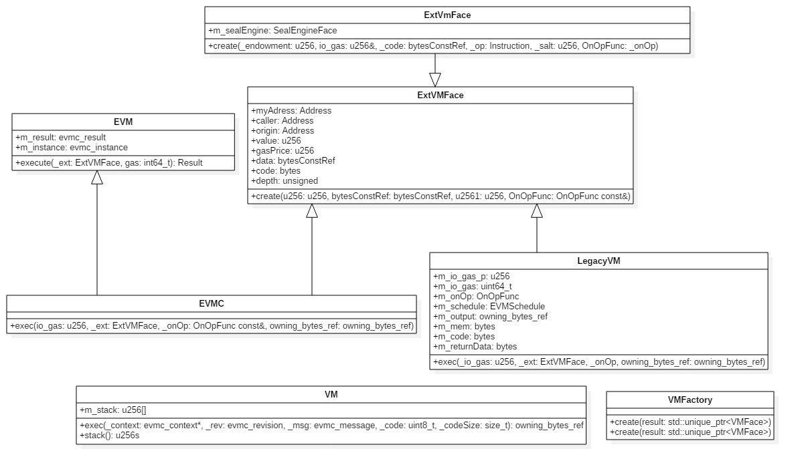
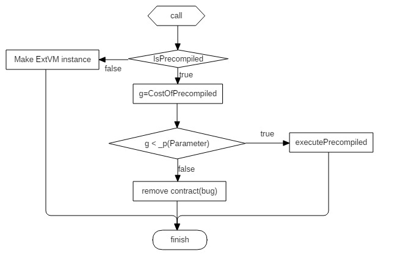
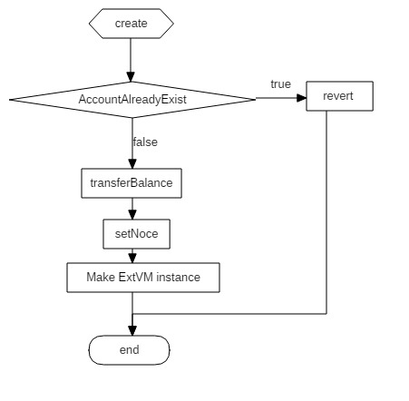
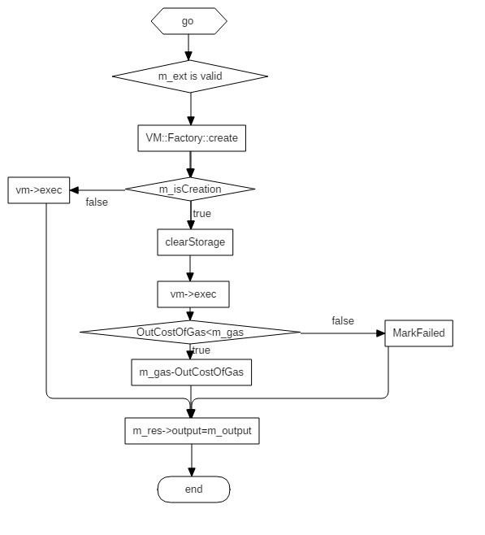

### EVM架构简析和源码分析
EVM为以太坊虚拟机。以太坊底层通过EVM模块支持智能合约的执行和调用，调用时根据合约的地址获</br>
取到代码，生成具体的执行环境，然后将代码载入到EVM虚拟机中运行。通常目前开发智能合约的高级</br>
语言为Solidity,在利用solidity实现智能合约逻辑后，通过编译器编译成元数据（字节码）最后发布到以</br>
坊上。

### EVM架构概述
EVM本质上是一个堆栈机器，它最直接的的功能是执行智能合约，根据官方给出的设计原理，EVM</br>的主要的设计目标为如下几点：
* 简单性
* 确定性
* 空间节省
* 为区块链服务
* 安全性保证
* 便于优化

针对以上几点通过对EVM源代码的阅读来了解其具体的设计思想和工程实用性。

### EVM存储系统
#### 机器位宽
EVM机器位宽为**256**位，即32个字节，256位机器字宽不同于我们经常见到主流的64位的机器字宽，</br>这就标明EVM设计上将考虑一套自己的关于操作，数据，逻辑控制的指令编码。目前主流的处理器</br>原生的支持的计算数据类型有：8bits整数，16bits整数，32bits整数，64bits整数。一般情况下宽</br>字节的的计算将更加的快一些，因为它可能包含更多的指令被一次性加载到pc寄存器中，同时伴有</br>内存访问次数的减少。目前在X86的架构中8bits的计算并不是完全的支持（除法和乘法），但基本</br>的数学运算大概在几个时钟周期内就能完成，也就是说主流的字节宽度基本上处理器能够原生的支</br>持，那为什么EVM要采用256位的字宽。主要从以下两个方面考虑：
* 时间，智能合约是否能执行得更快
* 空间，这样是否整体字节码的大小会有所减少
* gas成本

**时间**上主要体现在执行的效率上，我们以两个整形数相加来对比具体的操作时间消耗。</br>
*32bits相加的X86的汇编代码*
```
mov eax, dword [9876ABCD] //将地址9876ABCD中的32位数据放入eax数据寄存器
add eax, dword [1234DCBA] //将1234DCBA地址指向32位数和eax相加,结果保存在eax中
```
*64bits相加的X86汇编代码*
```
mov rax, qword [123456789ABCDEF1] //将地址指向的64位数据放入64位寄存器
add rax, qword [1020304050607080] //计算相加的结果并将结果放入到64位寄存器中
```
下面我们看一下在64bits机器上如何完成256bits的加法
```
mov rax, qword [9876ABCD]
add qword [1234DCBA], rax
mov rax, qword [9876ABCD+8]
adc qword [1234DCBA+8], rax//这里应用adc带进位的加法指令，影响进位标记CF
mov rax, qword [9876ABCD+16]
adc qword [1234DCBA+16], rax
mov rax, qword [9876ABCD+24]
adc qword [1234DCBA+24], rax
```
由上面的的汇编指令我们可以看出256位操作要比系统原生支持的要复杂的多，从时间上考虑采用</br>
256位这样的字节宽度，实际的收益并不大。</br></br>
**空间**上，由上面的汇编操作（在实际的EVM中操作类似）我们不难看到，如果直接对地址进行操</br>
作似乎是一种快速的方式，并减少了操作数，进而操作码也有所减少，相应的智能合约的字节流</br>
大小就会小很多，gas花费也会有所下降。但是从另外一个层面来讲，支持宽字节的数据类型势必</br>
会造成在处理低字节宽度的数据时候带来存储上的浪费（如添加标识用来区分类型）或者添加额外</br>
的操作来进行数据的compact。</br></br>
从时间和空间角度来看，仅支持256字节宽度的选择有利有弊，具体还要看以太坊智能合约的具体</br>应用。可能的几点原因如下:</br>
* 256位的宽度方便进行密码学方面的计算（sha256），但是成本有些高，场景比较少
* 仅支持256位的比要支持其他类型的操作要少，单一，实现简单可控
* 和gas的计算相关，仅支持一种，方便计算，同时也考虑到了安全问题

#### 内存分配
EVM中数据可以在三个地方进行存储，分别是栈，临时存储，永久存储。</br>
由于EVM是基于栈的虚拟机，因此基本上所有的操作都是在栈上进行的，并且EVM中没有寄存器的概</br>念,
这样EVM对栈的依赖就更大，虽然这样的设计使实现比较简单且易于理解，但是带来的问题就是需</br>
要更多数据的相关操作。在EVM中栈是唯一的免费（几乎是）存放数据的地方。栈自然有深度的限制，</br>目前的限制是1024</br>
`static constexpr int64_t stackLimit = 1024;`</br>
因为栈的限制，因此栈上的临时变量的使用会受限制。
临时内存存储在每个VM实例中，并在合约执行</br>完后消失
永久内存存储在区块链的状态层。

---
### EVM代码简析
本文分析EVM c++的代码， github地址为https://github.com/ethereum/cpp-ethereum</br>
EVM c++实现了同go版本中的核心的功能，对于快速理解EVM的设计思想比较受用，对于熟悉C++的</br>
可以先通过阅读C++版本的实现，然后对标go版本的实现来进一步了解EVM的设计思路。</br>
#### EVM代码overview
主要代码路径为cpp-ethereum/libevm和libethereum，代码量不大，以下为主要代码。</br>
```
EVMC.cpp
ExtVMFace.cpp
Instruction.cpp
interpreter.h
LegacyVMCalls.cpp
VM.cpp
VMCalls.cpp
VMFactory.cpp
VMOpt.cpp
VMSIMD.cpp
VmValidate.cpp
LegacyVM.cpp
Executive.cpp
ExtVm.cpp
```
下图为EVM中主要类的类图:</br>



以太坊中调用EVM相关代码的入口存在于不同的阶段，我们主要从以下几个角度来看它是如何运作的</br>
* 执行环境创建
* 新合约的创建
* 合约执行调用、
* 执行后结果返回
* 运行过程中的gas消费

**执行环境的创建**</br>
以太坊虚拟中涉及到的虚拟机执行的关键类为Executive（位于目录libethereum）中，我们先从</br>
创建运行环境入手，关键入口函数call入手，函数声明为：</br>
```
bool call(Address const& _receiveAddress, //接收者地址
          Address const& _txSender,       //发送者地址
          u256 const& _txValue,           //transaction的值
          u256 const& _gasPrice,          //gas的价格
          bytesConstRef _txData,          //具体的transaction数据
          u256 const& _gas);              //提供的gas值
bool call(CallParameters const& _cp,      //运行参数，由上个函数的相关变量创建
          u256 const& _gasPrice,          //gas的价格
          Address const& _origin);        //源地址
```
两个函数的功能是一样的，只是第一个函数会将参数包装成CallParameters然后在调用第二个函数,现在看</br>一下call函数的流程图如下：</br>

</br>
上述函数的关键点在于在不是预编译合约（以太坊中内部定义好的合约多为签名计算），生成**ExtVM**</br>实例，这个对象将在函数go中返回重要的作用。注意函数最后会更改状态指向函数transferBalance:</br>
` m_s.transferBalance(_p.senderAddress, _p.receiveAddress, _p.valueTransfer);`</br>

**新合约的创建**</br>
如果调用的合约地址在系统中还没有出存在，这个适合涉及到合约的创建，关键函数为create:</br>
```
bool create(Address const& _txSender, //目的地址
            u256 const& _endowment,   //花费的值
            u256 const& _gasPrice,    //gas的价钱
            u256 const& _gas,         //花费的gas数量
            bytesConstRef _init,      //传入的字节码
            Address const& _origin)   //源地址
```
函数将调用createOpcode函数，该函数在获得sender的nonce值后生成合约地址，并且调用函数</br>executeCreate来完成最后的创建。
```
u256 nonce = m_s.getNonce(_sender);
//注意地址保存在m_newAddress中,这个是否足够灵活
m_newAddress = right160(sha3(rlpList(_sender, nonce)));
return executeCreate(_sender, _endowment, _gasPrice, _gas, _init, _origin);
```
下面看关键的的函数executeCreate,其流程图如下所示:</br>
</br>
我们从代码中不难看出，最后和call函数相同生成ExtVM对象，将要执行的字节码放入其中。</br>这里需要注意的是执行transferBalance时候如果没有账户将创建一个新的账户。</br>
**合约执行调用**</br>
合约的执行的起始点在函数Executive::go中，函数的流程图如下：</br>
</br>
从流程图中我们看到如果m_ext（create或者call函数中创建）不为空的时候通过工厂方法创建VM，</br>这里要正确的理解m_ext和vm的区别，我们先看工厂方法的实现:</br>
```
std::unique_ptr<VMFace> VMFactory::create(VMKind _kind)
{
    switch (_kind)
    {
#ifdef ETH_EVMJIT
    case VMKind::JIT:
        return std::unique_ptr<VMFace>(new EVMC{evmjit_create()});
#endif
#ifdef ETH_HERA
    case VMKind::Hera:
        return std::unique_ptr<VMFace>(new EVMC{evmc_create_hera()});
#endif
    case VMKind::Interpreter:
        return std::unique_ptr<VMFace>(new EVMC{evmc_create_interpreter()});
    case VMKind::DLL:
        return std::unique_ptr<VMFace>(new EVMC{g_dllEvmcCreate()});
    case VMKind::Legacy:
    default:
        return std::unique_ptr<VMFace>(new LegacyVM);
    }
}
```
从代码中我们不难看出，会根据虚拟机的类型创建对应的虚拟机对象，无参函数create将默认生成
</br>类型为VMKind::Legacy。在函数create和call中生成的m_ext是虚拟机和外部相关状态进行</br>交互的。调用VM的exec函数完成虚拟机的执行。LegacyVM的exec函数关键代码如下:</br>
```
// trampoline to minimize depth of call stack when calling out
m_bounce = &LegacyVM::initEntry;//初始化m_bounce
do
    (this->*m_bounce)();
while (m_bounce);
```
初始化m_bounce的函数使initEntry,我们看下initEntry函数中实现的功能。</br>
```
m_bounce = &LegacyVM::interpretCases;//设置m_bounce为函数interpreCases
initMetrics();//初始化操作，参数和返回值，gas花费矩阵，
optimize();//优化，主要针对跳转的优化，后续再做补充，目前程序汇总关闭
```
经过上面的代码处理，m_bounce设置为下一步将要运行的函数。初始化操作以及花费说明的矩阵，</br>矩阵关联的Instruction部分相关信息如下：</br>
```
static const std::map<Instruction,  InstructionInfo> c_instructionInfo =
{ //                                         Add,  Args,  Ret,  GasPriceTier
	{ Instruction::STOP,    { "STOP",           0,     0,    0,  Tier::Zero } },
	{ Instruction::ADD,     { "ADD",            0,     2,    1,  Tier::VeryLow } },
	{ Instruction::SUB,     { "SUB",            0,     2,    1,  Tier::VeryLow } },
	{ Instruction::MUL,     { "MUL",            0,     2,    1,  Tier::Low } },
	{ Instruction::DIV,     { "DIV",            0,     2,    1,  Tier::Low } },
	{ Instruction::SDIV,    { "SDIV",           0,     2,    1,  Tier::Low } },
	{ Instruction::MOD,     { "MOD",            0,     2,    1,  Tier::Low } },
```

经过上面的相关初始化，再运行循环将执行m_bounce指向的interpretCases函数。函数interpretCase</br>相对来说比较复杂一些，如下所示:</br>
```
void LegacyVM::interpretCases()
{
  INIT_CASES
  DO_CASES
  {
    CASE(CREATE2)
    {
      ON_OP();
      if (!m_schedule->haveCreate2)
          throwBadInstruction();
          m_bounce = &LegacyVM::caseCreate;
		}
		BREAK
    CASE(CREATE)
    ........
    此处省略很多的case
    .......

    NEXT

    CASE(INVALID)
    DEFAULT
    {
        throwBadInstruction();
    }
	}  
  WHILE_CASES
}
```
上述代码中对应了很多宏，，如果不对宏进行展开，直观理解就是对每种操作执行对应的函数，并将</br>结果进行中间存储，EVM中定义了相关宏开关，其中一些宏开关，都对应了上述代码中不同的</br>宏展开,同时对应了不同的代码组织形式。参见文件VMConfing.h,如下代码为相关的宏开关：</br>
```
EIP_615                - 子程序和静态跳转的方式
EIP_616                - 单执行多数据流的方式
EVM_OPTIMIZE           - 优化开关，当值为false时，所有的优化全部关掉
EVM_SWITCH_DISPATCH    - 通过loop和switch执行代码
EVM_JUMP_DISPATCH      - 跳转通过一个跳表来实现，只针对gcc
EVM_USE_CONSTANT_POOL  - 应用静态数据并在栈上直接赋值操作
EVM_REPLACE_CONST_JUMP - 带预确认的跳转来保证运行时的循环
EVM_TRACE              - 提供不同等级的trace操作
```
下面我们来看一下源代码中是如何设置这些宏开关</br>
```
首先EIP_615和EIP_616均为关闭状态
#ifndef EIP_615
#define EIP_615 false
#endif

#ifndef EIP_616
#define EIP_616 false
#endif
//--------------------------------------------------------------------------
//如果没有定义EVM_JUMP_DISPATCH的情况下,如果是GNU的gcc,则打开EVM_JUMP_DISPATCH
//我们一般在linux编译，则这里我们可以得到的结论是开关EVM_JUMP_DISPATCH开关打开
ifndef EVM_JUMP_DISPATCH
#ifdef __GNUC__
#define EVM_JUMP_DISPATCH true
#else
#define EVM_JUMP_DISPATCH false
#endif
#endif

#if EVM_JUMP_DISPATCH
#ifndef __GNUC__
#error "address of label extension available only on Gnu"
#endif
#else
#define EVM_SWITCH_DISPATCH true
#endif
//---------------------------------------------------------------------------
//从下面的宏定义EVM_OPTIMIZE的开关是关闭的，因此开关EVM_REPLACE_CONST_JUMP</br>
//EVM_USE_CONSTANT_POOL EVM_DO_FIRST_PASS_OPTIMIZATION均为false的状态
#ifndef EVM_OPTIMIZE
#define EVM_OPTIMIZE false
#endif
#if EVM_OPTIMIZE
#define EVM_REPLACE_CONST_JUMP true
#define EVM_USE_CONSTANT_POOL true
#define EVM_DO_FIRST_PASS_OPTIMIZATION \
       (EVM_REPLACE_CONST_JUMP || EVM_USE_CONSTANT_POOL)
#endif
```
综上宏开关的说明，最后开关EVM_JUMP_DISPATCH是打开的，其他的均处于关闭状态。

在开关**EVM_JUMP_DISPATCH**打开的情况下对每一个宏展开进行说明，便于理解实际是如何运</br>行的。具体的参见文件VMConfig.h</br>
***宏INIT_CASES***</br>
在开关EVM_JUMP_DISPATCH打开的情况下该宏展开为初始化一个静态的跳转表，代码片段如下:</br>
```
#define INIT_CASES                              \
                                                \
    static const void* const jumpTable[256] = { \
        &&STOP, /* 00 */                        \
        &&ADD,                                  \
        &&MUL,                                  \
        &&SUB,                                  \
        &&DIV,                                  \
        &&SDIV,                                 \
        &&MOD,                                  \
        &&SMOD,                                 \
        &&ADDMOD,                               \
```
其中的ADD等定义在文件Instruction.h中，其中枚举了所有的虚拟机执行过程中的字节操作码。</br>
```
/// Virtual machine bytecode instruction.
enum class Instruction: uint8_t
{
	STOP = 0x00,        ///< halts execution
	ADD,                ///< addition operation
	MUL,                ///< mulitplication operation
	SUB,                ///< subtraction operation
	DIV,                ///< integer division operation
	SDIV,               ///< signed integer division operation
  .......
  .......
```

***宏DO_CASES***</br>
在开关EVM_JUMP_DISPATCH打开的情况下该宏展开为如下代码片段：</br>
```
#define DO_CASES        \
    fetchInstruction(); \
    goto* jumpTable[(int)m_OP];
```

由上面的代码可知操作符定义为一个字节，函数fetchInstruction执行后m_OP中存储了当前要</br>
执行的操作，接着switch将根据具体的操作来执行分支中的内容。</br>
***宏CASES***</br>
在开关EVM_JUMP_DISPATCH打开的情况下CASES展开的内容如下 ：</br>
```
#define CASE(name) \
    name:
```
***宏NEXT***</br>
在开关EVM_JUMP_DISPATCH打开的情况下NEXT展开的内容如下 ：</br>
```
#define NEXT            \
    ++m_PC;             \
    fetchInstruction(); \
    goto* jumpTable[(int)m_OP];
```
***宏CONTINUE***</br>
在开关EVM_JUMP_DISPATCH打开的情况下CONTINUE展开的内容如下 ：</br>
```
#define CONTINUE        \
    fetchInstruction(); \
    goto* jumpTable[(int)m_OP];
```
其他的几个控制分支跳转的宏展开如下：</br>
```
#define BREAK return;
#define DEFAULT
#define WHILE_CASES
```
关键的执行操作的宏ON_OP展开如下：</br>
```
#define ON_OP() onOperation()
```
通过上面的宏的展开我们可以看出过程主要依赖jumpTable和函数fetchInstructio来完成</br>
执行过程。首先我们看一下函数fetchInstruction的具体执行流程，整个执行将从这里开始</br>
```
//初始化时m_PC为0，这里先获取第一个操作符
m_OP = Instruction(m_code[m_PC]);
//获取操作相关的参数，gas花费等信息
const InstructionMetric& metric = c_metrics[static_cast<size_t>(m_OP)];
//设置SP为最后返回值所在的位置，同时检查参数出栈和返回值入栈没有超过栈的边界
adjustStack(metric.args, metric.ret);

//计算运行的费用
m_runGas = toInt63(
         m_schedule->tierStepGas[static_cast<unsigned>(metric.gasPriceTier)]
        );
m_newMemSize = m_mem.size();
m_copyMemSize = 0;
```
下面我们看程序是如何利用跳表和onOpearion来完成程序的执行，下面我们以ADD操作</br>为例来进行说明，在进行ADD说明前，先简单介绍一下EVM中栈工作的原理，例如如果我</br>们要执行一
加法操作，则通常表示为c = a + b，把它翻译成EVM中栈的操作序列伪操作码</br>序列如下：</br>
```
push a into stack
push b into stack
pop a and b then cal a+b
push a+b into stack
```
我们先看一下ADD的前置操作PUSH是如何实现的,首先注意如下代码：</br>
`````
    CASE(PUSH2)
    .........
		CASE(PUSH23)
		CASE(PUSH24)
		CASE(PUSH25)
		CASE(PUSH26)
		CASE(PUSH27)
		CASE(PUSH28)
		CASE(PUSH29)
		CASE(PUSH30)
		CASE(PUSH31)
		CASE(PUSH32)
		{
      ON_OP();
      updateIOGas();
      int numBytes = (int)m_OP - (int)Instruction::PUSH1 + 1;
      m_SPP[0] = 0;
      for (++m_PC; numBytes--; ++m_PC)
      //这里主要是处理256位宽的的情况
      m_SPP[0] = (m_SPP[0] << 8) | m_code[m_PC];
		}
		CONTINUE
`````
EVM中对PUSH1的其他操作均采用上面的代码，PUSH3的含义是将三个输入的字节序列中的宽度</br>为32字节的数据压入到栈中，如下代码:</br>
`m_SPP[0] = (m_SPP[0] << 8) | m_code[m_PC];`</br>
上面这段代码主要是将传入的字节流数据转化为256的数据，并放入栈上，同时我们的栈的定义如下：</br>
`u256 m_stack[1024];`
这里的设计其实有可以改进的地方，主要是以下几点：</br>
* 即使编译器部分做了数据紧凑的优化，但是执行的过程中又做了放大，失去了原来的意义。
* 栈的宽度为256位，抛开加密算法的影响（目前几乎没有栈上运算）,实际有些浪费。
* 从实际角度讲可以选择小的位宽的栈，数据更加紧密，但是可能会造成操作增加。

通过执行完PUSH操作后，栈上的已经放好了我们要做加法的数据，现在我们看一下ADD操作是如何</br>的。如下为ADD操作的代码片段：</br>
```
CASE(ADD)
{
  ON_OP();
  updateIOGas();

  //pops two items and pushes their sum mod 2^256.
  m_SPP[0] = m_SP[0] + m_SP[1];
}
NEXT
```
上面的代码通过宏展开后代码如下：</br>
```
ADD:
{
   onOperation();
   updateIOGas();
   m_SPP[0] = m_SP[0] + m_SP[1];
}
++m_PC;             
fetchInstruction();
goto* jumpTable[(int)m_OP];
```
现在step by step的看一下这部分是如何进行处理，首先是opOperaion函数，如下为onOperation</br>函数的实现：</br>
```
if (m_onOp)
  (m_onOp)(++m_nSteps, m_PC, m_OP,
  m_newMemSize > m_mem.size() ? (m_newMemSize - m_mem.size()) / 32 : uint64_t(0),
  m_runGas, m_io_gas, this, m_ext);
```
代码中的m_onOp为提供的回调函数，其中其中m_onOp的类型为OnOpFunc,声明如下如下所示：</br>
```
using OnOpFunc = std::function<void(uint64_t /*steps*/,
                                    uint64_t /* PC */,
                                    Instruction /*instr*/,
                                    bigint /*newMemSize*/,
                                    bigint /*gasCost*/,
                                    bigint /*gas*/,
                                    VMFace const*,
                                    ExtVMFace const*)>;
```
函数设计主要是在虚拟执行的时候提供一个可以回调的接口，方便进行处理，比如做最简单的tracing</br>
接下来执行函数updateIOGas(),该函数功能主要是查看目前的gas消耗是否已经大于提供的gas,</br>如果大于，则抛出异常，虚拟机停止运行。代码片段如下：</br>
```
if (m_io_gas < m_runGas)
  throwOutOfGas();
m_io_gas -= m_runGas;
```
注意函数中的m_runGas在函数updateGas中被修改，会根据内存的使用来进行计算和消耗。
接下来执</br>行的代码为`m_SPP[0] = m_SP[0] + m_SP[1];`主要功能是完成两个数的相加计算结果会存储在m_SPP[0]</br>中，m_SPP的含义是“指向下一个栈中可用的位置”，这里指向m_SP[0]运行初始化开始时m_SPP = m_SP。</br>
接着执行`++m_PC`,这里将指向代码字节流中的下一个操作。接着执行数fetchInstruction(),
这个时候</br>变量m_OP中存储的是新的操作，继续执行goto* jumpTable[(int)m_OP]，这个时候将跳到下一个操作的</br>label去执行。
综上，EVM虚拟机就是借助栈和基本的操作来完成一个合约字节流的运行的。</br>
**执行后的结果返回**</br>
在操作序列的RETURN和REVERT操作，将栈上的结果数据拷贝到内存中去。以下为RETURN部分代码/br>
```
CASE(RETURN)
{
  ON_OP();
  m_copyMemSize = 0;
  updateMem(memNeed(m_SP[0], m_SP[1]));
  updateIOGas();

  uint64_t b = (uint64_t)m_SP[0];
  uint64_t s = (uint64_t)m_SP[1];
  //m_output中存储的就是最后返回的结果
  m_output = owning_bytes_ref{std::move(m_mem), b, s};
  m_bounce = 0;
}
BREAK
```
**运行过程中的Gas的消费**</br>
上面描述ADD和所涉及到的PUSH操作的时候我们就已经看到会调用updateIOGas函数来计算gas</br>的消费。从代码中我们可以看到不同的操作对应不同的gas消费具体如下：</br>


 no gas | IO gas 1| IO gas 2  | mem gas
 :--|:--|:--|:--
 CREATE2|RETURN|REVERT|RETURN
 CREATE|SUICIDE|STOP|REVERT
DELEGATECALL|MLOAD|MSTORE|MLOAD
STATICCALL|MSTORE8|SHA3|MSTORE
CALL|LOG0|LOG1|MSTORE8
CALLCODE|LOG2|LOG3|SHA3
JUMPTO|EXP|ADD|LOG1
JUMPIF|MUL|SUB|LOG2
JUMPV|DIV|SDIV|LOG3
JUMPSUB|MOD|SMOD|CALLDATACOPY
JUMPSUBV|NOT|LT|
RETURNSUB|GT|SLT|
BEGINSUB|SGT|EQ|
BEGINDATA|ISZERO|AND|
GETLOCAL|OR|XOR|
PUTLOCAL|BYTE|SHL|
|SHR|SAR|
|ADDMOD|MULMOD|
|SIGNEXTEND|ADDRESS|
|ORIGIN|BALANCE|
|CALLER|CALLVALUE|
|CALLDATALOAD|CALLDATASIZE|
|RETURNDATASIZE|CODESIZE|
|EXTCODESIZE|CALLDATACOPY|
|RETURNDATACOPY|RETURNDATACOPY|
|CODECOPY|CODECOPY|
|GASPRICE|BLOCKHASH|
|COINBASE|TIMESTAMP|
|NUMBER|DIFFICULTY|
|GASLIMIT|POP|
|PUSH|JUMP|
|DUP|SWAP|
|SLOAD|SSTORE|
|PC|MSIZE|
|GAS|JUMPDEST|
|INVALID||
其中**SSTORE**是一条比较特殊的指令，他将消耗stack存储的gas</br>

###小结
EVM如果精确的定位应该是一个基于栈的自定义字节码解释器，实现上并不复杂，代码</br>过程中遇到的主要问题有以下几点：</br>
* 字节宽度的设计，目前看主要是出于实现难度和实际需求（如SHA3的操作)。
* 设计上每次都会生成新的VM对象，出于安全和目前需求这样的设计和实现是可以接受的，数据</br>共享和多线程处理在智能合约的层面目前还不需要。
* EVM整体上实现了基本的操作，但是还需要和语言编译器去结合来做具体的优化。
* 目前下一代的EVM虚拟机eWASM在设计中，目前GitHub上只有设计并没有代码实现。
