# wasm文件格式

# 一、模块
在WASM的文件组织上，既不像传统的程序编写过程中存在执行文件和库文件的区别，也不像某些编译器提供的中间状态文件。其提供了一种脱离于具体的物理架构的“虚拟的指令体系”，或者如果一定要和其它一些固有的形式来绑定的话，它更倾向于一种“虚拟机格式”。
</br>
一般来说，都是对应用目标进行高级的抽象，但在WASM中，可以认为是一种的抽象，它是面向编译器的，而不是面向程序员的。
</br>
WASM是基于模块的，或者说，每个程序段都可以自由的组成模块，每个模块都可以有自己的主入口，相当于main函数。模块是整个Webassembly代码中的基本单元，在前面提到过，它有两种格式，即wat,wasm两种格式，在wast文件中，它相当于一个S-表达式。
</br>
S-表达式的优点在于它是可以用人类的语言来看明白的，对人是友好的。其实它也是在图论中的剑桥波兰表达式法。它的基本表现方法如下：
</br>

```
(module (memory 1)(func))
```
</br>
回忆一下上一篇文章中的WAT文件：
</br>

```C++
(module
  (type $t0 (func))
  ......
)
```
一个合法的模块，是以module开始的，用UE（或者其它的十进制编辑器）打开前文中的wasm文件：
</br>

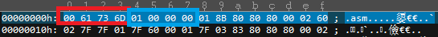
</br>
红色杠住的二进制代码：0061  736d是所有文件格式都有的标志：文件的魔数。
</br>
蓝色框住的二进制代码：0100 0000 是wasm文件的版本号。
</br>
在前面的文档中提到了，wast和 wasm两种文件可以通过工具进行转换。
</br>

# 二、文件组成
现在重点分析一下wasm的文件格式：
</br>

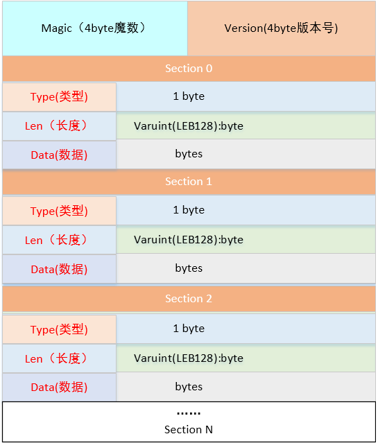
</br>
对比上面的文件格式，看一下实际的格式：
</br>

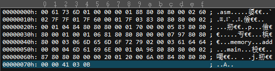
</br>
再对比一下上文中的wast文件：
</br>

```C++
(module
  (type $t0 (func))
  (type $t1 (func (param i32 i32) (result i32)))
  (type $t2 (func (result i32)))
  (func $\__wasm_call_ctors (type $t0))
  (func $add (export "add") (type $t1) (param $p0 i32) (param $p1 i32) (result i32)
    get_local $p1
    get_local $p0
    i32.add)
  (func $main (export "main") (type $t2) (result i32)
    i32.const 42)
  (table $T0 1 1 anyfunc)
  (memory $memory (export "memory") 2)
  (global $g0 (mut i32) (i32.const 66560))
  (global $\__heap_base (export "\__heap_base") i32 (i32.const 66560))
  (global $\__data_end (export "\__data_end") i32 (i32.const 1024)))
```
### 1、Section Type种类
Type的类型目前只有12种：
</br>

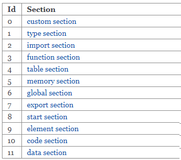
它们的编码，依次排序下去。其在WA的官网的文件中Module中可以推导出以下的形式：
</br>

```
module::=
{
  types vec(functype),
  funcs vec(func),
  tables vec(table),
  mems vec(mem),
  globals vec(global),
  elem vec(elem),
  data vec(data),
  start start?,
  imports vec(import),
  exports vec(export)}
```
</br>
下面分别介绍一下各个节的内容：
</br>

1）Custom Section：
</br>
这个提供了一个自定义机制，允许在此处增加调试信息或者相关的扩展，它会被Webassembly的主义忽略。其形式如下：

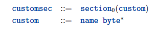
</br>
2) Type section
</br>

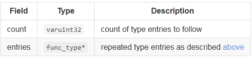
</br>
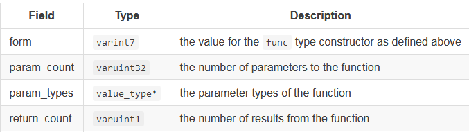
</br>
类型区提供了一组函数签名，在其前面还有一个数组的长度，在上面的定义里可以看到函数的第一个字段固定为0x60.需要注意的是，目前函数的返回值只支持一个。举一个例子:int test(int x,int y),其函数签名为：0x60 2 i32 i32 1 i32。即上面描述的，固定标记0x60，加上参数类型个数和参数类型，加上返回值个数和返回值类型。
</br>
3) import section
</br>

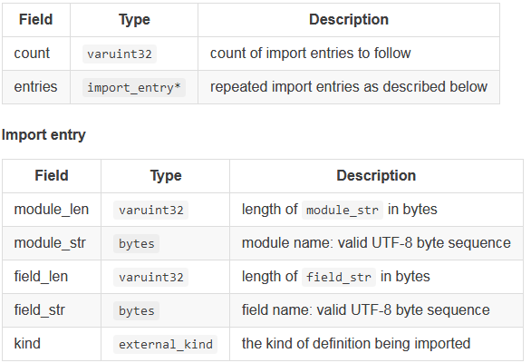
</br>
导入区就是从其它模块导入的相关的函数、表等。导入区也是数组大小+数组。内容包括：导入的模块名称、字段名称、导入类型及相关信息。其中0表示函数，后面是函数签名在数组中的索引；1表示表，后面表示表中的元素类型及表的容量大小等；2表示内存，后面是初始和最大容量，单位是页。每页为64K；3表示全局变量，其后是类型和是否只读。
</br>
4) function section
</br>

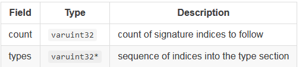
</br>
函数区和代码区的函数代码一一对应。它指向类型区中的函数签名数组中的某个签名的索引。
</br>
5) table section
</br>


</br>

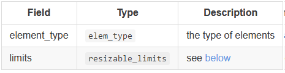
</br>
表中主要存储了函数的索引的列表。用来供运行进调用指向的函数。专门提供一个表而不是放到内存中，是考虑到安全的因素。
</br>
6) memory section
</br>

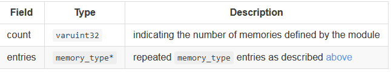
</br>
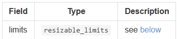
</br>
内存区是存储模块运行所需要的内存空间的，在模块初始化时由数据区进行填充。不过这里面因为不能确定类型，所以只能以字节形式来处理，这和其它汇编表示一样。
</br>
7) global section
</br>

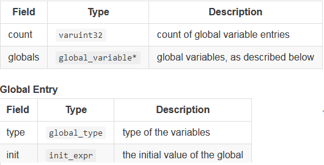
</br>
全局区定义了模块内的全局变量及相关属性信息，包括只读等，它的结构也是数组长度+数组。</br>
8) export section
</br>

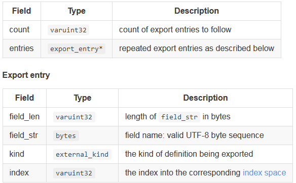
</br>
导出和导入正好相反，这个其它语言中库的导出标记一样，如果没有导出，则外部不可以引用。同样，其也是一个数组长度+数组。其内容和导入基本一致。
</br>
9) start section
</br>

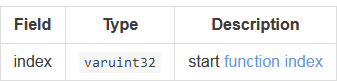
</br>
开始区有点类似于main函数，或者如果有汇编编程经验中的start.s文件，它只有一个字段，当模块加载完成后，如果有这个区，是会首先调用其内部指向的函数。
</br>
10) element section
</br>

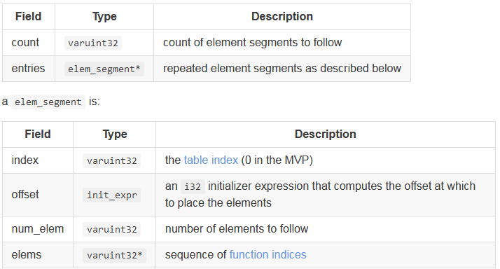
</br>
元素区同样是一个数组，它用来填充表区，主要包括表索引、表中的偏移值和指向函数索引。
</br>
11) code section
</br>

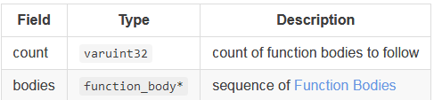
</br>
代码区定义了模块中的函数定义，它和函数区内的函数签名一一对应。它也是由数组长度+数组组成。在每个数组单元内，描述了函数体的大小（字节数）、局部变量、代码。代码是由具体的指令集中的指令组成来完成函数要实现的具体的功能。
</br>
12) data section
</br>

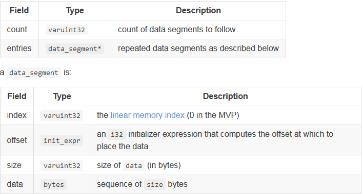
</br>
数据区同样也是一个数组（长度+数组内容），它定义了如何填充内存区数据结构。每个data_entry表示一个具体的一段内存。
</br>

### 2、LEB128编码
先介绍一下LEB128这种数据压缩格式，谷歌为了省点空间，在安卓中用了这个压缩标准，其原理就是一个4字节32位的数字，一般很少占满，比如数字1，2等，它其实用几位就可以表示。下面看看它的工作原理：
</br>
1）忽略高字节的正负代表位。
</br>
2）每七位组成一组，待编码。
</br>
3）有符号和无符号的分成不同的情况来处理。
</br>
4）无符号，最高位为0表示结束，1表示还有后续字节。待编码的七位为数据。
</br>
5）有符号的处理，同上，但需要处理高位为0的不同情况。
</br>
6）有符号的处理，同上，需要处理高位为1的不同情况。
</br>
从上面可以看出无符号比较简单，有符号还需要处理几种情况，这里举一个无符号的例子，简单理解一下，更多请查阅相关资料：
</br>
编码：
</br>
十六进制数字：0x238 ========>   二进制  0000 0010 0011 1000
</br>
分成两个七位的组：0000100(高位)，  0111000（低位）
</br>
0000100后面没数据了，所以前面加一个0；0111000后面还有一个字节，所以高为为1，则变为：
</br>
00000100(即：0x04),10111000(0x70)  
</br>
则小端存放的数据为：0x70,0x04
</br>
解码：
</br>
正好相反，把数据拆开，按编码逆向过程即可。
</br>

### 3、基础说明
1）Webassemble数据类型有四种即：
</br>
i32:32位整数
</br>
i64:64位整数
</br>
f32:32位浮点数
</br>
f64:64位浮点数
</br>
2）Webassembly的函数签名：其函数签名由参数类型和返回值类型组成，即：
</br>
(pars1_type,pars2_type...parsN_type)(result_type)，即：
</br>
functype::=[vec(valtype)]→[vec(valtype)]
</br>
3）索引空间空间说明：
</br>
函数、表、内存和全局变量都拥有自己的索引空间，用来记录顺序和位置，供指令调用。本地的索引空间只能在函数内部访问。
</br>

# 三、总结
通过上述的分析可以明白，wasm的文件数据组织的格式，那么在以后无论对编译器还是对解释器及其执行的流程，就有一个了清楚的底层认知。
