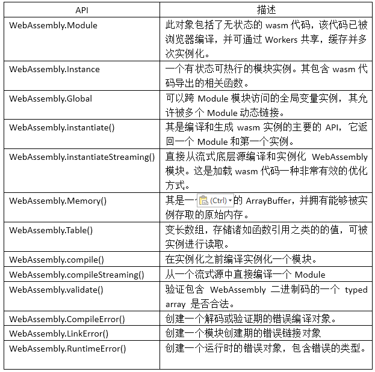

# wasm的相关接口

## 一、接口定义
wasm应用的接口还是比较少的，不过低级到这种地步的抽象，应该也不会有太多的接口，否则就没法弄了，还不如直接操作呢。其接口主要包含以下几个：
</br>


</br>
1、Moudle
</br>
要想得到一个实例对象，就可以用其构造函数来实现，但需要注意的是，这个只适合于同步使用，同步使用就会有一些限制条件，比如不能太耗时，不能太大等待，在官方的文档中也建议如无必要，请使用compile或者缓存对象的直接读取。其使用的方法如下：
</br>

```js
var Mod = new WebAssembly.Module(bufferSource);
参数：
bufferSource:一个 类型化数组 或 ArrayBuffer，包含要编译的 .wasm 模块的二进制代码。
```
</br>
2、Instance
</br>
这个接口，浏览器的支持并不完整，可以参看一下相关的支持列表。它主要是得到一个有状态的Module的可执行实例。这个实例包含所有的导出函数，同时允许JS调用这些代码。其是以同步的方式获取实例的。

```js
var myInstance = new WebAssembly.Instance(module, importObject);
参数：
module:要被实例化的 WebAssembly.Module 对象
importObject:一个包含值的对象,导入到新创建的 实例
返回值：
实例对象。
```
</br>

3、Global
</br>
和其它语言的全局变量类似，可以跨模块访问并被多个模块动态链接。

```js
var myGlobal = new WebAssembly.Global(descriptor, value);
参数：
descriptor：有两个属性，一个表示数据类型，一个表示是否可以修改，默认是false
value：变量的值
```
</br>

4、instantiate()
</br>
相对于前面的同步实现，这个是异步机制的。它既提供从数据流式得到实例的方式，也提供从其它编译成功模块中的相关代码来得到实例。

```js
Promise<ResultObject> WebAssembly.instantiate(bufferSource, importObject);
同上面的instance
```
</br>

5、instantiateStreaming()
</br>
在文件系统中现在基本都采用了流式加载，所以这里也不稀奇，这个接口可以从流式底层直接实例化一个模块，而且它非常高效。
</br>

```js
Promise<ResultObject> WebAssembly.instantiateStreaming(source, importObject);
参数：
source:Response或者一个可履行的Promise，也就是编译实例化的源数据。
importObject :想要导入到新建实例的值的对象。如方法等。
返回值：
一个Promise，包含两个属性，其中一个是可再实例化的Module，另外一个是实例对象。
```
</br>
6、Memory()
</br>
创建一个内存对象，其包含一个缓冲数组（arrayBuffer），如果其它语言一样，所有的访问是要通过内存的字节流来实现的。目前一个WASM的内存页面的大小是64K。

```js
var myMemory = new WebAssembly.Memory(memoryDescriptor);
参数：
memoryDescriptor：它包含两个属性，一个是内存的初始大小，以页为单位；一个是WASM的内存的最大值（可选项）
异常：
会抛出相关的异常，TypeError或者RangeError。
```
</br>

7、Table()
</br>
创建指定类型大小的Table对象。其类似于数组的结构（细节可看前面的分析），表示存储函数引用的WebAssembly表。它可以由JS或WASM双向访问和更改。注意：表目前只能存储函数引用。

```js
var myTable = new WebAssembly.Table(tableDescriptor);
参数：
tableDescriptor：包含三个属性的对象，第一个是元素，目前只能是“anyfunc”,第二个是初始的大小，第三个是最大值(可选项)。
异常：
同Memory（）。
```
</br>

8、compile()
</br>
编译一个二进制代码到一个WASM实例对象。

```js
Promise<WebAssembly.Module> WebAssembly.compile(bufferSource);
参数：
bufferSource：二进制的代码缓冲区。
返回值：
Promise：一个解析为Module的Promise对象。
异常：
bufferSource不符合标准， 抛出TypeError 。
编译异常，会发出一个WebAssembly.CompileError。
```
</br>

9、compileStreaming()
</br>
从数据流中直接编译一个模块。这个前面的流式实例化有些类似。

```js
Promise<WebAssembly.Module> WebAssembly.compileStreaming(source);
参数：
source：一个 Response 对象或一个会履行（fulfill）它的 promise，用来表示你想编译的 .wasm 模块的流式源。
返回值：
一个 WebAssembly.Module 对象的 Promise。
异常：
有可能抛出数据源的TypeError异常或者编译异常CompileError。
```
</br>
10、validate()
</br>
验证二进制代码的合法性。

```js
WebAssembly.validate(bufferSource);
参数：略
异常：略
返回值：
正确为true，否则false
```
</br>
11、compileError()
</br>
创建一个编译期的错误对象。

```js
new WebAssembly.CompileError(message, fileName, lineNumber)
内容同LinkError。
```
</br>
12、LinkError()
</br>
主要用来构建一个新的链接错误对象，表明在调用Start Function时发生的错误。其方法如下：
</br>

```js
new WebAssembly.LinkError(message, fileName, lineNumber)
参数：
message:错误消息
fileName:错误引起的文件
lineNumber:文件中触发异常的代码行号
```
</br>

13、RuntimeError()
</br>
创建一个运行期的错误对象，其方法如下：

```js
new WebAssembly.RuntimeError(message, fileName, lineNumber)
内容同上LinkError，略过。
```
</br>

```html
<!doctype html>
<title>WASM </title>
<script>
  fetch('./Add.wasm') .then(ret => {
    if (ret.ok)
      return ret.arrayBuffer();
    throw new Error(`no wasm module.`);
  }) .then(bytes => {
    return WebAssembly.compile(bytes);
  }) .then(module => {
    return WebAssembly.instantiate(module);
  }) .then(instance => {
    window.add = instance.exports.add;
  });
</script>
```
这时候再回头看前面的例程，就更清楚了，得到代码后，可以用重载的方式得到实例对象（一个直接编译，一个使用异步的实例化），如果是已经编译好的，则导出相关的导出函数。

## 二、接口应用
既然有了接口，那么在应用上就方便了好多，在上面有一个简单的小例子，反复用了很多次，这次来一个比较复杂一些的,代码引自下面的github：
</br>
https://github.com/cunzaizhuyi/blog-assets/tree/master/WebAssembly

```js
<script>
  //创建实例函数，传入路径和相关导入的空间变量
	function loadWebAssembly (path, imports = {}) {
		return fetch(path)
			.then(response => response.arrayBuffer())
			.then(buffer => WebAssembly.compile(buffer))
			.then(module => {
				imports.env = imports.env || {}
				//新添加的
				imports.env.DYNAMICTOP_PTR = imports.env.DYNAMICTOP_PTR||0;
				imports.env.tempDoublePtr = imports.env.tempDoublePtr||0;
				imports.env.ABORT = imports.env.ABORT||0;
				imports.global = imports.global||{NaN:5,Infinity:6};
				imports.env.abortStackOverflow = imports.env.abortStackOverflow||new Function();

				// 开辟内存空间
				imports.env.memoryBase = imports.env.memoryBase || 0
				if (!imports.env.memory) {
					imports.env.memory = new WebAssembly.Memory({ initial: 256 })
				}

				// 创建变量映射表
				imports.env.tableBase = imports.env.tableBase || 0
				if (!imports.env.table) {
					// 在 MVP 版本中 element 只能是 "anyfunc"
					imports.env.table = new WebAssembly.Table({ initial: 0, element: 'anyfunc' })
				}
				// 创建 WebAssembly 实例
				return new WebAssembly.Instance(module, imports)
			})
	}
	var canvas = document.getElementById("canvas");
	var ctx = canvas.getContext("2d");
	ctx.strokeStyle = "blue";
	ctx.fillStyle = "red";
	ctx.beginPath();
	ctx.arc(0,40,10,0,2 * Math.PI,false);
	//ctx.stroke();
	ctx.fill();
	var startPoint = 0;

  //调用函数创建相关实例并导入相关数据，调用结果
	loadWebAssembly('./mathz.wasm')
		.then(instance => {
			var speed = instance.exports._speed;
			const addSpeed = instance.exports._addSpeed;
			var speedV = speed();
			//speedV = addSpeed(speedV,50);
			function run(ctx) {
				ctx.clearRect(0,0,1000,800);
				//cxt.top+=speed;
				startPoint+=speedV;
				ctx.beginPath();
				ctx.arc(startPoint,40,10,0,2*Math.PI,true);
				ctx.stroke();
				ctx.closePath();
				ctx.fill();
			}
			setInterval(function () {
				run(ctx);
			},50);
		});
</script>
```
</br>
其调用的wast代码如下：
</br>

```
(module
  (type (;0;) (func (param i32)))
  (type (;1;) (func (param i32) (result i32)))
  (type (;2;) (func (result i32)))
  (type (;3;) (func (param i32 i32)))
  (type (;4;) (func (param i32 i32) (result i32)))
  (type (;5;) (func))
  (import "env" "DYNAMICTOP_PTR" (global (;0;) i32))
  (import "env" "tempDoublePtr" (global (;1;) i32))
  (import "env" "ABORT" (global (;2;) i32))
  (import "env" "memoryBase" (global (;3;) i32))
  (import "env" "tableBase" (global (;4;) i32))
  (import "global" "NaN" (global (;5;) f64))
  (import "global" "Infinity" (global (;6;) f64))
  (import "env" "abortStackOverflow" (func (;0;) (type 0)))
  (import "env" "memory" (memory (;0;) 256))
  (import "env" "table" (table (;0;) 0 anyfunc))
  (func (;1;) (type 1) (param i32) (result i32)
    (local i32)
    block  ;; label = @1
      get_global 10
      set_local 1
      get_global 10
      get_local 0
      i32.add
      set_global 10
      get_global 10
      i32.const 15
      i32.add
      i32.const -16
      i32.and
      set_global 10
      get_global 10
      get_global 11
      i32.ge_s
      if  ;; label = @2
        get_local 0
        call 0
      end
      get_local 1
      return
      unreachable
    end
    unreachable)
  (func (;2;) (type 2) (result i32)
    get_global 10
    return)
  (func (;3;) (type 0) (param i32)
    get_local 0
    set_global 10)
  (func (;4;) (type 3) (param i32 i32)
    block  ;; label = @1
      get_local 0
      set_global 10
      get_local 1
      set_global 11
    end)
  (func (;5;) (type 3) (param i32 i32)
    get_global 12
    i32.const 0
    i32.eq
    if  ;; label = @1
      get_local 0
      set_global 12
      get_local 1
      set_global 13
    end)
  (func (;6;) (type 2) (result i32)
    (local i32 i32 i32 i32)
    block  ;; label = @1
      get_global 10
      set_local 3
      get_global 10
      i32.const 16
      i32.add
      set_global 10
      get_global 10
      get_global 11
      i32.ge_s
      if  ;; label = @2
        i32.const 16
        call 0
      end
      i32.const 5
      set_local 1
      get_local 1
      set_local 0
      get_local 3
      set_global 10
      get_local 0
      return
      unreachable
    end
    unreachable)
  (func (;7;) (type 4) (param i32 i32) (result i32)
    (local i32 i32 i32 i32 i32 i32 i32)
    block  ;; label = @1
      get_global 10
      set_local 8
      get_global 10
      i32.const 16
      i32.add
      set_global 10
      get_global 10
      get_global 11
      i32.ge_s
      if  ;; label = @2
        i32.const 16
        call 0
      end
      get_local 0
      set_local 6
      get_local 1
      set_local 5
      get_local 6
      set_local 2
      get_local 5
      set_local 3
      get_local 2
      get_local 3
      i32.add
      set_local 4
      get_local 8
      set_global 10
      get_local 4
      return
      unreachable
    end
    unreachable)
  (func (;8;) (type 5)
    (local i32)
    nop)
  (func (;9;) (type 5)
    block  ;; label = @1
      get_global 3
      i32.const 0
      i32.add
      set_global 10
      get_global 10
      i32.const 5242880
      i32.add
      set_global 11
      call 8
    end)
  (global (;7;) (mut i32) (get_global 0))
  (global (;8;) (mut i32) (get_global 1))
  (global (;9;) (mut i32) (get_global 2))
  (global (;10;) (mut i32) (i32.const 0))
  (global (;11;) (mut i32) (i32.const 0))
  (global (;12;) (mut i32) (i32.const 0))
  (global (;13;) (mut i32) (i32.const 0))
  (global (;14;) (mut i32) (i32.const 0))
  (global (;15;) (mut i32) (i32.const 0))
  (global (;16;) (mut f64) (get_global 5))
  (global (;17;) (mut f64) (get_global 6))
  (global (;18;) (mut i32) (i32.const 0))
  (global (;19;) (mut i32) (i32.const 0))
  (global (;20;) (mut i32) (i32.const 0))
  (global (;21;) (mut i32) (i32.const 0))
  (global (;22;) (mut f64) (f64.const 0x0p+0 (;=0;)))
  (global (;23;) (mut i32) (i32.const 0))
  (global (;24;) (mut f32) (f32.const 0x0p+0 (;=0;)))
  (global (;25;) (mut f32) (f32.const 0x0p+0 (;=0;)))
  (export "__post_instantiate" (func 9))
  (export "_addSpeed" (func 7))
  (export "runPostSets" (func 8))
(export "_speed" (func 6)))
```

</br>

代码的分析直接看注释即可，没有太多的技术性细节。

</br>
Webassembly可以双向工作，既可以从JS调用WASM中的导出符号，也可以在WASM中调用导入的JS符号。在JS中，可以通过前面提到的API接口创建相关的表和内存等，并通过导入符号的方式将其导入到WASM中，这和多语言间的库的交换数据还是有些相似的。如果想对交互方式有更深入的了解，可以查看一下github:
</br>

https://github.com/mdn/webassembly-examples/tree/master/js-api-examples
</br>
</br>

## 三、总结
这一块是整个Webassembly中最常用的部分，毕竟WASM的设计初衷就是为了解决在JS运行高效的代码。接口的设计好坏与否，直接关系到上层应用到底层调用的的方便易用性，特别是效率的影响，一定要引起重视。在IBM,mozilla以及github等官网上都有大师的相关文档供查阅。需要注意的一点就是，许多的细节随着版本的推进，已经变得过时。
