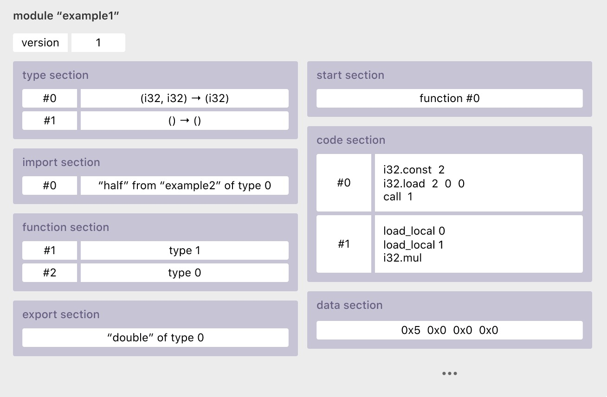

# webassembly技术

## 一、webassembly介绍
wasm最近相当火，不光EOS默认的智能合约开发使用的是它，以太坊也已经决定在下一代的版本上采用ewasm做为虚拟机的实现（wasm的一个子集）。wasm为什么会被区块链如此重视？这得说它确实有相当出色的能力。
</br>
在早期的软件开发中，基本是桌面开发，各种库用起来相当方便，便是到了后来，从CS转向BS后，发现了一个问题，如果想在Web前端实现复杂的应用场景，非常麻烦，随着各种脚本语言和相关的JS的框架的广泛流行，开发的便捷性和性能都有大幅提升，但是在一个非常重要的场景下，还是解决不了问题，那就是3D游戏。这时候就有相关方提出了asm.js、Dart 、typescript，它们各有优势，在不同的应用场景下都有很抢眼的表现。
</br>
可是，技术的发展是要有统一的标准，而不是各自搞各自的，这种情况下，webassembly被提出了。好多人把它当成一种新的编程语言，但是目前来看，它更象是一种中间标准技术，甚至它只是一种文件格式。把它当成一门汇编语言，有点不是很准确。
</br>
webassembly就是为了性能而生，它在Web前端的应用可以大幅的提高应用的流畅性。之所以有这些优越性，主要原因在于，它可以编译成非常稳定的wasm字节码格式，而llvm实现了llvm IR中间码到wasm的转换。也就是说，wasm其实并不是真正的汇编指令，而是对应的一些虚拟的指令，即他在IR到真正的机器架构间的一环。所以实现了执行WASM的环境可以叫做WASM虚拟机，比如EOS中的wasm-jit执行环境。
</br>
在webassembly中有两种文件格式，即wat,wasm,另外还有一个wat的超集wast,可以这样理解，wast是人类易理解的文本格式，wasm是机器识别的格式。
网上有很多的开发相关的工具和在线网站：
https://webassembly.studio/
</br>
https://wasdk.github.io/WasmFiddle/
</br>
https://webassembly.github.io/wabt/demo/wat2wasm/
</br>
https://github.com/WebAssembly/wabt
</br>
https://github.com/emscripten-core/emscripten
</br>
https://github.com/AssemblyScript/assemblyscript

## 二、现状
webassembly主要是应用于前端浏览器，当然LINUX的内核也可以使用，但是主流是为了在前端提高性能。它的主要框架如下：



发展的路线图：
</br>
1、WebAssembly API和二进制格式的设计已完成。
</br>
2、下一步准备统一解释器。
</br>
3、将Emscripten稳定，实现LLVM和Webassembly的转换。
</br>
4、将其应用到更多的浏览器并开发相关工具。
</br>
5、启动 post-MVP(a Minimum Viable Product:最低可行产品) features,详细的内容参看官网
</br>
Webassembly目前来看，既支持编译器编译执行，也支持解释器解释执行，当然，这就引出了类似热点代码的问题，可以解释，然后编译热点。目前主要的编译器基本以LLVM为主，所以看到资料基本都是IR到WASM，但是看其发展的目标，应该是直接到wasm，也就是说，由标准的虚拟指令取代中间代码（一个新的中间态）。所以最后发展成什么样子，还需要继续看。

# 三、应用
1、浏览器中使用高效（C/C++等）代码
</br>
举一个小例子：
</br>

```C++
#define WASM_EXPORT __attribute__((visibility("default")))
WASM_EXPORT
int add(int a, int b) {
    return a + b;
}
WASM_EXPORT
int main() {
  return 42;
}
```
其对应的WAT文件：

```C++
(module
  (type $t0 (func))
  (type $t1 (func (param i32 i32) (result i32)))
  (type $t2 (func (result i32)))
  (func $\__wasm_call_ctors (type $t0))
  (func $add (export "add") (type $t1) (param $p0 i32) (param $p1 i32) (result i32)
    get_local $p1
    get_local $p0
    i32.add)
  (func $main (export "main") (type $t2) (result i32)
    i32.const 42)
  (table $T0 1 1 anyfunc)
  (memory $memory (export "memory") 2)
  (global $g0 (mut i32) (i32.const 66560))
  (global $\__heap_base (export "\__heap_base") i32 (i32.const 66560))
  (global $\__data_end (export "\__data_end") i32 (i32.const 1024)))
```
将这段代码拷贝到前面网址中的webassembly中，编译，就可以得到WASM文件并下载下来。同时它的右侧会有一个测试的JS提供调用的测试。如果你不想使用它的测试想自己来的话，就接着往下看：
</br>
写一个HTML文件中的JS脚本：
</br>

```html
<!doctype html>
<title>WASM </title>
<script>
  fetch('./Add.wasm') .then(ret => {
    if (ret.ok)
      return ret.arrayBuffer();
    throw new Error(`no wasm module.`);
  }) .then(bytes => {
    return WebAssembly.compile(bytes);
  }) .then(module => {
    return WebAssembly.instantiate(module);
  }) .then(instance => {
    window.add = instance.exports.add;
  });
</script>
```
然后把这个用可以调试的浏览器（如Chrome等），打开，在控制台里，输入：window.add(1,2),则可以得到3.如果需要跨域，请使用各种跨域的方法来解决。
</br>

2、多语言的中间化
</br>
这个如果做好了，更有前途，比如c#语言，编译成WASM后，可以在LINUX平台上跑，完全解决了微软的各种套路。安卓的程序，编译好了，可以搞到苹果上开发，也不用什么各种跨平台的框架了。
</br>
看它们的路线图里，也有这个野望。

## 四、不足
虽然webassembly有很多优点，但作为一个新技术还是有很多不足之处：
</br>
1、新，就意味着应用不广泛，还有各种坑。同时，学习的资料不多并且社区都不是很成熟。
</br>
2、对各种浏览器的支持不是很好，同时，不同的浏览器调用还是存在很多的兼容性问题。
</br>
3、目前还没有一门专门的成熟的开发的语言。虽然有c++，Go，Rust等语言支持，但毕竟还不是原生支持的。
</br>

# 五、总结
从目前来看，webassembly仍然是一门正在发展的技术，虽然它的后面站着微软，谷歌等一票大公司，但距离成熟还有相当的距离。不过，webassembly的优势会让大家逐渐接受他并流行起来。如果有一门原生的语言直接支持webassembly后，相信会很快的打开一片市场。
