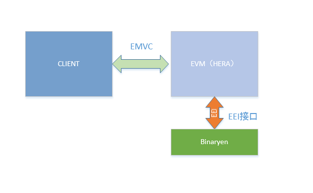
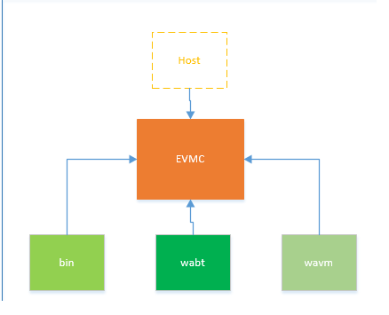

# 以太坊对WASM的支持

## 一、以太坊新版本中的WASM虚拟机
以太坊的原生的EVM在使用中暴露了不少的问题，在下一个新的大的版本变更中，将提供一个基于WASM的ewasm文件格式。可以把认为是下一代虚拟机的技术标准。使用WASM的优势很多，但缺点也不少，最关键的是WASM技术本身正处在很快的发展变化过程中，它的自身并不是很完善。
 </br>
如果你想部署一个WASM的智能合约到测试网络testnet可以使用下面的网址：
</br>
http://ewasm.ethereum.org/studio/

## 二、EVMC
在EWASM的支持上，Parity对其支持的最好的（不愧是原来以太坊的技术老大），但是它将其内置到了客户端中，这和目前以太坊的设计发展是不一致的。现在以太坊的官方已经推出一个Hera的初步ewasm虚拟机，它支持以太坊提出的EVMC。EVMC是解除客户端和虚拟机的耦合的一个标准接口。
</br>


</br>
在这种设计下，以太坊的客户端只负责和链上的信息交互，而合约的执行解析交给EVM。二者通过EVMC这个接口来通信。在EVMC中提供三部分即下图：
</br>


</br>
 这里HOST使用虚线的目的是表示这部分逻辑上是可以和EVMC隔离实现的。

## 三、对EVM的兼容
以太坊的虚拟上已经部署了N多的基于Solidity的合约，如何与其相兼容，是一个很重要的问题。EWASM能过版本的匹配来判断是EVM1.0（Solidity）还是2.0（EWASM），如果老的版本，则使用evm2wasm将其翻译成wasm合约。在部署合约时，需要有一个预编译的内置合约对部署合约进行检查，即对EVM2.0的规范的匹配，比如不能出现float等。
</br>
EWASM为了保证安全性，只提供对EEI模块的支持导入，不支持其它的Module。这样就可以把EWASM的运行控制在一个类似沙箱的环境内。
</br>
EWASM只提供了开发时的Debug，在部署时，必须关闭。

## 四、EEI和ECI
EEI（Ethereum Environment Interface）和ECI（Ewasm Contract Interface），即以太坊的环境接口和Ewasm合约的接口。EEI是以太坊提供的一套上下文环境的相关接口标准，原则是只要实现了这个接口标准，就能够和以太坊的链进行交互并安全运行。其说明文档在：
</br>
https://github.com/ewasm/design/blob/master/eth_interface.md
</br>
而ECI是关于Ewasm的智能合约的数据结构和合约模块的接口规范(语义设计)。其说明文档地址在：
</br>
https://github.com/ewasm/design/blob/master/contract_interface.md
</br>
在已经实现的Hera中，分成了两部分，一部分在EVMC中，提供的标准的接口，另外一部分是在hera的eei.h中，提供了对EVMC的接口的封装和实现。可以看一下下面的代码：
</br>

```C++
//emvc
typedef struct evmc_tx_context (*evmc_get_tx_context_fn)(struct evmc_context* context);
typedef evmc_bytes32 (*evmc_get_block_hash_fn)(struct evmc_context* context, int64_t number);
typedef void (*evmc_release_result_fn)(const struct evmc_result* result);
typedef bool (*evmc_account_exists_fn)(struct evmc_context* context, const evmc_address* address);
typedef evmc_bytes32 (*evmc_get_storage_fn)(struct evmc_context* context,
                                            const evmc_address* address,
                                            const evmc_bytes32* key);

typedef enum evmc_storage_status (*evmc_set_storage_fn)(struct evmc_context* context,
                                                        const evmc_address* address,
                                                        const evmc_bytes32* key,
                                                        const evmc_bytes32* value);

typedef evmc_uint256be (*evmc_get_balance_fn)(struct evmc_context* context,
                                              const evmc_address* address);

typedef size_t (*evmc_get_code_size_fn)(struct evmc_context* context, const evmc_address* address);

typedef evmc_bytes32 (*evmc_get_code_hash_fn)(struct evmc_context* context,
                                              const evmc_address* address);

typedef size_t (*evmc_copy_code_fn)(struct evmc_context* context,
                                    const evmc_address* address,
                                    size_t code_offset,
                                    uint8_t* buffer_data,
                                    size_t buffer_size);

typedef void (*evmc_selfdestruct_fn)(struct evmc_context* context,
                                     const evmc_address* address,
                                     const evmc_address* beneficiary);
typedef void (*evmc_emit_log_fn)(struct evmc_context* context,
                                 const evmc_address* address,
                                 const uint8_t* data,
                                 size_t data_size,
                                 const evmc_bytes32 topics[],
                                 size_t topics_count);

typedef struct evmc_result (*evmc_call_fn)(struct evmc_context* context,
                                           const struct evmc_message* msg);

typedef void (*evmc_destroy_fn)(struct evmc_instance* evm);

//Hera中.eei.h eei.cpp
class EthereumInterface {
public:
......
  int64_t eeiGetBlockNumber();
  int64_t eeiGetBlockTimestamp();
  void eeiGetTxOrigin(uint32_t resultOffset);
  void eeiStorageStore(uint32_t pathOffset, uint32_t valueOffset);
  void eeiStorageLoad(uint32_t pathOffset, uint32_t resultOffset);
  void eeiFinish(uint32_t offset, uint32_t size) { eeiRevertOrFinish(false, offset, size); }
  void eeiRevert(uint32_t offset, uint32_t size) { eeiRevertOrFinish(true, offset, size); }
  uint32_t eeiGetReturnDataSize();
  void eeiReturnDataCopy(uint32_t dataOffset, uint32_t offset, uint32_t size);
  uint32_t eeiCall(EEICallKind kind, int64_t gas, uint32_t addressOffset, uint32_t valueOffset, uint32_t dataOffset, uint32_t dataLength);
  uint32_t eeiCreate(uint32_t valueOffset, uint32_t dataOffset, uint32_t length, uint32_t resultOffset);
......
  void ensureSourceMemoryBounds(uint32_t offset, uint32_t length);
  void loadMemoryReverse(uint32_t srcOffset, uint8_t *dst, size_t length);
  void loadMemory(uint32_t srcOffset, uint8_t *dst, size_t length);
  void loadMemory(uint32_t srcOffset, bytes& dst, size_t length);
......
};
//eei.cpp
void EthereumInterface::loadMemory(uint32_t srcOffset, bytes& dst, size_t length)
{
  // NOTE: the source bound check is not needed as the caller already ensures it
  ensureCondition((srcOffset + length) >= srcOffset, InvalidMemoryAccess, "Out of bounds (source) memory copy.");
  ensureCondition(memorySize() >= (srcOffset + length), InvalidMemoryAccess, "Out of bounds (source) memory copy.");
  ensureCondition(dst.size() >= length, InvalidMemoryAccess, "Out of bounds (destination) memory copy.");

  if (!length)
    HERA_DEBUG << "Zero-length memory load from offset 0x" << hex << srcOffset << dec <<"\n";

  for (uint32_t i = 0; i < length; ++i) {
    dst[i] = memoryGet(srcOffset + i);
  }
}

void EthereumInterface::storeMemoryReverse(const uint8_t *src, uint32_t dstOffset, uint32_t length)
{
  ensureCondition((dstOffset + length) >= dstOffset, InvalidMemoryAccess, "Out of bounds (destination) memory copy.");
  ensureCondition(memorySize() >= (dstOffset + length), InvalidMemoryAccess, "Out of bounds (destination) memory copy.");

  if (!length)
    HERA_DEBUG << "Zero-length memory store to offset 0x" << hex << dstOffset << dec << "\n";

  for (uint32_t i = 0; i < length; ++i) {
    memorySet(dstOffset + length - (i + 1), src[i]);
  }
}

void EthereumInterface::storeMemory(const uint8_t *src, uint32_t dstOffset, uint32_t length)
{
  ensureCondition((dstOffset + length) >= dstOffset, InvalidMemoryAccess, "Out of bounds (destination) memory copy.");
  ensureCondition(memorySize() >= (dstOffset + length), InvalidMemoryAccess, "Out of bounds (destination) memory copy.");

  if (!length)
    HERA_DEBUG << "Zero-length memory store to offset 0x" << hex << dstOffset << dec << "\n";

  for (uint32_t i = 0; i < length; ++i) {
    memorySet(dstOffset + i, src[i]);
  }
}
```

</br>
代码本身没有什么可讲的，基本就是相关以太坊的操作。整个对WASM支持的基础是在ECI和EEI中，接口在EVMC中，实现的细节在EEI和相关的虚拟机，目前对二进制的虚拟机执行支持的已经基本完备，但WABT和WAVM尚在完善过程中。

## 五、总结
通过从整体架构分析，基本可以清楚，EWASM2.0是以EVMC为接口支持，限制实现了WASM的功能。目前以太坊的客户端有很多。活跃就有好几个，有GO，c++和RUST等几个版本。对EWASM的支持又不尽相同。而通过EVMC隔离后，虚拟机的实现也有几个版本，比如e3vm。所以要从根本上把握设计的整体框架，再来看具体的实现，才能够更好的理解开发者的意图，并在此基础上，实现开源的贡献。
