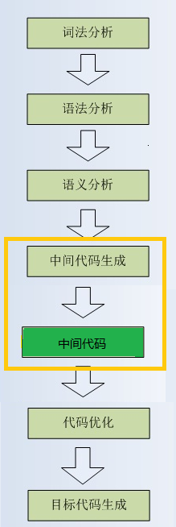
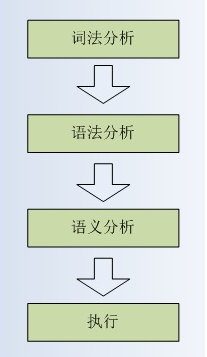
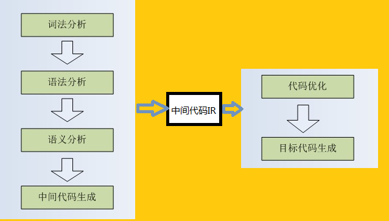
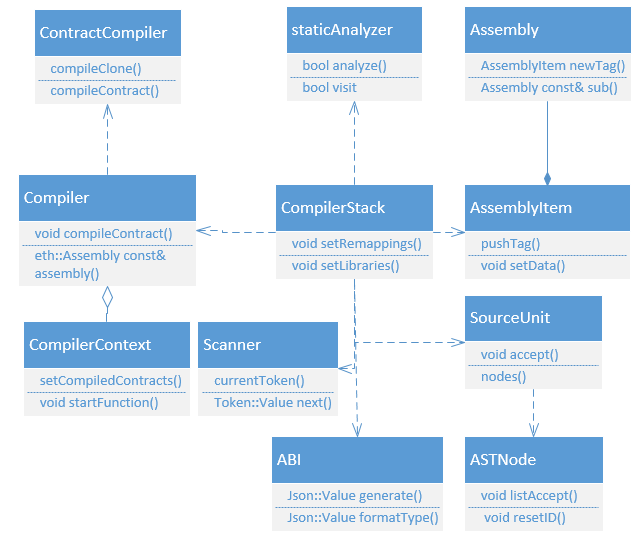
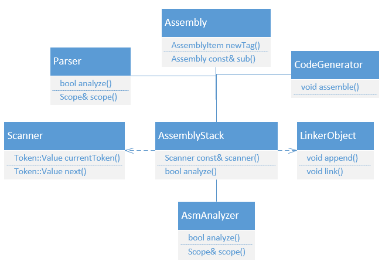

# solc编译器分析
</br>

## 一、solc介绍
</br>
以太坊的智能合约经过编译后运行在虚拟机上，完成整个工作流程，这个过程，需要solc编译器来完成。虽然说solc是一个编译器，但是它又有它与主流编译器不同之处。主要表现在如下几点：
</br>

### 1、功能简单
</br>
支持的基本数据类型只有有限的几种,不支持浮点（或者说想支持，但是目前还没实现）。编译指令也较其它编译器少很多，功能单一。在完成编译时需要借助一些其它辅助的工具。
</br>
换一句话说，以太坊的具体需求，也不需要它提供类似于c++等编译器的强大的编译能力。
</br>

### 2、安全性弱
</br>
虽然solc也支持各种处理数据私有的方法，但是由于区块链的先天性问题，部署到链上后，可以通过各种手段来访问和查看私有数据。而且目前以太坊尚未对数据提供混淆和加密的机制。
</br>

### 3、对主流的异常处理机制支持较弱
</br>
当前主流的编译器基本对异常各种操控都已经非常全面，各种理论和技术也不断涌现，但是以太坊的编译器对异常的处理机制支持的比较简单，流于表面化。
</br>

### 4、不考虑平台相关
</br>
这也是一个非常重要的事项，一个主流的编译器应该是支持市场上主流的操作系统，但是在以太坊上没有这个要求，因为它只服务于以太坊，甚至说对于升级版本的考虑都很简单。
</br>

## 二、编译器流程
</br>
目前主流的编译系统基本分为两大类，即编译类型和解释类型。二者各有各的优势，所以在近年来，二者融合的趋势只增不减。但是编译的原理基本没有发生革命性的变化。
</br>
目前JAVA和C#的编译器都采用了热点编译，普通解释的方式。（这样表述其实并不太合理，JAVA其实是编译成字节码后，如果编译器发现某些代码被经常执行，就会再次汇编成类似C/C++一样的目标代码，更具体的可以参看JAVA虚拟机相关资料）
</br>
下面简要分析一下：
</br>

### 1、编译方式
</br>

最典型的就是C/C++的编译器了，它们基本分为以下几个步骤：
</br>

预编译：在这个阶段主要是使用“预处理程序”来处理源代码，比如C/C++中会把宏和头文件处理并包含到编译单元中。
</br>

词法分析：将源代码分割成不可再分割的单词，主要针对token进行处理归类等。
</br>

语法分析：将提取的单词连接成单词序列，并根据编程语言规则验证其顺序是否合理。在这里会形成大家熟知的抽象语法树（Abstract Syntax Tree）
</br>

语义分析：发现符合语法规则的语句是否有实际意义。即遍历整个语法树进行判断。
</br>

抽象语法树：这里即根据前边的各种条件处理后，最终生成的AST。
</br>

中间码生成：不同的目标平台有着不同的运行机制，所以在这里要根据平台兼容性动态生成中间代码文件。
</br>

目标代码生成：最终的汇编文件。
</br>
目标代码优化：在生成汇编文件前的优化。
</br>

其实后二者是在一起进行的。在一些强类型的编译器中，比如编译c/c++中，可能跳过中间码的生成而由汇编阶段再进行目标代码的生成和优化。也就是说，不同的编译器针对不同的环境或者场景，会有自己的优化和侧重点，这个不要一概而论。下图为其基本流程：
</br>


</br>
### 2、解释方式
</br>
需要说明一下的是，不要被名字误导，解释器也是要进行编译的，只是它编译的过程没有编译方式那么复杂，特别是针对在类似JAVA这种虚拟机上执行的代码，还和虚拟机的相关规范有关系。它主要有以下几个步骤：
</br>

预处理
</br>

词法分析
</br>

语法分析
</br>

生成语法树
</br>

生成字节码
</br>
通过上面来看，基本和编译方式的差不太多，对，往后面就开始有区别了。首先，JAVA和C#走到这里，它的整个工作流程基本就走完成了。当然二者的虚拟机都会针对具体的情况在运行时再次进行优化和编译。但那个就属于优化的范畴了。
</br>
但是JS不同，JavaScript还要进行LLInt（Low Level Interpreter 解释器）执行字节码，最后会用JIT即时编译器再进行具体的编译和优化。所以说，不是一谈解释器就把它和编译器搞成两个山头，不是你死就是我活。下图为解释器工作的基本流程：
</br>


</br>

### 3、WebAssembly
</br>
其实提到WebAssembly，就是因为区块链现在好多都在向这个方向上转，包括以太坊和目前大火的EOS。它的主要流程如下图：
</br>


</br>
WebAssembly把编译分成了前端和后端，它把中间代码做得非常强大，可以使用相关的工具将IR中间代码和相关的平台代码相互转换，同时还可以实现IR的不同表现形式————JSON或者二进制等，方便人和机器识别，从而使应用更加灵活方便。
</br>

## 三、solc的代码模块
</br>
solc的代码主要由libdevcore 、libevmasm、 libjulia 、libsolc、 libsolidity 几个模块组成。在主目录下的CMakeLists.txt中可以看到：
</br>

``` c++
add_subdirectory(libdevcore)
add_subdirectory(libevmasm)
add_subdirectory(libsolidity)
add_subdirectory(libsolc)
if (NOT EMSCRIPTEN)
  add_subdirectory(solc)
	add_subdirectory(liblll)
	add_subdirectory(lllc)
endif()
```
</br>
libdevcore主要提供了基础的数据操作和编解码操作，libjulia是用来处理YUL相关，libsolc和 libsolidity提供了大量的词法语法分析的类，比如声明定义、语法检查、类型检查等等。并且还提供了ABI生成和bin生成相关的操作。

</br>


## 四、SOLC的简要分析
</br>
在分析solidity的源码时要注意LLL已经基本废弃了，所以这部分代码就不再关注了。在solc的主程序中启动调用了CommandLineInterface这个接口类，在这个接口类中首先调用parseArguments来确定各种编译的环境参数。如果出现什么问题，就直接退出。这点有些类似于LINUX的命令机制。而在主程序的最后，调用actOnInput这个函数来实现编译结果的文件序列化。
</br>
需要注意的是，未来版本的 Solidity 编译器很可能会将 Yul 用作智能合约编译的中间语言（IR），因此在solc源码中会出现很多与其相关的代码。
</br>
其实solc编译的重点就在processInput这个函数中,主要就是下面三块：
</br>

### 1、complier
</br>
调用扫描和编译单元等模块生成AST，并在这个过程中完成各种验证和词法语法的分析。编译过程的主要类图如下：
</br>


</br>

### 2、assembly
</br>
汇编成相关的栈文件，包括YUL，EWASM等。这其中会AsmAnalyzer、Assembly等类进行流程的处理和异常的控制。汇编过程的主要类图如下：
</br>


</br>

### 3、link
</br>
处理相关的链接库和文件。如果在编译过程中需要相关库和文件，就会调用链接函数对智能合约需要的资源进行链接。其实就是字节码的映射过程。
</br>

## 五、总结
</br>
solc做为智能合约的编译器，目前的资料还比较少，抛砖引玉，希望把solc的相关内容引入到EVM的分析中，给大家提供一个新的思路。
</br>
