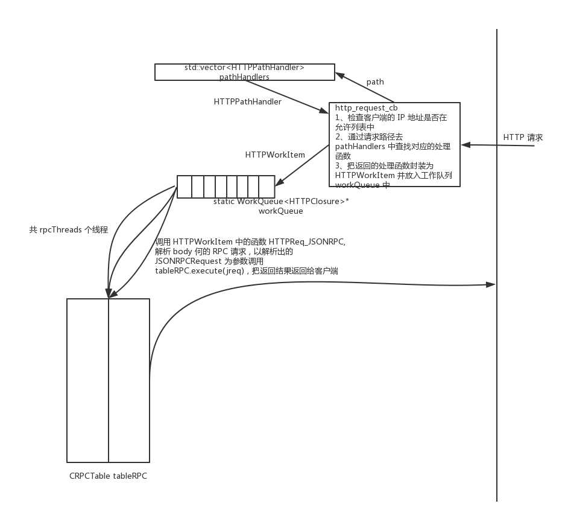

### 比特币中的 HTTP 服务
---
bitcoind 通过 http 服务向外界提供了一系列基于 json-rpc 规范的 rpc 命令，这些命令涉及挖矿、交易、链信息查询等。本篇文章简要介绍其具体实现。

#### 一、提供的 rpc 命令
源码中把所有的 rpc 命令都封装到类 CRPCCommand 中，并且用一个 CRPCTable 类来管理所有的 CRPCCommand，代码如下：
```cpp
typedef UniValue(*rpcfn_type)(const JSONRPCRequest& jsonRequest); // 定义 rpc 命令调用的函数类型

class CRPCCommand
{
public:
    std::string category; // 命令所属范围
    std::string name;  // 命令名字
    rpcfn_type actor; // 命令执行时调用的函数
    std::vector<std::string> argNames;
};

class CRPCTable
{
private:
    std::map<std::string, const CRPCCommand*> mapCommands; //维护所有 rpc 命令
public:
    CRPCTable();
    const CRPCCommand* operator[](const std::string& name) const;
    std::string help(const std::string& name, const JSONRPCRequest& helpreq) const;   
    UniValue execute(const JSONRPCRequest &request) const; // 执行命令   
    std::vector<std::string> listCommands() const;
    bool appendCommand(const std::string& name, const CRPCCommand* pcmd); // 添加命令
};
```
server.cpp 文件中定义了一个 CRPCTable 类型的对象 tableRPC，bitcoind 在启动时会把所有的相关 rpc 命令通过 appendCommand 函数添加到 tableRPC。

#### 二、不同的 http 请求路径对应的处理函数
类 HTTPPathHandler 中含有 http 请求的路径以及对应的处理函数，pathHandlers 是一个这种类型的 vector，可通过 RegisterHTTPHandler 函数向 pathHandlers 中添加元素。
```cpp
std::vector<HTTPPathHandler> pathHandlers;
struct HTTPPathHandler
{
   ......
    std::string prefix; // 请求路径
    bool exactMatch;
    HTTPRequestHandler handler; // 处理函数
};

void RegisterHTTPHandler(const std::string &prefix, bool exactMatch, const HTTPRequestHandler &handler)
{
    LogPrint(BCLog::HTTP, "Registering HTTP handler for %s (exactmatch %d)\n", prefix, exactMatch);
    pathHandlers.push_back(HTTPPathHandler(prefix, exactMatch, handler));
}
// 在 StartHTTPRPC() 函数中向 pathHandlers 添加元素。
bool StartHTTPRPC()
{
......
    RegisterHTTPHandler("/", true, HTTPReq_JSONRPC);
#ifdef ENABLE_WALLET
    // ifdef can be removed once we switch to better endpoint support and API versioning
    RegisterHTTPHandler("/wallet/", false, HTTPReq_JSONRPC);
#endif
......
}
```
可见针对不同的路径这里都是调用 HTTPReq_JSONRPC 函数来处理 http 请求。由于客户端要把想调用的 rpc 命令以 json 格式放在 http 请求的 body 体中，所以这里的 http 服务只支持 post 请求。HTTPReq_JSONRPC 把 http 请求的数据解析到一个类 JSONRPCRequest 的对象 jreq 中，jreq 中含有 http 请求的路径以及从 body 体中解析出的 rpc 请求及参数，然后以 jreq 为参数去 tableRPC 中执行 rpc 命令对应的函数。部分代码如下：
```cpp
static bool HTTPReq_JSONRPC(HTTPRequest* req, const std::string &)
{
    // JSONRPC handles only POST
    if (req->GetRequestMethod() != HTTPRequest::POST) {
        req->WriteReply(HTTP_BAD_METHOD, "JSONRPC server handles only POST requests");
        return false;
    }
......
    JSONRPCRequest jreq;
......
    try {
        // Parse request
        UniValue valRequest;
        if (!valRequest.read(req->ReadBody()))
            throw JSONRPCError(RPC_PARSE_ERROR, "Parse error");

        // Set the URI
        jreq.URI = req->GetURI();

        std::string strReply;
        // singleton request
        if (valRequest.isObject()) {
            jreq.parse(valRequest);

            UniValue result = tableRPC.execute(jreq);

            // Send reply
            strReply = JSONRPCReply(result, NullUniValue, jreq.id);

        // array of requests
        } else if (valRequest.isArray())
            strReply = JSONRPCExecBatch(jreq, valRequest.get_array());
        else
            throw JSONRPCError(RPC_PARSE_ERROR, "Top-level object parse error");

        req->WriteHeader("Content-Type", "application/json");
        req->WriteReply(HTTP_OK, strReply);
    } catch (const UniValue& objError) {
        JSONErrorReply(req, objError, jreq.id);
        return false;
    } catch (const std::exception& e) {
        JSONErrorReply(req, JSONRPCError(RPC_PARSE_ERROR, e.what()), jreq.id);
        return false;
    }
    return true;
}
```

#### 三、借助 libevent 来提供 http 服务
借助于 libevent，用少量代码就可以实现自己的 http 服务，不需要考虑复杂的网络连接请求等问题，以下是部分代码。
```cpp
bool InitHTTPServer()
{
    if (!InitHTTPAllowList())  // 设置允许的客户端地址
        return false;
......
    raii_event_base base_ctr = obtain_event_base();

    /* Create a new evhttp object to handle requests. */
    raii_evhttp http_ctr = obtain_evhttp(base_ctr.get());
    struct evhttp* http = http_ctr.get();
    if (!http) {
        LogPrintf("couldn't create evhttp. Exiting.\n");
        return false;
    }

    evhttp_set_timeout(http, gArgs.GetArg("-rpcservertimeout", DEFAULT_HTTP_SERVER_TIMEOUT));
    evhttp_set_max_headers_size(http, MAX_HEADERS_SIZE);
    evhttp_set_max_body_size(http, MAX_SIZE);
    evhttp_set_gencb(http, http_request_cb, nullptr); // 设置处理 http 请求的回调函数
......
    workQueue = new WorkQueue<HTTPClosure>(workQueueDepth);
......
    return true;
}

static void http_request_cb(struct evhttp_request* req, void* arg)
{
......   
    std::unique_ptr<HTTPRequest> hreq(new HTTPRequest(req));
......
    // Early address-based allow check
    if (!ClientAllowed(hreq->GetPeer())) {
        hreq->WriteReply(HTTP_FORBIDDEN);
        return;
    }
......
    // Find registered handler for prefix
    std::string strURI = hreq->GetURI();
    std::string path;
    std::vector<HTTPPathHandler>::const_iterator i = pathHandlers.begin();
    std::vector<HTTPPathHandler>::const_iterator iend = pathHandlers.end();
    for (; i != iend; ++i) {
        bool match = false;
        if (i->exactMatch)
            match = (strURI == i->prefix);
        else
            match = (strURI.substr(0, i->prefix.size()) == i->prefix);
        if (match) {
            path = strURI.substr(i->prefix.size());
            break;
        }
    }

    // Dispatch to worker thread
    if (i != iend) {
        std::unique_ptr<HTTPWorkItem> item(new HTTPWorkItem(std::move(hreq), path, i->handler));
        assert(workQueue);
        if (workQueue->Enqueue(item.get()))
            item.release(); /* if true, queue took ownership */
        else {
            LogPrintf("WARNING: request rejected because http work queue depth exceeded, it can be increased with the -rpcworkqueue= setting\n");
            item->req->WriteReply(HTTP_INTERNAL, "Work queue depth exceeded");
        }
    } else {
        hreq->WriteReply(HTTP_NOTFOUND);
    }
}
```
http_request_cb 根据请求路径到 pathHandlers 中查找对应的处理函数（这里都是 HTTPReq_JSONRPC），然后将找到的函数封装到 HTTPWorkItem 类型的对象 item 中，并将 item 放入 workQueue 中，由其它线程来进行处理。这里就涉及到一个典型的生产者消费者模型。

#### 四、典型的生产者消费者模型
类模板 WorkQueue 定义了一个生产者消费者模型
```cpp
/** HTTP request work item */
class HTTPWorkItem final : public HTTPClosure
{
public:
......
    void operator()() override
    {
        func(req.get(), path);
    }

    std::unique_ptr<HTTPRequest> req;

private:
    std::string path;
    HTTPRequestHandler func;
};

/** Simple work queue for distributing work over multiple threads.
 * Work items are simply callable objects.
 */
template <typename WorkItem>
class WorkQueue
{
private:
    /** Mutex protects entire object */
    std::mutex cs;
    std::condition_variable cond;
    std::deque<std::unique_ptr<WorkItem>> queue;
    bool running;
    size_t maxDepth;

public:
......
    /** Enqueue a work item */
    bool Enqueue(WorkItem* item)
    {
        std::unique_lock<std::mutex> lock(cs);
        if (queue.size() >= maxDepth) {
            return false;
        }
        queue.emplace_back(std::unique_ptr<WorkItem>(item));
        cond.notify_one();
        return true;
    }
    /** Thread function */
    void Run()
    {
        while (true) {
            std::unique_ptr<WorkItem> i;
            {
                std::unique_lock<std::mutex> lock(cs);
                while (running && queue.empty())
                    cond.wait(lock);
                if (!running)
                    break;
                i = std::move(queue.front());
                queue.pop_front();
            }
            (*i)();
        }
    }
......
};

static WorkQueue<HTTPClosure>* workQueue = nullptr;  // 以 HTTPClosure 为模板参数定义变量 workQueue。
```

生产者：http_request_cb 根据 http 请求路径从 pathHandlers 中找出对应函数（这里都是 HTTPReq_JSONRPC），然后把该函数封装到 WorkItem 并放入 workQueue。
消费者：bitcoind 在启动时创建了 rpcThreads 个线程，这些线程从 workQueue 中取出 WorkItem 并调用其函数调用运算符（也应是执行 HTTPReq_JSONRPC 函数）。代码如下：
```cpp
bool StartHTTPServer()
{
    LogPrint(BCLog::HTTP, "Starting HTTP server\n");
    int rpcThreads = std::max((long)gArgs.GetArg("-rpcthreads", DEFAULT_HTTP_THREADS), 1L);
    LogPrintf("HTTP: starting %d worker threads\n", rpcThreads);
    std::packaged_task<bool(event_base*, evhttp*)> task(ThreadHTTP);
    threadResult = task.get_future();
    threadHTTP = std::thread(std::move(task), eventBase, eventHTTP);

    for (int i = 0; i < rpcThreads; i++) {
        g_thread_http_workers.emplace_back(HTTPWorkQueueRun, workQueue);
    }
    return true;
}

/** Event dispatcher thread */
static bool ThreadHTTP(struct event_base* base, struct evhttp* http)
{
    RenameThread("bitcoin-http");
    LogPrint(BCLog::HTTP, "Entering http event loop\n");
    event_base_dispatch(base);  // 调用 libevent 接口处理 http 连接请求
    // Event loop will be interrupted by InterruptHTTPServer()
    LogPrint(BCLog::HTTP, "Exited http event loop\n");
    return event_base_got_break(base) == 0;
}
```



注：具体的 rpc 命令以及以及其处理过程在 bitcoin/src/rpc 目录下的  rawtransaction.cpp、mining.cpp、blockchain.cpp、misc.cpp、net.cpp 文件中。