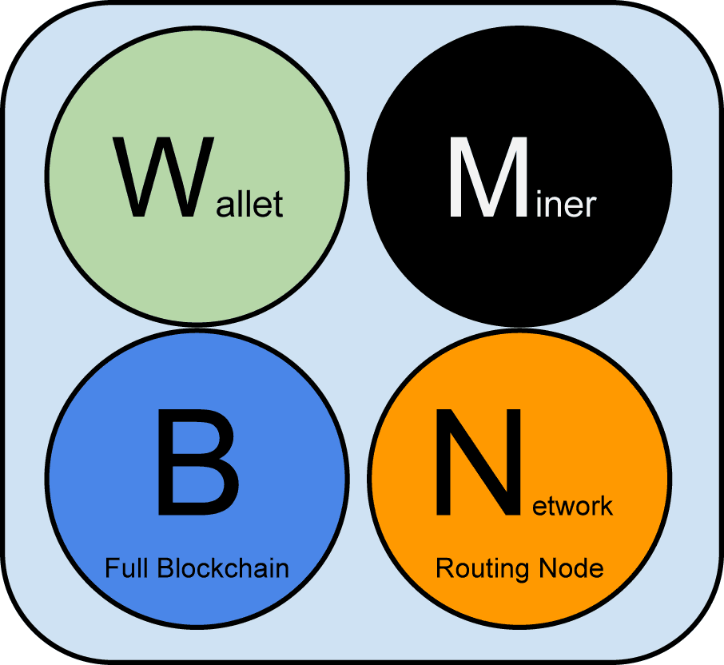
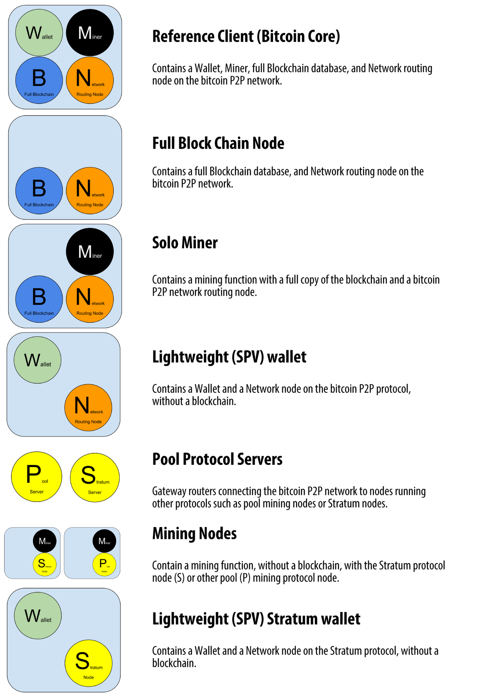
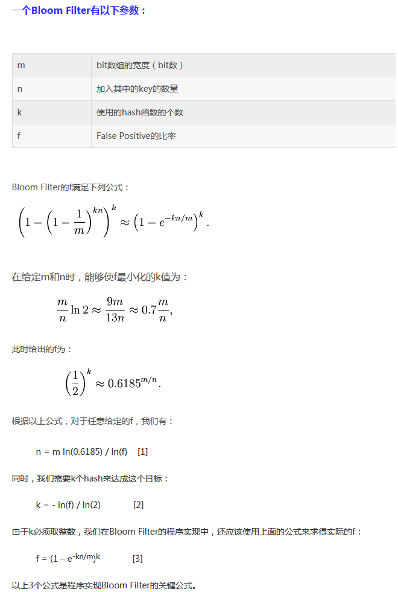

# 精通比特币之五网络

</br>

## 一、比特币网络的架构和算法

</br>
比特币的网络主要以P2P网络协议为主，但也有其它的，比如挖矿的Stratum协议。这里主要以分析P2P网络为主。P2P网络的出现已经有很长一段时间，比较有名的P2P网络包括电骡和BitTorrent.P2P网络一般来说可以分成两类，即结构性和非结构性的，不过最新的也有二者混合在一起的。
</br>
P2P网络的路由从最初的洪泛到现在广泛使用的算法有以下几种：
</br>

1、CAN
</br>
CAN的哈希算法与一致性哈希有所不同。Chord中，哈希得到的键值总是一维的，而在CAN中，哈希的结果由d维的笛卡尔空间来表示。d是一个由系统规模决定的常量。
</br>

2、Pastry
</br>
Pastry使用一致性哈希作为哈希算法。哈希所得的键值为一维(实际上使用的是128bit的整数空间)。Pastry也没有规定具体应该采用何种哈希算法。它也是DHT的一个变种。
</br>

3、Tapestry    
</br>
Tapestry提供了一个分布式容错查找和路由基础平台 。Tapestry的思想来源于Plaxton。在Plaxton中，结点使用自己所知道的邻近结点表，按照目的ID来逐步传递消息。Tapestry基于Plaxtion的思想，加入了容错机制，从而可适应P2P的动态变化的特点.
</br>

4、chord
</br>
Chord通过把Node和Key映射到相同的空间而保证一致性哈希，为了保证哈希的非重复性，Chord选择SHA-1作为哈希函数，SHA-1会产生一个2160的空间，每项为一个16字节（160bit）的大整数。我们可以认为这些整数首尾相连形成一个环，称之为Chord环。整数在Chord环上按大小顺时针排列，Node（机器的IP地址和Port）与Key（资源标识）都被哈希到Chord环上，这样我们就假定了整个P2P网络的状态为一个虚拟的环，因此我们说Chord是结构化的P2P网络。
</br>

5、电骡和BT使用的Kademlia
</br>
二者都实现了后者，但在KEY,VALUE和NODE ID的计算方式有所不同。Kademlia假设网络是一棵二叉树树所有的节点均为叶子节点。在此基础上计算哈希。它属于非集中式的结构算法。

</br>

## 二、比特币网络中的结点构成

</br>

1、节点功能

</br>


</br>
节点的功能主要有四个，钱包，挖矿，全节点数据库，路由。
</br>
2、节点类型
</br>


</br>
由上图可以看到节点的类型主要有以下几类：全节点，全节点数据库，独立矿工，SPV轻量级节点，矿池服务节点，挖矿节点，stratum SPV节点。
</br>

## 三、比特币网络中的结点发现

</br>
网络结点的发现，有两种方法，一种是DNS种子的查询，比特币网络本身带有五种DNS种子的名称。第二种方法是带--seednode参数。下面是硬编码在CMainParams中的种子节点。
</br>

``` C++
vSeeds.emplace_back("seed.bitcoin.sipa.be"); // Pieter Wuille, only supports x1, x5, x9, and xd
vSeeds.emplace_back("dnsseed.bluematt.me"); // Matt Corallo, only supports x9
vSeeds.emplace_back("dnsseed.bitcoin.dashjr.org"); // Luke Dashjr
vSeeds.emplace_back("seed.bitcoinstats.com"); // Christian Decker, supports x1 - xf
vSeeds.emplace_back("seed.bitcoin.jonasschnelli.ch"); // Jonas Schnelli, only supports x1, x5, x9, and xd
vSeeds.emplace_back("seed.btc.petertodd.org"); // Peter Todd, only supports x1, x5, x9, and xd
vSeeds.emplace_back("seed.bitcoin.sprovoost.nl"); // Sjors Provoost
```
</br>
在新的版本中封装了一个CConnman类型，来管理P2P网络的相关运行。这个和以前有一个比较大的变动。从整体看来，比特币的代码正在朝着专业人士的方向前进。在AppInitMain函数中的第六步中调用了这个类对象的初始化和相关的设置。
</br>

``` C++
g_connman = std::unique_ptr<CConnman>(new CConnman(GetRand(std::numeric_limits<uint64_t>::max()), GetRand(std::numeric_limits<uint64_t>::max())));
CConnman& connman = \*g_connman;

peerLogic.reset(new PeerLogicValidation(&connman, scheduler));
RegisterValidationInterface(peerLogic.get());
```
</br>
在第十一步，启动节点时，才真正开始网络服务，发现并连接相关对等节点，并与之进行通信。Discover()然后connman.Start(scheduler, connOptions)，节点就正式启动了。根据实际的参数配置情况会相应启动下列的几个线程：
</br>
CConnman::ThreadSocketHandler
</br>

``` C++
void CConnman::ThreadSocketHandler()
{
    unsigned int nPrevNodeCount = 0;
    while (!interruptNet)
    {
......
        int nSelect = select(have_fds ? hSocketMax + 1 : 0,
                             &fdsetRecv, &fdsetSend, &fdsetError, &timeout);
......

        //
        // Accept new connections接收新连接
        //
        for (const ListenSocket& hListenSocket : vhListenSocket)
        {
            if (hListenSocket.socket != INVALID_SOCKET && FD_ISSET(hListenSocket.socket, &fdsetRecv))
            {
                AcceptConnection(hListenSocket);
            }
        }

        //
        // Service each socket遍历增加引用
        //
        std::vector<CNode*> vNodesCopy;
        {
            LOCK(cs_vNodes);
            vNodesCopy = vNodes;
            for (CNode* pnode : vNodesCopy)
                pnode->AddRef();
        }
        for (CNode* pnode : vNodesCopy)
        {
            if (interruptNet)
                return;

            //
            // Receive//接收数据
            //
......
            if (recvSet || errorSet)
            {
                // typical socket buffer is 8K-64K
                char pchBuf[0x10000];
                int nBytes = 0;
                {
                    LOCK(pnode->cs_hSocket);
                    if (pnode->hSocket == INVALID_SOCKET)
                        continue;
                    nBytes = recv(pnode->hSocket, pchBuf, sizeof(pchBuf), MSG_DONTWAIT);
                }
......
            }

            //
            // Send 发送数据
            //
            if (sendSet)
            {
                LOCK(pnode->cs_vSend);
                size_t nBytes = SocketSendData(pnode);
                if (nBytes) {
                    RecordBytesSent(nBytes);
                }
            }

....  
        }
    }
}
```
</br>
如果有网络编程的经验就非常简单了，一个标准的Select调用，辅助大量的错误和异常判断，这里都删除了。
</br>
ThreadDNSAddressSeed，这个比较简单，就不贴代码了，之所以启动一个线程是因为在某种情况下要阻塞11秒。其它就是对种子的地址处理然后保存到队列中去。
</br>
ThreadOpenAddedConnections和ThreadOpenConnections都是打开网络连接，一个是从RPC -addnode指定的节点连接，一个是地址管理器得到的节点连接。都是调用OpenNetworkConnection这个函数。

</br>
ThreadMessageHandler在交易中进行了比较详细的说明，这里只要简单的说明一下就可以了：
</br>

``` C++
void CConnman::ThreadMessageHandler()
{
    while (!flagInterruptMsgProc)
    {
......

        for (CNode* pnode : vNodesCopy)
        {
......
            // Receive messages
            bool fMoreNodeWork = m_msgproc->ProcessMessages(pnode, flagInterruptMsgProc);
            fMoreWork |= (fMoreNodeWork && !pnode->fPauseSend);
            if (flagInterruptMsgProc)
                return;
            // Send messages
            {
                LOCK(pnode->cs_sendProcessing);
                m_msgproc->SendMessages(pnode, flagInterruptMsgProc);
            }

            if (flagInterruptMsgProc)
                return;
        }
      }
......
}

```
</br>
两个消息处理函数，ProcessMessages和SendMessages。内部在交易中有过介绍，其它和交易都差不太多。
</br>

## 四、交换库存

</br>
这个其实就是对等节点比较自己和接收到的请求之间的顶点的差距，做一个深度500的限制的遍历。没有太复杂的情况 。
</br>

``` C++
else if (strCommand == NetMsgType::GETDATA)
{
    std::vector<CInv> vInv;
    vRecv >> vInv;
    if (vInv.size() > MAX_INV_SZ)
    {
        LOCK(cs_main);
        Misbehaving(pfrom->GetId(), 20, strprintf("message getdata size() = %u", vInv.size()));
        return false;
    }
......
    pfrom->vRecvGetData.insert(pfrom->vRecvGetData.end(), vInv.begin(), vInv.end());
    ProcessGetData(pfrom, chainparams.GetConsensus(), connman, interruptMsgProc);
}
else if (strCommand == NetMsgType::GETBLOCKS)
{
......
    LOCK(cs_main);

    // Find the last block the caller has in the main chain
    const CBlockIndex* pindex = FindForkInGlobalIndex(chainActive, locator);

    // Send the rest of the chain
    if (pindex)
        pindex = chainActive.Next(pindex);
    int nLimit = 500;
......
    for (; pindex; pindex = chainActive.Next(pindex))
    {
        if (pindex->GetBlockHash() == hashStop)
        {
            LogPrint(BCLog::NET, "  getblocks stopping at %d %s\n", pindex->nHeight, pindex->GetBlockHash().ToString());
            break;
        }
        // If pruning, don't inv blocks unless we have on disk and are likely to still have
        // for some reasonable time window (1 hour) that block relay might require.
        const int nPrunedBlocksLikelyToHave = MIN_BLOCKS_TO_KEEP - 3600 / chainparams.GetConsensus().nPowTargetSpacing;
        if (fPruneMode && (!(pindex->nStatus & BLOCK_HAVE_DATA) || pindex->nHeight <= chainActive.Tip()->nHeight - nPrunedBlocksLikelyToHave))
        {
            LogPrint(BCLog::NET, " getblocks stopping, pruned or too old block at %d %s\n", pindex->nHeight, pindex->GetBlockHash().ToString());
            break;
        }
        pfrom->PushInventory(CInv(MSG_BLOCK, pindex->GetBlockHash()));
        if (--nLimit <= 0)
        {
            // When this block is requested, we'll send an inv that'll
            // trigger the peer to getblocks the next batch of inventory.
            LogPrint(BCLog::NET, "  getblocks stopping at limit %d %s\n", pindex->nHeight, pindex->GetBlockHash().ToString());
            pfrom->hashContinue = pindex->GetBlockHash();
            break;
        }
    }
}
```
</br>

## 五、SPV

</br>
现在的轻量级钱包基本不会下载区块的所有部分，那个太占用空间和时间了，一般都是只把区块头下载下来，然后对交易用默克尔树进行验证。当然，为了安全起见，SPV节点会连接随机的多个全节点来进行验证，防止意外攻击和双重支付等恶意行为。
</br>
Merkle 树的部分在下一章区块链中再阐述。
</br>

## 六、bloom过滤器及应用

</br>
Bloom过滤器是一个允许用户描述特定的关键词组合而不必精确表述的基于概率的过滤方法。它能让用户在有效搜索关键词的同时保护他们的隐私。在SPV节点里，这一方法被用来向对等节点发送交易信息查询请求，同时交易地址不会被暴露。
</br>
布隆过滤器的关键参数如下：
</br>



</br>
spv节点通过不断发送BLOOM过滤器的消息，来达到获取自己需要数据的目的。如果不再使用后，可以发送清除消息，将过滤器去除。
</br>

## 七、加密和认证

</br>
比特币的网络可以使用用洋葱路由网络来达到遮蔽隐私的目的。为了安全起见，也可以使用加密通信以及强制要求身份认证，这在BIP-150和BIP-151提案中得到了支持。

</br>

## 八、交易池

</br>
交易池在交易的时候儿也说过，这里简单的说明一下，交易池一方面为打包交易到区块中做数据准备，一方面可以通过VIEW映射UTXO到相关需要中去，比如钱包。书中提到的UTXO池，一般在全节点都会维护一个，他其实是一个CCoinsViewCache 的对象，分成两部分，一部分从本地UTXO数据库中获得并映射到CCoinsViewDB ，另外一部分就是刚刚提到的CTxMemPool映射过来的CCoinsViewMemPool 。
</br>
