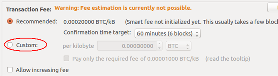


# 一、交易的基本数据结构

</br>


</br>

# 二、交易的流程
</br>
在整个的交易过程中，CTransaction这个类是基础的数据结构，在网络分发的数据中应用的数据结构最终也是它。一个正常的交易从发起到结束，再到确认，需要一个比较长的时间。交易的过程相对来说比较复杂。这里就按照上面的的一个发送交易，对内部的一些内容展开讨论。
</br>
在展开前先说一下两个小的概念，一个是最小传播交易费，一个是创建最小交易的费用，这两个时期版本是相同的，但新的分开了。
</br>

**判断最小传播交易：CFeeRate minRelayTxFee = CFeeRate(5000)；  判断最小创建交易：CFeeRate CWallet::minTxFee = CFeeRate(1000);**
</br>

## 1、准备交易
</br>

``` c++
WalletModel::SendCoinsReturn WalletModel::prepareTransaction(WalletModelTransaction &transaction, const CCoinControl \*coinControl)
{
......
   //此处主要是对本地添加和维护的收款人列表进行处理。
    QList<SendCoinsRecipient> recipients = transaction.getRecipients();
    std::vector<CRecipient> vecSend;

    if(recipients.empty())//接收人为空，退出
    {
        return OK;
    }
......
    // Pre-check input data for validity
    Q_FOREACH(const SendCoinsRecipient &rcp, recipients)
    {
        if (rcp.fSubtractFeeFromAmount)
            fSubtractFeeFromAmount = true;

        if (rcp.paymentRequest.IsInitialized())
        {   // PaymentRequest...
            CAmount subtotal = 0;
            const payments::PaymentDetails& details = rcp.paymentRequest.getDetails();

            //从收款人列表中得到相关脚本，供后面的发送币使用。
            for (int i = 0; i < details.outputs_size(); i++)
            {
                const payments::Output& out = details.outputs(i);
                if (out.amount() <= 0) continue;
                subtotal += out.amount();
                const unsigned char* scriptStr = (const unsigned char*)out.script().data();
                CScript scriptPubKey(scriptStr, scriptStr+out.script().size());
                CAmount nAmount = out.amount();
                CRecipient recipient = {scriptPubKey, nAmount, rcp.fSubtractFeeFromAmount};
                vecSend.push_back(recipient);
            }
            if (subtotal <= 0)
            {
                return InvalidAmount;
            }
            total += subtotal;
        }
        else
        {   // User-entered bitcoin address / amount:
            if(!validateAddress(rcp.address))
            {
                return InvalidAddress;
            }
            if(rcp.amount <= 0)
            {
                return InvalidAmount;
            }
            setAddress.insert(rcp.address);
            ++nAddresses;

            CScript scriptPubKey = GetScriptForDestination(CBitcoinAddress(rcp.address.toStdString()).Get());
            CRecipient recipient = {scriptPubKey, rcp.amount, rcp.fSubtractFeeFromAmount};
            vecSend.push_back(recipient);

            total += rcp.amount;
        }
    }
    if(setAddress.size() != nAddresses)
    {
        return DuplicateAddress;
    }

    //查询帐户余额
    CAmount nBalance = getBalance(coinControl);

    if(total > nBalance)
    {
        return AmountExceedsBalance;
    }

    {
        LOCK2(cs_main, wallet->cs_wallet);

        //把密钥分配池和钱包绑定
        transaction.newPossibleKeyChange(wallet);

        CAmount nFeeRequired = 0;
        int nChangePosRet = -1;
        std::string strFailReason;

        //创建交易和密钥
        CWalletTx \*newTx = transaction.getTransaction();
        CReserveKey \*keyChange = transaction.getPossibleKeyChange();
        //创建交易
        bool fCreated = wallet->CreateTransaction(vecSend, \*newTx, \*keyChange, nFeeRequired, nChangePosRet, strFailReason, coinControl);
        transaction.setTransactionFee(nFeeRequired);
        if (fSubtractFeeFromAmount && fCreated)
            transaction.reassignAmounts(nChangePosRet);//重新安排零钱帐户的数据

        if(!fCreated)
        {
            if(!fSubtractFeeFromAmount && (total + nFeeRequired) > nBalance)
            {
               //费用不够
                return SendCoinsReturn(AmountWithFeeExceedsBalance);
            }
            Q_EMIT message(tr("Send Coins"), QString::fromStdString(strFailReason),
                         CClientUIInterface::MSG_ERROR);
            return TransactionCreationFailed;
        }

        // reject absurdly high fee > 0.1 bitcoin 费用太高
        if (nFeeRequired > 10000000)
            return AbsurdFee;
    }

    return SendCoinsReturn(OK);
}
```

</br>
SendCoinsEntry入口UI：
</br>

  

</br>
自定义费率：
</br>



</br>
上面的代码在上篇文章中有过但为了清晰，删除了大部分的代码。这次基本贴全了。
</br>

## 2、创建交易
</br>

**重点照顾一下CreateTransaction：**
</br>

``` c++
bool CWallet::CreateTransaction(const vector<CRecipient>\& vecSend,
                                CWalletTx\& wtxNew, CReserveKey\& reservekey, CAmount& nFeeRet, int\& nChangePosRet, std::string\& strFailReason, const CCoinControl\*coinControl)
{
    CAmount nValue = 0;
    unsigned int nSubtractFeeFromAmount = 0;
    BOOST_FOREACH (const CRecipient& recipient, vecSend)
    {
        if (nValue < 0 || recipient.nAmount < 0)
        {
            strFailReason = _("Transaction amounts must be positive");
            return false;
        }
        nValue += recipient.nAmount;

        if (recipient.fSubtractFeeFromAmount)
            nSubtractFeeFromAmount++;
    }
    if (vecSend.empty() || nValue < 0)
    {
        strFailReason = _("Transaction amounts must be positive");
        return false;
    }

    wtxNew.fTimeReceivedIsTxTime = true;
    wtxNew.BindWallet(this);
    CMutableTransaction txNew;

    // Discourage fee sniping.防止费用狙击--为处理小BUG，增加块设置，和书上略有不同
    //                        最新版本是当前块，意思是说（1~5亿间），大于等于当前块，交易都可用。
    //                        书上说的不太清楚。
    // However because of a off-by-one-error in previous versions we need to
    // neuter it by setting nLockTime to at least one less than nBestHeight.
    // Secondly currently propagation of transactions created for block heights
    // corresponding to blocks that were just mined may be iffy - transactions
    // aren't re-accepted into the mempool - we additionally neuter the code by
    // going ten blocks back. Doesn't yet do anything for sniping, but does act
    // to shake out wallet bugs like not showing nLockTime'd transactions at
    // all.
    txNew.nLockTime = std::max(0, chainActive.Height() - 10); //设置锁定时间

    // Secondly occasionally randomly pick a nLockTime even further back, so
    // that transactions that are delayed after signing for whatever reason,
    // e.g. high-latency mix networks and some CoinJoin implementations, have
    // better privacy.
    if (GetRandInt(10) == 0)//设置锁定时间
        txNew.nLockTime = std::max(0, (int)txNew.nLockTime - GetRandInt(100));

    assert(txNew.nLockTime <= (unsigned int)chainActive.Height());
    assert(txNew.nLockTime < LOCKTIME_THRESHOLD);

    {
        LOCK2(cs_main, cs_wallet);
        {
            nFeeRet = 0;
            while (true)
            {
                txNew.vin.clear();
                txNew.vout.clear();
                wtxNew.fFromMe = true;

                nChangePosRet = -1;
                bool fFirst = true;

                CAmount nTotalValue = nValue;
                if (nSubtractFeeFromAmount == 0)
                    nTotalValue += nFeeRet;
                double dPriority = 0;
                // vouts to the payees
                BOOST_FOREACH (const CRecipient& recipient, vecSend)
                {
                    //这里填充CTxOut
                    CTxOut txout(recipient.nAmount, recipient.scriptPubKey);

                    if (recipient.fSubtractFeeFromAmount)
                    {
                        txout.nValue -= nFeeRet / nSubtractFeeFromAmount; // Subtract fee equally from each selected recipient

                        if (fFirst) // first receiver pays the remainder not divisible by output count
                        {
                            fFirst = false;
                            txout.nValue -= nFeeRet % nSubtractFeeFromAmount;
                        }
                    }
		    //处理是不是小额交易
                    if (txout.IsDust(::minRelayTxFee))
                    {
                        if (recipient.fSubtractFeeFromAmount && nFeeRet > 0)
                        {
                            if (txout.nValue < 0)
                                strFailReason = _("The transaction amount is too small to pay the fee");
                            else
                                strFailReason = _("The transaction amount is too small to send after the fee has been deducted");
                        }
                        else
                            strFailReason = _("Transaction amount too small");
                        return false;
                    }
                    txNew.vout.push_back(txout);//加入输出,将txout填充入CWalletTx，继承自CTransaction
                }

                // Choose coins to use 选择可以花费的币
                set<pair<const CWalletTx*,unsigned int> > setCoins;
                CAmount nValueIn = 0;
                if (!SelectCoins(nTotalValue, setCoins, nValueIn, coinControl))
                {
                    strFailReason = _("Insufficient funds");
                    return false;
                }
                //设置币龄相关
                BOOST_FOREACH(PAIRTYPE(const CWalletTx\*, unsigned int) pcoin, setCoins)
                {
                    CAmount nCredit = pcoin.first->vout[pcoin.second].nValue;
                    //The coin age after the next block (depth+1) is used instead of the current,
                    //reflecting an assumption the user would accept a bit more delay for
                    //a chance at a free transaction.
                    //But mempool inputs might still be in the mempool, so their age stays 0
                    //计算块龄，这个跟进入mempool有一定的联系。
                    int age = pcoin.first->GetDepthInMainChain();
                    if (age != 0)
                        age += 1;
                    dPriority += (double)nCredit * age;
                }

                CAmount nChange = nValueIn - nValue;
                if (nSubtractFeeFromAmount == 0)
                    nChange -= nFeeRet;

                //处理零钱
                if (nChange > 0)
                {
                    // Fill a vout to ourself
                    // TODO: pass in scriptChange instead of reservekey so
                    // change transaction isn't always pay-to-bitcoin-address
		    //提供更健全的处理机制，即不只是处理比特币地址，也包括各种脚本支持的交易。
                    CScript scriptChange;

                    // coin control: send change to custom address自定义地址
                    if (coinControl && !boost::get<CNoDestination>(&coinControl->destChange))
                        scriptChange = GetScriptForDestination(coinControl->destChange);

                    // no coin control: send change to newly generated address没有则产生一个新地址
                    else
                    {
                        // Note: We use a new key here to keep it from being obvious which side is the change.
                        //  The drawback is that by not reusing a previous key, the change may be lost if a
                        //  backup is restored, if the backup doesn't have the new private key for the change.
                        //  If we reused the old key, it would be possible to add code to look for and
                        //  rediscover unknown transactions that were written with keys of ours to recover
                        //  post-backup change.

                        // Reserve a new key pair from key pool
                        CPubKey vchPubKey;
                        bool ret;
                        ret = reservekey.GetReservedKey(vchPubKey);
                        assert(ret); // should never fail, as we just unlocked

                        scriptChange = GetScriptForDestination(vchPubKey.GetID());
                    }

	            //为零钱创建一个输出
                    CTxOut newTxOut(nChange, scriptChange);

                    // We do not move dust-change to fees, because the sender would end up paying more than requested.
                    // This would be against the purpose of the all-inclusive feature.
                    // So instead we raise the change and deduct from the recipient.
                    //我的理解可能是虽然用记可以多付，但是你不能多收，所以要从你那把钱放回到零钱中去。
                    if (nSubtractFeeFromAmount > 0 && newTxOut.IsDust(::minRelayTxFee))
                    {
                        CAmount nDust = newTxOut.GetDustThreshold(::minRelayTxFee) - newTxOut.nValue;
                        newTxOut.nValue += nDust; // raise change until no more dust
                        for (unsigned int i = 0; i < vecSend.size(); i++) // subtract from first recipient
                        {
                            if (vecSend[i].fSubtractFeeFromAmount)
                            {
                                txNew.vout[i].nValue -= nDust;
                                if (txNew.vout[i].IsDust(::minRelayTxFee))
                                {
                                    strFailReason = _("The transaction amount is too small to send after the fee has been deducted");
                                    return false;
                                }
                                break;
                            }
                        }
                    }

                    // Never create dust outputs; if we would, just
                    // add the dust to the fee.
                    if (newTxOut.IsDust(::minRelayTxFee))
                    {
                        nFeeRet += nChange;
                        reservekey.ReturnKey();
                    }
                    else
                    {
                        // Insert change txn at random position:
                        nChangePosRet = GetRandInt(txNew.vout.size()+1);
                        vector<CTxOut>::iterator position = txNew.vout.begin()+nChangePosRet;//nChangePosRet 是向量长度的随机数取余。
                        txNew.vout.insert(position, newTxOut); //随机插入零钱交易的位置
                    }
                }
                else
                    reservekey.ReturnKey();

                // Fill vin
                //
                // Note how the sequence number is set to max()-1 so that the
                // nLockTime set above actually works.此处处理上面类图中的CTxIn
                //包括内部数据的填充其中有COutPoint类型的prevout
                BOOST_FOREACH(const PAIRTYPE(const CWalletTx\*,unsigned int)& coin, setCoins)
                    txNew.vin.push_back(CTxIn(coin.first->GetHash(),coin.second,CScript(),
                                              std::numeric_limits<unsigned int>::max()-1));

                // Sign签名
                int nIn = 0;
                BOOST_FOREACH(const PAIRTYPE(const CWalletTx\*,unsigned int)& coin, setCoins)
                    if (!SignSignature(\*this, \*coin.first, txNew, nIn++))
                    {
                        strFailReason = _("Signing transaction failed");
                        return false;
                    }

                // Embed the constructed transaction data in wtxNew.生成交易数据
                \*static_cast<CTransaction*>(&wtxNew) = CTransaction(txNew);

                // Limit size控制大小 不多于
                unsigned int nBytes = ::GetSerializeSize(\*(CTransaction\*)&wtxNew, SER_NETWORK, PROTOCOL_VERSION);
                if (nBytes >= MAX_STANDARD_TX_SIZE)
                {
                    strFailReason = _("Transaction too large");
                    return false;
                }
                dPriority = wtxNew.ComputePriority(dPriority, nBytes);

                // Can we complete this as a free transaction?是不是允许成为一个免费的交易
                if (fSendFreeTransactions && nBytes <= MAX_FREE_TRANSACTION_CREATE_SIZE)
                {
                    // Not enough fee: enough priority?
                    double dPriorityNeeded = mempool.estimatePriority(nTxConfirmTarget);
                    // Not enough mempool history to estimate: use hard-coded AllowFree.
                    if (dPriorityNeeded <= 0 && AllowFree(dPriority))
                        break;

                    // Small enough, and priority high enough, to send for free
                    if (dPriorityNeeded > 0 && dPriority >= dPriorityNeeded)
                        break;
                }

                CAmount nFeeNeeded = GetMinimumFee(nBytes, nTxConfirmTarget, mempool);

                // If we made it here and we aren't even able to meet the relay fee on the next pass, give up
                // because we must be at the maximum allowed fee.
                //小于广播交易费用报错。
                if (nFeeNeeded < ::minRelayTxFee.GetFee(nBytes))
                {
                    strFailReason = _("Transaction too large for fee policy");
                    return false;
                }

                if (nFeeRet >= nFeeNeeded)//正常成功然后中断循环
                    break; // Done, enough fee included.

                // Include more fee and try again.如果找的输入得出的交易费太小就直接回到初始位置重找重算。
                nFeeRet = nFeeNeeded;
                continue;
            }
        }
    }

    return true;
}
```
</br>

## 3、签名

</br>
最后就是签名了：
</br>

``` c++
两个重载的SignSignature，最重要的是创建了签名的TransactionSignatureCreator类型的creator

bool ProduceSignature(const BaseSignatureCreator& creator, const CScript& fromPubKey, CScript& scriptSig)
{
    txnouttype whichType;
    if (!SignStep(creator, fromPubKey, scriptSig, whichType))
        return false;

    if (whichType == TX_SCRIPTHASH)
    {
......
        bool fSolved =
            SignStep(creator, subscript, scriptSig, subType) && subType != TX_SCRIPTHASH;
......
    }

    // Test solution
    return VerifyScript(scriptSig, fromPubKey, STANDARD_SCRIPT_VERIFY_FLAGS, creator.Checker());
}
static bool SignStep(const BaseSignatureCreator& creator, const CScript& scriptPubKey,
                     CScript& scriptSigRet, txnouttype& whichTypeRet)
{
    scriptSigRet.clear();

    vector<valtype> vSolutions;
    if (!Solver(scriptPubKey, whichTypeRet, vSolutions))
        return false;

    CKeyID keyID;
    switch (whichTypeRet)
    {
    case TX_NONSTANDARD:
    case TX_NULL_DATA:
        return false;
    case TX_PUBKEY:
        keyID = CPubKey(vSolutions[0]).GetID();
        return Sign1(keyID, creator, scriptPubKey, scriptSigRet);
    case TX_PUBKEYHASH:
        keyID = CKeyID(uint160(vSolutions[0]));
        if (!Sign1(keyID, creator, scriptPubKey, scriptSigRet))
            return false;
        else
        {
            CPubKey vch;
            creator.KeyStore().GetPubKey(keyID, vch);
            scriptSigRet << ToByteVector(vch);
        }
        return true;
    case TX_SCRIPTHASH:
        return creator.KeyStore().GetCScript(uint160(vSolutions[0]), scriptSigRet);

    case TX_MULTISIG:
        scriptSigRet << OP_0; // workaround CHECKMULTISIG bug
        return (SignN(vSolutions, creator, scriptPubKey, scriptSigRet));
    }
    return false;
}

//返回一个公钥或者哈希
bool Solver(const CScript& scriptPubKey, txnouttype& typeRet, vector<vector<unsigned char> >& vSolutionsRet)
{
    // Templates
    static multimap<txnouttype, CScript> mTemplates;
    if (mTemplates.empty())
    {
        // Standard tx, sender provides pubkey, receiver adds signature
        mTemplates.insert(make_pair(TX_PUBKEY, CScript() << OP_PUBKEY << OP_CHECKSIG));

        // Bitcoin address tx, sender provides hash of pubkey, receiver provides signature and pubkey
        mTemplates.insert(make_pair(TX_PUBKEYHASH, CScript() << OP_DUP << OP_HASH160 << OP_PUBKEYHASH << OP_EQUALVERIFY << OP_CHECKSIG));

        // Sender provides N pubkeys, receivers provides M signatures
        mTemplates.insert(make_pair(TX_MULTISIG, CScript() << OP_SMALLINTEGER << OP_PUBKEYS << OP_SMALLINTEGER << OP_CHECKMULTISIG));

        // Empty, provably prunable, data-carrying output
        if (GetBoolArg("-datacarrier", true))
            mTemplates.insert(make_pair(TX_NULL_DATA, CScript() << OP_RETURN << OP_SMALLDATA));
        mTemplates.insert(make_pair(TX_NULL_DATA, CScript() << OP_RETURN));
    }

    // Shortcut for pay-to-script-hash, which are more constrained than the other types:
    // it is always OP_HASH160 20 [20 byte hash] OP_EQUAL
    if (scriptPubKey.IsPayToScriptHash())
    {
        typeRet = TX_SCRIPTHASH;
        vector<unsigned char> hashBytes(scriptPubKey.begin()+2, scriptPubKey.begin()+22);
        vSolutionsRet.push_back(hashBytes);
        return true;
    }

    // Scan templates
    const CScript& script1 = scriptPubKey;
    BOOST_FOREACH(const PAIRTYPE(txnouttype, CScript)& tplate, mTemplates)
    {
        const CScript& script2 = tplate.second;
        vSolutionsRet.clear();

        opcodetype opcode1, opcode2;
        vector<unsigned char> vch1, vch2;

        // Compare
        CScript::const_iterator pc1 = script1.begin();
        CScript::const_iterator pc2 = script2.begin();
        while (true)
        {
            if (pc1 == script1.end() && pc2 == script2.end())
            {
                // Found a match
                typeRet = tplate.first;
                if (typeRet == TX_MULTISIG)
                {
                    // Additional checks for TX_MULTISIG:
                    unsigned char m = vSolutionsRet.front()[0];
                    unsigned char n = vSolutionsRet.back()[0];
                    if (m < 1 || n < 1 || m > n || vSolutionsRet.size()-2 != n)
                        return false;
                }
                return true;
            }
            if (!script1.GetOp(pc1, opcode1, vch1))
                break;
            if (!script2.GetOp(pc2, opcode2, vch2))
                break;

            // Template matching opcodes:
            if (opcode2 == OP_PUBKEYS)
            {
                while (vch1.size() >= 33 && vch1.size() <= 65)
                {
                    vSolutionsRet.push_back(vch1);
                    if (!script1.GetOp(pc1, opcode1, vch1))
                        break;
                }
                if (!script2.GetOp(pc2, opcode2, vch2))
                    break;
                // Normal situation is to fall through
                // to other if/else statements
            }

            if (opcode2 == OP_PUBKEY)
            {
                if (vch1.size() < 33 || vch1.size() > 65)
                    break;
                vSolutionsRet.push_back(vch1);
            }
            else if (opcode2 == OP_PUBKEYHASH)
            {
                if (vch1.size() != sizeof(uint160))
                    break;
                vSolutionsRet.push_back(vch1);
            }
            else if (opcode2 == OP_SMALLINTEGER)
            {   // Single-byte small integer pushed onto vSolutions
                if (opcode1 == OP_0 ||
                    (opcode1 >= OP_1 && opcode1 <= OP_16))
                {
                    char n = (char)CScript::DecodeOP_N(opcode1);
                    vSolutionsRet.push_back(valtype(1, n));
                }
                else
                    break;
            }
            else if (opcode2 == OP_SMALLDATA)
            {
                // small pushdata, <= nMaxDatacarrierBytes
                if (vch1.size() > nMaxDatacarrierBytes)
                    break;
            }
            else if (opcode1 != opcode2 || vch1 != vch2)
            {
                // Others must match exactly
                break;
            }
        }
    }

    vSolutionsRet.clear();
    typeRet = TX_NONSTANDARD;
    return false;
}

static bool Sign1(const CKeyID& address, const BaseSignatureCreator& creator, const CScript& scriptCode, CScript& scriptSigRet)
{
......
    if (!creator.CreateSig(vchSig, address, scriptCode))
        return false;
......
}

static bool SignN(const vector<valtype>& multisigdata, const BaseSignatureCreator& creator, const CScript& scriptCode, CScript& scriptSigRet)
{
......
        CKeyID keyID = CPubKey(pubkey).GetID();
        if (Sign1(keyID, creator, scriptCode, scriptSigRet))
            ++nSigned;
......
    return nSigned==nRequired;
}

真正的签名在这Creator中：
bool TransactionSignatureCreator::CreateSig(std::vector<unsigned char>& vchSig, const CKeyID& address, const CScript& scriptCode) const
{
......
    uint256 hash = SignatureHash(scriptCode, \*txTo, nIn, nHashType);
......
}

uint256 SignatureHash(const CScript& scriptCode, const CTransaction& txTo, unsigned int nIn, int nHashType)
{
    static const uint256 one(uint256S("0000000000000000000000000000000000000000000000000000000000000001"));
.....
    return ss.GetHash();
}
```
</br>
到现在为止，基本上一个交易的细节就完成了。
