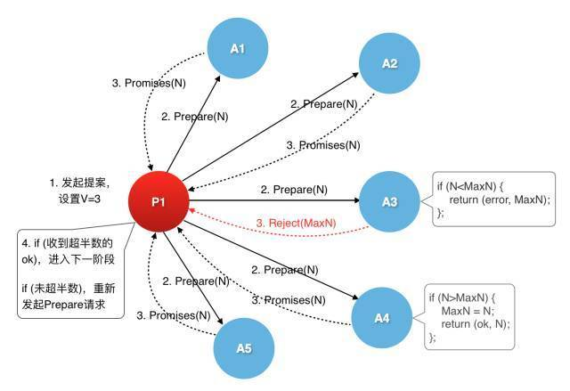
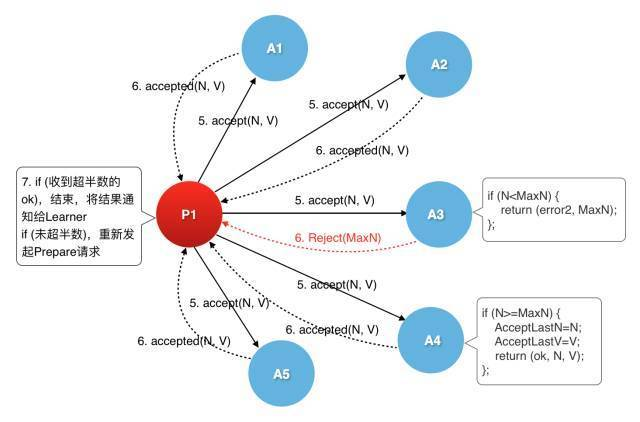

# 共识算法之：Paxos

## 介绍

在2006年Google的经典论文“The Chubby lock service for loosely-coupled distributed systems”中有一句话，”Indeed, All working protocols for asynchronous consensus we have so far encountered have Paxos at their core"(事实上，到目前为止我们遇到的解决异步共识问题的实用算法，其核心都是Paxos)。

Google大牛的话，直接指出了Paxos的江湖地位，那么Paxos到底是那一路武林门派？

## Paxos的诞生

Leslie Lamport在1989年写出第一篇论文《The Part-Time Parliament》的时候，使用了一个虚拟的小岛Paxos，岛上的人们通过议会表决的方式来决定具体事务，Lamport就通过这种方式来解释这个算法，群众纷纷表示难以理解，大神表示你们一点儿幽默感也没有，拒绝修改自己的论文，导致这篇论文也没有能够发表。随着分布式系统的发展，有一部分人读懂了这篇论文，直到1998年这篇论文才得以最终发表。随后Lamport也做出了让步，后续又陆续发表了《Paxos Made Simple》和《Fast Paxos》两篇论文。大家也就习惯性的把这套算法成为Paxos算法。

Lamport在《Paxos Made Simple》中写道：The Paxos algorithm, when presented in plain English, is very simple. 大神眼里的very simple在普通人这里变成了异常的晦涩难懂，尤其是要使用程序员严谨的思维将所有细节理清的时候，那更是云山雾罩。

那么，Paxos究竟在解决什么问题？算法的核心思想是什么？

## Paxos 是什么

分布式系统中的跨节点通信存在两种模型：共享内存(Shared memory)和消息传递(Messages passing)。共享内存的方式，只适合于不同的节点共存于同一台物理机器的时候，当跨越物理机器的时候，就只能使用消息传递了。

基于消息传递模型的分布式系统，不可避免的会发生以下异常：
- 进程可能会慢、被杀死或者重启；
- 消息可能会延迟、丢失、重复；

注：在基础Paxos场景中，先不考虑可能出现消息篡改(即拜占庭错误)的情况；

Paxos算法解决的问题，就是在一个可能发生上述异常的分布式系统中，如何就某个值达成一致，保证不论发生以上任何异常，都不会破坏决议的一致性。注意，这里的“某个值”，可以是某一个具体的数值，比如，1，2，3，4，5。也可以是某一种具体的操作，这个操作可以序列化成“一个值”，只要这个“值”确定了，也就等于这个操作确定了。

** 维基百科的定义 **

Paxos的目的是让整个集群的结点对某个值的变更达成一致。Paxos可以说是一个民主选举的算法——大多数节点的决定会成个整个集群的统一决定。任何一个点都可以提出要修改某个数据的提案，是否通过这个提案取决于这个集群中是否有超过半数的节点同意。取值一旦确定将不再更改，并且可以被获取到(不可变性，可读取性)。

简而言之，这个就有点像我们的人民代表大会制度，每一个与会代表都可以提出自己的提案，只要能够获得超过半数的代表同意，这个提案就可以获得通过。

我们现在知道了Paxos是干什么的，下面继续来看，他是怎么干的。

## Paxos算法

#### 角色说明

Paxos把这个过程中的所有参与者划分成了几种角色，分别如下：
- Proposer：提议者，提出议案(同时存在一个或者多个，他们各自发出提案)
- Acceptor：接受者，收到议案后选择是否接受
- Learner：最终决策学习者，只学习正确的决议
- Client：产生议题者，发起新的请求

上面这一幅图表示出了各个角色之间的关系。这4种角色中最主要的是Proposer和Acceptor。Proposer就像Client的代理人，由Proposer拿着Client的议题去向Acceptor提议，让Acceptor来做出决策。主要的交互过程在Proposer和Acceptor之间。

这幅图表示的是角色之间的逻辑关系，每一种角色就代表了一种节点类型。在物理部署环节，可以把每一种角色都部署在一台物理机器上，也可以组合任何两种或者多种角色在一台物理机器上，甚至于，把这四种角色都部署在同一台物理机器上也是可以的。

#### 算法细节

Paxos算法描述非常的简单，就只有两步，决议的提出(Prepare)与批准(Accept)。就这么一句话，你懂了么？是不是云里雾里的。

###### Prepare阶段

proposer选择一个提案编号n并将Prepare请求发送给acceptors中的一个多数派(即超过半数)；acceptor收到Prepare消息后，如果提案的编号大于它已经回复的所有Prepare消息，则acceptor将自己上次接受的提案回复给proposer，并承诺不再回复小于n的提案；

上图是一个proposer和5个acceptor之间的交互，对2种不同的情况做了处理。

###### 批准阶段

当一个proposer收到了多数acceptors对Prepare的回复后，就进入批准阶段。它要向回复Prepare请求的acceptors发送accept请求，包括编号n和value；

在不违背自己向其他proposer的承诺的前提下，acceptor收到accept请求后即接受这个请求。

可以看出，Proposer与Acceptor之间的交互主要有4类消息通信，这4类消息对应于Paxos算法的两个阶段4个过程。用2轮RPC来确定一个值。上面的图解都只有一个Proposer，但是实际肯定是有多个Proposer发出请求，所以在每个过程中都会有些特殊情况处理，这也是为了达成一致性所做的事情。

如果在整个过程中没有其他Proposer来竞争，那么这个操作的结果就是确定无异议的。但是如果有其他Proposer来竞争的话，情况就不一样了。

上面的描述就是比较正统的解释Paxos算法的说明了，怎么样，你看懂了吗？作为初学者第一次看到这样的描述的时候，一般都在云里游荡呢，反正我第一次看到的时候是这样。下面，我们还是用生活化的例子来说明一下吧。

#### 四个人约饭局的问题

我们先来看一个最简单的模型，只有一个Proposer的情况。

这里有四个人要约饭局，就用A，B，C，D来代表着四个人吧，他们要确定的是去吃什么的问题，他们彼此之间还是只能通过短信沟通。大家都很谦让，都说你们说吧，看看去吃什么，在这种情况下，每个人都没有做出决定。

初始状态是这样的：

|  | A | B | C | D |
| - | :-: |:-: | :-: | :-: |
| 编号 | 0 | 0 | 0 | 0 |
| 选择 | NULL | NULL | NULL | NULL |

这种沉默也不能无限期下去吧，终于A站出来，发出了第一个提议，我们去吃海底捞吧，并且给另外三个发了短信。这个时候，A就是Proposer，B，C，D三个人的角色就成了Acceptor。这三个人都正确的收到了短信，而且爽快的回复了短信说，你决定就好了，反正我这里还没有做出选择。

这个时候，状态是这样的：

|  | A(Proposer) | B(Acceptor) | C(Acceptor) | D(Acceptor) |
| - | :-: |:-: | :-: | :-: |
| 编号 |  | 1 | 1 | 1 |
| 选择 |  | NULL | NULL | NULL |

A收到了B，C和D回复的短信，这是A的状态是这样的。

|  | A(Proposer) |
| - | :-: |
| 编号 | 1 |
| 选择 | NULL |

这时候，由于A收到了3个人的确认短信，已经超过了Acceptors(三个人)的半数，也就意味着A的提案被接受了。所以A给三个人再次发出确认短信，确定去海底捞吃饭，B，C，D收到后，都同意了这个提议。由于超过了半数Acceptors的批准，这次去哪儿吃饭的事情就定下来了。这时候最新的状态是这样的。

|  | A(Proposer) | B(Acceptor) | C(Acceptor) | D(Acceptor) |
| - | :-: |:-: | :-: | :-: |
| 编号 |  | 1 | 1 | 1 |
| 选择 | 海底捞 | 海底捞 | 海底捞 | 海底捞 |

在大家都确定好了之后，又一个冒失鬼E突然闯了进来，给四个人都发了短信问，去哪儿吃饭，捎上我呀。B，C，D都给他回短信，去海底捞吃饭，你来吧，负责买单就好。这个情况下，E就是Learner角色。

|  | E(Learner) |
| - | :-: |
| 选择 | 海底捞 |

至此，约饭局结束。这里只是一个最简单的模型，只有一个Proposer提出提案，没有人竞争，所有大家都直接接受这个唯一的提案者提出的建议就好了。

#### 七个人约饭局的问题

下面，我们看一个稍微复杂一点的例子，有2个Proposers和5个Acceptors. 这种情况下，就已经不失一般性了，更多的Proposer和Acceptors的情况下，很可能就是交互的轮次会更多而已。

在这里，我们就直接假定，A和B是Proposer，其余的C，D，E，F，G是Acceptor，这里是所有角色的初始状态，所有的Acceptors都没有响应过任何编号的提案，所以编号都是0，且选择都是NULL

|  |  C(Acceptor) | D(Acceptor) |  E(Acceptor) | F(Acceptor) | G(Acceptor) |
| - | :-: | :-: | :-: | :-: | :-: |
| 编号 | 0 | 0 | 0 | 0 | 0 |
| 选择 | NULL | NULL | NULL | NULL | NULL |

这时候，A发起了第一轮建议，给所有的Acceptors发短信说，我们去吃海底捞吧，由于异常，只有两个Acceptors收到了这个Prepare(1, 海底捞)的短信。由于这两个Acceptors也是没有任何主见的人，所以他们就爽快的同意了A的建议，并且给A回复了承诺短信promise(1, NULL)

|  |  C(Acceptor) | D(Acceptor) |  E(Acceptor) | F(Acceptor) | G(Acceptor) |
| - | :-: | :-: | :-: | :-: | :-: |
| 编号 | 0 | 1 | 0 | 0 | 1 |
| 承诺 | 0 | 海底捞 | 0 | 0 | 海底捞 |
| 选择 | NULL | NULL | NULL | NULL | NULL |

> Paxos协议的第一阶段，就是proposer发起提案，每一个提案都需要包含一个提案的唯一编号。对于acceptor来说，如果他还没有承诺过任何提案，那么就必须对收到的第一个提案做出承诺，即：把这个提案作为备选的可接受提案。做出承诺的方式就是给proposer做出承诺回复，回复的信息是proposal的提案编号和空值(NULL)，NULL表示自己还没有承诺过任何提案

由于A只收到了D和G两个人的承诺，未能超过半数，所以无法对所有人发起确认消息。

> Proposer必须要收到超过半数以上Acceptors的承诺，才能发起accept请求

随后，B发起第二轮建议，给所有人发短信说，我们去吃披萨吧。Prepare(2,披萨)，由于异常原因，只有C，D，E，F四个人处理了他的消息，C，E，F由于没有做出过任何承诺，所以给B回复了承诺短信promise(2, NULL)，B由于已经给A做出过承诺，承诺了海底捞，所以给B回复了承诺promise(2, 海底捞)

|  |  C(Acceptor) | D(Acceptor) |  E(Acceptor) | F(Acceptor) | G(Acceptor) |
| - | :-: | :-: | :-: | :-: | :-: |
| 编号 | 2 | 2 | 2 | 2 | 1 |
| 承诺 | 披萨 | 海底捞 | 披萨 | 披萨 | 海底捞 |
| 选择 | NULL | NULL | NULL | NULL | NULL |

> 如果Acceptor已经向Proposer承诺过某个编号的提案，在收到了新的提案时，会先去比较提案编号。如果新的提案编号小于或者等于前面承诺过的提案编号，则会忽略这个新的提案。如果新的提案编号大于曾经承诺过的提案编号，那就把曾经承诺过的提案连同新的提案编号回复给这个Proposer，并且向这个新的Proposer承诺，不会再响应任何低于这个新提案编号的其它提案

B收到了上述四个Acceptors的承诺回复，由于C，E，F三个人回复都相同，同意他说的去吃披萨，超过了半数，所以B给所有人发送了短信，通知大家都去吃披萨，Accept(2, 披萨)。由于异常原因，只有C，D收到了这个短信，并且接受了这个建议。

|  |  C(Acceptor) | D(Acceptor) |  E(Acceptor) | F(Acceptor) | G(Acceptor) |
| - | :-: | :-: | :-: | :-: | :-: |
| 编号 | 2 | 2 | 2 | 2 | 1 |
| 承诺 | 披萨 | 海底捞 | 披萨 | 披萨 | 海底捞 |
| 选择 | 披萨 | 披萨 | NULL | NULL | NULL |

> Proposer必须在收到了超过半数的Acceptors的承诺之后，才可以发起accept请求，要求所有的Acceptors批准这个提案。

这个时候，A发起了第三轮建议，给所有Acceptors发送短信，还是建议去吃海底捞。Prepare(3,海底捞)，这时候C，E，F，G都收到了这个建议。C回复说，我已经批准了去吃披萨，Promise(3,披萨)。E，F则发现，他们之前已经承诺了去吃披萨，于是给A回复说，行，我们还是去吃披萨吧，Promise(3,披萨)。G则发现，他之前的承诺是去吃海底捞，所以还是回复说吃海底捞。Promise(3,海底捞)。

|  |  C(Acceptor) | D(Acceptor) |  E(Acceptor) | F(Acceptor) | G(Acceptor) |
| - | :-: | :-: | :-: | :-: | :-: |
| 编号 | 3 | 2 | 3 | 3 | 3 |
| 承诺 | 披萨 | 海底捞 | 披萨 | 披萨 | 海底捞 |
| 选择 | 披萨 | 披萨 | NULL | NULL | NULL |

> 对于Acceptor来说，在收到Prepare消息的时候，如果它已经批准了(Accept)某项提案(Proposal)，则必须把这个已经批准的提案回复给Proposer。如果他已经响应过之前的某项提案，则需要把之前响应过的最大编号的提案回复给Proposer。

A收到了这四个回复承诺，有三个(超过半数了)都说去吃披萨，A一看，只好少数服从多数，就给所有人回复短信说，那好吧，听你们的就去吃披萨好了，Accept(3，披萨)。

|  |  C(Acceptor) | D(Acceptor) |  E(Acceptor) | F(Acceptor) | G(Acceptor) |
| - | :-: | :-: | :-: | :-: | :-: |
| 编号 | 3 | 2 | 3 | 3 | 3 |
| 承诺 | 披萨 | 海底捞 | 披萨 | 披萨 | 海底捞 |
| 选择 | 披萨 | 披萨 | 披萨 | 披萨 | 披萨 |

> proposer必须要选择超过半数Acceptors承诺的值发起accept请求。至此，所有的acceptors达成共识。

## 小结：

我们通过一个现实生活中约饭局的例子，来形象的描述Paxos算法。在这个例子中我们也可以看到，在确定一个值的过程中，就是在应用少数服从多数的法则。然而，核心算法与实际的工程还有比较大的距离，在实际的项目中，还有诸多的细节需要仔细思考。
