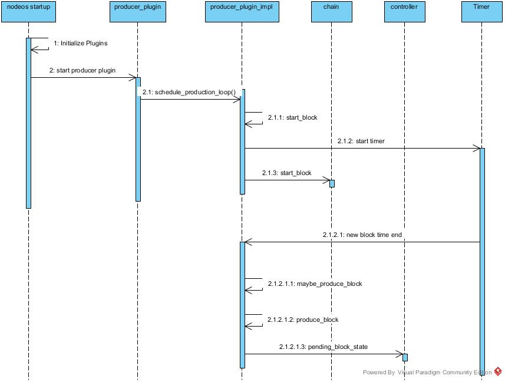

# EOS DPoS 共识算法

EOS的DPoS共识算法，总体上来说，是由EOS的持币人，投票给想要作为记账的节点，然后每隔63(21 * 3)秒统计一次每个节点获得的选票，获得选票数最多的21个节点成为超级节点，参与下一轮的记账，得票数排在后面的100个节点作为备选节点。

每一个EOS代币，最多可以投票给30个节点，但是不能重复投票，也就是说，一个币给一个节点只能投一票。

下面，让我们首先来看看投票的过程。


### 注册节点

注册节点，意思就是说，如果一个节点想要成为记账节点，获得EOS持有者的投票，必须先把自己注册到候选节点里面去。这个就像是美国的总统选举，想当总统是吧，要先想全世界的人宣布，自己参选了。

注册自己的时候，首先会做合规检查，url的长度必须小于512字节。然后，eosio有一个公共的public key，这个也是不能注册为记账节点的。对于还没有注册过的节点，直接添加到候选节点队列中；如果一个账户已经注册过了，再注册一次的话，啥事儿都不会做的（难道还是多吃多占不成？），


```c++
// source file: ./eos/contracts/eosio.system/voting.cpp
// producer : 这个是候选者账户的的名字
// producer_key : 这个是候选者账户的 public key
void system_contract::regproducer(const account_name producer,
                                  const eosio::public_key& producer_key,
                                  const std::string& url,
                                  uint16_t location ) {
   // 检查url长度
   eosio_assert( url.size() < 512, "url too long" );
   // eosio有一个公共的public key，这个是不能注册的
   eosio_assert( producer_key != eosio::public_key(), "public key should not be the default value" );
   require_auth( producer );

   auto prod = _producers.find( producer );

   if ( prod != _producers.end() ) {
      if( producer_key != prod->producer_key ) {
          // 确保这个账户没有被注册过。如果有一个同名的，则改之
          _producers.modify( prod, producer, [&]( producer_info& info ){
               info.producer_key = producer_key;
               info.is_active    = true;
               info.url          = url;
               info.location     = location;
          });
      }
   } else {
     // 添加到竞选队列，恭喜，现在有被选举权了
      _producers.emplace( producer, [&]( producer_info& info ){
            info.owner         = producer;
            info.total_votes   = 0;
            info.producer_key  = producer_key;
            info.is_active     = true;
            info.url           = url;
            info.location      = location;
      });
   }
}

// 记账太累了，我不干了，休息，休息，休息一会儿/
// 告诉所有人，我退出竞选了
void system_contract::unregprod(const account_name producer) {
   require_auth( producer );

   const auto& prod = _producers.get( producer, "producer not found" );

   _producers.modify( prod, 0, [&]( producer_info& info ){
         // 标记为非活动状态
         info.deactivate();
   });
}
```


### 更新记账节点队列

每一轮记账结束之后，都会根据在这一段时间内的投票结果更新记账节点队列，会把得票数最高的21个节点作为超级节点选择，进入下一轮的记账工作。

这个update_elected_producers函数是被eosio.system::onblock函数调用了，这个onblock函数是向记账节点付账的时候调用了，在这个函数里面，我们可以看到，大于120秒的时候，会调用update_elected_producers函数还更新超级节点列表

```c++
// source file: ./eos/contracts/eosio.system/voting.cpp
void system_contract::update_elected_producers( block_timestamp block_time ) {
  // 保当前时间保存下来
   _gstate.last_producer_schedule_update = block_time;

   auto idx = _producers.get_index<N(prototalvote)>();

   // 产生新的超级节点，这在这里限定了最多只有21个
   std::vector< std::pair<eosio::producer_key,uint16_t> > top_producers;
   top_producers.reserve(21);

   // 从候选节点列表中获取票数最多的21个节点(候选节点列表是排好序的)
   for ( auto it = idx.cbegin();
         it != idx.cend() && top_producers.size() < 21 && 0 < it->total_votes && it->active();
         ++it ) {
      top_producers.emplace_back( std::pair<eosio::producer_key,uint16_t>({{it->owner, it->producer_key}, it->location}) );
   }

   if ( top_producers.size() < _gstate.last_producer_schedule_size ) {
      return;
   }

   /// 把选出的21个节点按照名字排序
   std::sort( top_producers.begin(), top_producers.end() );

   std::vector<eosio::producer_key> producers;

   producers.reserve(top_producers.size());
   for( const auto& item : top_producers )
      producers.push_back(item.first);

   bytes packed_schedule = pack(producers);

   if( set_proposed_producers( packed_schedule.data(),  packed_schedule.size() ) >= 0 ) {
      _gstate.last_producer_schedule_size = static_cast<decltype(_gstate.last_producer_schedule_size)>( top_producers.size() );
   }
}


// source file: ./eos/contracts/eosio.system/producer_pay.cpp
void system_contract::onblock( block_timestamp timestamp, account_name producer ) {
   // 当时间差大于120秒的时候，更新超级节点列表
   if( timestamp.slot - _gstate.last_producer_schedule_update.slot > 120 ) {
      update_elected_producers( timestamp );
   }
}
```


### 注册成为投票代理

对于每一个账户来说，投票方式有两种，一种是自己亲自出马，直接给候选节点投票。还有一种是自己不想直接参与投票，那可以选择一个代理人来帮自己投票，让他来代替你进行投票。投票代理对那些想要投票，但无法了解全部节点候选人的用户来说是非常有用的。

如果一个账户选择了另外一个账户作为投票代理的话，则要把自己相应的投票权重赋予给代理，这样代理才拥有相应的代理投票权。当然喽，你吧投票权给别人了，也就意味着自己没有投票权了。

有一点需要注意，如果一个账户已经使用了另外一个账户作为自己的代理，那么这个账户就不能再把自己注册作为代理了。用大白话来说就是，既然你已经让别人来代理你投票了，你就不能代理别人来投票了。。。。。。

```c++
// source file: ./eos/contracts/eosio.system/voting.cpp
// proxy : 想要注册成为代理，或者不想再继续做代理了(太累了是吗？)
// isproxy : true表示想成为代理,false不想做代理了
void system_contract::regproxy( const account_name proxy, bool isproxy ) {
   require_auth( proxy );
   // 在投票队里里面看看，在吗
   auto pitr = _voters.find(proxy);
   if ( pitr != _voters.end() ) {
      eosio_assert( isproxy != pitr->is_proxy, "action has no effect" );
      eosio_assert( !isproxy || !pitr->proxy, "account that uses a proxy is not allowed to become a proxy" );
      // 赋予或者取消代理资格
      _voters.modify( pitr, 0, [&]( auto& p ) {
            p.is_proxy = isproxy;
         });
      propagate_weight_change( *pitr );
   } else {
     // 把自己加入投票者队列，并且赋予或者取消代理资格
      _voters.emplace( proxy, [&]( auto& p ) {
            p.owner  = proxy;
            p.is_proxy = isproxy;
         });
   }
}
```


### 投票

关键点终于来了，这就是投票给候选人。给候选人投票的时候，有一些前提条件。首先，候选者列表是经过了排序的，并且是由低到高的排序；每一个候选者都是处于active状态的。在这个函数的参数里面，proxy和producers只能有一个获得投票，要么是投票者把权重赋予代理这，要么是投票给候选节点。

```c++
// source file: ./eos/contracts/eosio.system/voting.cpp
void system_contract::voteproducer( const account_name voter_name,
                                 const account_name proxy,
                                 const std::vector<account_name>& producers ) {
   require_auth( voter_name );
   update_votes( voter_name, proxy, producers, true );
}

// voter_name : 投票者的名字
// proxy : 代理的名字。如果提供了代理的名字，那么这里就是给把投票者的权重赋予代理
// producers : 候选者列表
// voting : 真的要投票吗？
void system_contract::update_votes( const account_name voter_name,
                                 const account_name proxy,
                                 const std::vector<account_name>& producers,
                                 bool voting ) {
   //validate input
   if ( proxy ) {
      // 如果设置了给代理赋予权重，那么候选列表必须为空，就是一个候选节点都没有
      eosio_assert( producers.size() == 0, "cannot vote for producers and proxy at same time" );
      // 投票者和代理不能是同一个账户
      eosio_assert( voter_name != proxy, "cannot proxy to self" );
      require_recipient( proxy );
   } else {
      // 检查：一个投票者，最多只能给30个节点投票
      eosio_assert( producers.size() <= 30, "attempt to vote for too many producers" );
      for( size_t i = 1; i < producers.size(); ++i ) {
         // 检查：候选者列表，必须是从低到高排序的
         eosio_assert( producers[i-1] < producers[i], "producer votes must be unique and sorted" );
      }
   }

   // 从投票节点列表中，把投票者找出来
   auto voter = _voters.find(voter_name);
   // 投票人在投票之前，必须已经做了资产抵押
   eosio_assert( voter != _voters.end(), "user must stake before they can vote" ); /// staking creates voter object
   // 如果投票者已经把自己注册为代理了，那么久不能再把自己的投票权委托给其他代理
   eosio_assert( !proxy || !voter->is_proxy, "account registered as a proxy is not allowed to use a proxy" );

   // 当第一次有人投票的时候，计算并且保存last_vote_weight，然后一直要等到total_activated_stake到达一个阈值的时候，才能取回自己的资产抵押。这里使用last_vote_weight来确定，投票者是不是第一次投票，并且确认他的资产抵押是有效的
   if( voter->last_vote_weight <= 0.0 ) {
      _gstate.total_activated_stake += voter->staked;
      if( _gstate.total_activated_stake >= min_activated_stake ) {
         _gstate.thresh_activated_stake_time = current_time();
      }
   }

   // 计算投票者的投票权重
   auto new_vote_weight = stake2vote( voter->staked );
   if( voter->is_proxy ) {
      // 如果自己是代理，再把代理权重加上
      new_vote_weight += voter->proxied_vote_weight;
   }

   boost::container::flat_map<account_name, pair<double, bool /*new*/> > producer_deltas;
   // 必须确认投票者的投票权重大于0
   if ( voter->last_vote_weight > 0 ) {
      if( voter->proxy ) {
         // 如果自己是代理，
         // 则从投票者队列中把自己找出来，并且从代理权重数据中减去本次的投票权重，表示投过票了
         auto old_proxy = _voters.find( voter->proxy );
         eosio_assert( old_proxy != _voters.end(), "old proxy not found" ); //data corruption
         _voters.modify( old_proxy, 0, [&]( auto& vp ) {
               vp.proxied_vote_weight -= voter->last_vote_weight;
            });
         propagate_weight_change( *old_proxy );
      } else {
         for( const auto& p : voter->producers ) {
            auto& d = producer_deltas[p];
            d.first -= voter->last_vote_weight;
            d.second = false;
         }
      }
   }

   if( proxy ) {
      // 如果是给代理赋予投票权，
      // 则从投票者列表中，找出代理账户，并且给代理账户的代理权重添加相应的投票权重
      auto new_proxy = _voters.find( proxy );
      eosio_assert( new_proxy != _voters.end(), "invalid proxy specified" ); //if ( !voting ) { data corruption } else { wrong vote }
      eosio_assert( !voting || new_proxy->is_proxy, "proxy not found" );
      if ( new_vote_weight >= 0 ) {
         _voters.modify( new_proxy, 0, [&]( auto& vp ) {
               vp.proxied_vote_weight += new_vote_weight;
            });
         propagate_weight_change( *new_proxy );
      }
   } else {
      if( new_vote_weight >= 0 ) {
         // 不是赋值给代理的话，就把票投给候选节点
         for( const auto& p : producers ) {
            auto& d = producer_deltas[p];
            d.first += new_vote_weight;
            d.second = true;
         }
      }
   }

}
```

### Multi_Index

在投票过程中，有两种非常重要的数据，投票者列表和候选者列表是使用 Multi_Index类来定义的，所以，了解Multi_Index类对于理解上述代码十分重要，在eos的wiki上面有详细介绍。
https://github.com/eosio/eos/wiki/Persistence-API#the-eosio-multi-index-api

这里做一个简单的介绍：

1. Multi-Index API 是EOS提供的访问数据库的C++接口，使智能合约能够读取和修改EOS数据库中的数据；
2. Multi-Index模仿了boost库的boost::multi_index，但又有一些重要不同，eos中使用eosio::multi_index；
3. eosio::multi_index在概念上和传统数据库的“表（table）”类似，数据“行（rows）”是独立的对象，数据“列（columns）”是对象的成员属性；
4. eosio::multi_index提供和传统数据库的“键（key）”类似的成员属性，用于快速查找对象；
5. eosio::multi_index允许使用自定义函数作为索引，但它的返回值是受限制的，只能是支持的键类型；
6. eosio::multi_index支持主键（primary key），但必须是唯一的无符号64位整型（uint64_t）；
7. eosio::multi_index按主键排序时，使用升序；
8. Multi-Index表允许多索引排序，最多可以使用16个二级索引；
9. Multi-Index迭代器可以双向迭代，即const_iterator或const_reverse_iterator；  
10. 二级索引作为Multi-Index表构造函数的一部分创建，不支持直接构建。


```C++
// source file: ./eos/contracts/eosiolib/multi_index.hpp
template<uint64_t TableName, typename T, typename... Indices>
class multi_index
{
  //...................................
}


// source file: ./eos/contracts/eosio.system/eosio.system.hpp
typedef eosio::multi_index< N(voters), voter_info>  voters_table;

typedef eosio::multi_index< N(producers), producer_info,
                            indexed_by<N(prototalvote), const_mem_fun<producer_info, double, &producer_info::by_votes>  >
                            >  producers_table;

class system_contract : public native {
   private:
      voters_table           _voters;
      producers_table        _producers;
}
```

### 区块生产

EOS的系统架构，把很多功能都分拆到智能合约和插件中去了，区块的生产模块也被封装到一个plugin之中，名字是producer_plugin。

下面这个是区块生产的主流程，从这里可以看出，producer_plugin这个插件在nodeos启动的时候被加载、启动，然后进入了一个生产block的循环。在这里面检查当前链的长度、状态，在收到信的区块的时候检查当前自己是不是生产者，如果是就生产区块。



下面我们来看看源代码：

```C++
// source file: ./eos/plugins/producer_plugin/producer_plugin.cpp
void producer_plugin_impl::schedule_production_loop() {
   // 获取 chain_plugin
   chain::controller& chain = app().get_plugin<chain_plugin>().chain();
   _timer.cancel();
   std::weak_ptr<producer_plugin_impl> weak_this = shared_from_this();

   // 启动区块生产流程
   auto result = start_block();
}


// source file: ./eos/plugins/producer_plugin/producer_plugin.cpp
producer_plugin_impl::start_block_result producer_plugin_impl::start_block() {
   // 获取 chain_plugin
   chain::controller& chain = app().get_plugin<chain_plugin>().chain();
   const auto& hbs = chain.head_block_state();

   // 假设，现在可以出块
   _pending_block_mode = pending_block_mode::producing;

   // 看看情况，现在是不是真的应该我来出块了
   if( !_production_enabled ) {
      // 还在同步，现在还不是时候
      _pending_block_mode = pending_block_mode::speculating;
   } else if( _producers.find(scheduled_producer.producer_name) == _producers.end()) {
      // 看看现在是否轮到自己出块了，对了，现在还没有轮到我
      _pending_block_mode = pending_block_mode::speculating;
   } else if (signature_provider_itr == _signature_providers.end()) {
      elog("Not producing block because I don't have the private key for ${scheduled_key}", ("scheduled_key", scheduled_producer.block_signing_key));
      // 因为我没有相应的私钥，所以我也没法出块
      _pending_block_mode = pending_block_mode::speculating;
   } else if ( _pause_production ) {
      elog("Not producing block because production is explicitly paused");
      // 现在处于暂定出块状态
      _pending_block_mode = pending_block_mode::speculating;
   } else if ( _max_irreversible_block_age_us.count() >= 0 && irreversible_block_age >= _max_irreversible_block_age_us ) {
      elog("Not producing block because the irreversible block is too old [age:${age}s, max:${max}s]", ("age", irreversible_block_age.count() / 1'000'000)( "max", _max_irreversible_block_age_us.count() / 1'000'000 ));
      // 还是不能出块，因为最后的一个不可逆块已经是很久以前的事情了，这怎么能出块呢？
      _pending_block_mode = pending_block_mode::speculating;
   }

   try {
      uint16_t blocks_to_confirm = 0;

      if (_pending_block_mode == pending_block_mode::producing) {
         if (currrent_watermark_itr != _producer_watermarks.end()) {
            auto watermark = currrent_watermark_itr->second;
            if (watermark < hbs->block_num) {
               blocks_to_confirm = std::min<uint16_t>(std::numeric_limits<uint16_t>::max(), (uint16_t)(hbs->block_num - watermark));
            }
         }
      }

      chain.abort_block();
      // 终于到了应该生产区块的时候啦，哈哈哈哈
      chain.start_block(block_time, blocks_to_confirm);
   } FC_LOG_AND_DROP();
}


bool producer_plugin_impl::maybe_produce_block() {
   try {
      // 在这里调用了 produce_block()
      produce_block();
      return true;
   } FC_LOG_AND_DROP();
}


void producer_plugin_impl::produce_block() {
   chain.finalize_block();
   // 对一个块签名
   chain.sign_block( [&]( const digest_type& d ) {
      auto debug_logger = maybe_make_debug_time_logger();
      return signature_provider_itr->second(d);
   } );
   // 提交一个块
   chain.commit_block();
}

```
