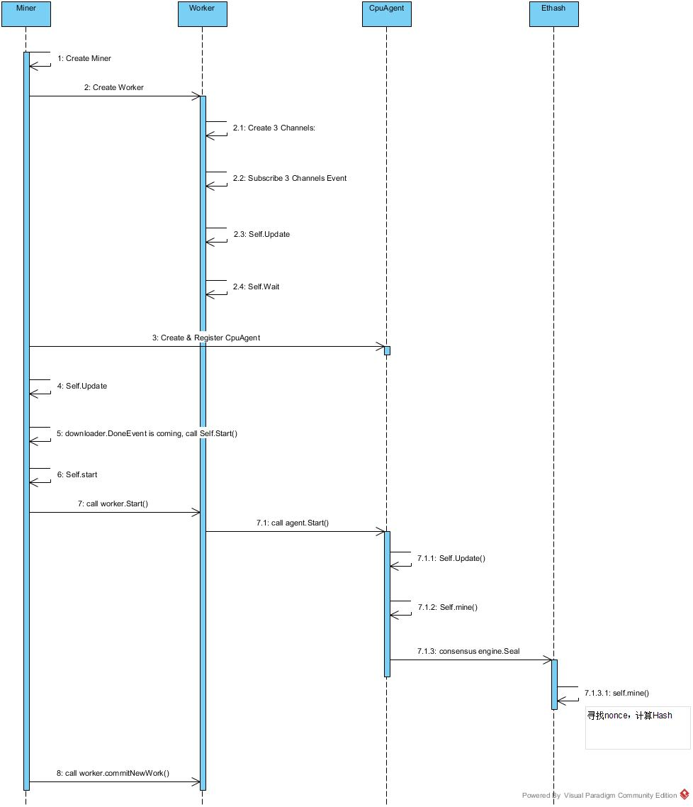

# Ethereum PoW 共识算法概述


## 前言
Ethereum目前所使用的共识算法还是PoW，未来会切换到PoS的共识算法，本文基于Ethereum 1.8.8 Golang 版本探讨其PoW共识算法。

在Ethereum中，PoW共识算法被命名为Ethash，源代码位于 `<your/path>/go-ethereum/consensus/ethash` 目录下面，与此目录紧密相关的目录有旷工的代码，位于下面这个目录：`<your/path>/go-ethereum/miner`

在以太坊的源代码中，共识算法目录里面还包括了下面的目录 `<your/path>/go-ethereum/consensus/clique` 这个其实现的PoA共识算法，但是并没有适用于以太坊的主网里面，对这个共识算法，本文不做讨论。


## 主流程


上面这幅图就是以太坊里面挖矿的主流程。从这个流程图上我们可以看出来，首先会创建一个Miner对象，在Miner对象创建过程中，会创建worker对象以及创建CpuAgent对象并且注册到worker对象。然后使用goroutinue来启动miner.Update()和miner.start()方法。

在创建worker对象的过程中，会创建三个channel并监听相应的event，这三个channel都是block相关的，然后使用goroutinue来启动worker.Update()和worker.Wait()方法。

在worker.Start()方法中，会遍历其所持有的Ageng对象并依次调用agent.Start()方法。在agent.Start()中会调用ageng.Update()和agent.mine()方法， 在agent.mine()中会去调用Agent中持有的共识算法引擎ethash的Seal()方法执行具体的寻找nonce去符合挖矿难度目标的要求。

下面我们沿着这个主流程一步一步的对这一部分源码进行“挖矿”

## Miner

miner package负责向外提供一个“挖矿”得到的新区块，这个package中有一个Miner对象，它作为公共类型，向外暴露mine功能。Miner对象用来对worker进行管理， 订阅外部事件，控制worker的启动和停止。


数据结构

```go
type Miner struct {
	mux *event.TypeMux  // 事件锁，事件发生时，会有一个TypeMux将时间分派给注册的接收者

	worker *worker  // worker, 顾名思义，干活的人

	coinbase common.Address  // 节点地址
	mining   int32  // 挖矿进行中的状态
	eth      Backend  // Backend对象是一个自定义接口封装了所有挖矿所需方法。
	engine   consensus.Engine // 获得共识算法的工具对象，以提供后续共识相关操作使用。

	canStart    int32 // 是否能够开始挖矿操作
	shouldStart int32 // 同步以后是否应该开始挖矿
}
```

Miner对象在构造的过程中, 针对新对象miner的各个成员变量初始化完成后，会紧跟着创建worker对象，然后创建了一个CpuAgent并且把这个CpuAgent注册给了worker对象。然后用一个goroutine启动了Miner对象自身的miner.Update()函数


```go
func New(eth Backend, config *params.ChainConfig, mux *event.TypeMux, engine consensus.Engine) *Miner {
	miner := &Miner{
		eth:      eth,
		mux:      mux,
		engine:   engine,
		// 创建worker对象
		worker:   newWorker(config, engine, common.Address{}, eth, mux),
		canStart: 1,
	}
	// 创建CpuAgent并且注册给worker对象
	miner.Register(NewCpuAgent(eth.BlockChain(), engine))
	// 用goroutine启动miner.Update()函数
	go miner.update()

	return miner
}
```

Miner对象的Update()方法订阅(监听)了downloader的事件。当收到downloader.StartEvent时，意味者此时本节点正在从其他节点下载新区块，这时miner会立即停止进行中的挖掘工作，并继续监听；

如果收到downloader.DoneEvent或downloader.FailEvent时，意味本节点的下载任务已结束-无论下载成功或失败-此时都可以开始挖掘新区块，并且此时会退出Downloader事件的监听。注意这个goroutine是一个一次性的循环， 只要接收到一次downloader.DoneEvent或者 downloader.FailedEvent事件， 就会设置canStart为1. 并退出循环， 这是为了避免黑客恶意的 DOS攻击，让你不断的处于异常状态

从这里的逻辑可以看出，对于任何一个Ethereum网络中的节点来说，挖掘一个新区块和从其他节点下载、同步一个新区块，根本是相互冲突的。这样的规定，保证了在某个节点上，一个新区块只可能有一种来源，这可以大大降低可能出现的区块冲突，并避免全网中计算资源的浪费。

```go
func (self *Miner) update() {
	events := self.mux.Subscribe(downloader.StartEvent{}, downloader.DoneEvent{}, downloader.FailedEvent{})
out:
	for ev := range events.Chan() {
		switch ev.Data.(type) {
		case downloader.StartEvent:
			atomic.StoreInt32(&self.canStart, 0)
			if self.Mining() {
				self.Stop()
				atomic.StoreInt32(&self.shouldStart, 1)
				log.Info("Mining aborted due to sync")
			}
		case downloader.DoneEvent, downloader.FailedEvent:
			shouldStart := atomic.LoadInt32(&self.shouldStart) == 1

			atomic.StoreInt32(&self.canStart, 1)
			atomic.StoreInt32(&self.shouldStart, 0)
			if shouldStart {
				// 启动挖矿
				self.Start(self.coinbase)
			}
			// 取消订阅，只对这些消息监听一次
			events.Unsubscribe()
			// 立即停止并且忽略其余的事件
			break out
		}
	}
}
```

在miner.Start()方法中，主要的工作是启动了worker.start()来开始挖矿，以及启动worker.commitNewWork()来提交新的挖矿任务。

```go
func (self *Miner) Start(coinbase common.Address) {
	atomic.StoreInt32(&self.shouldStart, 1)  //  是是否应该启动
	self.worker.setEtherbase(coinbase)
	self.coinbase = coinbase

	if atomic.LoadInt32(&self.canStart) == 0 {  // 是否能够启动，
		log.Info("Network syncing, will start miner afterwards")
		return
	}
	atomic.StoreInt32(&self.mining, 1)

	log.Info("Starting mining operation")
	self.worker.start()  // 启动worker 开始挖矿
	self.worker.commitNewWork()  //提交新的挖矿任务。
}
```


## worker

worker 哈哈，顾名思义，这是具体干活的对象，它负责全部具体的挖矿工作流程。其包含了多个属性，都是与具体的挖矿操作相关的，其中就包括了链本身的属性以及区块数据结构的属性。内部包含多个agent，可以包含之前提到的agent和remote_agent。 worker同时负责构建区块和对象。同时把任务提供给agent。

worker对象负责管理mine过程；worker内部有一组Agent接口类型对象，每个Agent都可以完成单个区块的mine；Work结构体主要用以携带数据，被视为挖掘一个区块时所需的数据环境。

主要的数据传输发生在worker和它的Agent(们)之间：在合适的时候，worker把一个Work对象发送给每个Agent，然后任何一个Agent完成mine时，将一个经过授权确认的Block加上那个更新过的Work，组成一个Result对象发送回worker。

有意思的是<<Agent>>接口，尽管调用方worker内部声明了一个Agent数组，但目前只有一个实现类CpuAgent的对象会被加到该数组，可能这个Agent数组是为将来的扩展作的预留吧。CpuAgent通过全局的<<Engine>>对象，借助共识算法完成最终的区块授权。


Agent接口，可以把自身注册到worker。在PoW算法中，创建了一个CpuAgent来完成具体的工作。

```go
type Agent interface {
	Work() chan<- *Work
	SetReturnCh(chan<- *Result)
	Stop()
	Start()
	GetHashRate() int64
}

// worker是负责将消息应用到新状态的主要对象
type worker struct {
	config *params.ChainConfig
	engine consensus.Engine
	mu sync.Mutex
	// update loop
	mux          *event.TypeMux
	txCh         chan core.TxPreEvent		// 用来接受txPool里面的交易的通道
	txSub        event.Subscription			// 用来接受txPool里面的交易的订阅器
	chainHeadCh  chan core.ChainHeadEvent	// 用来接受区块头的通道
	chainHeadSub event.Subscription
	chainSideCh  chan core.ChainSideEvent	// 用来接受一个区块链从规范区块链移出的通道
	chainSideSub event.Subscription
	wg           sync.WaitGroup

	agents map[Agent]struct{}				// worker所拥有的agent的map集合
	recv   chan *Result						// agent会把结果发送到这个通道

	eth     Backend							// eth的协议
	chain   *core.BlockChain				// 区块链
	proc    core.Validator					// 区块链验证器
	chainDb ethdb.Database					// 区块链数据库

	coinbase common.Address					// 挖矿者的地址
	extra    []byte							//

	currentMu sync.Mutex
	current   *Work

	uncleMu        sync.Mutex
	possibleUncles map[common.Hash]*types.Block	//可能的叔父节点

	unconfirmed *unconfirmedBlocks // 本地挖出的待确认块

	// atomic status counters
	mining int32
	atWork int32
}
```


#### newWorker

worker对象是在创建Miner对象的时候创建的，它会根据Miner结构体成员属性依次给worker对象属性赋值，然后创建了三个监听事件的channel并且监听相应的事件。其部分代码如下(完整代码请参考go-ethereum源代码)：

```go
func newWorker(config *params.ChainConfig, engine consensus.Engine, coinbase common.Address, eth Backend, mux *event.TypeMux) *worker {
    worker := &worker{
        // TxPreEvent事件是TxPool发出的事件，代表一个新交易tx加入到了交易池中，这时候如果work空闲会将该笔交易收进work.txs，准备下一次打包进块
        txCh:           make(chan core.TxPreEvent, txChanSize),
        // ChainHeadEvent事件，代表已经有一个块作为链头，此时work.update函数会监听到这个事件，则会继续挖新的区块
        chainHeadCh:    make(chan core.ChainHeadEvent, chainHeadChanSize),
        // ChainSideEvent事件，代表有一个新块作为链的旁支，会被放到possibleUncles数组中，可能称为叔块
        chainSideCh:    make(chan core.ChainSideEvent, chainSideChanSize),
        // 区块链数据库
        chainDb:        eth.ChainDb(),
        // 存放可能称为下一个块的叔块数组
        possibleUncles: make(map[common.Hash]*types.Block),
        // 返回一个数据结构，包括追踪当前未被确认的区块
        unconfirmed:    newUnconfirmedBlocks(eth.BlockChain(), miningLogAtDepth),
    }
    // 注册TxPreEvent事件到tx pool交易池
    worker.txSub = eth.TxPool().SubscribeTxPreEvent(worker.txCh)
    // 注册worker.chainHeadCh事件到blockchain
    worker.chainHeadSub = eth.BlockChain().SubscribeChainHeadEvent(worker.chainHeadCh)
    // 注册worker.chainSideCh事件到
    worker.chainSideSub = eth.BlockChain().SubscribeChainSideEvent(worker.chainSideCh)
    go worker.update()

    go worker.wait()
    worker.commitNewWork()

    return worker
}
```

我们看到在newWorker的最后，通过goroutinue启动了worker.update()个worker.wait()两个方法，最后还调用了worker.commitNewWork()。


worker.update()分别监听ChainHeadEvent，ChainSideEvent，TxPreEvent几个事件，每个事件会触发worker不同的操作。

ChainHeadEvent是指区块链中已经加入了一个新的区块作为整个链的链头，这时worker的回应是立即开始准备挖掘下一个新区块；ChainHeadEvent并不一定是外部源发出。由于worker对象有个成员变量chain(eth.BlockChain)，所以当worker自己完成挖掘一个新区块，并把它写入数据库，加进区块链里成为新的链头时，worker自己也可以调用chain发出一个ChainHeadEvent，从而被worker.update()函数监听到，进入下一次区块挖掘。

ChainSideEvent指区块链中加入了一个新区块作为当前链头的旁支，worker会把这个区块收纳进possibleUncles[]数组，作为下一个挖掘新区块可能的Uncle之一；

TxPreEvent是TxPool对象发出的，指的是一个新的交易tx被加入了TxPool，这时如果worker没有处于挖掘中，那么就去执行这个tx，并把它收纳进Work.txs数组，为下次挖掘新区块备用。

下面是worker.update()的部分代码(完整代码请参考go-ethereum源代码)。

```go
func (self *worker) update() {
	for {
		select {
		// Handle ChainHeadEvent 当接收到一个区块头的信息的时候，马上开启挖矿服务。
		case <-self.chainHeadCh:

		// Handle ChainSideEvent 接收不在规范的区块链的区块，加入到潜在的叔父集合
		case ev := <-self.chainSideCh:

		// Handle TxPreEvent 接收到txPool里面的交易信息的时候。
		case ev := <-self.txCh:
			// 如果当前没有挖矿， 那么把交易应用到当前的状态上，以便马上开启挖矿任务。
		}
	}
}
```


worker.wait()会在一个channel处一直等待Agent完成挖掘发送回来的新Block和Work对象。这个Block会被写入数据库，加入本地的区块链试图成为最新的链头。注意，此时区块中的所有交易，假设都已经被执行过了，所以这里的操作，不会再去执行这些交易对象。
当这一切都完成，worker就会发送一条事件(NewMinedBlockEvent{})，等于通告天下：我挖出了一个新区块！这样监听到该事件的其他节点，就会根据自身的状况，来决定是否接受这个新区块成为全网中公认的区块链新的链头。至于这个公认过程如何实现，就属于共识算法的范畴了。

commitNewWork()会在worker内部多处被调用，注意它每次都是被直接调用，并没有以goroutine的方式启动。commitNewWork()内部使用sync.Mutex对全部操作做了隔离。这个函数的基本逻辑如下：
- 准备新区块的时间属性Header.Time，一般均等于系统当前时间，不过要确保父区块的时间(parentBlock.Time())要早于新区块的时间，父区块当然来自当前区块链的链头了。
- 创建新区块的Header对象，其各属性中：Num可确定(父区块Num + 1)；Time可确定；ParentHash可确定;其余诸如Difficulty，GasLimit等，均留待之后共识算法中确定。
- 调用Engine.Prepare()函数，完成Header对象的准备。
- 根据新区块的位置(Number)，查看它是否处于DAO硬分叉的影响范围内，如果是，则赋值予header.Extra。
- 根据已有的Header对象，创建一个新的Work对象，并用其更新worker.current成员变量。
- 如果配置信息中支持硬分叉，在Work对象的StateDB里应用硬分叉。
- 准备新区块的交易列表，来源是TxPool中那些最近加入的tx，并执行这些交易。
- 准备新区块的叔区块uncles[]，来源是worker.possibleUncles[]，而possibleUncles[]中的每个区块都从事件ChainSideEvent中搜集得到。注意叔区块最多有两个。
- 调用Engine.Finalize()函数，对新区块“定型”，填充上Header.Root, TxHash, ReceiptHash, UncleHash等几个属性。
- 如果上一个区块(即旧的链头区块)处于unconfirmedBlocks中，意味着它也是由本节点挖掘出来的，尝试去验证它已经被吸纳进主干链中。
- 把创建的Work对象，通过channel发送给每一个登记过的Agent，进行后续的挖掘。

以上步骤中，4和6都是仅仅在该区块配置中支持DAO硬分叉，并且该区块的位置正好处于DAO硬分叉影响范围内时才会发生；其他步骤是普遍性的。commitNewWork()完成了待挖掘区块的组装，block.Header创建完毕，交易数组txs，叔区块Uncles[]都已取得，并且由于所有交易被执行完毕，相应的Receipt[]也已获得。万事俱备，可以交给Agent进行‘挖掘’了。

下面是worker.commitNewWork()的部分代码(完整代码请参考go-ethereum源代码)。

```go
func (self *worker) commitNewWork() {
	// 不能出现比parent的时间还早的情况
	if parent.Time().Cmp(new(big.Int).SetInt64(tstamp)) >= 0 {
		tstamp = parent.Time().Int64() + 1
	}

	// 我们的时间不要超过现在的时间太远， 那么等待一段时间，
	// 感觉这个功能完全是为了测试实现的， 如果是真实的挖矿程序，应该不会等待。
	if now := time.Now().Unix(); tstamp > now+1 {
	}

	// 只有当我们挖矿的时候才设置coinbase
	if atomic.LoadInt32(&self.mining) == 1 {
	}

	// 根据我们是否关心DAO硬分叉来决定是否覆盖额外的数据。
	if daoBlock := self.config.DAOForkBlock; daoBlock != nil {
		// 检查区块是否在 DAO硬分叉的范围内   [daoblock,daoblock+limit]
		limit := new(big.Int).Add(daoBlock, params.DAOForkExtraRange)
		if header.Number.Cmp(daoBlock) >= 0 && header.Number.Cmp(limit) < 0 {
			// 如果我们支持DAO 那么设置保留的额外的数据
			if self.config.DAOForkSupport {
				header.Extra = common.CopyBytes(params.DAOForkBlockExtra)
			} else if bytes.Equal(header.Extra, params.DAOForkBlockExtra) {
				header.Extra = []byte{}
			}
		}
	}

	// 用新的区块头来设置当前的状态
	err := self.makeCurrent(parent, header)
	//得到阻塞的资金
	pending, err := self.eth.TxPool().Pending()
	if err != nil {
		log.Error("Failed to fetch pending transactions", "err", err)
		return
	}
	// 创建交易。 这个方法后续介绍
	txs := types.NewTransactionsByPriceAndNonce(self.current.signer, pending)
	// 提交交易 这个方法后续介绍
	work.commitTransactions(self.mux, txs, self.chain, self.coinbase)

	// 使用给定的状态来创建新的区块，Finalize会进行区块奖励等操作
	if work.Block, err = self.engine.Finalize(self.chain, header, work.state, work.txs, uncles, work.receipts); err != nil {
	}
}
```

## CpuAgent

agent 是具体执行挖矿的对象。它执行的流程就是，接受计算好了的区块头， 计算mixhash和nonce， 把挖矿好的区块头返回。与mine过程相关的函数，主要是update()和mine():

CpuAgent.update()就是worker.commitNewWork()结束后发出Work对象的会一直监听相关channel，如果收到Work对象(显然由worker.commitNewWork()结束后发出)，就启动mine()函数；如果收到停止(mine)的消息，就退出一切相关操作。

CpuAgent.mine()会直接调用Engine.Seal()函数，利用Engine实现体的共识算法对传入的Block进行最终的授权，如果成功，就将Block同Work一起通过channel发还给worker，那边worker.wait()会接收并处理。
显然，这两个函数都没做什么实质性工作，它们只是负责调用<Engine>接口实现体，待授权完成后将区块数据发送回worker。挖掘出一个区块的真正奥妙全在Engine实现体所代表的共识算法里。

在PoW算法中，CpuAgent对象中的engine就是Ethash的对象，下面我们来看Ethash对象。


## Ethash

Ethash是PoW的共识引擎，它实现了Engine接口，在Engine接口声明的函数中，
- VerifyHeader()，VerifyHeaders()，VerifyUncles()用来验证区块相应数据成员是否合理合规，可否放入区块；
- Prepare()函数往往在Header创建时调用，用来对Header.Difficulty等属性赋值；
- Finalize()函数在区块区块的数据成员都已具备时被调用，比如叔区块(uncles)已经具备，全部交易Transactions已经执行完毕，全部收据(Receipt[])也已收集完毕，此时Finalize()会最终生成Root，TxHash，UncleHash，ReceiptHash等成员。
- Seal()函数可对一个调用过Finalize()的区块进行授权或封印，并将封印过程产生的一些值赋予区块中剩余尚未赋值的成员(Header.Nonce, Header.MixDigest)。Seal()成功时返回的区块全部成员齐整，可视为一个正常区块，可被广播到整个网络中，也可以被插入区块链等。所以，对于挖掘一个新区块来说，所有相关代码里Engine.Seal()是其中最重要，也是最复杂的一步。
- VerifySeal()函数基于跟Seal()完全一样的算法原理，通过验证区块的某些属性(Header.Nonce，Header.MixDigest等)是否正确，来确定该区块是否已经经过Seal操作。
在两种共识算法的实现中，Ethash是产品环境下以太坊真正使用的共识算法，Clique主要针对以太坊的测试网络运作，两种共识算法的差异，主要体现在Seal()的实现上。


Ethash.Seal()函数实现中，会以多线程(goroutine)的方式并行调用mine()函数，线程个数等于Ethash.threads；如果Ethash.threads被设为0，则Ethash选择以本地CPU中的总核数作为开启线程的个数。

下面是ethash.Seal()的部分代码(完整代码请参考go-ethereum源代码)。

```go
// Seal方法通过调用mine()尝试去寻找一个nonce值，去符合产生一个新区块的难度目标
func (ethash *Ethash) Seal(chain consensus.ChainReader, block *types.Block, stop <-chan struct{}) (*types.Block, error) {
	// 如果threads数等于0，就获取当前CPU的核心数
	if threads == 0 {
		threads = runtime.NumCPU()
	}

	var pend sync.WaitGroup
	for i := 0; i < threads; i++ {
		pend.Add(1)
		go func(id int, nonce uint64) {
			defer pend.Done()
			// 调用自身的 mine 函数执行挖矿动作
			ethash.mine(block, id, nonce, abort, found)
		}(i, uint64(ethash.rand.Int63()))
	}
}
```


下面是mine()函数的主要业务逻辑。入参id是线程编号，用来发送log告知上层；函数内部首先定义一组局部变量，包括之后调用hashimotoFull()时传入的hash、nonce、巨大的辅助数组dataset，以及结果比较的target；然后是一个无限循环，每次调用hashimotoFull()进行一系列复杂运算，一旦它的返回值符合条件，就复制Header对象(深度拷贝)，并赋值Nonce、MixDigest属性，返回经过授权的区块。注意到在每次循环运算时，nonce还会自增+1，使得每次循环中的计算都各不相同。
这里hashimotoFull()函数通过调用hashimoto()函数完成运算，而同时还有另外一个类似的函数hashimoLight()函数。

下面是ethash.mine()的部分代码(完整代码请参考go-ethereum源代码)。

```go
// mine()会具体去尝试去寻找一个nonce值，去符合产生一个新区块的难度目标
func (ethash *Ethash) mine(block *Block, id int, seed uint64, abort chan struct{}, found chan *Block) {  
    for {  
        select {  
        case <-abort:  
            ...; return  
        default:  
            // 计算这个nonce的hash值
            digest, result := hashimotoFull(dataset, hash, nonce)
            if new(big.Int).SetBytes(result).Cmp(target) <= 0 {
                // 找到了合适的nonce值
                header = types.CopyHeader(header)  
                header.Nonce = types.EncodeNonce(nonce)  
                header.MixDigest = common.BytesToHash(digest)  
                found<- block.WithSeal(header)  
                return  
            }  
        }  
        nonce++  
    }  
}  
```
