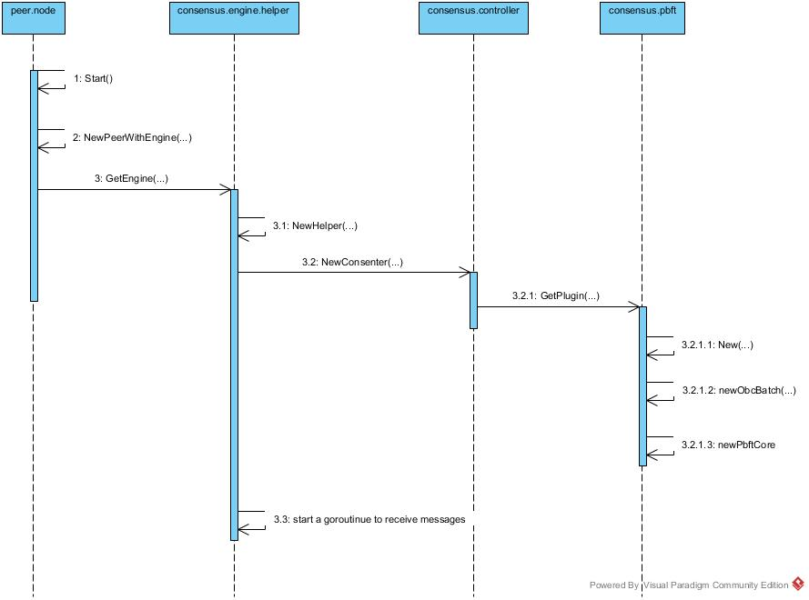

# Hyperledger Fabric PBFT 共识算法解析


从Fabric 1.0开始，把PBFT共识算法的代码给去掉了，最新的代码里面并没有PBFT，所以本文是从Hyperledger Fabric v0.6.1版本源代码的基础上来解析的。


## PBFT 暴露的接口
PBFT 算法的核心代码在这个目录下面：`<your/path>/fabric/consensus/pbft`，但是PBFT算法模块对外的接口位于这个文件之中：`<your/path>/fabric/consensus/consensus.go`

```go
// <your/path>/fabric/consensus/consensus.go
// 定义了在异步执行和状态转换时候的回调方法
type ExecutionConsumer interface {
  // 执行完成的时候调用
	Executed(tag interface{})
	// commit 完成的时候调用
	Committed(tag interface{}, target *pb.BlockchainInfo)
	// 回滚操作完成的时候调用
	RolledBack(tag interface{})
	// 状态转换完成的时候调用
	StateUpdated(tag interface{}, target *pb.BlockchainInfo)
}

// 下面这个接口用于从网络接口消息，任何共识算法插件都需要实现这个接口
type Consenter interface {
	// 对所有接收到的消息连续的调用这个方法
	RecvMsg(msg *pb.Message, senderHandle *pb.PeerID) error
	ExecutionConsumer
}

type Stack interface {
	// 网络消息发送和接收接口
	NetworkStack   
	// Sign和Verify接口
	SecurityUtils  
	// 事件消息处理接口
	Executor       
	// 交易处理接口
	LegacyExecutor
	// 控制ledger的状态
	LedgerManager  
	// 操作blockchain
	ReadOnlyLedger
	// 操作共识状态
	StatePersistor
}
```

每个共识插件都需要实现Consenter接口，包括RecvMsg函数和ExecutionConsumer接口里的函数。

Consenter是EngineImpl的一个成员，EngineImpl是接口Engine的一个实例，是在peer启动的时候创建的，连同Impl的其他成员一起注册到gRPC服务中。当通过gRPC收到ProcessTransaction消息时，最终会调用Consenter的RecvMsg处理交易信息。

ExecutionConsumer接口是专门处理事件消息的，它是Stack的成员Executor的一个接口。coordinatorImpl是Executor的一个实例，在实例化coordinatorImpl的时候同时设置自身为成员变量Manager的事件消息接收者，然后启动一个协程循环处理接收到的事件，根据不同的事件类型，调用ExecutionConsumer的不同函数。特别说明一下，事件在内部是channel实现的生产者/消费者模型，只有一个缓冲区，如果处理不及时会出现消息等待的情况，在实际产品化过程中需要进行优化。

在 EngineImpl 中包含了实现上述接口对象的reference。
```go
// <your/path>/fabric/helper/engine.go
// EngineImpl 定义了具体的共识算法引擎，包含consensus.Consenter, PeerEndpoint 和 MessageFan 接口的实现对象
type EngineImpl struct {
	consenter    consensus.Consenter
	helper       *Helper
	peerEndpoint *pb.PeerEndpoint
	consensusFan *util.MessageFan
}
```


## 共识引擎创建流程
下面这是共识引擎创建的主流程


从这张图中，我们可以看到，在 peer node 节点启动的过程中，会调用 consensus.engine.helper.GetEngine(...),  

```go
// <your/path>/fabric/peer/node/start.go
func serve(args []string) error {
  // ................ 省略无关代码 若干 行
  peerServer, err = peer.NewPeerWithEngine(secHelperFunc, helper.GetEngine)
}

// <your/path>/fabric/core/peer/peer.go
func NewPeerWithEngine(secHelperFunc func() crypto.Peer, engFactory EngineFactory) (peer *Impl, err error) {
  // ................ 省略无关代码 若干 行
  peer.engine, err = engFactory(peer)
}
```


GetEngine(...) 的作用是进行共识模块的初始化，首先会创建 EngineImpl 对象，然后会调用 consensus.controller.NewConsenter(...) 方法创建具体的Consenter。最后会启动一个goroutine等待消息进入。

在NewConsenter(...)方法中，会去调用consensus.pbft.GetPlugin(...)方法去创建共识引擎插件

```go
// <your/path>/fabric/consensus/helper/engine.go
func GetEngine(coord peer.MessageHandlerCoordinator) (peer.Engine, error) {
  // ................ 省略无关代码 若干 行
  engine = new(EngineImpl)
  engine.consenter = controller.NewConsenter(engine.helper)

  go func() {
    // 启动goroutine等待消息进入
    for msg := range engine.consensusFan.GetOutChannel() {
      engine.consenter.RecvMsg(msg.Msg, msg.Sender)
    }
  }()
})

// <your/path>/fabric/consensus/controller/controller.go
func NewConsenter(stack consensus.Stack) consensus.Consenter {
  // ................ 省略无关代码 若干 行
  return pbft.GetPlugin(stack)
}
```


下一步，会根据在配置文件中的"general.mode"配置项来创建匹配的对象，在这个版本中仅支持batch方式。

在newObcBatch()方法中，首先会初始化一个obcbatch对象。这个batch对象的作用就是用来做request缓存，提高transaction的执行效率，缓存存储在batchStore里。

调用 consensus.util.event.NewManagerImpl() 去创建一个向PBFT共识引擎发送消息的ManagerImpl对象，并且把前一步创建的pbftCore对象设置给它作为Receiver对象，即接收message的对象。

最后，会创建pbftCore对象，到一个pbftcore的一个实例，这个是算法的核心模块。并此时会启动一个batchTimer（这个batchTimer是一个计时器，当batchTimer timeout后会触发一个sendbatch操作，这个只有primary节点才会去做）。当然此时会创建一个事件处理机制，这个事件处理机制是各个模块沟通的桥梁。


```go
// <your/path>/fabric/consensus/pbft/pbft.go
func GetPlugin(c consensus.Stack) consensus.Consenter {
  // ................ 省略无关代码 若干 行
  pluginInstance = New(c)
}

func New(stack consensus.Stack) consensus.Consenter {
  // ................ 省略无关代码 若干 行
  switch strings.ToLower(config.GetString("general.mode")) {
  case "batch":
    return newObcBatch(id, config, stack)
  default:
  }
}

func newObcBatch(id uint64, config *viper.Viper, stack consensus.Stack) *obcBatch {
  // ................ 省略无关代码 若干 行
  op := &obcBatch{
    obcGeneric: obcGeneric{stack: stack},
  }
  op.manager = events.NewManagerImpl()
  op.manager.SetReceiver(op)
  op.pbft = newPbftCore(id, config, op, etf)
}
```

在初始化pbftcore时，在把所用配置读进的同时，创建了三个timer：

```go
func newPbftCore(id uint64, config *viper.Viper, consumer innerStack, etf events.TimerFactory) *pbftCore {
  // ................ 省略细节代码N行

  // newViewTimer对应于viewChangeTimerEvent{}，当这个timer在一定时间没有close时，就会触发一个viewchange事件
	instance.newViewTimer = etf.CreateTimer()
  // vcResendTimer对应viewChangeResendTimerEvent，发出viewchange过时时会触发一个将viewchange从新发送
	instance.vcResendTimer = etf.CreateTimer()
  // nullRequestTimer对应nullRequestEvent，如果主节点长期没有发送preprepare消息，也就是分配了seq的reqBatch。它timeout就认为主节点挂掉了然后发送viewchange消息
	instance.nullRequestTimer = etf.CreateTimer()

  //网络中验证器的最大数量赋值
  //N是所有replicas的集合，每一个replica用一个整数来表示，依次为
  //  { 0, …, |N - 1 }
  //  简单起见，我们定义
  //  |N = 3f + 1
  //  f 是最大可容忍的faulty节点
  //  另外我们将一个view中的primary节点定义为replica p，
  //  p = v mod |N
  //  v 是view的编号，从0开始一直连续下去，这样可以理解为从replica 0 到 replica |N-1 依次当primary节点，当每一次view change发生时
  instance.N = config.GetInt("general.N")

  //默认的最大容错数量赋值
  instance.f = config.GetInt("general.f")
  if instance.f*3+1 > instance.N {
    //默认的最大容错数量大于网络中验证器的最大数量
    panic(............)
  }

  //检查点时间段赋值
  instance.K = uint64(config.GetInt("general.K"))

  //自动视图改变的时间段
  instance.viewChangePeriod = uint64(config.GetInt("general.viewchangeperiod"))
  //这个节点是否故意充当拜占庭;testnet用于调试
  instance.byzantine = config.GetBool("general.byzantine")
  //请求过程超时
  instance.requestTimeout, err = time.ParseDuration(config.GetString("general.timeout.request"))

  //重发视图改变之前超时
  instance.vcResendTimeout, err = time.ParseDuration(config.GetString("general.timeout.resendviewchange"))

  //新的视图超时
  instance.newViewTimeout, err = time.ParseDuration(config.GetString("general.timeout.viewchange"))

  //超时持续
  instance.nullRequestTimeout, err = time.ParseDuration(config.GetString("general.timeout.nullrequest"))

  //广播过程超时
  instance.broadcastTimeout, err = time.ParseDuration(config.GetString("general.timeout.broadcast"))

  //查看view发生
  instance.activeView = true
  //replicas的数量; PBFT `|R|`
  instance.replicaCount = instance.N

  //跟踪法定证书请求
  instance.certStore = make(map[msgID]*msgCert)
  //跟踪请求批次
  instance.reqBatchStore = make(map[string]*RequestBatch)
  //跟踪检查点设置
  instance.checkpointStore = make(map[Checkpoint]bool)
  //检查点状态; 映射lastExec到全局hash
  instance.chkpts = make(map[uint64]string)
  //跟踪视view change消息
  instance.viewChangeStore = make(map[vcidx]*ViewChange)

  //跟踪我们接收后者发送的最后一个新视图
  instance.newViewStore = make(map[uint64]*NewView)
  // initialize state transfer
  //观察每一个replica最高薄弱点序列数
  instance.hChkpts = make(map[uint64]uint64)
  //检查点状态; 映射lastExec到全局hash
  instance.chkpts[0] = "XXX GENESIS"
  // 在我们使用视图改变期间最后超时
  instance.lastNewViewTimeout = instance.newViewTimeout
  //跟踪我们是否正在等待请求批处理执行
  instance.outstandingReqBatches = make(map[string]*RequestBatch)
  //对于所有已经分配我们可能错过的在视图改变期间的非检查点的请求批次
  instance.missingReqBatches = make(map[string]bool)
  //将变量的值恢复到初始状态
  instance.restoreState()
  // 执行视图改变的下一个序号
  instance.viewChangeSeqNo = ^uint64(0)
  //更新视图改变序列号
  instance.updateViewChangeSeqNo()

}
```

## externalEventReceiver
在 `fabric/consensus/pbft/external.go` 文件中，externalEventReceiver struct 实现了上述PBFT共识引擎的接口，Fabric通过这里的调用来向PBFT引擎传递消息。

由于 externalEventReceiver 设置的 Receiver 是 obcbatch, 所以外面所有事件交由 obcbatch.ProcessEvent 处理，obcbatch.ProcessEvent 转发给 obcbatch.processMessage，然后调用 op.submitToLeader(req)

submitToLeader 存下该请求（storeOutstanding(req)），并广播（防止自己处于错误的 view），然后如果自己是主节点的话，执行 leaderProcReq，它的策略主要是在请求数达到 op.batchSize 的时候才返回 events.Event，否则返回空。当返回不为空时，processMessage 会返回一个非空事件，然后传递到 ProcessEvent进入 default 分支，交给 pbft-core 的 ProcessEvent 模块处理 (RequestBatch 事件)

```go
// fabric/consensus/pbft/external.go
// 当收到消息时（和 noops 消息类型一样），调用 externalEventReceiver.RecvMsg
func (eer *externalEventReceiver) RecvMsg(ocMsg *pb.Message, senderHandle *pb.PeerID) error {
  eer.manager.Queue() <- batchMessageEvent{
    msg:    ocMsg,
    sender: senderHandle,
  }
  return nil
}

// fabric/consensus/pbft/batch.go
func (op *obcBatch) submitToLeader(req *Request) events.Event {
  // 把这个request消息广播到网络中去
  op.broadcastMsg(&BatchMessage{Payload: &BatchMessage_Request{Request: req}})
  // 保存这个请求
  op.reqStore.storeOutstanding(req)
  // 判断自己是不是主节点
  if op.pbft.primary(op.pbft.view) == op.pbft.id && op.pbft.activeView {
    return op.leaderProcReq(req)
  }
  return nil
}
```


## 事件处理

在consensus.pbft.pbftCore.ProcessEvent(....) 方法中处理所有接收到的消息。

```go
// <your/path>/fabric/consensus/util/events/events.go
// eventLoop() 运行在一个goroutinye中，一直监听这消息，
// 不断的从em.events里取出事件，通过Inject注射给对应的接收者
// 直到pbftCore.ProcessEvent(...)
func (em *managerImpl) eventLoop() {
  // ................ 省略细节代码N行
  select {
  case next := <-em.events:
    em.Inject(next)
  }
}

// <your/path>/fabric/consensus/util/events/events.go
func (em *managerImpl) Inject(event Event) {
  SendEvent(em.receiver, event)
}

// <your/path>/fabric/consensus/util/events/events.go
func SendEvent(receiver Receiver, event Event) {
  next := event
  for {
    // 这个receiver就是下一步的pbftCore对象
    next = receiver.ProcessEvent(next)
      if next == nil {
        break
    }
  }
}

// <your/path>/fabric/consensus/pbft/pbft-core.go
func (instance *pbftCore) ProcessEvent(e events.Event) events.Event {
  // ................ 省略细节代码N行
  switch et := e.(type) {
  case viewChangeTimerEvent:
  case *pbftMessage:
  case pbftMessageEvent:
  case *RequestBatch:
    err = instance.recvRequestBatch(et)
  case *PrePrepare:
    err = instance.recvPrePrepare(et)
  case *Prepare:
    err = instance.recvPrepare(et)
  case *Commit:
    err = instance.recvCommit(et)
  default:
  }
}
```

## PBFT协议过程

#### 主节点收到 Client Request

- 存入到 reqBatchStore，outstandingReqBatches, 并持久化 (instance.consumer.StoreState(k,v) )
- 打开一个与 hash(req) 相关的计时器
- 判断当前节点是不是主节点，如果是 sendPrePrepare

```go
// <your/path>/fabric/consensus/pbft/pbft-core.go
func (instance *pbftCore) recvRequestBatch(reqBatch *RequestBatch) error {
  // ................ 省略细节代码N行

  // 首先计算出这个requestBatch的hash，并且保存下来
  digest := hash(reqBatch)
  instance.reqBatchStore[digest] = reqBatch
  instance.outstandingReqBatches[digest] = reqBatch
  instance.persistRequestBatch(digest)

  if instance.activeView {
    instance.softStartTimer(instance.requestTimeout, fmt.Sprintf("new request batch %s", digest))
  }

  if instance.primary(instance.view) == instance.id && instance.activeView {
  instance.nullRequestTimer.Stop()
    // 判断出当前自己是主节点，发送prePrepare消息
    instance.sendPrePrepare(reqBatch, digest)
  } else {
    logger.Debugf("Replica %d is backup, not sending pre-prepare for request batch %s", instance.id, digest)
  }
  return nil
}
```

#### 主节点发送 PrePrepare 过程

主节点在收到request消息之后，首先会进行有效性判断，通过之后就会构造prePrepare消息，本地保存之后，就广播出去啦。

```go
// <your/path>/fabric/consensus/pbft/pbft-core.go
func (instance *pbftCore) sendPrePrepare(reqBatch *RequestBatch, digest string) {
  // ................ 省略细节代码N行

  // 先得到序列号 n
  n := instance.seqNo + 1
  for _, cert := range instance.certStore {
    if p := cert.prePrepare; p != nil {
      if p.View == instance.view && p.SequenceNumber != n && p.BatchDigest == digest && digest != "" {
        // 如果发现已经收到其他摘要相同 view 相同而序列号 n 不同的，则返回
        return
      }
    }
  }

  if !instance.inWV(instance.view, n) || n > instance.h+instance.L/2 {
    // 当 n 不在 watermarks 间，或 n > h + L/2 返回
    return
  }

  if n > instance.viewChangeSeqNo {
    // 当 n 大于 viewChangeSeqNo, 因为将要 view-change 主节点，返回
    return
  }

  // 构造 pre-prepare 消息
  instance.seqNo = n
  preprep := &PrePrepare{
    View:           instance.view,
    SequenceNumber: n,
    BatchDigest:    digest,
    RequestBatch:   reqBatch,
    ReplicaId:      instance.id,
  }

  // 将 prePrepare, digest 存入 cert 里，并持久化
  cert := instance.getCert(instance.view, n)
  cert.prePrepare = preprep
  cert.digest = digest
  instance.persistQSet()

  // 广播 pre-Prepare 消息
  instance.innerBroadcast(&Message{Payload: &Message_PrePrepare{PrePrepare: preprep}})

}

```


#### 收到PrePrepare消息的处理流程


```go
// <your/path>/fabric/consensus/pbft/pbft-core.go
func (instance *pbftCore) recvPrePrepare(preprep *PrePrepare) error {
  // ................ 省略细节代码N行

  // 如果正在 view-change, 忽略这个 Pre-Prepare 消息
  if !instance.activeView {
    return nil
  }

  // 如果收到的 Pre-Prepare 发送 id 不是当前 view 的主节点，忽略这个 Pre-Prepare 消息（view 一定，主节点一定 pbftCore.primary 函数）
  if instance.primary(instance.view) != preprep.ReplicaId {
    return nil
  }

  // 当收到的 view 与 pbft-core 的 view 不一致，或 n 不在 watermarks 间的话，丢弃这个消息
  if !instance.inWV(preprep.View, preprep.SequenceNumber) {
    if preprep.SequenceNumber != instance.h && !instance.skipInProgress {
    } else {
    // This is perfectly normal
    }
    return nil
  }

  // 当 n 大于 viewChangeSeqNo, 发送 viewChange 消息，返回
  if preprep.SequenceNumber > instance.viewChangeSeqNo {
    instance.sendViewChange()
    return nil
  }

  // 当收到相同序列号的消息时，如果消息体不同，进行 view-change 否则，将收到的 prePrepare, digest 存入 cert 里
  cert := instance.getCert(preprep.View, preprep.SequenceNumber)
  if cert.digest != "" && cert.digest != preprep.BatchDigest {
    return nil
  }
  cert.prePrepare = preprep
  cert.digest = preprep.BatchDigest

  // 当 reqBatchStore 不存在当前 PrePrepare 消息的摘要时，首先计算摘要，如果摘要与收到的摘要一致，将摘要记录到 reqBatchStore 与 outstandingReqBatches 中，并持久化该 reqBatch
  if _, ok := instance.reqBatchStore[preprep.BatchDigest]; !ok && preprep.BatchDigest != "" {
    digest := hash(preprep.GetRequestBatch())
    if digest != preprep.BatchDigest {
    return nil
    }
    instance.reqBatchStore[digest] = preprep.GetRequestBatch()
    instance.outstandingReqBatches[digest] = preprep.GetRequestBatch()
    instance.persistRequestBatch(digest)
  }

  instance.softStartTimer(instance.requestTimeout, fmt.Sprintf("new pre-prepare for request batch %s", preprep.BatchDigest))
  instance.nullRequestTimer.Stop()

  // 当前节点不是主节点并且这个 Pre-Prepare 消息之前没有发送 Prepare 消息的话，构造 prepare 消息：
  if instance.primary(instance.view) != instance.id && instance.prePrepared(preprep.BatchDigest, preprep.View, preprep.SequenceNumber) && !cert.sentPrepare {
    prep := &Prepare{
      View:           preprep.View,
      SequenceNumber: preprep.SequenceNumber,
      BatchDigest:    preprep.BatchDigest,
      ReplicaId:      instance.id,
    }
    cert.sentPrepare = true
    instance.persistQSet()
    // 自己调用 recvPrepare（相当于自己收到了 Prepare 消息）
    instance.recvPrepare(prep)
    // 广播prepare消息
    return instance.innerBroadcast(&Message{Payload: &Message_Prepare{Prepare: prep}})
  }

  return nil
}
```


#### 收到prepare消息的处理流程


```go
// <your/path>/fabric/consensus/pbft/pbft-core.go
func (instance *pbftCore) recvPrepare(prep *Prepare) error {
  // ................ 省略细节代码N行

  // 如果收到的是主节点的消息，丢弃（prepare 不可能由主节点发送）
  if instance.primary(prep.View) == prep.ReplicaId {
    return nil
  }

  // 当收到的 view 与 pbft-core 的 view 不一致，或 n 不在 watermarks 间的话，丢弃这个消息
  if !instance.inWV(prep.View, prep.SequenceNumber) {
    if prep.SequenceNumber != instance.h && !instance.skipInProgress {
    } else {
    }
    return nil
  }

  // 获取 cert, 如果收到同一节点同一 view 的同一序号消息，则退出
  cert := instance.getCert(prep.View, prep.SequenceNumber)
  for _, prevPrep := range cert.prepare {
    if prevPrep.ReplicaId == prep.ReplicaId {
      return nil
    }
  }
  // 将 prepare 放入 cert, 并持久化 pset
  cert.prepare = append(cert.prepare, prep)
  instance.persistPSet()

  // 发送commit消息
  return instance.maybeSendCommit(prep.BatchDigest, prep.View, prep.SequenceNumber)
}
```


#### 收到commit消息的处理流程


```go
// <your/path>/fabric/consensus/pbft/pbft-core.go

func (instance *pbftCore) recvCommit(commit *Commit) error {
  // ................ 省略细节代码N行

  // 当收到的 view 与 pbft-core 的 view 不一致，或 n 不在 watermarks 间的话，丢弃这个消息
	if !instance.inWV(commit.View, commit.SequenceNumber) {
		if commit.SequenceNumber != instance.h && !instance.skipInProgress {
		} else {
		}
		return nil
	}

  // 获取 cert, 如果收到同一节点同一 view 的同一序号存在该 commit 消息，丢弃这个消息
	cert := instance.getCert(commit.View, commit.SequenceNumber)
	for _, prevCommit := range cert.commit {
		if prevCommit.ReplicaId == commit.ReplicaId {
			return nil
		}
	}
  // 添加 commit 到 cert 里
	cert.commit = append(cert.commit, commit)

  // 看该 msg 是否满足 commited 函数，若满足，将先前放入的 outstandingReqBatches 删除执行未完成的 batch, 执行完后，如果序列号等于 viewChangeSeqNo，进行 view-change
	if instance.committed(commit.BatchDigest, commit.View, commit.SequenceNumber) {
		instance.stopTimer()
		instance.lastNewViewTimeout = instance.newViewTimeout
		delete(instance.outstandingReqBatches, commit.BatchDigest)

    // 执行未完成的 batch executeOutstanding()
		instance.executeOutstanding()

		if commit.SequenceNumber == instance.viewChangeSeqNo {
			instance.sendViewChange()
		}
	}

	return nil
}
```
