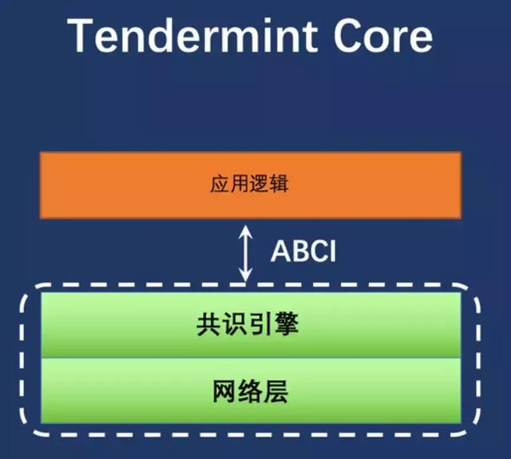
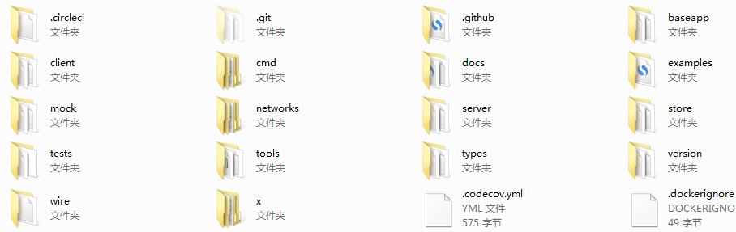
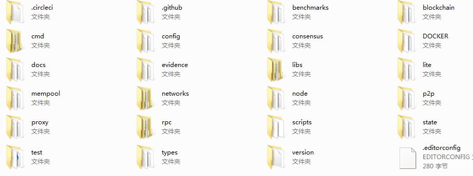

# cosmos源码分析之一概述

## 一、cosmos简介
 
cosmos这个项目是为了实现跨链而生的，在众多的跨链项目中，cosmos有它自己独特的特点，它把共识和P2P协议抽象出来，形成了一个单独的Tendermint的层或者叫模块。它采用Tendermint-BFT DPoS的共识引擎来解决跨链的共识问题。
 
众多的区块链项目，可以通过跨区块链沟通协议（IBC）来实现不同空间（cosmos用空间这个概念来表述不同的区块链）的信息传递。
 

 
N多的应用可以通过ABCI这个回调接口协议来实现与Tendermint的交互。在他们的官网上实现了一个Ethermint，其实就是以太坊去除了POW的共识再加上Tendermint实现的一个基于POS的高效的新以太坊链。
 
值得一提的是Cosmos-SDK,它是Cosmos团队的核心产品，其仍然是采用了ABCI应用的架构。（基于Go语言来实现）。如果使用这个SDK来开发一条自己的链，就不必过于纠结于链的底层的帐户体系，共识等技术细节，只需要关心自己的区块链的应用部分，而且在这个SDK中，还开放了一些开发的API，可以通过这些API来实现一些具体的基础实现，打造个性的区块链。
 

 
这也意味着，Cosmos-sdk是一个区块链开发的框架体系，通过Cosmos Hub接插任意的区块链，从理论上讲，万链并发不是幻想。cosmos的最终想法是通过cosmos SDK来实现一套完整的生态，但是正如波卡链和plasma一样，cosmos的进度确实是让人感到有些慢。很多的技术和概念可能会在未来不断变化。所以最终结果如何，还得走着瞧。
 

## 二、cosmos的整体结构

### 1、网络和共识（Tendermint）
 
就如上面图上直观的表示一样，cosmos通过Tendermint实现了一个通用层，利用这个通用层，可以实现不同的应用的接插隔离。
 

### 2、cosmos中心（Hub）
 
所谓中心，就是cosmos Hub,Cosmos网络中第一个公共区块链，通过Tendermint拜占庭共识算法运行。Cosmos中心通过ABCI来连接其他区块链（空间）。中心可以控制各个空间里代币。保证代币可以安全快速地从一个空间传递到另一个空间，即进行资产的跨链交易。
 
Cosmos中心负责管理各个独立区块链（即“空间”，或者“碎片”）。中心上的空间会源源不断地提交最新区块，这一点可以让中心跟上每个空间状态的变化。
 
Cosmos中心的验证人与委托人可以对提案进行投票，从而自动改变预先设置好的系统参数（比如区块容量限制），协调更新，并对人们看得懂的章程进行修订投票，从而管理Cosmos中心。这个章程允许权益相关者聚集到一起，来解决盗窃及漏洞等相关问题（比如The DAO事件），并快速得出明确的解决方案。
 

### 3、空间（Zones）
 
空间，也就是各个独立的区块链，连接到cosmos中心后，它们就成为了cosmos的一个空间。每个空间也会和中心的状态保持一致。信息可以从一个空间发送到另外一个空间，通过布默克尔证明（Merkle-proof）来表明信息已经被传送或接收。这种机制叫做“区块链间通信”，简称为“IBC”机制。
 

### 4、跨链通信协议（IBC）
 
IBC是中心与空间之前通信的方法。假设现在有三个区块链，分别是“空间1”、“空间2”以及“中心”，如果想要“空间1”生成一个消息包，通过“中心”发送给“空间2”。为了让消息包从一个区块链转移到另一个区块链，需要在接收方区块链上发布一个证明，来明确发送方已经发起了一个消息包到指定地点。接收方要验证的这个证明，必须和发送方区块头保持一致。这种机制就类似与侧链采用的机制，它需要两个相互作用的链，通过双向传送存在证明数据元（交易），来“知晓”另一方的情况。
 
IBC协议可以自然定义为两种交易的使用：一种是IBCBlockCommitTx 交易，这种交易可以让区块链向任何观察员证明其最新区块哈希值；另一种是IBCPacketTx 交易，这种交易则可以证明某个消息包确实由发送者的应用程序，通过默克尔证明机制（Merkle-proof）传送到了最新区块的哈希值上。
 
通过将IBC机制分裂成两个单独的交易，即IBCBlockCommitTx 交易与IBCPacketTx交易，可以让接收链的本地费用市场机制，来决定承认哪个消息包，与此同时还能确保发送方的完全自由，让其自行决定能够传出的消息包数量。
 
 

## 三、项目分布
 

cosmos可以分成cosmos（cosmos-SDK）和Tendermint两部分，它们在github上也是分成两个项目的。
 

### 1、cosmos-SDK部分
 
看一下文件：
 

 
baseapp: 基本ABCI应用程序定义模板，以便Cosmos-SDK应用程序可以与底层的Tendermint节点通信。
 
client:客户端 CLI和REST服务器工具，用于与SDK应用程序交互
 
examples: 如何构建独立的应用程序的示例。
 
server: 运行Tendermint上SDK应用程序的完整节点服务器。
 
store: SDK的数据库-MyKLE多存储支持多种类型的Melkey密钥值存储。
 
types: SDK应用程序中常见的类型。
 
x: 对核心的扩展，其中定义了所有消息和处理程序。有点神秘的味道。
 

### 2、Tendermint部分
 
代码目录：
 

 
blockchain:Tendermint链结构的规则验证和相关数据结构。
 
state:状态管理跟踪，包括签名摘要以及最生要的默克尔证明等。
 
consensus:共识部分，主要是基于拜占庭BFT的DPOS算法。
 
mempool: 验证完成的交易的存储池。
 
networks:本地和远端网络服务。
 
node:区块节点及相关数据结构。类似于以太坊，抽象了一层。
 
lite:轻节点，用来验证头。
 
p2p:网络层，用于链的发现和治理。
 
proxy:代理层，用于交易等代理连接验证共识等。
 
evidence:存储存证相关。
 
rpc:远程通信接口。
 
types:基本的数据类型定义。
 
 

## 四、总结
 
Tendermint和波卡链的substrate类似，都是抽象出来用来处理跨链的一个模块。只不过一个倾向于中心接入，一个倾向于中继处理，异曲同工，达到的目的没有什么区别。
 
