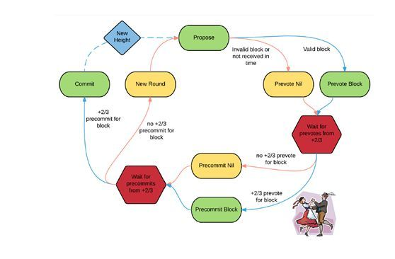
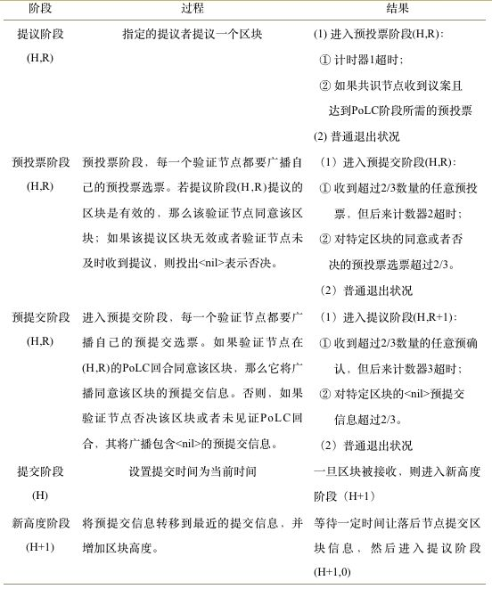

# cosmos源码分析之七Tendermint架构分析

## 一、介绍
Tendermint在网络有人把它当成一个共识，有人把它当成一个通信组件。这都是可以理解的。Tendermint融合了共识和网络通信部分。它类似于一个软件包，通过使用Tendermint可以很容易的开发一个和Cosmos相兼容的区块链（当然，如果使用Cosmos-sdk会更简单，但是会屏蔽更多的细节）。可以把它理解成Cosmos的一个底层架构，提供类似于基础服务的一个平台。Tendermint可以提供一个Cosmos标准的跨链的基础应用。
</br>
在前面分析完成Cosmos-sdk后，现在深入到网络通信和共识来看一看cosmos到底有什么特别之处？
</br>

## 二、整体架构
## 1、BFT
Tendermint使用的共识算法是拜占庭容错共识协议，它是来源于DLS共识算法。使用这种算法的目的是可以简单方便的解决区块链的分叉机制。这种BFT的机制要求有固定的一组验证人，然后他们会尝试在某个区块上达成共识。每个区块的共识轮流进行，每一轮都有一个提议者来发起区块，之后由验证人来决定是否接受穿上区块或者进入下一轮投票。
</br>
Tendermint采用由绝对多数的选票（三分之二）待定的最优拜占庭算法。因此它可以确定的做到：
</br>
如果想做恶，必须要有三分之一以上的选票出现问题，并且提交了两个值。
</br>
如果任何验证组引起安全问题，就会被发现并对冲突进行投票，同时广播有问题的那些选票。
</br>
因为使用了BFT，所以其共识的速度在所有的共识中最相当快速的，很容易达到并维持每秒千笔交易的速度。
</br>

## 2、P2P
Tendermint中的网络底层通信，使用的是一种普通的反应器，它通过参数来查找需要连接的P2P节点，在Tendermint的节点连接中，维护着两组映射来管理连接自己和自己连接的对象，分别称做inbound,outbound.
</br>
outbound中，有两种连接，一种是连接时指定的seed,一种是在初始化时检测出来的节点。一般情况下，outbound的数量少于10个。而inbound控制在50个左右的连接。
</br>
既然是基于反应器的，那么编程的复杂性就大大降低了。只需要服务监听就可以了。这里不再细节赘述网络通信部分。
</br>
网络在启动时，会启动一个协和，定时轮询outbound的数量，来控制连接的稳定性。
</br>

## 3、架构
</br>
Tendermint的设计目的是为了创建一个统一的区块链开发的基础组件。通过将区块链中主要的P2P和共识抽象出来，实现区块链开发过程中的组件式管理。这样做的优势有以下几点：
</br>
一个是代码重用。对通用的网络通信和共识就不必再重复的造轮子。
</br>
二是解放了区块链编程的语言。比如以太坊用go,c++，但是通过Tendermint的抽象后，可以使用任何语言（觉得和当初JAVA才提出时一次编译的想法有些相似啊）。特别是对于智能合约，这个优点就更显得明显了。
</br>

## 4、Tendermint的共识过程
Tendermint共识机制中通过作验证人（Validators）来对区块达成共识，这个在前面已经介绍过，一组验证人负责对每一轮的新区块进行提议和投票。整个共识达成的过程如下图所示。
</br>


</br>
每一轮的开始（New Round），节点对新一轮的区块进行提议。之后，合格的提议区块首先经过一轮预投票（Prevote）。在提议区块获得2/3以上的投票后，进入下一轮的预认可（Precommit），同样是待获得2/3以上的验证人预认可后，被提议区块就正式获得了认可（Commit）。而得到认可的这个区块就被添加的到区块链中。
</br>
下面为详细的过程：
</br>

</br>

</br>
在Tendermint算法中，如果遇到对同一特定区块的同意及否决信息同时超过2/3的情况，需要启用外部的维护机制去核查是否存在超过1/3的验证节点伪造签名或者投出双重选票。
</br>

## 三、源码分析

## 1、共识部分
共识中有一个重要的数据结构，那就是共识的状态，它决定的共识进行的步骤：
</br>

 ``` golang
 type ConsensusState struct {
 	cmn.BaseService

 	// config details
 	config        *cfg.ConsensusConfig
 	privValidator types.PrivValidator // for signing votes

 	// services for creating and executing blocks
 	// TODO: encapsulate all of this in one "BlockManager"
 	blockExec  *sm.BlockExecutor
 	blockStore types.BlockStore
 	mempool    types.Mempool
 	evpool     types.EvidencePool

 	// internal state
 	mtx sync.Mutex
 	cstypes.RoundState
 	state sm.State // State until height-1.

 	// state changes may be triggered by: msgs from peers,
 	// msgs from ourself, or by timeouts
 	peerMsgQueue     chan msgInfo
 	internalMsgQueue chan msgInfo
 	timeoutTicker    TimeoutTicker

 	// we use eventBus to trigger msg broadcasts in the reactor,
 	// and to notify external subscribers, eg. through a websocket
 	eventBus *types.EventBus

 	// a Write-Ahead Log ensures we can recover from any kind of crash
 	// and helps us avoid signing conflicting votes
 	wal          WAL
 	replayMode   bool // so we don't log signing errors during replay
 	doWALCatchup bool // determines if we even try to do the catchup

 	// for tests where we want to limit the number of transitions the state makes
 	nSteps int

 	// some functions can be overwritten for testing
 	decideProposal func(height int64, round int)
 	doPrevote      func(height int64, round int)
 	setProposal    func(proposal *types.Proposal) error

 	// closed when we finish shutting down
 	done chan struct{}

 	// synchronous pubsub between consensus state and reactor.
 	// state only emits EventNewRoundStep, EventVote and EventProposalHeartbeat
 	evsw tmevents.EventSwitch
 }
 ```
</br>
所以在共识要首先创建一个Proposal：
</br>

``` golang
func (cs *ConsensusState) createProposalBlock() (block *types.Block, blockParts *types.PartSet) {
	var commit *types.Commit
	if cs.Height == 1 {
		// We're creating a proposal for the first block.
		// The commit is empty, but not nil.
		commit = &types.Commit{}
	} else if cs.LastCommit.HasTwoThirdsMajority() {
		// Make the commit from LastCommit
		commit = cs.LastCommit.MakeCommit()
	} else {
		// This shouldn't happen.
		cs.Logger.Error("enterPropose: Cannot propose anything: No commit for the previous block.")
		return
	}

	// Mempool validated transactions
	txs := cs.mempool.Reap(cs.config.MaxBlockSizeTxs)
	block, parts := cs.state.MakeBlock(cs.Height, txs, commit)
	evidence := cs.evpool.PendingEvidence()
	block.AddEvidence(evidence)
	return block, parts
}
func NewProposal(height int64, round int, blockPartsHeader PartSetHeader, polRound int, polBlockID BlockID) *Proposal {
	return &Proposal{
		Height:           height,
		Round:            round,
		Timestamp:        time.Now().UTC(),
		BlockPartsHeader: blockPartsHeader,
		POLRound:         polRound,
		POLBlockID:       polBlockID,
	}
}
```
</br>
 然后进行验证：
</br>

``` golang
// Implements PrivValidator.
func (pv *MockPV) SignProposal(chainID string, proposal *Proposal) error {
	signBytes := proposal.SignBytes(chainID)
	sig := pv.privKey.Sign(signBytes)
	proposal.Signature = sig
	return nil
}
```
</br>
广播：
</br>

``` golang
type peer struct {
	cmn.BaseService

	// raw peerConn and the multiplex connection
	peerConn
	mconn *tmconn.MConnection

	// peer's node info and the channel it knows about
	// channels = nodeInfo.Channels
	// cached to avoid copying nodeInfo in hasChannel
	nodeInfo NodeInfo
	channels []byte

	// User data
	Data *cmn.CMap
}
func (p *peer) Send(chID byte, msgBytes []byte) bool {
	if !p.IsRunning() {
		// see Switch#Broadcast, where we fetch the list of peers and loop over
		// them - while we're looping, one peer may be removed and stopped.
		return false
	} else if !p.hasChannel(chID) {
		return false
	}
	return p.mconn.Send(chID, msgBytes)
}
```
</br>
真正的共识算法过程在state中：
</br>

``` golang
type RoundState struct {
	Height             int64               `json:"height"` // Height we are working on
	Round              int                 `json:"round"`
	Step               RoundStepType       `json:"step"`
	StartTime          time.Time           `json:"start_time"`
	CommitTime         time.Time           `json:"commit_time"` // Subjective time when +2/3 precommits for Block at Round were found
	Validators         *types.ValidatorSet `json:"validators"`
	Proposal           *types.Proposal     `json:"proposal"`
	ProposalBlock      *types.Block        `json:"proposal_block"`
	ProposalBlockParts *types.PartSet      `json:"proposal_block_parts"`
	LockedRound        int                 `json:"locked_round"`
	LockedBlock        *types.Block        `json:"locked_block"`
	LockedBlockParts   *types.PartSet      `json:"locked_block_parts"`
	ValidRound         int                 `json:"valid_round"`       // Last known round with POL for non-nil valid block.
	ValidBlock         *types.Block        `json:"valid_block"`       // Last known block of POL mentioned above.
	ValidBlockParts    *types.PartSet      `json:"valid_block_parts"` // Last known block parts of POL metnioned above.
	Votes              *HeightVoteSet      `json:"votes"`
	CommitRound        int                 `json:"commit_round"` //
	LastCommit         *types.VoteSet      `json:"last_commit"`  // Last precommits at Height-1
	LastValidators     *types.ValidatorSet `json:"last_validators"`
}
func (hvs *HeightVoteSet) POLInfo() (polRound int, polBlockID types.BlockID) {
	hvs.mtx.Lock()
	defer hvs.mtx.Unlock()
	for r := hvs.round; r >= 0; r-- {
		rvs := hvs.getVoteSet(r, types.VoteTypePrevote)
		polBlockID, ok := rvs.TwoThirdsMajority()
		if ok {
			return r, polBlockID
		}
	}
	return -1, types.BlockID{}
}
//启动一轮新的共识
func (cs *ConsensusState) startRoutines(maxSteps int) {
	err := cs.timeoutTicker.Start()
	if err != nil {
		cs.Logger.Error("Error starting timeout ticker", "err", err)
		return
	}
	go cs.receiveRoutine(maxSteps)
}
// Updates ConsensusState and increments height to match that of state.
// The round becomes 0 and cs.Step becomes cstypes.RoundStepNewHeight.
func (cs *ConsensusState) updateToState(state sm.State) {
	if cs.CommitRound > -1 && 0 < cs.Height && cs.Height != state.LastBlockHeight {
		cmn.PanicSanity(cmn.Fmt("updateToState() expected state height of %v but found %v",
			cs.Height, state.LastBlockHeight))
	}
	if !cs.state.IsEmpty() && cs.state.LastBlockHeight+1 != cs.Height {
		// This might happen when someone else is mutating cs.state.
		// Someone forgot to pass in state.Copy() somewhere?!
		cmn.PanicSanity(cmn.Fmt("Inconsistent cs.state.LastBlockHeight+1 %v vs cs.Height %v",
			cs.state.LastBlockHeight+1, cs.Height))
	}

	// If state isn't further out than cs.state, just ignore.
	// This happens when SwitchToConsensus() is called in the reactor.
	// We don't want to reset e.g. the Votes.
	if !cs.state.IsEmpty() && (state.LastBlockHeight <= cs.state.LastBlockHeight) {
		cs.Logger.Info("Ignoring updateToState()", "newHeight", state.LastBlockHeight+1, "oldHeight", cs.state.LastBlockHeight+1)
		return
	}

	// Reset fields based on state.
	validators := state.Validators
	lastPrecommits := (*types.VoteSet)(nil)
	if cs.CommitRound > -1 && cs.Votes != nil {
		if !cs.Votes.Precommits(cs.CommitRound).HasTwoThirdsMajority() {
			cmn.PanicSanity("updateToState(state) called but last Precommit round didn't have +2/3")
		}
		lastPrecommits = cs.Votes.Precommits(cs.CommitRound)
	}

	// Next desired block height
	height := state.LastBlockHeight + 1

	// RoundState fields
	cs.updateHeight(height)
	cs.updateRoundStep(0, cstypes.RoundStepNewHeight)
	if cs.CommitTime.IsZero() {
		// "Now" makes it easier to sync up dev nodes.
		// We add timeoutCommit to allow transactions
		// to be gathered for the first block.
		// And alternative solution that relies on clocks:
		//  cs.StartTime = state.LastBlockTime.Add(timeoutCommit)
		cs.StartTime = cs.config.Commit(time.Now())
	} else {
		cs.StartTime = cs.config.Commit(cs.CommitTime)
	}
	cs.Validators = validators
	cs.Proposal = nil
	cs.ProposalBlock = nil
	cs.ProposalBlockParts = nil
	cs.LockedRound = 0
	cs.LockedBlock = nil
	cs.LockedBlockParts = nil
	cs.ValidRound = 0
	cs.ValidBlock = nil
	cs.ValidBlockParts = nil
	cs.Votes = cstypes.NewHeightVoteSet(state.ChainID, height, validators)
	cs.CommitRound = -1
	cs.LastCommit = lastPrecommits
	cs.LastValidators = state.LastValidators

	cs.state = state

	// Finally, broadcast RoundState
	cs.newStep()
}

```
</br>
细节之处其实就是BFT的三阶段提交，对着代码就可以看得很清楚。
</br>

## 3、P2P部分
首先看一下连接的数据结构体：
</br>

``` golang
type MConnection struct {
	cmn.BaseService

	conn          net.Conn
	bufConnReader *bufio.Reader
	bufConnWriter *bufio.Writer
	sendMonitor   *flow.Monitor
	recvMonitor   *flow.Monitor
	send          chan struct{}
	pong          chan struct{}
	channels      []*Channel
	channelsIdx   map[byte]*Channel
	onReceive     receiveCbFunc
	onError       errorCbFunc
	errored       uint32
	config        *MConnConfig

	quit       chan struct{}
	flushTimer *cmn.ThrottleTimer // flush writes as necessary but throttled.
	pingTimer  *cmn.RepeatTimer   // send pings periodically

	// close conn if pong is not received in pongTimeout
	pongTimer     *time.Timer
	pongTimeoutCh chan bool // true - timeout, false - peer sent pong

	chStatsTimer *cmn.RepeatTimer // update channel stats periodically

	created time.Time // time of creation
}
```
</br>
其中的代码还是比较容易看清楚的，每一个Peer需要有一个这个结构体的变量的实例。它可以发送数据：
</br>

``` golang
// Queues a message to be sent to channel.
func (c *MConnection) Send(chID byte, msgBytes []byte) bool {
	if !c.IsRunning() {
		return false
	}

	c.Logger.Debug("Send", "channel", chID, "conn", c, "msgBytes", fmt.Sprintf("%X", msgBytes))

	// Send message to channel.
	channel, ok := c.channelsIdx[chID]
	if !ok {
		c.Logger.Error(cmn.Fmt("Cannot send bytes, unknown channel %X", chID))
		return false
	}

	success := channel.sendBytes(msgBytes)
	if success {
		// Wake up sendRoutine if necessary
		select {
		case c.send <- struct{}{}:
		default:
		}
	} else {
		c.Logger.Error("Send failed", "channel", chID, "conn", c, "msgBytes", fmt.Sprintf("%X", msgBytes))
	}
	return success
}
```
</br>
当然，它还有很多功能，这里就不再都列举出来。下面看一下Peer的代码：
</br>

``` golang
type Peer interface {
	cmn.Service

	ID() ID             // peer's cryptographic ID
	RemoteIP() net.IP   // remote IP of the connection
	IsOutbound() bool   // did we dial the peer
	IsPersistent() bool // do we redial this peer when we disconnect
	NodeInfo() NodeInfo // peer's info
	Status() tmconn.ConnectionStatus

	Send(byte, []byte) bool
	TrySend(byte, []byte) bool

	Set(string, interface{})
	Get(string) interface{}
}

//----------------------------------------------------------

// peerConn contains the raw connection and its config.
type peerConn struct {
	outbound   bool
	persistent bool
	config     *PeerConfig
	conn       net.Conn // source connection
	ip         net.IP
}
```
</br>
它的两类连接：
</br>

``` golang
func newOutboundPeerConn(addr *NetAddress, config *PeerConfig, persistent bool, ourNodePrivKey crypto.PrivKey) (peerConn, error) {
	var pc peerConn

	conn, err := dial(addr, config)
	if err != nil {
		return pc, cmn.ErrorWrap(err, "Error creating peer")
	}

	pc, err = newPeerConn(conn, config, true, persistent, ourNodePrivKey)
	if err != nil {
		if err2 := conn.Close(); err2 != nil {
			return pc, cmn.ErrorWrap(err, err2.Error())
		}
		return pc, err
	}

	// ensure dialed ID matches connection ID
	if addr.ID != pc.ID() {
		if err2 := conn.Close(); err2 != nil {
			return pc, cmn.ErrorWrap(err, err2.Error())
		}
		return pc, ErrSwitchAuthenticationFailure{addr, pc.ID()}
	}
	return pc, nil
}

func newInboundPeerConn(conn net.Conn, config *PeerConfig, ourNodePrivKey crypto.PrivKey) (peerConn, error) {

	// TODO: issue PoW challenge

	return newPeerConn(conn, config, false, false, ourNodePrivKey)
}

func newPeerConn(rawConn net.Conn,
	config *PeerConfig, outbound, persistent bool,
	ourNodePrivKey crypto.PrivKey) (pc peerConn, err error) {

	conn := rawConn

	// Fuzz connection
	if config.Fuzz {
		// so we have time to do peer handshakes and get set up
		conn = FuzzConnAfterFromConfig(conn, 10*time.Second, config.FuzzConfig)
	}

	// Set deadline for secret handshake
	if err := conn.SetDeadline(time.Now().Add(config.HandshakeTimeout * time.Second)); err != nil {
		return pc, cmn.ErrorWrap(err, "Error setting deadline while encrypting connection")
	}

	// Encrypt connection
	conn, err = tmconn.MakeSecretConnection(conn, ourNodePrivKey)
	if err != nil {
		return pc, cmn.ErrorWrap(err, "Error creating peer")
	}

	// Only the information we already have
	return peerConn{
		config:     config,
		outbound:   outbound,
		persistent: persistent,
		conn:       conn,
	}, nil
}
```
</br>
它们由一个公共的接口来控制：
</br>

``` golang
type Reactor interface {
	cmn.Service // Start, Stop

	// SetSwitch allows setting a switch.
	SetSwitch(*Switch)

	// GetChannels returns the list of channel descriptors.
	GetChannels() []*conn.ChannelDescriptor

	// AddPeer is called by the switch when a new peer is added.
	AddPeer(peer Peer)

	// RemovePeer is called by the switch when the peer is stopped (due to error
	// or other reason).
	RemovePeer(peer Peer, reason interface{})

	// Receive is called when msgBytes is received from peer.
	//
	// NOTE reactor can not keep msgBytes around after Receive completes without
	// copying.
	//
	// CONTRACT: msgBytes are not nil.
	Receive(chID byte, peer Peer, msgBytes []byte)
}

//--------------------------------------

type BaseReactor struct {
	cmn.BaseService // Provides Start, Stop, .Quit
	Switch          *Switch
}
```
</br>
节点的管理和控制都要通过这个接口继承的相关的结构体来处理。
</br>
服务器的监听由listener.go来实现：
</br>

``` golang
type Listener interface {
	Connections() <-chan net.Conn
	InternalAddress() *NetAddress
	ExternalAddress() *NetAddress
	String() string
	Stop() error
}

// Implements Listener
type DefaultListener struct {
	cmn.BaseService

	listener    net.Listener
	intAddr     *NetAddress
	extAddr     *NetAddress
	connections chan net.Conn
}
```
</br>
启动监听：
</br>

``` golang
// Accept connections and pass on the channel
func (l *DefaultListener) listenRoutine() {
	for {
		conn, err := l.listener.Accept()

		if !l.IsRunning() {
			break // Go to cleanup
		}

		// listener wasn't stopped,
		// yet we encountered an error.
		if err != nil {
			panic(err)
		}

		l.connections <- conn
	}

	// Cleanup
	close(l.connections)
	for range l.connections {
		// Drain
	}
}
```
</br>
总体上来讲，这波代码写得中规中矩，没有什么出彩的地方。估计Tendermint是搂草打兔子，重点还是在共识和通信协议的处理以及对整个模块的封装上。
</br>

## 四、总结
通过上面的分析可以看到，其实Tendermint的重点在于共识和P2P，相关的通信的协议和接口在前面介绍过。将二者抽象出来的有利之处在于，可以让开发者忽略对网络通信和共识的复杂性。直接进行业务层面的开发，而在前面也提到了SDK的封装，这进一步减少了业务上对非相关的逻辑的考虑，大大减少了开发者生产一条区块链的复杂度，而这也恰恰是Tendermint和cosmos-sdk所想达到的目的。
