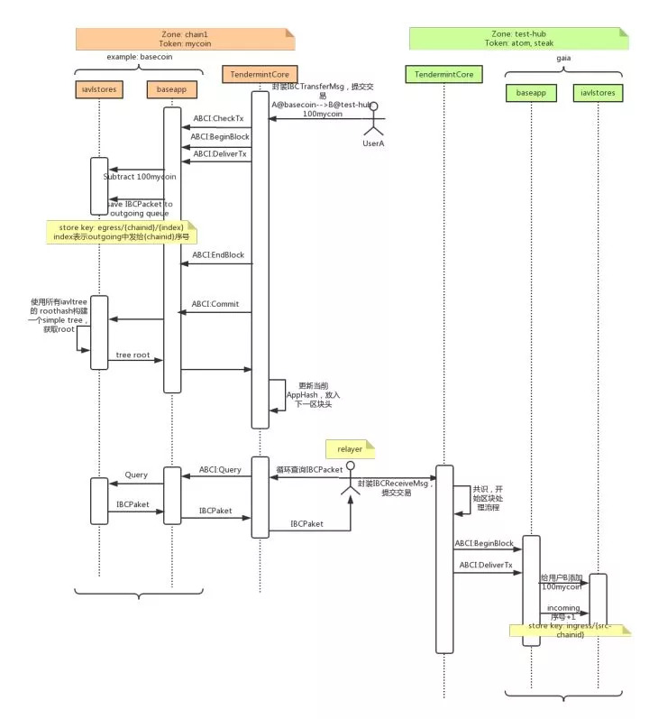

# cosmos源码分析之三跨链交易
cosmos中最重的一部分就是跨链通信，在上文提到过，跨链是通过IBC协议来实现的.cosmos中交易分为两种：普通交易和跨链交易。普通交易基本局限在各个区块链的交易方式中，在Basecoin中已经提供了基础的转帐功能供使用；跨链交易主要由IBC协议来实现。
</br>

## 一、普通交易
cosmos的普通交易和以太坊类似，也是一个帐户模型。但是与以太坊不同的是，cosmos的交易进行了插件化的处理，也就是说，最基础最简单的交易可以使用Basecoin提供的基础函数，但是要想实现以太坊一样的丰富的交易管理就得使用交易的插件，这也是在上文中提到的Cosmos基本实现了插件化的编程。
</br>

``` golang
// SendTxCommand will create a send tx and sign it with the given key
func SendTxCmd(cdc *wire.Codec) *cobra.Command {
	cmd := &cobra.Command{
		Use:   "send",
		Short: "Create and sign a send tx",
		RunE: func(cmd *cobra.Command, args []string) error {
			ctx := context.NewCoreContextFromViper().WithDecoder(authcmd.GetAccountDecoder(cdc))
.......

			// build and sign the transaction, then broadcast to Tendermint
			msg := client.BuildMsg(from, to, coins)
      res, err := ctx.EnsureSignBuildBroadcast(ctx.FromAddressName, msg, cdc)
......
		},
	}

......
	return cmd
}
// build the sendTx msg
func BuildMsg(from sdk.Address, to sdk.Address, coins sdk.Coins) sdk.Msg {
	input := bank.NewInput(from, coins)
	output := bank.NewOutput(to, coins)
	msg := bank.NewMsgSend([]bank.Input{input}, []bank.Output{output})
	return msg
}
// NewInput - create a transaction input, used with MsgSend
func NewInput(addr sdk.Address, coins sdk.Coins) Input {
	input := Input{
		Address: addr,
		Coins:   coins,
	}
	return input
}
// NewOutput - create a transaction output, used with MsgSend
func NewOutput(addr sdk.Address, coins sdk.Coins) Output {
	output := Output{
		Address: addr,
		Coins:   coins,
	}
	return output
}

```
</br>
普通交易比较简单，不是本次分析的重点。
</br>

## 二、跨链交易

### 1、交易步骤
</br>
IBC协议中包含了两个主要的交易类型：
</br>
IBCBlockCommitTx：发送方所在区块链的最新的区块信息。
</br>
IBCPacketTx：跨链交易本身的信息，及其在发送方链中被打包的区块信息。
</br>
其中IBCBlockCommitTx就是传送MerkleRoot到另外一条链的消息。而IBCPacketTx则传递了跨链的交易信息。也就是交易经常提到的有效载荷（payload）。而为了保证数据的安全，双方链需要创建两个队列，一进一出，用来存储入链（从对方链进来的消息）和出链（发给对方链的消息）。
</br>
当双方在路由注册后，彼此发现就可以通过路由进行跨链交易了。(下图来自美图的Cosmos分析)
</br>


</br>
它主要有以下几个步骤：
</br>
1、路由注册。
</br>
2、User A向chain1提交跨链交易（包括验证信息等），chain1执行该交易，并将交易存入outgoing队列。
</br>
3、relayer从chain1中对应test-hub的outgoing消息队列取出跨链交易，提交到test-hub。
</br>
4、test-hub执行交易，放入incoming消息队列。
</br>
此的流程和官网的白皮书略有不同，和前面交易的步骤中提到的也有区别，主要原因是代码尚未完成，按它们的计划需要明年第三季度才可能完成。所以细节有出入是正常的。
</br>

### 2、源码分析
在看了上面的分析之后，结合代码分析一下：
</br>
1、注册路由
</br>

``` golang
func NewBasecoinApp(logger log.Logger, db dbm.DB) *BasecoinApp {
......
	// add accountMapper/handlers
	app.coinKeeper = bank.NewKeeper(app.accountMapper)
	app.ibcMapper = ibc.NewMapper(app.cdc, app.keyIBC, app.RegisterCodespace(ibc.DefaultCodespace))
	app.stakeKeeper = stake.NewKeeper(app.cdc, app.keyStake, app.coinKeeper, app.RegisterCodespace(stake.DefaultCodespace))
	app.slashingKeeper = slashing.NewKeeper(app.cdc, app.keySlashing, app.stakeKeeper, app.RegisterCodespace(slashing.DefaultCodespace))

	// register message routes
	app.Router().
		AddRoute("auth", auth.NewHandler(app.accountMapper)).
		AddRoute("bank", bank.NewHandler(app.coinKeeper)).
		AddRoute("ibc", ibc.NewHandler(app.ibcMapper, app.coinKeeper)).
		AddRoute("stake", stake.NewHandler(app.stakeKeeper))

.......
	return app
}
```
</br>
2、发起传送
</br>

``` golang
// SendTxCommand will create a send tx and sign it with the given key
func SendTxCmd(cdc *wire.Codec) *cobra.Command {
......

			// build and sign the transaction, then broadcast to Tendermint
			msg := client.BuildMsg(from, to, coins)
			res, err := ctx.EnsureSignBuildBroadcast(ctx.FromAddressName, msg, cdc)
......
	return cmd
}
// IBC transfer command
func IBCTransferCmd(cdc *wire.Codec) *cobra.Command {
.......

			// build the message
			msg, err := buildMsg(from)
			if err != nil {
				return err
			}

			// get password
			res, err := ctx.EnsureSignBuildBroadcast(ctx.FromAddressName, msg, cdc)
			if err != nil {
				return err
			}

.......
	return cmd
}
```
</br>
3、Relay传输
</br>

``` golang
// IBC relay command
func IBCRelayCmd(cdc *wire.Codec) *cobra.Command {
......

	cmd := &cobra.Command{
		Use: "relay",
		Run: cmdr.runIBCRelay,
	}
.......

	return cmd
}

func (c relayCommander) runIBCRelay(cmd *cobra.Command, args []string) {
	//得到路由的相关信息
	fromChainID := viper.GetString(FlagFromChainID)
	fromChainNode := viper.GetString(FlagFromChainNode)
	toChainID := viper.GetString(FlagToChainID)
	toChainNode := viper.GetString(FlagToChainNode)
	address, err := context.NewCoreContextFromViper().GetFromAddress()
	if err != nil {
		panic(err)
	}
	c.address = address

  //循环处理路由
	c.loop(fromChainID, fromChainNode, toChainID, toChainNode)
}

func (c relayCommander) loop(fromChainID, fromChainNode, toChainID,
	toChainNode string) {

	ctx := context.NewCoreContextFromViper()
	// get password
	passphrase, err := ctx.GetPassphraseFromStdin(ctx.FromAddressName)
	if err != nil {
		panic(err)
	}

	ingressKey := ibc.IngressSequenceKey(fromChainID)

OUTER:
	for {
		time.Sleep(5 * time.Second)

		processedbz, err := query(toChainNode, ingressKey, c.ibcStore)
		if err != nil {
			panic(err)
		}

		var processed int64
		if processedbz == nil {
			processed = 0
		} else if err = c.cdc.UnmarshalBinary(processedbz, &processed); err != nil {
			panic(err)
		}

		lengthKey := ibc.EgressLengthKey(toChainID)
		egressLengthbz, err := query(fromChainNode, lengthKey, c.ibcStore)
		if err != nil {
			c.logger.Error("Error querying outgoing packet list length", "err", err)
			continue OUTER //TODO replace with continue (I think it should just to the correct place where OUTER is now)
		}
		var egressLength int64
		if egressLengthbz == nil {
			egressLength = 0
		} else if err = c.cdc.UnmarshalBinary(egressLengthbz, &egressLength); err != nil {
			panic(err)
		}
		if egressLength > processed {
			c.logger.Info("Detected IBC packet", "number", egressLength-1)
		}

		seq := c.getSequence(toChainNode)

		for i := processed; i < egressLength; i++ {
			egressbz, err := query(fromChainNode, ibc.EgressKey(toChainID, i), c.ibcStore)
			if err != nil {
				c.logger.Error("Error querying egress packet", "err", err)
				continue OUTER // TODO replace to break, will break first loop then send back to the beginning (aka OUTER)
			}
			//在此广播交易
			err = c.broadcastTx(seq, toChainNode, c.refine(egressbz, i, passphrase))
			seq++
			if err != nil {
				c.logger.Error("Error broadcasting ingress packet", "err", err)
				continue OUTER // TODO replace to break, will break first loop then send back to the beginning (aka OUTER)
			}

			c.logger.Info("Relayed IBC packet", "number", i)
		}
	}
}
```
</br>
4、执行交易
</br>

``` golang
// IBCReceiveMsg adds coins to the destination address and creates an ingress IBC packet.
func handleIBCReceiveMsg(ctx sdk.Context, ibcm Mapper, ck bank.Keeper, msg IBCReceiveMsg) sdk.Result {
......
	_, _, err := ck.AddCoins(ctx, packet.DestAddr, packet.Coins)
......

	return sdk.Result{}
}
```
</br>
5、相关的数据结构体
</br>

``` golang
// MsgSend - high level transaction of the coin module
type MsgSend struct {
	Inputs  []Input  `json:"inputs"`
	Outputs []Output `json:"outputs"`
}
```
</br>

## 三、总结
通过上述的分析，可以看到，其实整个Cosmos还是处于一个非常初级的阶段，大量的相关代码都处理演进状态。所以说白皮书写得好，还得看代码进度。
</br>
不过从交易的设计角度来看，这还是有一些值得借鉴的。这里没有讨论已存在的链（如比特币，以太坊等）在Cosmos-sdk上的交易的办法，解决的方式PegZone部分以后再专门进行分析。
