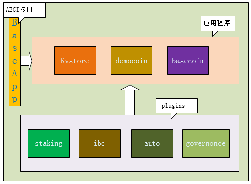

# cosmos源码分析之二整体流程

cosmos主要的源码其实是在SDK部分，听名字也可以理解出来，直接用这个SDK就可以写出一条不考虑底层的区块链来，但是，做为中继链的一个代表，理想和现实并不是那么完美的结合在一起。
</br>
目前区块链的跨链的难点在于，网络异构、共识算法不兼容等，而解决这些问题，都意味着巨大的投入和风险。Cosmos的目的当然是想建立一个区块链互联网，所以他的想法是把网络和共识抽象出来，专门做了一层，这在上一篇也讲过了。但是，这样做的方法，虽然从理论上讲是没有问题的，可开发上，难度还是增加了，开发者必须适应新的套路和不同的设计方法，怎么办？
</br>
凉拌，弄个SDK，隔离变化，软件界的通用手段。
</br>

## 一、SDK的架构

看一个架构图：
</br>


</br>
从上图可以看出来，其实SDK就是为了APP服务的，图中的应用程序其实就是给的例子，让大家能快速上手。然后另外两部分一个是和抽象层（共识和P2P）通信的，另外一个是用来调用各种插件的。
</br>
SDK从开始到现在，也进行了好几次比较大的改动了，至于今后会不会再有大的改动，也不敢肯定，所以说，做成插件化，是一个最好的选择，到时候儿看谁不顺眼，直接搞掉就可以了，喜欢谁，把插件接进来就OK。
</br>
</br>

### 1、plugins层
</br>
在插件层其实图中画的并是很完全只是一个示意。主要的几个插件包括staking、IBC、 bank、 auth、 governance 、tx、 keys等几个。staking主要是控制Atom持有者相关贡献。类似一个汇率机制，动态变化。IBC其实就是链间通信机制，因为各个通信链是通过插件插入到HUB中进行通信，所以需要一个相应的通信机制来保证通信的安全性。governance这个模块目前在源码中看好像注释了不少，只保留了较少的东西，它主要是治理相关的实现，如提议、投票等。bank其实就是提供了一系列的通信接口（资产转移的），所以叫“银行”。
</br>

### 2、APP层
</br>
这一层基本没啥可说的，应该就是客户开发的APP，但是为了能让客户迅速进入，提供了三个相关的Demo。其中Basecoin是第一个完成的，是一个相对完整的应用，实现了SDK的核心模块的扩展，提供了诸如帐户管理、管理交易类型、处理存储等。
</br>
其它两个都是相关的扩展。
</br>

### 3、BaseApp
</br>
这一层主要是ABCI的通信，和Tendermint进行交互，这个说过好几次了，Cosmos的核心就在这里。
</br>

## 二、源码流程

### 1、启动流程
从主程序的接口来分析源码：
</br>

``` golang
//gaia/cmd/gaiad/main.go
func main() {
  //生成需要注册的编解码器
	cdc := app.MakeCodec()
	ctx := server.NewDefaultContext()
	cobra.EnableCommandSorting = false
	rootCmd := &cobra.Command{
		Use:               "gaiad",
		Short:             "Gaia Daemon (server)",
		PersistentPreRunE: server.PersistentPreRunEFn(ctx),
	}

	server.AddCommands(ctx, cdc, rootCmd, app.GaiaAppInit(),
    //第一步，创建APP，在其中准备启动网络的各个条件
		server.ConstructAppCreator(newApp, "gaia"),
    //第二步，导出相生成的创世文件相关状态
		server.ConstructAppExporter(exportAppState, "gaia"))

	// 第三步，prepare and add flags设置并启动Tendermint
	executor := cli.PrepareBaseCmd(rootCmd, "GA", app.DefaultNodeHome)
	executor.Execute()
}

func newApp(logger log.Logger, db dbm.DB) abci.Application {
	return app.NewGaiaApp(logger, db)
}

func exportAppState(logger log.Logger, db dbm.DB) (json.RawMessage, error) {
	gapp := app.NewGaiaApp(logger, db)
	return gapp.ExportAppStateJSON()
}
```
</br>
这里只分析前两步，最后一步等分析Tendermint时再展开分析。
</br>

``` golang
func NewGaiaApp(logger log.Logger, db dbm.DB) *GaiaApp {
	cdc := MakeCodec()

	// create your application object
  //创建一个相关的APP，其它所有的APP都可以按照这个方法
	var app = &GaiaApp{
		BaseApp:     bam.NewBaseApp(appName, cdc, logger, db),
		cdc:         cdc,
		keyMain:     sdk.NewKVStoreKey("main"),
		keyAccount:  sdk.NewKVStoreKey("acc"),
		keyIBC:      sdk.NewKVStoreKey("ibc"),
		keyStake:    sdk.NewKVStoreKey("stake"),
		keySlashing: sdk.NewKVStoreKey("slashing"),
	}

	// define the accountMapper
  //帐户管理--从KVSTROE抽象
	app.accountMapper = auth.NewAccountMapper(
		app.cdc,
		app.keyAccount,      // target store
		&auth.BaseAccount{}, // prototype
	)

	// add handlers
  //添加各种操作——它们都从KVSTORE抽象出来,但是它们的抽象度更高，或者可以认为是accountMapper的更高一层。
  //处理帐户的操作，再抽象一层
	app.coinKeeper = bank.NewKeeper(app.accountMapper)
	app.ibcMapper = ibc.NewMapper(app.cdc, app.keyIBC, app.RegisterCodespace(ibc.DefaultCodespace))
  //处理Atom
	app.stakeKeeper = stake.NewKeeper(app.cdc, app.keyStake, app.coinKeeper, app.RegisterCodespace(stake.DefaultCodespace))
  //设置惩罚机制操作者
  app.slashingKeeper = slashing.NewKeeper(app.cdc, app.keySlashing, app.stakeKeeper, app.RegisterCodespace(slashing.DefaultCodespace))

	// register message routes
  //这个是重点，在这里注册路由的句柄
	app.Router().
		AddRoute("bank", bank.NewHandler(app.coinKeeper)).
		AddRoute("ibc", ibc.NewHandler(app.ibcMapper, app.coinKeeper)).
		AddRoute("stake", stake.NewHandler(app.stakeKeeper))

	// initialize BaseApp
  //初始化相关参数
	app.SetInitChainer(app.initChainer)
	app.SetBeginBlocker(app.BeginBlocker)
	app.SetEndBlocker(app.EndBlocker)
  //设置权限控制句柄
	app.SetAnteHandler(auth.NewAnteHandler(app.accountMapper, app.feeCollectionKeeper))
  //从KV数据库加载相关数据--在当前版本中，IVAL存储是KVStore基础的实现
	app.MountStoresIAVL(app.keyMain, app.keyAccount, app.keyIBC, app.keyStake, app.keySlashing)
	err := app.LoadLatestVersion(app.keyMain)
	if err != nil {
		cmn.Exit(err.Error())
	}

	return app
}

// custom tx codec
//将相关的编码器注册到相关的各方
func MakeCodec() *wire.Codec {
	var cdc = wire.NewCodec()
	ibc.RegisterWire(cdc)
	bank.RegisterWire(cdc)
	stake.RegisterWire(cdc)
	slashing.RegisterWire(cdc)
	auth.RegisterWire(cdc)
	sdk.RegisterWire(cdc)
	wire.RegisterCrypto(cdc)
	return cdc
}
//其下为具体的上面的HANDLER的设置
// application updates every end block
func (app *GaiaApp) BeginBlocker(ctx sdk.Context, req abci.RequestBeginBlock) abci.ResponseBeginBlock {
	tags := slashing.BeginBlocker(ctx, req, app.slashingKeeper)

	return abci.ResponseBeginBlock{
		Tags: tags.ToKVPairs(),
	}
}

// application updates every end block
func (app *GaiaApp) EndBlocker(ctx sdk.Context, req abci.RequestEndBlock) abci.ResponseEndBlock {
	validatorUpdates := stake.EndBlocker(ctx, app.stakeKeeper)

	return abci.ResponseEndBlock{
		ValidatorUpdates: validatorUpdates,
	}
}

// custom logic for gaia initialization
func (app *GaiaApp) initChainer(ctx sdk.Context, req abci.RequestInitChain) abci.ResponseInitChain {
	stateJSON := req.AppStateBytes
	// TODO is this now the whole genesis file?

	var genesisState GenesisState
	err := app.cdc.UnmarshalJSON(stateJSON, &genesisState)
	if err != nil {
		panic(err) // TODO https://github.com/cosmos/cosmos-sdk/issues/468
		// return sdk.ErrGenesisParse("").TraceCause(err, "")
	}

	// load the accounts
	for _, gacc := range genesisState.Accounts {
		acc := gacc.ToAccount()
		app.accountMapper.SetAccount(ctx, acc)
	}

	// load the initial stake information
	stake.InitGenesis(ctx, app.stakeKeeper, genesisState.StakeData)

	return abci.ResponseInitChain{}
}

```
</br>
这里面需要说明的是，Mapper和Keeper。记得在写数据库程序的时候儿，有几种方法，一种是直接连接操作数据库，拿到结果，这种方法最原始，但是权力也最大，想怎么操作就怎么操作。后来有了可以使用封装对象，这样访问数据库就被控制了起来，但是仍然是可以访问很多原始的东西。现在主流的使用的是Mybaits什么的，抽象的更厉害，基本上与你无关的数据，你根本不知道在哪儿了。
</br>
Mapper和Keeper就是干这个的，前者抽象度一般，后者更高一些。目的就是限制模块对功能访问的方式。按照最小权限原则来提供访问机制。这样，安全性和不必要的异常的出现就被控制起来，使得应用上更容易扩展。
</br>
这里其实主要是governance和slashing这两上解释的不太多，前者主要是控制提议和投票等，后者主要是防止有人做恶，然后从staking中slash掉你的Atom。说白了就是把你的抵押的钱没收。这里顺道说一下这个原则：Atom的持有者可以是验证人也可以是委托人，委托人可以根据他们对验证人的认知和具体的情况将币委托给验证人，验证人即可代理Atom资产并从每个出块奖励中得到大部分，另外有一小部分给委托人，还有一小部分供节点的自运行。而为了保证验证人的诚实，向区块链中发布不正确的数据的恶意验证人会失去他们的Atom。这就叫做slashing。
</br>

### 2、ABCI接口分析
在整个的SDK的流程中，调用ABCI同Tendermint进行通信是一个重要的机制。虽然这篇并不讨论Tendermint，但是相关的ABCI的接口得说明一下，否则在SDK的流程调用中不明白相关的规则，就会导致对整个流程的理解无法正常进行。ABCI有三种消息类型，DeliverTx，CheckTx， Commit。其中DeliverTx和BeginBlock和EndBlock两个接口有关系。
</br>
1、InitChain
</br>
在上面的流程介绍过有app.initChain的方法，它会被Tendermint在启动时调用一次，用来初始化各种相关的Message，比如共识层的参数和最初的验证人的集合数据。当然，肯定还会有决定信息处理的方式。在白皮书中提到，你可以在此处将引进的数据结构进行JSON编码，然后在调用这个函数的期间，对这些信息进行填充并存储。
</br>

``` golang
// Implements ABCI
// InitChain runs the initialization logic directly on the CommitMultiStore and commits it.
func (app *BaseApp) InitChain(req abci.RequestInitChain) (res abci.ResponseInitChain) {
	if app.initChainer == nil {
		return
	}

	// Initialize the deliver state and run initChain
	app.setDeliverState(abci.Header{})
	app.initChainer(app.deliverState.ctx, req) // no error

	// NOTE: we don't commit, but BeginBlock for block 1
	// starts from this deliverState
	return
}
func (app *BaseApp) setDeliverState(header abci.Header) {
	ms := app.cms.CacheMultiStore()
	app.deliverState = &state{
		ms:  ms,
		ctx: sdk.NewContext(ms, header, false, nil, app.Logger),
	}
}

```
</br>
当这些信息被正确的处理后，比如是一个帐户相关的信息，那么就可以使用它来进行交易的处理了。
</br>
2、BeginBlock
</br>
在上面提到过Tendermint的三种消息，其中的交易处理消息DeliverTx，它就是在区块开始被调用前，在这个接口中处理验证人签名的信息。如果大家写过数据库的底层操作，这个东西应该和它非常类似，不外乎是Begin准备，End结束，清扫资源。不过使用它的时候儿也需要注意，它和其它的相类似的操作一样，在这两个函数的处理过程中，不应该包含过多的和过于复杂的操作，导致整个消息的阻塞。
</br>
如果在这二者中出现了不合理的循环等，就有可能导致应用程序APP的假死。
</br>

``` golang
// application updates every end block
func (app *GaiaApp) BeginBlocker(ctx sdk.Context, req abci.RequestBeginBlock) abci.ResponseBeginBlock {
	tags := slashing.BeginBlocker(ctx, req, app.slashingKeeper)

	return abci.ResponseBeginBlock{
		Tags: tags.ToKVPairs(),
	}
}
// slashing begin block functionality
func BeginBlocker(ctx sdk.Context, req abci.RequestBeginBlock, sk Keeper) (tags sdk.Tags) {
	// Tag the height
	heightBytes := make([]byte, 8)
	binary.LittleEndian.PutUint64(heightBytes, uint64(req.Header.Height))
	tags = sdk.NewTags("height", heightBytes)

	// Deal with any equivocation evidence
	for _, evidence := range req.ByzantineValidators {
		pk, err := tmtypes.PB2TM.PubKey(evidence.Validator.PubKey)
		if err != nil {
			panic(err)
		}
		switch string(evidence.Type) {
		case tmtypes.ABCIEvidenceTypeDuplicateVote:
			//处理验证器在同一高度签名两个块
			sk.handleDoubleSign(ctx, evidence.Height, evidence.Time, pk)
		default:
			ctx.Logger().With("module", "x/slashing").Error(fmt.Sprintf("Ignored unknown evidence type: %s", string(evidence.Type)))
		}
	}

	// Iterate over all the validators  which *should* have signed this block
	for _, validator := range req.Validators {
		present := validator.SignedLastBlock
		pubkey, err := tmtypes.PB2TM.PubKey(validator.Validator.PubKey)
		if err != nil {
			panic(err)
		}
		sk.handleValidatorSignature(ctx, pubkey, present)
	}

	return
}
```
</br>
3、EndBlock
</br>
响应上一个函数接口，在DeliverTx消息处理完成所有的交易后调用，主要用来对验证人集合的结果进行维护。
</br>

``` golang
// Implements ABCI
func (app *BaseApp) EndBlock(req abci.RequestEndBlock) (res abci.ResponseEndBlock) {
	if app.endBlocker != nil {
		res = app.endBlocker(app.deliverState.ctx, req)
	} else {
		res.ValidatorUpdates = app.valUpdates
	}
	return
}
```
</br>
4、Commit
</br>
当处理完成交易后，应该把完成的交易从内存持久化到硬盘上，并以上为根据创建返回被下一个Tendermint区块需要的默克尔树的Root哈希值。这个哈希值 的作用在区块链中基本是一样的，用来验证合法性。
</br>

``` golang
// Implements ABCI
func (app *BaseApp) Commit() (res abci.ResponseCommit) {
	header := app.deliverState.ctx.BlockHeader()
	/*
		// Write the latest Header to the store
			headerBytes, err := proto.Marshal(&header)
			if err != nil {
				panic(err)
			}
			app.db.SetSync(dbHeaderKey, headerBytes)
	*/

	// Write the Deliver state and commit the MultiStore
	app.deliverState.ms.Write()
	commitID := app.cms.Commit()
	app.Logger.Debug("Commit synced",
		"commit", commitID,
	)

	// Reset the Check state to the latest committed
	// NOTE: safe because Tendermint holds a lock on the mempool for Commit.
	// Use the header from this latest block.
	app.setCheckState(header)

	// Empty the Deliver state
	app.deliverState = nil

	return abci.ResponseCommit{
		Data: commitID.Hash,
	}
}
```
</br>
5、Query
</br>
这个就不多说了吧，你总得给别人一个看一看的机会。
</br>

``` golang
// Implements ABCI.
// Delegates to CommitMultiStore if it implements Queryable
func (app *BaseApp) Query(req abci.RequestQuery) (res abci.ResponseQuery) {
	path := strings.Split(req.Path, "/")
	// first element is empty string
	if len(path) > 0 && path[0] == "" {
		path = path[1:]
	}
	// "/app" prefix for special application queries
	if len(path) >= 2 && path[0] == "app" {
		var result sdk.Result
		switch path[1] {
		case "simulate":
			txBytes := req.Data
			tx, err := app.txDecoder(txBytes)
			if err != nil {
				result = err.Result()
			} else {
				result = app.Simulate(tx)
			}
		default:
			result = sdk.ErrUnknownRequest(fmt.Sprintf("Unknown query: %s", path)).Result()
		}
		value := app.cdc.MustMarshalBinary(result)
		return abci.ResponseQuery{
			Code:  uint32(sdk.ABCICodeOK),
			Value: value,
		}
	}
	// "/store" prefix for store queries
	if len(path) >= 1 && path[0] == "store" {
		queryable, ok := app.cms.(sdk.Queryable)
		if !ok {
			msg := "multistore doesn't support queries"
			return sdk.ErrUnknownRequest(msg).QueryResult()
		}
		req.Path = "/" + strings.Join(path[1:], "/")
		return queryable.Query(req)
	}
	// "/p2p" prefix for p2p queries
	if len(path) >= 4 && path[0] == "p2p" {
		if path[1] == "filter" {
			if path[2] == "addr" {
				return app.FilterPeerByAddrPort(path[3])
			}
			if path[2] == "pubkey" {
				return app.FilterPeerByPubKey(path[3])
			}
		}
	}
	msg := "unknown query path"
	return sdk.ErrUnknownRequest(msg).QueryResult()
}
```
</br>
6、CheckTx
</br>
所有的拥有交易池的区块链，基本上在进池子前后都要搞一些事情，包括对各种合法性的检查，目的只有一个，防止千辛万苦才生产来的区块打包一些没用的交易。在Cosmos中也会有这种手段，在前面提到过AnteHandler，通过其对发送者授权，确定在交易前有足够的手续费，不过它和以太坊有些类似，如果交易失败，这笔费用仍然没有了，收不回去。
</br>

``` golang
// Implements ABCI
func (app *BaseApp) CheckTx(txBytes []byte) (res abci.ResponseCheckTx) {
	// Decode the Tx.
	var result sdk.Result
	var tx, err = app.txDecoder(txBytes)
	if err != nil {
		result = err.Result()
	} else {
		result = app.runTx(runTxModeCheck, txBytes, tx)
	}

	return abci.ResponseCheckTx{
		Code:      uint32(result.Code),
		Data:      result.Data,
		Log:       result.Log,
		GasWanted: result.GasWanted,
		GasUsed:   result.GasUsed,
		Fee: cmn.KI64Pair{
			[]byte(result.FeeDenom),
			result.FeeAmount,
		},
		Tags: result.Tags,
	}
}
```
</br>

### 3、IBC通信源码
</br>
在前面的代码中初始化时需要对路由进行注册，在这里同样会有路由的实际注册过程，先看一看提供的命令处理方式：
</br>

``` golang
// IBC transfer command
func IBCTransferCmd(cdc *wire.Codec) *cobra.Command {
	cmd := &cobra.Command{
		Use: "transfer",
		RunE: func(cmd *cobra.Command, args []string) error {
			ctx := context.NewCoreContextFromViper().WithDecoder(authcmd.GetAccountDecoder(cdc))

			// get the from address
			from, err := ctx.GetFromAddress()
			if err != nil {
				return err
			}

			// build the message
			msg, err := buildMsg(from)
			if err != nil {
				return err
			}

			// get password
			res, err := ctx.EnsureSignBuildBroadcast(ctx.FromAddressName, msg, cdc)
			if err != nil {
				return err
			}

			fmt.Printf("Committed at block %d. Hash: %s\n", res.Height, res.Hash.String())
			return nil
		},
	}

	cmd.Flags().String(flagTo, "", "Address to send coins")
	cmd.Flags().String(flagAmount, "", "Amount of coins to send")
	cmd.Flags().String(flagChain, "", "Destination chain to send coins")
	return cmd
}
```
</br>
处理传输命令，进入中继环节处理：
</br>

``` golang
// flags--代表从一个空间转向另外一个窠
const (
	FlagFromChainID   = "from-chain-id"
	FlagFromChainNode = "from-chain-node"
	FlagToChainID     = "to-chain-id"
	FlagToChainNode   = "to-chain-node"
)

type relayCommander struct {
	cdc       *wire.Codec
	address   sdk.Address
	decoder   auth.AccountDecoder
	mainStore string
	ibcStore  string
	accStore  string

	logger log.Logger
}

// IBC relay command
func IBCRelayCmd(cdc *wire.Codec) *cobra.Command {
	cmdr := relayCommander{
		cdc:       cdc,
		decoder:   authcmd.GetAccountDecoder(cdc),
		ibcStore:  "ibc",
		mainStore: "main",
		accStore:  "acc",

		logger: log.NewTMLogger(log.NewSyncWriter(os.Stdout)),
	}

	cmd := &cobra.Command{
		Use: "relay",
		Run: cmdr.runIBCRelay,
	}

	cmd.Flags().String(FlagFromChainID, "", "Chain ID for ibc node to check outgoing packets")
	cmd.Flags().String(FlagFromChainNode, "tcp://localhost:46657", "<host>:<port> to tendermint rpc interface for this chain")
	cmd.Flags().String(FlagToChainID, "", "Chain ID for ibc node to broadcast incoming packets")
	cmd.Flags().String(FlagToChainNode, "tcp://localhost:36657", "<host>:<port> to tendermint rpc interface for this chain")

	cmd.MarkFlagRequired(FlagFromChainID)
	cmd.MarkFlagRequired(FlagFromChainNode)
	cmd.MarkFlagRequired(FlagToChainID)
	cmd.MarkFlagRequired(FlagToChainNode)

	viper.BindPFlag(FlagFromChainID, cmd.Flags().Lookup(FlagFromChainID))
	viper.BindPFlag(FlagFromChainNode, cmd.Flags().Lookup(FlagFromChainNode))
	viper.BindPFlag(FlagToChainID, cmd.Flags().Lookup(FlagToChainID))
	viper.BindPFlag(FlagToChainNode, cmd.Flags().Lookup(FlagToChainNode))

	return cmd
}

//启动遍历监听
func (c relayCommander) runIBCRelay(cmd *cobra.Command, args []string) {
	fromChainID := viper.GetString(FlagFromChainID)
	fromChainNode := viper.GetString(FlagFromChainNode)
	toChainID := viper.GetString(FlagToChainID)
	toChainNode := viper.GetString(FlagToChainNode)
	address, err := context.NewCoreContextFromViper().GetFromAddress()
	if err != nil {
		panic(err)
	}
	c.address = address

	c.loop(fromChainID, fromChainNode, toChainID, toChainNode)
}

func (c relayCommander) loop(fromChainID, fromChainNode, toChainID,
	toChainNode string) {

	ctx := context.NewCoreContextFromViper()
	// get password
	passphrase, err := ctx.GetPassphraseFromStdin(ctx.FromAddressName)
	if err != nil {
		panic(err)
	}

	ingressKey := ibc.IngressSequenceKey(fromChainID)

OUTER:
	for {
		time.Sleep(5 * time.Second)

		processedbz, err := query(toChainNode, ingressKey, c.ibcStore)
		if err != nil {
			panic(err)
		}

		var processed int64
		if processedbz == nil {
			processed = 0
		} else if err = c.cdc.UnmarshalBinary(processedbz, &processed); err != nil {
			panic(err)
		}

		lengthKey := ibc.EgressLengthKey(toChainID)
		egressLengthbz, err := query(fromChainNode, lengthKey, c.ibcStore)
		if err != nil {
			c.logger.Error("Error querying outgoing packet list length", "err", err)
			continue OUTER //TODO replace with continue (I think it should just to the correct place where OUTER is now)
		}
		var egressLength int64
		if egressLengthbz == nil {
			egressLength = 0
		} else if err = c.cdc.UnmarshalBinary(egressLengthbz, &egressLength); err != nil {
			panic(err)
		}
		if egressLength > processed {
			c.logger.Info("Detected IBC packet", "number", egressLength-1)
		}

		seq := c.getSequence(toChainNode)

		for i := processed; i < egressLength; i++ {
			egressbz, err := query(fromChainNode, ibc.EgressKey(toChainID, i), c.ibcStore)
			if err != nil {
				c.logger.Error("Error querying egress packet", "err", err)
				continue OUTER // TODO replace to break, will break first loop then send back to the beginning (aka OUTER)
			}

			err = c.broadcastTx(seq, toChainNode, c.refine(egressbz, i, passphrase))
			seq++
			if err != nil {
				c.logger.Error("Error broadcasting ingress packet", "err", err)
				continue OUTER // TODO replace to break, will break first loop then send back to the beginning (aka OUTER)
			}

			c.logger.Info("Relayed IBC packet", "number", i)
		}
	}
}

func (c relayCommander) broadcastTx(seq int64, node string, tx []byte) error {
	_, err := context.NewCoreContextFromViper().WithNodeURI(node).WithSequence(seq + 1).BroadcastTx(tx)
	return err
}

//处理接收的消息
func (c relayCommander) refine(bz []byte, sequence int64, passphrase string) []byte {
	var packet ibc.IBCPacket
	if err := c.cdc.UnmarshalBinary(bz, &packet); err != nil {
		panic(err)
	}

	msg := ibc.IBCReceiveMsg{
		IBCPacket: packet,
		Relayer:   c.address,
		Sequence:  sequence,
	}

	ctx := context.NewCoreContextFromViper().WithSequence(sequence)
	res, err := ctx.SignAndBuild(ctx.FromAddressName, passphrase, msg, c.cdc)
	if err != nil {
		panic(err)
	}
	return res
}
```
</br>
通过一个中继节点来监听两条不同的链，进行消息的路由注册来达到自动跨链交易，Cosmos提供的这个方式还是比较不错的。至少，不用自己再犯愁怎么做。但是这个有一个前提，需要注册一下：
</br>

``` golang
// RegisterRoutes - Central function to define routes that get registered by the main application
func RegisterRoutes(ctx context.CoreContext, r *mux.Router, cdc *wire.Codec, kb keys.Keybase) {
	r.HandleFunc("/ibc/{destchain}/{address}/send", TransferRequestHandlerFn(cdc, kb, ctx)).Methods("POST")
}
```
</br>

## 三、总结
</br>
通过上面的简单的代码分析，可以看出，ABCI和IBC两个模块，是运行整个Cosmos的一个基础。Cosmos-SDK把这几个模块有机的抽象到一起，并提供了基础的交易、通信等功能。新的区块链可以从它上面调用或者继承Example中的例程，只关心区块链功能的开发，短时间内就可以方便的开发出一条公链来。
</br>
