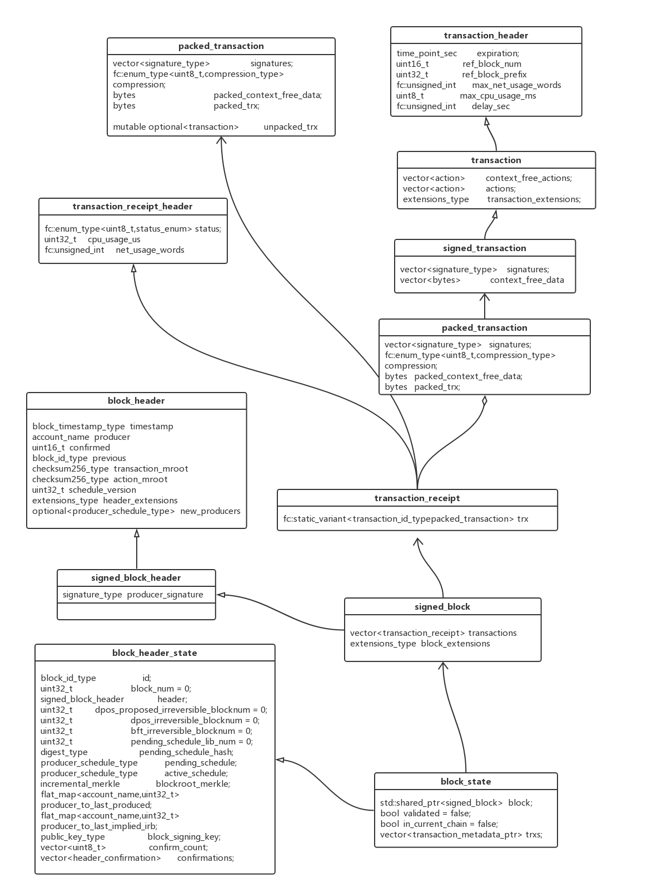

# EOS Block Data Structure


## 整体数据结构定义图

我们先来看一张EOS整体的数据结构定义图



从这个图上可以看出来，EOS在区块数据结构的定义上并不是特别复杂.

## Block 定义

```c++
// ..../eos/libraries/chain/include/eosio/chain/block.hpp
struct signed_block : public signed_block_header {
   using signed_block_header::signed_block_header;
   signed_block() = default;
   signed_block( const signed_block_header& h ):signed_block_header(h){}

   // 交易集合
   vector<transaction_receipt>   transactions;
   extensions_type               block_extensions;
};
using signed_block_ptr = std::shared_ptr<signed_block>;

// ..../eos/libraries/chain/include/eosio/chain/types.hpp
typedef vector<std::pair<uint16_t,vector<char>>> extensions_type;
```

Block的定义使用的是signed_block struct，这个struct是从signed_block_header继承而来的，在这个结构体中的关键部分是包含了Transaction的vector。区块是由按顺序组织的交易来构成的集合。

block_extensions则定义了一系列的扩展信息，这些信息都由一个整数类型的code来定义，需要的时候，都可以根据这个整数code来解析相应的信息。

在这个结构体中包含的transaction都是使用transaction_receipt结构体，这个结构体又是从transaction_receipt_header继承而来，下面我们看看这个两个struct的定义。

```c++
// ..../eos/libraries/chain/include/eosio/chain/block.hpp
struct transaction_receipt_header {
   // 定义交易状态的枚举类型
   enum status_enum {
      // 这个表示执行成功（所以不需要执行出错逻辑）
      executed  = 0,
      // 客观的来说，执行失败了（或者没有执行），某一个出错逻辑执行了
      soft_fail = 1,
      // 执行失败了，并且执行的出错逻辑也失败了，所以并没有状态改变
      hard_fail = 2,
      // 交易被延迟了，计划到未来的某个时间执行
      delayed   = 3,
      // 交易过期了，并且存储空间返还给用户
      expired   = 4  ///< transaction expired and storage space refuned to user
   };

   // 状态数据
   fc::enum_type<uint8_t,status_enum>   status;
   // CPU使用情况
   uint32_t                             cpu_usage_us;
   // 网络使用情况
   fc::unsigned_int                     net_usage_words;
};

struct transaction_receipt : public transaction_receipt_header {
   fc::static_variant<transaction_id_type, packed_transaction> trx;
};
```

transaction_receipt结构体主要包含了一个打包过的交易以及其对应的交易类型。其parent struct transaction_receipt_header则主要是记录了这个交易的状态信息，以及CPU和网络的使用情况。当一笔交易被某个区块引用时，区块生产者针对这笔交易会做出相应的操作，而操作的不同结果会导致这笔交易的不同状态.

packed_transaction，顾名思义，就是把交易数据打包了，这个结构体里面还定义了，打包数据是否经过了压缩的标识信息，

```c++
// ..../eos/libraries/chain/include/eosio/chain/transaction.hpp
struct packed_transaction {
   // 定义打包数据是否压缩的枚举类型
   enum compression_type {
      // 没有压缩
      none = 0,
      // 使用zlib压缩
      zlib = 1,
   };

   // 签名信息
   vector<signature_type>                  signatures;
   // 是否压缩的标识信息
   fc::enum_type<uint8_t,compression_type> compression;
   // 上下文无关的信息
   bytes                                   packed_context_free_data;
   // 打包后的交易数据
   bytes                                   packed_trx;
}
```

packed_transaction中打包的数据来自于signed_transaction结构体，这个结构体的主要作用就是对交易做签名。

signed_transaction又是从transaction结构体继承而来，一个transaction结构体的实例包含一系列的action，这些action要么全部成功，要么全部失败。

交易ID是通过对交易内容本身经过Hash运算得出，所以每个交易的ID是与其内容一一对应的。交易的主体是由操作构成的。一个交易在纳入区块之前必须含有签名，用以验证交易的合法性。

延迟型交易

交易分为两种类型：一种是账户发起的普通交易，一种是由代码生成的自动交易，自动交易可以设置一个延迟时间，这样的交易叫延迟型交易，这种交易不会立即被执行，而是等到设定时间到时才会被执行。


```c++
// ..../eos/libraries/chain/include/eosio/chain/transaction.hpp
struct signed_transaction : public transaction
{
	// 签名信息
	 vector<signature_type>    signatures;
	 // 上下文无关的数据
	 vector<bytes>             context_free_data;
};

struct transaction : public transaction_header {
	 // 上下文无关的action
	 vector<action>         context_free_actions;
	 // 交易操作
	 vector<action>         actions;
	 // 交易扩展类型
	 extensions_type        transaction_extensions;
}
```

transaction_header结构体包含了与每一个交易相关联的固定大小的数据，这些数据从具体的交易数据中分离出来，可以在需要的时候，帮助解析交易数据，而不再需要更多的动态内存分配。

所有的交易都有一个期限，这个期限限定了一个交易必须在规定时间内被纳入区块链，如果我们发现一个交易的时限已经过去，就可以放心的放弃这个交易，因为所有生产者都不会将它纳入任何区块。


```c++
// ..../eos/libraries/chain/include/eosio/chain/transaction.hpp
struct transaction_header {
	 // 这个交易的过期时间
	 time_point_sec         expiration;
	 // 在最后的2^16 blocks中指定一个具体的block number
	 uint16_t               ref_block_num       = 0U;
	 // 在指定的get_ref_blocknum的blockid中取低位的32bit
	 uint32_t               ref_block_prefix    = 0UL;
	 // 最大的网络带块
	 fc::unsigned_int       max_net_usage_words = 0UL;
	 // 最大的CPU使用
	 uint8_t                max_cpu_usage_ms    = 0;
	 // 这个交易的延期时间
	 fc::unsigned_int       delay_sec           = 0UL;
}
```


signed_block结构体是从signed_block_header继承而来的，这个signed_block_header结构体只是包含了一条数据，那就是producer的签名。

signed_block_header结构体又是从block_header继承而来的，这个结构体就包含了一个block中很多重要的数据，包括，时间戳，producer的名字，所有交易的merkle root，所有action的root等信息。

```c++
// ..../eos/libraries/chain/include/eosio/chain/block_header.hpp
struct block_header
{
	 block_timestamp_type             timestamp;
	 account_name                     producer;
	 uint16_t                         confirmed = 1;  

	 block_id_type                    previous;

	 checksum256_type                 transaction_mroot;
	 checksum256_type                 action_mroot;

	 uint32_t                          schedule_version = 0;
	 optional<producer_schedule_type>  new_producers;
	 extensions_type                   header_extensions;
};

struct signed_block_header : public block_header
{
	 signature_type    producer_signature;
};
```

## Action（操作）

在前面的transaction结构体中，我们看到包含了有action，这里我们对action做一下说明。

我们先看看action的数据结构定义：

```c++
// ..../eos/contracts/eosiolib/action.hpp
struct action {
   // 账户：操作的来源
   account_name               account;
   // 名称：操作的标识
   action_name                name;
   // 授权：执行操作的许可列表
   vector<permission_level>   authorization;
   // 数据：执行操作需要用到的信息
   bytes                      data;
}
```

EOS区块链中的交易是由一个个操作（action）组成的，操作可以理解成一个能够更改区块链全局状态的方法，操作的顺序是确定的，一个交易内的操作要么全部执行成功，要么都不执行，这与交易的本意是一致的。操作是区块链的最底层逻辑，相当于区块链这个大脑的神经元，区块链的智能最终也是通过一个个操作的组合来实现的。

#### 操作的设计原则

- 独立原则 操作本身须包含足以解释操作含义的信息，而不需要依赖区块链提供的上下文信息来帮助解释。所以，即便一个操作的当前状态可以通过区块链上的数据推导得出，我们也需要将状态信息纳入操作数据中，以便每个操作是容易理解的。这个原则体现的是区块的可解释性，这一点非常重要，这个底层的设计原则将影响整个区块链的使用效率
- 余额可计算原则 一个账户当前的余额计算，仅仅依赖于与这个账户相关的信息便可得出，而不需要解析整个区块链才能获得。这个原则针对的是比特币的设计，由于比特币的余额计算需要扫描区块链中的所有交易才能精准的计算出一个账户的余额，这使得一个非常基础的计算落地起来都变得相当繁琐，EOS的这个设计目的在于提升运算效率。
- 明确费用原则 区块链的交易费用随时间变化而变化，所以，一个签名过的交易须明确的认同这个交易所需要支付的费用，这个费用是在交易形成之前就已经设定并且明确好了的，这一点也非常重要，因为明确的费用协议才能保证余额的正确计算。
- 明确授权原则 每个操作须包含足够的授权信息以标明是哪一个账户拥有授权这个操作的权力，这种明确授权的设计思路带来几个好处：
  - 便于集中管理
  - 可以优化授权管理
  - 便于并行处理
- 关联账户原则 每个操作须包含足够的关联账户信息，以保证这个操作能够遍历所有相关联的账户，也就是这个操作能够影响的所有账户，这个原则的目的同样是为了确保账户的余额能够得到及时和准确的运算

#### 操作的来源

一个操作可以通过两种途径产生：
- 由一个账号产生，通过签名来授权，即显性方式。
- 由代码生成，即隐形方式。


操作的设计遵循React Flux设计模式，就是每一个操作将会被赋予一个名称，然后被分发给一个或者多个handler。在EOS环境中，每个操作对应的handler是通过scope和name来定义的，默认的handler也可以再次将操作分发给下一级的多个handler。所以，每个EOS应用可以实现自己的handler，当操作被分发到这个应用时，相应的handler的代码就会被执行。

操作的设计思路中另一重要概念是授权。每一个操作的执行都必须确保具备了指定账户的授权。授权通过许可(permission)的方式声明，对于一个授权动作，账户可以要求任意数量的许可，许可的验证是独立于代码执行的，只有所有规定的许可被成功验证之后，对应的代码才能够被执行。安全特性深深的嵌入了区块链的底层设计逻辑，同时又不让安全机制成为性能和结构的累赘，让它自成体系，独立管理。


## 区块的存储 - 区块日志

区块日志是存储区块的二进制文件，区块日志的特性是只能从末尾追加(append only)，区块日志包含两类文件：

#### 区块文件，结构如下：
+---------+----------------+---------+----------------+-----+------------+-------------------+

| Block 1 | Pos of Block 1 | Block 2 | Pos of Block 2 | ... | Head Block | Pos of Head Block |

+---------+----------------+---------+----------------+-----+------------+-------------------+

区块文件包含区块的内容以及每个区块的位置信息。区块位置信息是固定的8字节宽度，这样便于在连续读取区块的时候，按照读一个区块，向后跳跃8个字节，读一个区块，向后跳跃8个字节的模式快速加载区块内容。

#### 索引文件，结构如下：
+----------------+----------------+-----+-------------------+

| Pos of Block 1 | Pos of Block 2 | ... | Pos of Head Block |

+----------------+----------------+-----+-------------------+

区块索引的目的在于提供一个基于区块序号的快速随机搜索方法，使用索引文件可以快速定位目标区块在区块文件中的具体位置。索引文件不是必须的，没有索引文件区块链仍然可以运行，索引文件的主要作用是通过少量空间换取速度提升。索引文件可以通过顺序读取区块文件来重新构建。
