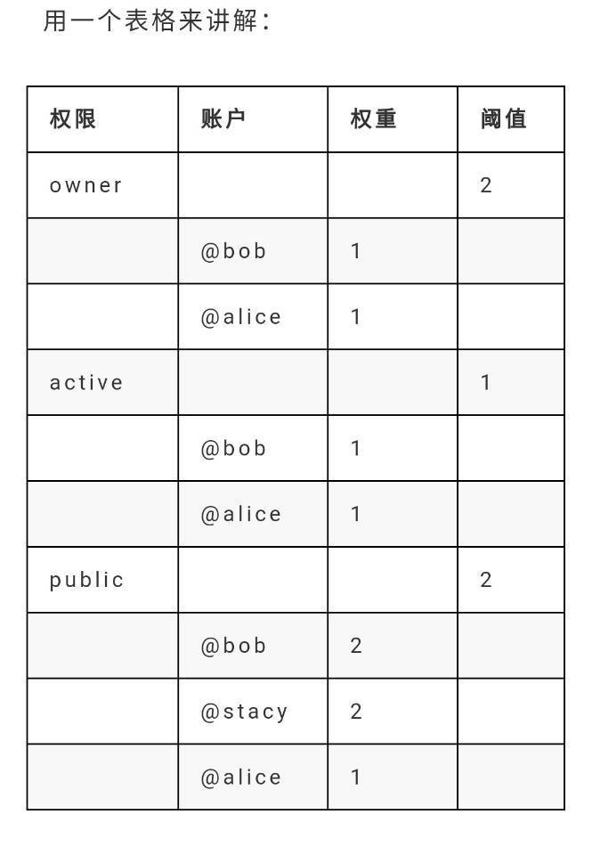

# eos源码分析之七钱包和帐户

## 一、EOS的钱包帐户
EOS的钱包其实主要就是管理密钥对，因为他不负责产生地址，也就是说，不会像以前的以太坊或者比特币，要通过密钥来产生钱包地址。它主要是提供对帐户的签名管理，也就是前面说的签名需要的密钥进行管理。
EOS使用是非UTXO机制，即帐户机制，这点和以太坊相同，但是他们又有不同之处，EOS为了使用安全方便，引入了权限和角色的功能。通过不同的帐户和私钥进行组合，可以达到创建不同的权限的帐户动作。举一个例子，你可以把你自己的帐户处理动作分配给任意的人，那么那个人就拥有了你的所有的帐户动作，但是它仍然是使用自己的密钥对来对你分配的动作进行签名。
要创建帐户，首先要创建钱包，因为创建帐户需要创建钱包时产生的密钥对。
</br>

``` c++
//创建钱包
string wallet_name = "default";
auto createWallet = wallet->add_subcommand("create", localized("Create a new wallet locally"), false);
createWallet->add_option("-n,--name", wallet_name, localized("The name of the new wallet"), true);
createWallet->set_callback([&wallet_name] {
   // wait for keosd to come up
   try_port(uint16_t(std::stoi(parse_url(wallet_url).port)), 2000);

   const auto& v = call(wallet_url, wallet_create, wallet_name);
   std::cout << localized("Creating wallet: ${wallet_name}", ("wallet_name", wallet_name)) << std::endl;
   std::cout << localized("Save password to use in the future to unlock this wallet.") << std::endl;
   std::cout << localized("Without password imported keys will not be retrievable.") << std::endl;
   std::cout << fc::json::to_pretty_string(v) << std::endl;
});
//因为创建帐户需要创建钱包时产生的密钥对   
// create key
   create->add_subcommand("key", localized("Create a new keypair and print the public and private keys"))->set_callback( [](){
      auto pk    = private_key_type::generate();
      auto privs = string(pk);
      auto pubs  = string(pk.get_public_key());
      std::cout << localized("Private key: ${key}", ("key",  privs) ) << std::endl;
      std::cout << localized("Public key: ${key}", ("key", pubs ) ) << std::endl;
   });
//创建帐户
struct create_account_subcommand {
   string creator;
   string account_name;
   string owner_key_str;
   string active_key_str;
   string stake_net;
   string stake_cpu;
   uint32_t buy_ram_bytes_in_kbytes = 0;
   string buy_ram_eos;
   bool transfer;
   bool simple;

   create_account_subcommand(CLI::App* actionRoot, bool s) : simple(s) {
      auto createAccount = actionRoot->add_subcommand( (simple ? "account" : "newaccount"), localized("Create an account, buy ram, stake for bandwidth for the account"));
      createAccount->add_option("creator", creator, localized("The name of the account creating the new account"))->required();
      createAccount->add_option("name", account_name, localized("The name of the new account"))->required();
      //这里需要两个KEY
      createAccount->add_option("OwnerKey", owner_key_str, localized("The owner public key for the new account"))->required();
      createAccount->add_option("ActiveKey", active_key_str, localized("The active public key for the new account"));

......

      add_standard_transaction_options(createAccount);

      createAccount->set_callback([this] {
            if( !active_key_str.size() )
               active_key_str = owner_key_str;
            public_key_type owner_key, active_key;
            try {
               owner_key = public_key_type(owner_key_str);
            } EOS_RETHROW_EXCEPTIONS(public_key_type_exception, "Invalid owner public key: ${public_key}", ("public_key", owner_key_str));
            try {
               active_key = public_key_type(active_key_str);
            } EOS_RETHROW_EXCEPTIONS(public_key_type_exception, "Invalid active public key: ${public_key}", ("public_key", active_key_str));
            auto create = create_newaccount(creator, account_name, owner_key, active_key);//创建一个帐户
.......
      });
   }
};
chain::action create_newaccount(const name& creator, const name& newaccount, public_key_type owner, public_key_type active) {
   return action {
      tx_permission.empty() ? vector<chain::permission_level>{{creator,config::active_name}} : get_account_permissions(tx_permission),
      eosio::chain::newaccount{//调用帐户创建
         .creator      = creator,
         .name         = newaccount,
         .owner        = eosio::chain::authority{1, {{owner, 1}}, {}},
         .active       = eosio::chain::authority{1, {{active, 1}}, {}}
      }
   };
}
```
</br>
整体的步骤来说就是创建钱包，创建密钥，导入密钥到钱包，由密钥来创建帐户。看代码中还有一个直接在钱包中创建密钥的命令。
</br>
旧的帐户的管理在插件account_history_plugin中。它提供了一个接口插件account_history_api_plugin用来更方便的管理帐户的历史记录。同样，在历史记录的类管理里中，使用了account_history_plugin_impl类来真正提供历史记录的控制。
</br>
但是在新的版本中，用history_plugin替代了它，相应的接口也替换成了history_api_plugin.这里面主要涉及到了以下几个类（排除api接口类）：history_plugin_impl,这个类是真正的操作数据的类，所有的关于历史记录的动作，最终都要落在这个类中。history_plugin是插件增加的实体类，是调用history_plugin_impl的入口点。read_only类是真正处理数据的类。
</br>
这里看一个帐户的交易记录读取：
</br>

``` c++
read_only::get_transaction_result read_only::get_transaction( const read_only::get_transaction_params& p )const {
   auto& chain = history->chain_plug->chain();//获得当前指定的Controller

   get_transaction_result result;

   result.id = p.id;
   result.last_irreversible_block = chain.last_irreversible_block_num();

   const auto& db = chain.db();//获得当前数据库的句柄

   //得到并处理multiindex的结果
   const auto& idx = db.get_index<action_history_index, by_trx_id>();
   auto itr = idx.lower_bound( boost::make_tuple(p.id) );
   if( itr == idx.end() ) {
      return result;
   }
   result.id         = itr->trx_id;
   result.block_num  = itr->block_num;
   result.block_time = itr->block_time;

   if( fc::variant(result.id).as_string().substr(0,8) != fc::variant(p.id).as_string().substr(0,8) )
      return result;

   //处理事务action内容
   while( itr != idx.end() && itr->trx_id == result.id ) {

     fc::datastream<const char*> ds( itr->packed_action_trace.data(), itr->packed_action_trace.size() );
     action_trace t;
     fc::raw::unpack( ds, t );
     result.traces.emplace_back( chain.to_variant_with_abi(t) );

     ++itr;
   }

   //处理块
   auto blk = chain.fetch_block_by_number( result.block_num );
   if( blk == nullptr ) { // still in pending
       auto blk_state = chain.pending_block_state();
       if( blk_state != nullptr ) {
           blk = blk_state->block;
       }
   }
   //得到交易内容
   if( blk != nullptr ) {
       for (const auto &receipt: blk->transactions) {
           if (receipt.trx.contains<packed_transaction>()) {
               auto &pt = receipt.trx.get<packed_transaction>();
               auto mtrx = transaction_metadata(pt);
               if (mtrx.id == result.id) {
                   fc::mutable_variant_object r("receipt", receipt);
                   r("trx", chain.to_variant_with_abi(mtrx.trx));
                   result.trx = move(r);
                   break;
               }
           } else {
               auto &id = receipt.trx.get<transaction_id_type>();
               if (id == result.id) {
                   fc::mutable_variant_object r("receipt", receipt);
                   result.trx = move(r);
                   break;
               }
           }
       }
   }

   return result;
}

//chainbase.hpp

template<typename MultiIndexType>
const generic_index<MultiIndexType>& get_index()const
{
   CHAINBASE_REQUIRE_READ_LOCK("get_index", typename MultiIndexType::value_type);
   typedef generic_index<MultiIndexType> index_type;
   typedef index_type*                   index_type_ptr;
   assert( \_index_map.size() > index_type::value_type::type_id );
   assert( \_index_map[index_type::value_type::type_id] );
   return *index_type_ptr( \_index_map[index_type::value_type::type_id]->get() );//返回一个multiindex的容器指针
}
```
</br>
这个函数会在history_api_plugin.cpp中由:
</br>

``` c++
void history_api_plugin::plugin_startup() {
   ilog( "starting history_api_plugin" );
   auto ro_api = app().get_plugin<history_plugin>().get_read_only_api();
   //auto rw_api = app().get_plugin<history_plugin>().get_read_write_api();

   app().get_plugin<http_plugin>().add_api({
//      CHAIN_RO_CALL(get_transaction),
      CHAIN_RO_CALL(get_actions),
      CHAIN_RO_CALL(get_transaction),
      CHAIN_RO_CALL(get_key_accounts),
      CHAIN_RO_CALL(get_controlled_accounts)
   });
}
```
</br>
提供HTTP的调用，并封装成JSON格式回传给相关调用方。
</br>

## 二、帐户的权限和角色
</br>
</br>
在前边创建帐户时提到了owner 和 active，它们的权限分别有一个值为1的阈值。owner 和 active 所绑定的 公钥 , 则分别有一个值为1的权重。阈值和权重是什么呢？
</br>
阈值是指操作的最小权限，而权重指权限量。简单的说明一下，比如打开保险柜的阈值是3，然后有三个角色权重：1，2，3.则3权重的可以自己直接打开。2和1权重的需要向其它两个角色申请，当权重总和>=3时，才可以打开。
</br>
owner是自己的根本权限，可以用来授权给别人的权限。而active是被授予的相关的权限。网上举得例子比较好理解：
</br>
owner这个权限比作一扇门，打开这扇门需要一把正确的钥匙。 而 owner 所绑定的那个公钥 对应的那把私钥 就是正确的钥匙。那么二者到底有什么具体的关系和内容呢？
</br>
owner:啥都能干，还可以做冷备份。
</br>
active:除了不能修改owner之外的所有权限。其它所有的权限都是基于active产生出来的。
</br>
帐户的权限在EOS中功能相对来说是比较全的。在EOS中分为单签名帐户和多签名帐户。
</br>

### 1、单签名帐户
</br>
因此单签名账户就是权限的阈值和钥匙的权重都为1的一种账户类型。使用某个权限，只需要一把对应的私钥就行了.
</br>

``` c++
struct newaccount {
   account_name                     creator;
   account_name                     name;
   authority                        owner;
   authority                        active;
......
};
```
</br>


</br>
单签名其实好理解，其实就是一句话，自己的事情自己干，当然，如果你授权给了别人，别人也可以干，不过不用二者合作，一个即可。
</br>

### 2、多签名帐户
</br>
多签名帐户其实就是一个权限绑定了多个帐户或者公钥。要想使用一个权限得需要大于1个以上的签名了。
</br>


</br>
还是举一个例子，比如有一个权限可以从帐户转走一笔钱，转钱的权限阈值设定为3，有三个角色bob,alice,joe,他们对应的权重为2，2，3.那么joe自己就可以直接操作转钱，而bob,alice由于权重不足，只能二者互相合作或者去向joe申请合作。
</br>
它对应到EOS的区块链上，其实就是对帐户的授权，比如某个智能合约需要权限才能操作，那么它会在执行前检查当前帐户的权限，如果不足，则直接退出。否则，完成。
</br>

### 3、密钥的恢复
</br>
在EOS中，有一个比较重要的特点就是被盗窃的密钥可以恢复，不会像比特币那样，密钥丢失后所有的一切都永远的消失在区块链中。不过恢复也不是没有条件的：
</br>
首先，使用任何30天内的owner权限的密钥和指定的合作伙伴才能恢复。
</br>
其次，合作伙伴不参成任何日常交易。合作伙伴其实就是指你的关联帐户。
</br>
最后，在恢复的过程中，也可以设置一些类似QQ的恢复机制中的问题机制。
</br>

## 三、签名的验证
</br>
既然前面提到了签名需要验证，分析一下验证的过程，从push_transcations中对比一下：
</br>

``` c++
void apply_context::schedule_deferred_transaction( const uint128_t& sender_id, account_name payer, transaction&& trx, bool replace_existing ) {
......

   if( !control.skip_auth_check() && !privileged ) { // Do not need to check authorization if replayng irreversible block or if contract is privileged
      if( payer != receiver ) {
         require_authorization(payer); /// uses payer's storage
      }

      // if a contract is deferring only actions to itself then there is no need
      // to check permissions, it could have done everything anyway.
      bool check_auth = false;
      for( const auto& act : trx.actions ) {
         if( act.account != receiver ) {
            check_auth = true;
            break;
         }
      }
      if( check_auth ) {
         control.get_authorization_manager()
                .check_authorization( trx.actions,
                                      {},
                                      {{receiver, config::eosio_code_name}},
                                      delay,
                                      std::bind(&transaction_context::checktime, &this->trx_context),
                                      false
                                    );
      }
   }

   uint32_t trx_size = 0;
   auto& d = control.db();
......

   trx_context.add_ram_usage( payer, (config::billable_size_v<generated_transaction_object> + trx_size) );
}

void apply_context::require_authorization(const account_name& account,
                                          const permission_name& permission) {
  for( uint32_t i=0; i < act.authorization.size(); i++ )
     if( act.authorization[i].actor == account ) {
        if( act.authorization[i].permission == permission ) {
           used_authorizations[i] = true;
           return;
        }
     }
  EOS_ASSERT( false, missing_auth_exception, "missing authority of ${account}/${permission}",
              ("account",account)("permission",permission) );
}

void
authorization_manager::check_authorization( const vector<action>&                actions,
                                            const flat_set<public_key_type>&     provided_keys,
                                            const flat_set<permission_level>&    provided_permissions,
                                            fc::microseconds                     provided_delay,
                                            const std::function<void()>&         \_checktime,
                                            bool                                 allow_unused_keys
                                          )const
{
   const auto& checktime = ( static_cast<bool>(\_checktime) ? \_checktime : \_noop_checktime );

   auto delay_max_limit = fc::seconds( \_control.get_global_properties().configuration.max_transaction_delay );

   auto effective_provided_delay =  (provided_delay >= delay_max_limit) ? fc::microseconds::maximum() : provided_delay;

   auto checker = make_auth_checker( [&](const permission_level& p){ return get_permission(p).auth; },
                                     \_control.get_global_properties().configuration.max_authority_depth,
                                     provided_keys,
                                     provided_permissions,
                                     effective_provided_delay,
                                     checktime
                                   );

   map<permission_level, fc::microseconds> permissions_to_satisfy;

   for( const auto& act : actions ) {
      bool special_case = false;
      fc::microseconds delay = effective_provided_delay;

      if( act.account == config::system_account_name ) {
         special_case = true;

         if( act.name == updateauth::get_name() ) {
            check_updateauth_authorization( act.data_as<updateauth>(), act.authorization );
         } else if( act.name == deleteauth::get_name() ) {
            check_deleteauth_authorization( act.data_as<deleteauth>(), act.authorization );
         } else if( act.name == linkauth::get_name() ) {
            check_linkauth_authorization( act.data_as<linkauth>(), act.authorization );
         } else if( act.name == unlinkauth::get_name() ) {
            check_unlinkauth_authorization( act.data_as<unlinkauth>(), act.authorization );
         } else if( act.name ==  canceldelay::get_name() ) {
            delay = std::max( delay, check_canceldelay_authorization(act.data_as<canceldelay>(), act.authorization) );
         } else {
            special_case = false;
         }
      }

      for( const auto& declared_auth : act.authorization ) {

         checktime();

         if( !special_case ) {
            auto min_permission_name = lookup_minimum_permission(declared_auth.actor, act.account, act.name);
            if( min_permission_name ) { // since special cases were already handled, it should only be false if the permission is eosio.any
               const auto& min_permission = get_permission({declared_auth.actor, \*min_permission_name});
               EOS_ASSERT( get_permission(declared_auth).satisfies( min_permission,
                                                                    \_db.get_index<permission_index>().indices() ),
                           irrelevant_auth_exception,
                           "action declares irrelevant authority '${auth}'; minimum authority is ${min}",
                           ("auth", declared_auth)("min", permission_level{min_permission.owner, min_permission.name}) );
            }
         }

         auto res = permissions_to_satisfy.emplace( declared_auth, delay );
         if( !res.second && res.first->second > delay) { // if the declared_auth was already in the map and with a higher delay
            res.first->second = delay;
         }
      }
   }

   // Now verify that all the declared authorizations are satisfied:

   // Although this can be made parallel (especially for input transactions) with the optimistic assumption that the
   // CPU limit is not reached, because of the CPU limit the protocol must officially specify a sequential algorithm
   // for checking the set of declared authorizations.
   // The permission_levels are traversed in ascending order, which is:
   // ascending order of the actor name with ties broken by ascending order of the permission name.
   for( const auto& p : permissions_to_satisfy ) {
      checktime(); // TODO: this should eventually move into authority_checker instead
      EOS_ASSERT( checker.satisfied( p.first, p.second ), unsatisfied_authorization,
                  "transaction declares authority '${auth}', "
                  "but does not have signatures for it under a provided delay of ${provided_delay} ms",
                  ("auth", p.first)("provided_delay", provided_delay.count()/1000)
                  ("delay_max_limit_ms", delay_max_limit.count()/1000)
                );

   }

   if( !allow_unused_keys ) {
      EOS_ASSERT( checker.all_keys_used(), tx_irrelevant_sig,
                  "transaction bears irrelevant signatures from these keys: ${keys}",
                  ("keys", checker.unused_keys()) );
   }
}
```
</br>
不过上面的英文注释很搞笑，说其实不必检查，这也是有谁没谁的了。在controller.cpp中push_transcation中也有类似的调用，可以对比分析。这样的情况下基本上帐户和钱包也就分析的差不多了。
</br>
