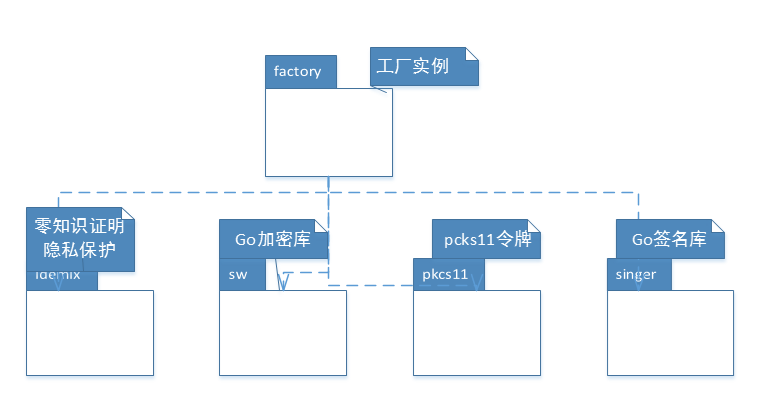
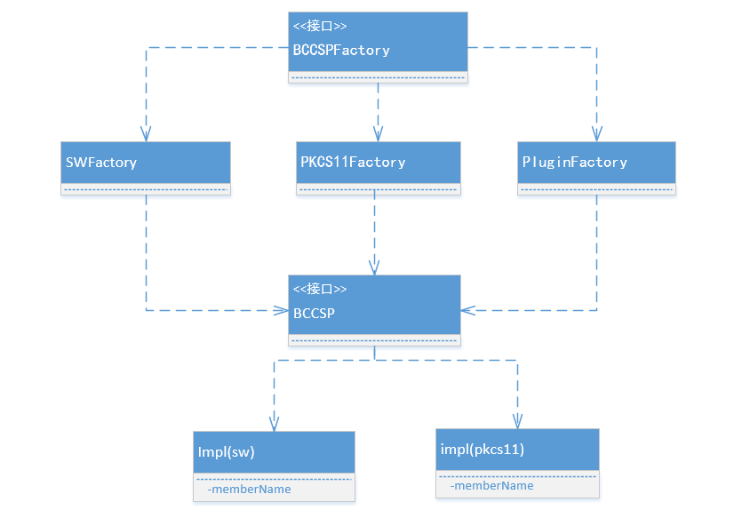

# fabric中使用国密（SMx）

## 一、fabric中的加密体系
### 1、整体架构
包的基本架构：
</br>


类的基本架构：
</br>




### 2、国密的接入
国密的接入在目前找到资料有两种解决方案，一种是完全在Fabric层面上解决，优势是形式简单，但证书部分可能需要单独处理。另外一种是直接修改Go的基础库，用国密的相关算法替换掉基础库中的相关实现。这个优势在于Fabric整体上不需要怎么改动。但缺点是丧失了移植性。

### 3、相关接口
工厂的相关接口：
</br>

```go
type BCCSP interface {

	// KeyGen generates a key using opts.
	KeyGen(opts KeyGenOpts) (k Key, err error)

	// KeyDeriv derives a key from k using opts.
	// The opts argument should be appropriate for the primitive used.
	KeyDeriv(k Key, opts KeyDerivOpts) (dk Key, err error)

	// KeyImport imports a key from its raw representation using opts.
	// The opts argument should be appropriate for the primitive used.
	KeyImport(raw interface{}, opts KeyImportOpts) (k Key, err error)

	// GetKey returns the key this CSP associates to
	// the Subject Key Identifier ski.
	GetKey(ski []byte) (k Key, err error)

	// Hash hashes messages msg using options opts.
	// If opts is nil, the default hash function will be used.
	Hash(msg []byte, opts HashOpts) (hash []byte, err error)

	// GetHash returns and instance of hash.Hash using options opts.
	// If opts is nil, the default hash function will be returned.
	GetHash(opts HashOpts) (h hash.Hash, err error)

	Sign(k Key, digest []byte, opts SignerOpts) (signature []byte, err error)

	// Verify verifies signature against key k and digest
	// The opts argument should be appropriate for the algorithm used.
	Verify(k Key, signature, digest []byte, opts SignerOpts) (valid bool, err error)

	// Encrypt encrypts plaintext using key k.
	// The opts argument should be appropriate for the algorithm used.
	Encrypt(k Key, plaintext []byte, opts EncrypterOpts) (ciphertext []byte, err error)

	// Decrypt decrypts ciphertext using key k.
	// The opts argument should be appropriate for the algorithm used.
	Decrypt(k Key, ciphertext []byte, opts DecrypterOpts) (plaintext []byte, err error)
}
```
</br>
执行类的具体接口：
</br>

```go
type KeyGenerator interface {
	// KeyGen generates a key using opts.
	KeyGen(opts bccsp.KeyGenOpts) (k bccsp.Key, err error)
}
// KeyDeriver is a BCCSP-like interface that provides key derivation algorithms
type KeyDeriver interface {
	KeyDeriv(k bccsp.Key, opts bccsp.KeyDerivOpts) (dk bccsp.Key, err error)
}
// KeyImporter is a BCCSP-like interface that provides key import algorithms
type KeyImporter interface {
	KeyImport(raw interface{}, opts bccsp.KeyImportOpts) (k bccsp.Key, err error)
}
// Encryptor is a BCCSP-like interface that provides encryption algorithms
type Encryptor interface {
	Encrypt(k bccsp.Key, plaintext []byte, opts bccsp.EncrypterOpts) (ciphertext []byte, err error)
}

// Decryptor is a BCCSP-like interface that provides decryption algorithms
type Decryptor interface {
	Decrypt(k bccsp.Key, ciphertext []byte, opts bccsp.DecrypterOpts) (plaintext []byte, err error)
}

// Signer is a BCCSP-like interface that provides signing algorithms
type Signer interface {

	Sign(k bccsp.Key, digest []byte, opts bccsp.SignerOpts) (signature []byte, err error)
}

// Verifier is a BCCSP-like interface that provides verifying algorithms
type Verifier interface {
	Verify(k bccsp.Key, signature, digest []byte, opts bccsp.SignerOpts) (valid bool, err error)
}

// Hasher is a BCCSP-like interface that provides hash algorithms
type Hasher interface {
	Hash(msg []byte, opts bccsp.HashOpts) (hash []byte, err error)
	GetHash(opts bccsp.HashOpts) (h hash.Hash, err error)
}
```
可以看到，为了保持一致性和解耦，两类接口的实现基本没有差别。

## 二、国密算法的介绍
### 1、国密算法的分类
国密算法即国家密码局认定的国产密码算法，主要有SM1（SCB2）、SM2、SM3、SM4、SM7、SM9、祖冲之密码算法（ZUC)，其中SM2,SM3,SM4三种算法是比较常接触到的。在密码学中，一般分为对称加密算法和非对称加密算法，国密的基本分类如下：
</br>
对称算法：SM1,SM4,SM7,ZUC（SM1,SM7算法不公开）
</br>
非对称算法：S2,S9是非对称算法
</br>
哈希算法：SM3
</br>
### 2、国密算法及应用
SM1算法：分组密钥算法，分组长度是128位。密钥长度也是128位。以IP核的形式存在于芯片中。它主要应用于需要智能IC卡，加密卡等的电子政务和电子商务的环境中。（诸如公安、金融等）。
</br>
SM2算法：比较熟悉的椭圆曲线公钥密码算法，包括三部分：椭圆曲线数字签名算法SM2-1，椭圆曲线密钥交换协议SM2-2，椭圆曲线公钥加密算法SM2-3。算法使用的是ECC椭圆曲线密码机制，但在签名和密钥交换上不同于ECDSA、ECDH等国际标准，而是采用了更安全的方式（比如签名使用SM3的杂凑算法等），整体性能优于RSA算法。同时，其还推荐了一条256位的曲线做为标准曲线（曲线的使用会导致算法的安全性的强度，目前美国提供的几条曲线，很多密码专家怀疑有漏洞）。
</br>
SM3算法：密码杂凑算法。它主要在SM2,SM9中使用。其实就是常见的哈希和散列算法。应用范围主要是商用密码中的数字签名和验证以及随机数的生成。
</br>
SM4算法：分组加密算法，密钥长度和分组长度都是128位。采用32轮非线性迭代结构。它主要用于无线局域网产品。
</br>
SM7算法：分组密码算法，分组和密钥长度都是128位，适用于非接触式IC卡，比如门禁、一卡通等。
</br>
SM9算法：标识密码算法，主要是降低公开密钥系统中的密钥和证书管理的复杂性。使用用户的特征标识（如电邮、电话号码等）作为公钥，省略了交换数字证书和公钥的过程。它主要应用于端对端的离线安全通讯、云端数据的加密等等。
</br>
ZUC:祖冲之算法，中国自主的流密码算法，主要应用于移动通信4G网络中的加密。它分为三部分：祖冲之算法，加密算法和完整性算法。
</br>
国密相关的文档官方下载地址在文末，一个是国家标准公开下载的地址，一个是国家密码管理局相关地址，二者提供的是一致的。
</br>

## 三、国密算法的相关资料
在对国密算法库在Fabric中的应用进行调研后，发现，主流有三种情况，即直接用go语言完成密码库，或者在相关的版本上进行Patch，最后就是使用传统的c++/c来实现库。这种目前针对国密的硬件算法SM1居多。其中北京大学信息安全实验室的开源项目比较有名。
### 1、Go国密算法库
国密算法本身的实现比较流行的还是以c/c++为主，但是其它语言的也不少。其中Go语言的以苏州同济区块链研究院的国密算法库比较有影响。其地址见文末的相关说明。它同时提供了单独的Go国密算法库和直接用其替换的Fabric相关版本。
### 2、补丁算法库
其实说补丁算法库并没有什么特别意义，只是说应用的一种形式而已，类似于修改Linux内核后给出一个Patch。地址见文末。

### 3、c/c++算法库
北大的GsmSSL，是开源中国推荐的六大加密项目之一。但是它不是专门为Fabric开发的，应该是为SSL开发的。它的接口相当丰富，Go，Java等语言都有。具体地址见文末。

### 4、对比
使用Go的算法库的优势在于有完全开源并集成好的代码，进一步来讲，甚至可以直接使用其在国密基础上的Fabric，使用补丁也非常简单，但可能会产生版本的依赖的问题。使用c++相关的库，需要自己处理算法的Go和c的接口，同时对BCCSP中的相关的接口和框架流程也需要重新进行编写。所以在实际应用中要考虑具体的实际情况。

## 四、国密的应用

### 1、直接替换接口工厂
在上面的Fabric的加密体系分析中，在BCCSP中，实现了加密体系的模块化和接口化。最简单的替换方法就是直接将生成工厂内的原有的接口替换成新的SM系列算法，这样改动最小，但是可能会引起一些歧义。

### 2、实现接口工厂
如果想同时维护多套的密码体系，可以在BCCSP中重新定义一套加密体系的工厂类，继承并实现相关的加密接口，但是这样就需要修改整个Fabric中相关应用的代码。这样做的优势在于，清楚明了，便于同时维护多套密码系统。

## 五、分析总结
国密的SM系列算法在国内的一些重要的行业是必不可少的，这既是安全需要也是一种强制行为。针对Fabric在金融、司法等行业的应用，SM算法的引入是不可或缺的。Fabric在设计之初可能就考虑到了类似的问题，所以其加密系统接口的可插拔化设计是非常有前瞻性的，值得借鉴。
</br>
在这次的国密的相关资料调研整理过程中，将一些相关的国家标准文档及库的源码统一整理提交到Github的开源库中，供大家参考，地址见文末。

## 六、附属资料
本文件相关资源Github地址：
</br>
https://github.com/XChainLab/documentation/blob/master/fabric-bccsp/fabric%E4%B8%AD%E4%BD%BF%E7%94%A8%E5%9B%BD%E5%AF%86.md
</br>
国密系列《国家标准全文公开系统》地址：
</br>
http://www.gb688.cn/bzgk/gb/std_list_type?r=0.9349212631727359&p.p1=2&p.p2=SM4&p.p90=circulation_date&p.p91=desc
</br>
国家密码管理局相关：
</br>
http://www.oscca.gov.cn/sca/xxgk/bzgf.shtml
</br>
国密改造系列相关文章源码：
</br>
https://blog.csdn.net/dyj5841619/article/details/90670703
</br>
https://github.com/dddengyunjie/fabric
</br>
苏州同济区块链研究院相关文章源码：
</br>
https://www.cnblogs.com/laolieren/p/hyperledger_fabric_gm_summary.html
</br>
https://github.com/tjfoc/fabric-ca-gm
</br>
国密补丁方式文章源码：
</br>
https://www.blockchainbrother.com/article/19680
</br>
https://github.com/flyinox/fabric-sm-patch/blob/master/fabric-sm-patch
</br>
北京大学信息安全实验室的开源项目
</br>
https://github.com/guanzhi/GmSSL
</br>
