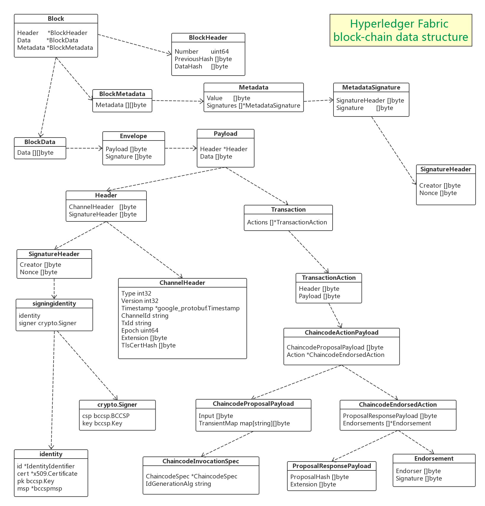

# Hyperledger Fabric Block Data Structure


## 前言
区块链上所有的一切都是围绕着数据处理来展开的，无论是架构设计，存储，加密/解密，共识，智能合约，账本，P2P，等等。而终极的数据就是存储在磁盘上的区块链数据。所以理解链上数据的结构对于完整理解一个平台的设计至关重要。这里我们就来解读一下Hyperledger Fabric的区块链数据结构。

## Protobuf
Protobuf是Google开发的一种用于数据交换和传输的数据格式，Fabric大量使用了Protobuf来做数据传输和存储，包括在内存中运行的数据也有很多是采用了Protobuf来做序列化，对于Protobuf这里不做详细介绍。下面是Protobuf在Github上的链接，这个是Golang版本的。

https://github.com/golang/protobuf

## 整体数据结构定义图

让我们先来看一张整体的数据结构定义图，以便有一个整体的概念



## Block 定义
Block是区块链数据结构里面的一个最基本的元素，其数据结构的定义位于下面这个Protobuf文件中，使用Protobuf格式定义，然后再使用protobuf工具生成golang的源文件

`<your/path>/fabric/protos/common/common.proto`  对应的golang源文件是：`<your/path>/fabric/protos/common/common.pb.go`

```go
type Block struct {
	Header   *BlockHeader
	Data     *BlockData
	Metadata *BlockMetadata
}
```
从这个结构体的定义可以看出，一个Block里面包含了三种类型的数据，
- Header，即区块头，这里又包含了三项数据，包括：
  - Number：Block Number，即区块号
  - PreviousHash：前一个区块头的hash值
  - DataHash：Data域的hash值，这里没有包含Metadata
- Data，即区块数据，这里包含的就是所有的Transaction数据
- Metadata，元数据，这里记录的是一些辅助信息，包括：
  - Metadata[BlockMetadataIndex_SIGNATURES]：签名信息
  - Metadata[BlockMetadataIndex_LAST_CONFIG]：Channel的最新配置区块索引
  - Metadata[BlockMetadataIndex_TRANSACTIONS_FILTER]：交易是否合法的标记
  - Metadata[BlockMetadataIndex_ORDERER]：Channel的排序服务信息

这里是BlockHeader结构体的定义，这里面的三项数据前面已经有说明了：
```go
type BlockHeader struct {
	Number       uint64
	PreviousHash []byte
	DataHash     []byte
}
```

这里是BlockMetadata的定义：
```go
type BlockMetadata struct {
	Metadata [][]byte
}
```
我们可以看到，BlockMetadata结构体中的Metadata域是一个byte类型的二维数组，而这个数据是由下面的Metadata结构体序列化而来的
```go
type Metadata struct {
	Value      []byte
	Signatures []*MetadataSignature
}
```
从这个定义中可以知道，元数据就是由一个value和相应的签名组成


### BlockData 定义
下面我们再来看一个Block中最核心的data部分的定义

这个结构体只有一个数据Data，又是一个byte类型的二维数组。和前面的Metadata一样，这个也是由另外一个数据结构序列化而来的。
```go
type BlockData struct {
	Data [][]byte
}

type Envelope struct {
	Payload []byte
	Signature []byte
}
```
在Envelope这个结构体中，Signature就是对Payload数据的签名，这个数据在网络中传输的时候，这个签名用于对数据做有效性验证。Payload本身又是由另外一个数据结构序列化而来的
```go
type Payload struct {
	Header *Header
	Data []byte
}
```
Payload，中文直译是负载的意思，也就是说具体承载交易数据。这里包含一个header，这个header带有类型，负责描述这个payload的性质以及如何解析data字段。
另外header中还包含有创建者的信息和一个随机数，以及用来标识逻辑时间窗口的时期信息，这个时间窗口数据用于抵御重放攻击。

同样，Header中的ChannelHeader字段是由一个ChannelHeader的结构序列化而来的。
```go
type Header struct {
	ChannelHeader   []byte
	SignatureHeader []byte
}

type ChannelHeader struct {
	Type int32
	Version int32
	Timestamp *google_protobuf.Timestamp
	ChannelId string
	TxId string
	Epoch uint64
	Extension []byte
	TlsCertHash []byte
}
```
* Type：ChannelHeader中的Type，定义了这个Payload包含的是那种类型的消息，其中，1~10000的数值定义由系统保留。目前有如下的类型定义：
	* MESSAGE = 0;                   // 不透明的消息类型
	* CONFIG = 1;                    // Channel配置消息
	* CONFIG_UPDATE = 2;             // Channel配置更新的交易
	* ENDORSER_TRANSACTION = 3;      // 客户端通过SDK向Endorser节点提交交易提案
	* ORDERER_TRANSACTION = 4;       // 排序节点内部使用
	* DELIVER_SEEK_INFO = 5;         // 用于指示Deliver API查找信息
	* CHAINCODE_PACKAGE = 6;         // 用户安装链码的时候打包链码组件
	* PEER_RESOURCE_UPDATE = 7;      // 用于peer资源更新的时候，对更新信息做编码


* Version：指定消息协议的版本号
* Timestamp：定义发件人发出消息时候的本地时间，这里使用了Google Protobuf框架里面定义的时间格式
* ChannelId：指定了这个消息是绑定在哪一个Channel上的。我们知道Fabric中定义了Multi Channel的概念，绑定到特定的Channel上面，意味着这个消息只能由这个特定的Channel处理，其他的Channel是不能查看这个消息的
* TxId：一个唯一的ID，通常由更高层设定，比如用户或者SDK。这个数据传递给背书节点的时候，背书节点会检查其唯一性。当消息被正确传递的时候，记账节点也会去检索这条消息，同时也会去检查其唯一性。最终，这个数据会被保存在账本中
* Epoch：这个数据基于区块的高度(区块号)来定义，指定了这条消息的时间窗口，只有在满足以下两个条件的情况下，目的节点才会接受这条消息：
	* 消息中指定的时间信息是当前时期
	* 在这一个时间段内，这条消息只出现了一次(预防重放攻击)
* Extension：根据header type，不同的特定消息会附加自己特定的扩展数据
* TlsCertHash：如果使用了共同TLS，则这个数据指示了客户端的TLS证书


### Transaction 定义
后续Transaction的定义则是在这个proto文件中，`<your/path>/fabric/protos/peer/transaction.proto`
对应的golang源文件是 `<your/path>/fabric/protos/peer/transaction.pb.go`

在Payload结构体中的Data，是由Transaction结构体序列化而来的，
```go
type Transaction struct {
	Actions []*TransactionAction
}
```
客户端发送到排序服务节点的数据就是由这个Transaction结构体定义的，一个Transaction结构又包含了一个或者多个TransactionAction数据。每一个TransactionAction数据就是一个交易提案，可能包含有多个Action。Transaction结构数据是原子性的，这就意味着，一条Transaction结构数据中包含的所有Action要么是全部被写入账本，要么是全部丢弃。这里需要注意的是：一条Transaction结构数据中可能会包含有多个Header，但是所有这些Header的Creator都必须是相同的，这也就意味着所有这些Action都是由同一个用户发起的。

一个单独的客户端可以提交一系列相互独立的提案，每一个提案都可以包含它自己的header和Payload(ChaincodeProposalPayload)。背书节点会对每一个提案单独做背书并且产生独立的Action

每一个独立的背书节点都会给Payload(ChaincodeProposalPayload)打上自己的签名，任意数量的提案以及这些提案包含的Action都可以打包到一条Transaction数据之中，当然这样的一条Transaction数据会被当做一条原子数据来处理。

Transaction结构体本身是由TransactionAction的数组组成
```go
type TransactionAction struct {
	Header []byte
	Payload []byte
}
```

这个结构体为每一个Action绑定了一个提案，在Header字段中的type指定了这个action的分类


这个结构体中的Payload具体类型则是由Header中的type定义的，它是ChaincodeActionPayload结构体的序列化数据
