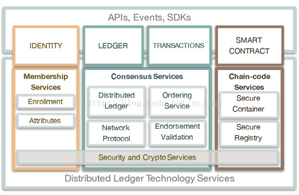
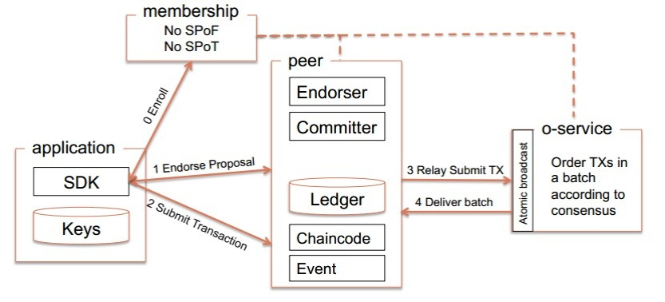
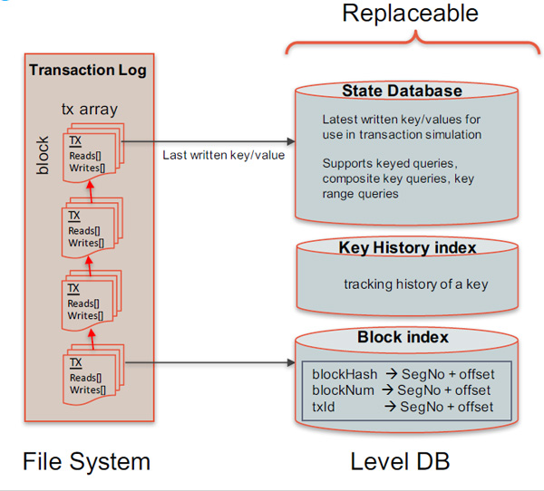
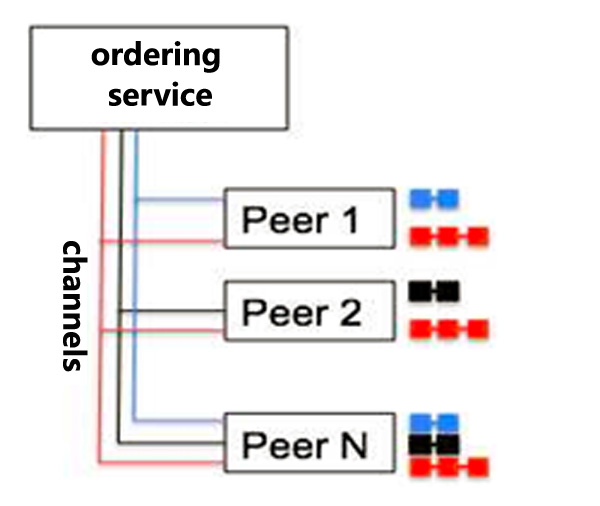

# Hyperledger Fabric 架构解析

## 前言
Hyperledger Project由Linux基金会创办于2015年10月，是一个开源的区块链研发孵化项目，致力于提供可协同开发以区块链为底层的分布式账本。旗下的Fabric项目目标为打造一个提供分布式账本解决方案的联盟链平台。

## Fabric 特点

##### 1. 完备的权限控制和安全保障

成员必须被许可才能加入网络，通过证书，加密，签名等手段保证安全。通过多通道功能，保证只有参与交易的节点能访问到数据，其他的节点看不到。满足数据保护方面的法律法规要求。如有些行业，需要知道谁访问了特定的数据。

##### 2. 模块化设计，可插拔架构

如状态数据库可采用Level DB或者Couch DB，或其他的key-value数据库。身份管理（identity management）可以采用自己的。共识机制和加密算法也是可插拔的，可以根据实际情况选择替换。

##### 3. 高性能，可扩展

Fabric采用模块化架构把交易处理划分为3个阶段：通过Chaincode进行分布式业务逻辑处理和协商(peers)；交易排序(orderders)；交易的验证和提交(committers)。这样划分带来的好处：不同的阶段由不同的节点角色参与，不需要全网的节点都参与。网络的性能和扩展性得到优化。Peer节点和Orderder节点可以独立扩展，并可以动态增加。

##### 4. 在不可更改的分布式账本上提供丰富的查询功能

可以在Level DB上进行按key查询，按复合KEY查询，按KEY的范围查询。如果采用Couch DB，Couch DB是文档数据库，数据是JSON格式的。除了支持按key查询，按复合KEY查询，按KEY的范围查询外，还支持全文搜索。

--------------------------

## 逻辑架构图

如下图所示，整体上来说，Fabric架构分为上下两层，
* 上面一层是应用层，是应用程序与Fabric进行交互的媒介，包括身份管理，账本处理，交易处理和智能合约
* 下面一层是核心的区块链实现，包括成员管理，共识服务，分布式账本，排序服务，P2P网络，链码服务，安全和加密服务等等

#### 一、应用层角度

##### IDENTITY(身份管理)
Fabric的设计目标是联盟链而不是公链，这个目标决定了Fabric在用户管理上和Bitcoin等公链有很大的不同。需要充分的考虑到商业应用对安全、隐私、监管、审计、性能等方面的需求，成员必须被许可才能加入网络。这个模块为整个区块链网络提供身份管理、隐私、保密和可审计的服务。

##### Ledger(账本管理)
应用程序对于账本的管理主要是两种类型，一种是数据的读取，另一种是数据写入。只有获得授权的用户才可以查询账本数据，并且有多种可以使用的查询方式，包括使用区块号查询区块，使用区块hash查询区块，使用交易ID查询交易。还可以根据Channel的名字查询区块链信息

##### Transactions(交易管理)
应用程序对于数据的写入，只能通过发起一个交易的方式来完成。Fabric SDK提供了相应的Interface，应用程序调用SDK接口，通过交易管理提交交易提案(Transaction Proposal)，应用程序收集到经过背书(Endorsement)之后的交易之后，通过广播发送给排序服务(Orderer)节点，经过排序之后，生成区块。

##### Smart Contract(智能合约)
Fabric的智能合约称为Chaincode(链码)，它处理网络成员所同意的业务逻辑。Fabric链码和底层账本是分开的，升级链码时并不需要迁移账本数据到新链码当中，实现了逻辑与数据的分离。

应用程序提交到区块链的Transaction，只能通过Chaincode执行，才能实现区块链的业务逻辑。只有Chaincode才能更新账本数据，其他模块都不能直接修改账本数据。

Chaincode可采用Go、Java、Node.js等语言编写。Chaincode被编译成一个独立的应用程序，然后这个Chaincode应用程序可以部署到Docker容器中运行。

#### 二、底层角度

##### Membership Service(成员管理服务)
MSP(Membership Service Provider)对成员管理进行了抽象，对应用层的身份管理提供服务。每个MSP都会建立根信任证书体系，验证用户提交请求的签名。通过公钥基础设施PKI和去中心化共识机制使得非许可的区块链变成许可制的区块链。

用户获取证书需要通过CA系统，可以使用第三方的CA认证系统，也可以使用Fabric-CA服务。CA系统负责用户注册，并管理用户身份证书，比如新增或者撤销。注册的证书又分为三种类型，注册证书(ECert)用于用户身份，交易证书(TCert)用于交易签名，TLS证书(TLS Cert)用于TLS数据传输。

##### Consensus Service(共识服务)
共识服务是区块链的核心组件，需要确保区块里面每一个交易数据的有效性和有序性，网络上不同节点之间数据的一致性。

共识机制由如下几个阶段组成：客户端向背书节点提交交易提案进行背书签名，背书节点把经过背书签名后的交易发送回客户端，客户端收集到足够数量的背书交易后把这些交易广播给排序服务节点，排序服务对交易进行排序并且产生区块(Block)，之后把这些区块广播给记账节点，记账节点在验证所有的交易和背书信息都有效之后把区块(Block)写入账本。

##### Chaincode Service(链码服务)
应用层的智能合约执行，需要依赖底层链码服务的实现。链码服务为智能合约提供安全的执行环境，确保执行过程的安全和用户数据的隔离，保证用户数据的私密性。Fabric采用Docker容器来管理和执行链码，提供安全的沙箱环境和镜像文件仓库。这有利于支持多种语言编写的链码，扩展性很好。

##### Security and Crypto Service(安全和加密服务)
安全问题是区块链的核心问题之一，对于企业级的联盟链更是重中之重。Fabric定义了一套BCCSP(Blockchain Cryptographic Service Provider)接口，可以根据这个接口来替换安全模块。在实现模块中，包含了密钥生成，Hash计算，签名以及验证签名，加密解密等等。

--------------------------
## 网络拓扑

如下图所示，Fabric 把运行时的网络切分成了多个不同的节点，节点是区块链上通信的主体，是一个逻辑概念。不同的节点可以运行在同一台物理机器上，也可以分散运行在不同的物理机器上。节点之间通过Gossip协议进行通信。节点类型包括：客户端、Peer节点、排序服务节点和CA节点

##### 客户端

客户端或者应用程序，代表了由最终用户操作的实体。它必须连接到某一个peer节点或者排序服务节点，才能与区块链网络通信。Fabric对于client端提供了SDK，让开发人员可以更容易地对接到区块链内的交易环节，交易的发起便是通过SDK进行。所有的通信信息都需要包含自己的签名，签名证书通过CA节点获得。客户端向Endorser节点提交交易提案并且从Endorser节点获取经过背书的交易，收集到足够多的交易之后，就广播给排序服务节点。

##### Peer节点
Peer节点是参与交易的主体，可以说是代表了每个参与到链上的成员，负责共识环节中的执行智能合约。包含两种类型的节点，背书节点(Endorser)和记账节点(Committer)，peer节点还存储了账本数据以及链码。

背书节点在接收到客户端的交易提案(Transaction Proposal)后，会验证交易签名，模拟执行交易，并且对结果执行签名背书，然后把经过背书的交易发送回客户端。背书节点是动态的角色，并且与具体的链码绑定，每个链码在实例化的时候都会设置背书策略，指定有效的交易背书需要由哪些节点完成。只有客户端向peer节点发起交易背书请求的时候，peer节点才是背书节点，其他时候只是一个普通的记账节点。只负责验证交易并且记账。

记账节点负责维护状态数据和账本。接收从排序服务发送过来的区块，首先会验证区块里面所有交易的有效性，还会验证所有的交易背书是否符合背书策略，最后把区块写入账本，更新状态数据库。

Peer节点有一种角色是主节点(Leader Peer)，负责和排序服务通信，从排序服务节点处获得最新的区块，并且同步给组织内的其他peer节点。主节点可以提前设置好，也可以在运行过程中由所有的peer节点动态选举产生。

peer节点的配置是非常灵活的，可以是一个单独的记账节点，可以同时是背书节点和记账节点，还可以同时背书节点、记账节点和主节点。

##### 排序服务节点
排序服务节点(Orderer)，主体功能便是对交易排序从而保证各Peer节点上的数据一致性，也包含了ACL进行访问控制。Orderer接收来自客户端的经过背书签名的交易，对还没有打包的交易进行排序并且打包生成区块，然后广播给peer节点。排序服务节点提供的是原子广播(Atomic Broadcast)，保证同一个链上的节点接收到的消息都是相同的，而且在顺序上也是一致的。

排序服务中提供了多通道(Multi-Channel)能力，多通道实现了数据的隔离，保证了只有在同一个通道内的peer节点才能访问通道内的数据，有效的保护的数据的隐私性。

目前Fabric使用了Kafka来对交易进行排序。Orderer节点在网络中起到代理作用，多个Orderer节点会连接到Kafka集群，利用Kafka的排序功能，完成对网络中交易的排序和打包成区块的工作。对于每个通道，Orderer节点将其映射到Kafka集群中的一个topic(topic名称与channelID相同)上。Orderer目前并没有使用Kafka Topic的多分区负载均衡特性，默认每个topic只创建了一个分区(0号分区)。

* 客户端通过gRPC连接发送交易信息到Orderer节点的Broadcast()接口。
* Orderer节点收到请求后，提取消息进行解析、检查，通过检查后封装为Kafka消息，通过Produce接口发送到Kakfa集群对应的topic分区中。当前消息数达到BatchSize.MaxMessageCount或消息尺寸过大，或超时时间达到BatchTimeout，则发送分块消息TTC-X到Kafka。
* Kafka集群维护多个topic分区。Kakfa通过共识算法来确保写入到分区后的消息的一致性。即一旦写入分区，任何Orderer节点看到的都是相同的消息队列。
* Orderer节点在启动后，还默认对本地账本对应的Kafka分区数据进行监听，不断从Kafka拉取(Consume)新的交易消息，并对消息进行处理。满足一定策略情况下(收到TTX-C或配置消息)还会将消息打包为区块。

##### CA节点
CA节点负责对加入链内的所有节点进行授权认证，包括上层的client端，每一个节点都有其颁发的证书用于交易流程中的身份识别。在上图中，Membership部分就代表了CA节点的功能。

对于一个隐私性要求较高的区块链网络，节点需要授权才可以加入区块链网络，并且节点可能存在不同角色，CA从中起到授权用户、签名传输数据的作用。由于CA在授权区块链网络中的重要作用，Fabric将CA作为一个模块独立出来，可以独立运行。使用中需要根据区块链网络的特性，使用CA签发的数字证书进行认证、加密传输数据、授权用户、管理用户证书等。

下图描述了CA在Fabric中的工作方式

从图中可以看出，CA 服务器结构为树形结构，整个树形结构的根节点为根CA(Root Server)，存在多个中间CA(Intermediate CA)，图中每个中间CA服务器上可以配置一个CA服务集群，CA服务集群通过前置的HAproxy实现负载均衡。

Fabric CA提供了两种访问方式调用Server服务，一种是通过Client调用，另一种是通过SDK调用。两种调用都是REST风格的。

--------------------------
## 账本

如下图所示，Fabric的账本数据包括以下几个部分：
* 区块链数据(Blockchain Data)
* 状态数据(State Database)
* 索引数据

##### 区块链数据(Blockchain Data)
区块链数据，又称为账本数据，就是我们通常所说的由一个一个的区块(Block)连接而成的链式数据结构。每一个区块中都存储有一条或一组有序的且不可篡改的记录。每个通道(channel)都有且仅有一个账本，在该通道(channel)中的每个加盟成员的对等点都维护同一份账本。

每一个区块包含三部分数据，区块头、交易数据和元数据。每一个区块头中又包含一个指向前一个区块头的Hash值，由此组成了一个完整的链(Chain)，这部分数据是直接保存在文件系统里面的。对于这个完整的链式数据结构，已经产生的数据是无法修改的，只能查询，当有新的区块生成时，就附加在链的末尾，从而这个链逐渐增长，最终形成一个完整的交易记录。

所有针对数据状态变更的请求都会生成有序且不可篡改的记录保存于区块链数据中。数据状态的变更是由所有参与方认可的智能合约调用事务的结果。每个事务都将产生一组Key/Value对，这些键值对作为创建、更新或删除等操作而同步到所有账本。

##### 状态数据(State Database)
状态数据，也称为世界状态(World State)，它不是链式数据结构的一部分，而是链式数据结构综合而成的一个结果。这部分数据是保存在Level DB数据库中的，是可以修改的。状态数据只是保存所有交易完成之后的最新结果，全部都是以Key/Value数据对的形式存在，并不会保存交易过程。当有新的交易产生的时候，peer节点会根据最新的交易信息修改状态数据库，以反映出交易的结果。当需要详细的交易记录的时候，就去区块链数据里面查询。

##### 索引数据
索引数据库是为了查询区块链数据的时候，可以快速定位，加快查询速度。在索引数据中，保存了两类数据，一类是对于每一个Key的历史记录的追踪信息，另一类是对于block的相关信息，包括区块hash，区块号，交易号等等。

--------------------------
## 多通道(Multi Channel)

通道是两个或多个特定网络成员之间的通信的私有“子网”，用于进行需要数据保密的交易。Channel由成员(组织)、每个成员的锚点、共享账本、链码应用程序和Order服务节点定义。网络上的每个Transaction都在一个Channel上执行，每个通信方必须经过身份验证并授权在该Channel上进行交易。加入Channel的每个peer都具有由成员服务提供商(MSP)给出的自己的身份。

要创建新的channel，客户端SDK会调用configuration system chaincode和引用属性，如锚点和成员(组织)。该请求为channel ledger创建一个genesis block，它存储有关channel的策略，成员和锚点的配置信息。当将新成员添加到现有channel时，这个genesis block或最近被重新配置的块将会分享给新成员。(具体可参阅configtx部分)

Channel中每个成员的Leading Peer的选举决定了哪个peer代表成员与Ordering Service进行通信。如果没有指定Leader，则可以使用算法来指定Leader。共识服务将交易排序并以一个Block的形式发送给一个Leader，然后Leader将其分发给其成员peer。

虽然任何一个锚点可以属于多个通道，并且因此维护多个账本，但没有账本数据可以从一个channel传递到另一个channel。账本按channel分隔，由configuration chaincode，identity membership service和gossip数据传播协议来定义和实现。被隔离的数据包括交易信息，账本状态和channel成员资料，这些数据仅限于在channel上具有可验证成员资格的peer间传播。通过信道隔离peer和账本数据，允许需要私有和机密事务的网络成员与同一个块链网络上的业务竞争对手和其他受限制的成员共存。

在上图中，一共有两个通道，

通道1(红色实线)：
包含的节点有：1.1，1.2，2.1，2.2    Leader节点：1.1，2.1

通道2(蓝色实线)：
包含的节点有：1.1，1.3，2.2，2.3，3.1，3.2，3.3

每一个通道，都是一个独立的区块链，因此上图包含两个链。

--------------------------
### 子账本

通道提供了一种通讯机制，将peer和orderer连接在一起，形成一个个具有保密性的通讯链路(虚拟)。在每一个通道中的数据都是与其他通道隔离的，并且数据会单独保存，由此形成了一个一个的子账本。从本质上来说，就是每一个通道都有一个独立的账本数据。账本可以被创建，并绑定到一个通道

在上图中，一个包含了三个通道，也就包含了三个独立的子账本

通道1(红色)：
包含的节点有：Peer 1，Peer 2，Peer N

通道2(黑色)：
包含的节点有：Peer 2，Peer N

通道3(蓝色)：
包含的节点有：Peer 1，Peer N

--------------------------
## 交易流程

下图所示为一个典型的Fabric交易流程

##### 1. 客户端构造交易提案(Transaction Proposal)

客户端应用程序利用任意SDK(Node.js，java，python)构造交易提案proposal。该提案是一个调用智能合约功能函数的请求，用来确认哪些数据可以读取或写入账本。交易提案中包含本次交易要调用的合约标识、合约方法和参数信息以及客户端签名等。SDK将交易提案打包为可识别的格式(如gRPC上的protocol buffer)，并使用用户的加密凭证为该交易提案生成唯一的签名。客户端把交易提案发送给一个或多个背书节点。

##### 2. 背书节点模拟执行交易

背书节点(Endorser)收到交易提案后，验证签名并确定提交者是否有权执行操作。背书节点将交易提案的参数作为输入，在当前状态KV数据库上执行交易，生成包含执行返回值、读操作集合和写操作集合的交易结果(此时不会更新账本)，这些值的集合、背书节点的签名和背书结果(YES/NO)作为提案的结果返回给客户端SDK，SDK解析这些信息判断是否应用于后续的交易。

##### 3. 客户端把交易发送到排序服务(Order Servvice)

应用程序使用SDK验证背书节点签名，并比较各节点返回的提案结果，判断提案结果是否一致以及是否参照指定的背书策略执行。客户端收到各个背书节点的应答后，打包到一起组成一个交易并签名，发送给Orderers。

##### 4. 共识排序，生成新区块

Orderers对接收到的交易进行排序，然后按照区块生成策略，将一批交易打包到一起，生成新的区块，调用deliver API投递消息，发送给提交节点。

##### 5. 更新账本
提交节点(Committer)收到区块后，会对区块中的每笔交易进行校验，检查交易依赖的输入输出是否符合当前区块链的状态，然后还要验证交易的背书是否符合相应的背书策略，所有的验证都通过之后，将区块追加到本地的区块链，并修改KV状态数据库。
