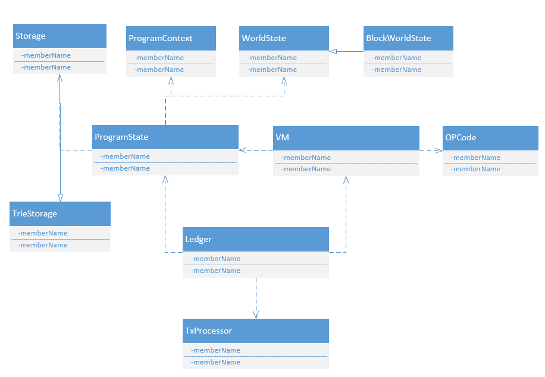
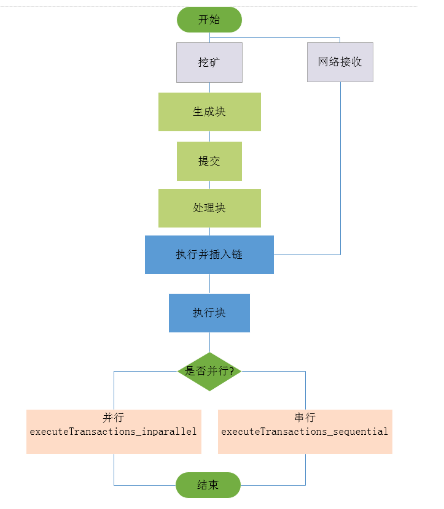
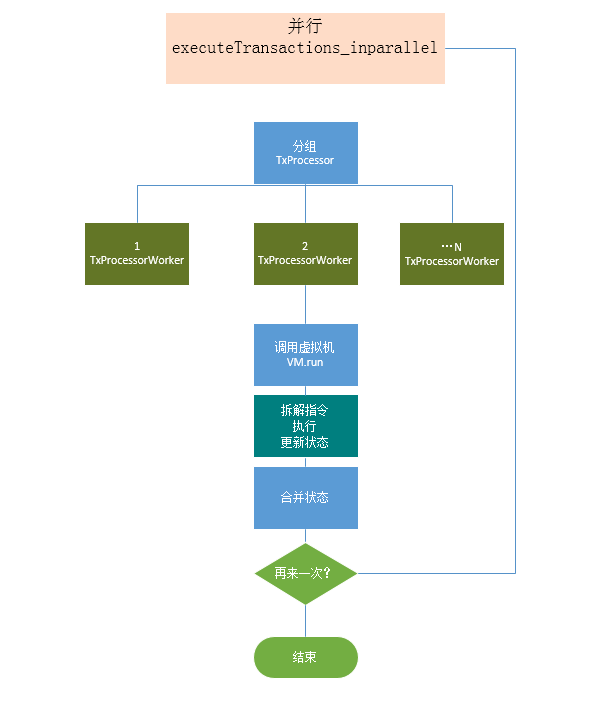

# khipu并行分析之一概述

## 一、介绍
khipu是用scala编写的一个初步的以太坊的优化产品，据其本人宣称速度还是有较大提高的，提高速度的原因是采用了并行交易，为了和星云链的并行交易进行对比，这里首先分析一下其并行的特点和效果。
 

## 二、主要特点

交易并行的限制在于三点：
 
1、相同帐户（地址）的原子控制。
 
2、相同帐户（地址）的数据stroage的并发。
 
3、相同帐户（地址）的EVM的OPCODE并发。
 
khipu解决的方法是进行的交易都从前一期区块的世界状态开始，并行运行，并在运行过程记录这三种竞态的状态。然后执行完成后，开始合并。合并过程对冲突进行判断，没有直接合并，反之则放到已经合并的世界状态于执行一次，然后再次合并世界状态 。使用区块哈希进行最后校验。如果有误，则放弃前面的并行方案，回退到原始位置串行交易。
 
其引入一个并行指标，来计算并行结果。其实际测试的结果是有百分之八十可以进行交行。根据安达尔定理，理想状态下，这样做可以五倍提高速度。
 

## 三、类图和流程

## 1、类图
主要的类图如下：
 

 
从上图可以看出，重点在
 

## 2、流程图
基本的流程图如下：
 

 
基本的并行的流程图如下：
 

 
从流程图中可以分析出，真正的并行，其实是在执行交易验证时，使用了future对map映射，通过TxProcessor来进行同时操作。
 

## 四、并行主体
在源码的分析中，基本可以看到以下几点：
 
1、在Ledger.scala文件中操作并行的主流程。包括启动验证，发起并行交易，初始状态的载入和最后状态的合并。
 
2、在VM中通过对指令的切分利用OpenCode来进行状态的更新。
 
3、通过WorldState(BlockWroldstate)等实现状态的保存和修改。
 
4、利用TxProcessor来完成单个交易的执行，换句话说，在1中的并行交易，最终要拆解到这里来执行。
 
5、并行交易只执行两次，如果未成功转成串行。
 

## 五、总结
通过对khipu的初步分析，在整体上看来，实现的步骤简单有效，当然，在内网中测试是什么情况，能不能达到和公网一样的效果，这个得看最后的实际测试情况。但是解决问题的方法还是值得借鉴的。
 
>
