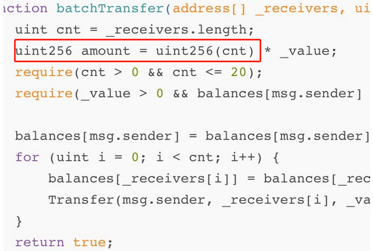
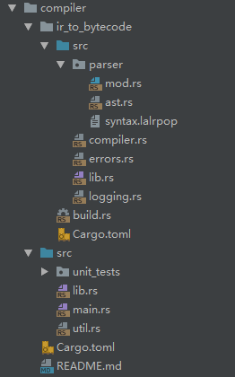
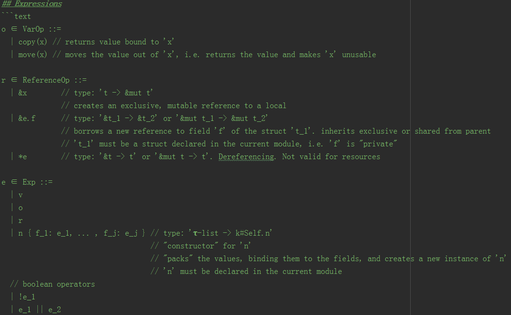
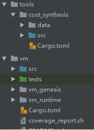

# MOVE语言的重点分析

## 一、MOVE语言的介绍
MOVE语言借鉴了相当一部分的RUST和c++中的编程的优秀部分，并结合智能合约编写的实际情况，创建了不同于以太坊和EOS的一种静态智能合约平台开发语言。它是facebook为其libra准备的智能合约的开发语言，它从语法层面和二进流的字节两个方向上都对合约的安全进行了有效的控制。不过，目前其正在发展过程中，许多提出的目标能否最终很好的实现，仍待观察。

## 二、安全层面的分析
1、与其它相关语言的对比
</br>
以太坊的solidity:新语言，语言的功能简单，语法简单，无法实现强大的功能。出现了很多语言级别的漏洞，比如溢出（最近的美图的漏洞）、超越栈深度（1024）、DAO等。
看一下例子：
```
//溢出
pragma solidity ^0.4.5;
contract Test {  
  //上溢出---直接归0
  function TestOF() returns (uint256 of) {     
    uint256 v = 2**256 - 1;     
    return v + 1;     
    } ​
    //下溢出
    function TestUF() returns (uint256 uf) {     
      uint256 v = 0;     
      return v - 1;     
      }
  }
```
如果在Remix的编译器中，会直接提出编译警告，有溢出的风险。如果在转帐过程中有类似的操作，可能就风险大多了，看一下美图的漏洞：
</br>


</br>
这个就是以太坊ERC-20智能合约BatchOverFlow数据溢出的漏洞,这和上面的溢出没有本质区别。当然，Solidity后来也提供了安全的数学库，算是亡羊补牢吧。
</br>
EOS:使用c++，入门较难，功能强大，虽然有相当多的一部分c++功能无法使用。所以用它写出来的智能合约，基本上语言层面的漏洞不多或者说基本不占主流（毕竟c++语言应用多年，好多坑都已经被踩了）。大多是逻辑或者链设计上的问题（比如回滚攻击，延迟攻击），但是这并不代表用c++写智能合约是多么完美。
看一下下面GITHUB上的一个例子：
</br>

```
//https://github.com/itleaks/eos-contract/blob/master/rollback-exp/rollback/rollback.cpp
class Rollback : public eosio::contract {
  public:
      using contract::contract;

      /// @abi action
      void dream(account_name who, asset value, string memo) {
            require_auth( _self );
            auto eos_token = eosio::token(N(eosio.token));
            //获得原始余额
            auto balance = eos_token.get_balance(_self, symbol_type(S(4, EOS)).name());
            //开始游戏，即转帐给游戏方
            action(
                permission_level{ _self, N(active) },
                N(eosio.token), N(transfer),
                std::make_tuple(_self, who, value, memo)
            ).send();
            //调用reality函数检测游戏结果，成功就得到奖励，否则回滚
            action(
                permission_level{ _self, N(active) },
                _self, N(reality),
                std::make_tuple(balance)
            ).send();
      }

      /// @abi action
      //通过新旧帐户余额的比较，判断是否中奖。
      void reality( asset data) {
            require_auth( _self );
            auto eos_token = eosio::token(N(eosio.token));
            auto newBalance = eos_token.get_balance(_self, symbol_type(S(4, EOS)).name());
            eosio_assert( newBalance.amount > data.amount, "bad day");
            // action(
            //     permission_level{ _self, N(active) },
            //     _self, N(test),
            //     std::make_tuple(newBalance)
            // ).send();
      }
};

EOSIO_ABI( Rollback, (dream)(reality))
```
</br>
所以说使用成熟的语言的好处是，语言级别的漏洞少而且很容易被开发人员发现和修改。
MOVE：使用了（线性类型）资源类型。再引入了c++中的move,copy的相似功能。安全控制住了资源的无序利用。从理论上讲，大大减少了语言级别上和部分逻辑上（比如资源的连续增减的逻辑二义性）的漏洞，看一下白皮书的例子：
</br>

```
module Currency {
resource Coin { value: u64 }
// ...
}
public deposit(payee: address, to_deposit: Coin) {
let to_deposit_value: u64 = Unpack<Coin>(move(to_deposit));
let coin_ref: &mut Coin = BorrowGlobal<Coin>(move(payee));
let coin_value_ref: &mut u64 = &mut move(coin_ref).value;
let coin_value: u64 = *move(coin_value_ref);
*move(coin_value_ref) = move(coin_value) + move(to_deposit_value);
}
public withdraw_from_sender(amount: u64): Coin {
let transaction_sender_address: address = GetTxnSenderAddress();
let coin_ref: &mut Coin = BorrowGlobal<Coin>(move(transaction_sender_address));
let coin_value_ref: &mut u64 = &mut move(coin_ref).value;
let coin_value: u64 = *move(coin_value_ref);
RejectUnless(copy(coin_value) >= copy(amount));
*move(coin_value_ref) = move(coin_value) - copy(amount);
let new_coin: Coin = Pack<Coin>(move(amount));
return move(new_coin);
}
```
</br>
首先通过抽象封装了对Coin的操作，使得对外是不可见的，资源的操作只能通过Currency来进行，而Coin做为资源，只能通过move来操作，而一旦move成功，就自然失去了对Coin的原来的所有权，这样就可以防止对Coin的反复操作，等同于从语法层面对资源重复操作进行了限制。可以通过Unpack和BorrowGlobal等内置的接口来对资源的操作进行限制，提高资源的安全性。通过这样一个接收款的两个函数过程，就可以比较清晰的看出MOVE语言对资源操作安全性要求的严格性。另外，它还提供了字节验证过程(Bytecode verifier)：
</br>

```rust
//!ResourceTransitiveChecker：对非资源字段中的资源字段的验证
pub fn verify(self) -> Vec<VerificationError> {
    let mut errors = vec![];
    for (idx, struct_def) in self.module_view.structs().enumerate() {
        let def_is_resource = struct_def.is_resource();
        if !def_is_resource {
            let mut fields = struct_def.fields();
            let any_resource_field = fields.any(|field| field.type_signature().is_resource());
            if any_resource_field {
                errors.push(VerificationError {
                    kind: IndexKind::StructDefinition,
                    idx,
                    err: VMStaticViolation::InvalidResourceField,
                });
            }
        }
    }
    errors
}
```
</br>
所以单纯从设计角度来看MOVE语言的安全性确实要比其它两个主流的合约语言考虑的多得多。但是，毕竟MOVE尚在迭代中，并且没有过实际的应用测试案例，其真正落地的效果，还不敢妄下断言。
</br>

2、形式化验证
</br>
常用的Coq可以进行形式化验证，它从更高级的抽象角度通过形式化验证机制来确保智能合约的安全性。在这点上，MOVE语言与其有异曲同式之妙，不同的是，MOVE语言更倾向于单独创建一个验证工具来验证安全性，而形式化验证直接就可以抽象到语言上进行操作。
</br>

3、安全控制
</br>
一般来说在安全控制方面可以从两个方面下手，一个是使用高级的语言（如DeepSEA等），从语法层次上增加大量的安全属性然后在编译器上进行验证；另外一种是使用低级语言，直接在运行时对安全属性进行检察。MOVE语言采取了一种折衷的态度，它使用了一种字节码（IR），然后使用字节码验证器对内存安全、存储安全和资源安全进行了验证。同时它使用了一些特性：抛弃了Dynamic Dispatch（动态分发）；静态语言并保持有限的可变性以及扩展的模块功能。
相对来说，经过这一系列的操作，完全可以可以使用独立的静态验证工具对合约进行有效的检查，确实也是如此，libra的官方也正在着手开发这样一款强大的工具。

## 三、MOVE语言的编译角度分析
在现代的编译器中，一个基本的发展方向是朝着分段式编译发展，目前主流的基本分为三段：前端编译，中部优化（IR）和后端转机器码。下面从这三个阶段来分析一下MOVE语言的现实情况，并窥测一下未来的发展。
</br>
1、前端编译
</br>
MOVE直接操作类似于IR的语言，所以目前来看其前端编译可以认为没有，至于以后会不会提供更高级的语言或者开发工具来转换，这要看以后的发展。
</br>
2、IR中间语言分析
</br>
使用IR的优势在于，如果能形成标准，以后任何语言从理论上都可以编译到IR，然后形成与平台或者硬件无关的开发。这点在LLVM出现后，引起了高度的重视，这个方向的发展也相当的迅速。MOVE语言之所以采用这咱类IR的语言方式，应该有也有这种想法。至少在以后朝这个方向完善时，付出的代价不会太大。
MOVE语言应该是牺牲了图灵完备性，特别是针对金融进行了优化（例如资源的使用）。在编译时的优化工作应该还有很大改善余地，毕竟MOVE还处在初始阶段。比如白皮书中提到的泛型、容器和事件等等。下面是编译器的文件组织：

</br>
在Parser目录下，mod.rs和ast.rs主要用来抽象语法树AST及其依赖的数据结构，在这个过程中，可以对一些基础的语法进行分析处理。这里利用lalr来生成一个解析器。采用的是Rust的一个开源框架LALRPOP（syntax.lalrpop：http://www.github.com/lalrpop/lalrpop）。
一般来说，编译器会使用词法分析器（lexer）和语法分析器（Parser）来处理输入的代码。词法分析器的构建一般会从正则到NFA，然后转到最小化DFA再到词法生成器的构建。但是MOVE方言的中低级性，应该对词法分析器的要求不高，相对语法分析器的工作量来说，语法分析器的工作量应该比词法分析器多一些。
在目前的编译器IR中间语言这一段是集中优化的区间，在LLVM的编译器中，会有一个HIR到MIR的过程，在这个过程中，可以调用LLVM的优化编译器opt进行优化，从而这一个阶段得到一个优化后的IR中间代码。
比如有两种常见的编译器的优化:一种是DCE，一种是常量优化。
</br>
看一下在MOVE中编译过程代码（三个主要文件mod.rs,ast.rs和compiler.rs）：
</br>

```rust
//mod.rs分析
//创建脚本
pub fn parse_script(script_str: &str) -> Result<ast::Script> {
    let stripped_string = &strip_comments(script_str);
    let parser = syntax::ScriptParser::new();
    match parser.parse(stripped_string) {
        Ok(script) => Ok(script),
        Err(e) => handle_error(e, script_str),
    }
}
//创建模块
pub fn parse_module(modules_str: &str) -> Result<ast::ModuleDefinition> {
    let stripped_string = &strip_comments(modules_str);
    let parser = syntax::ModuleParser::new();
    match parser.parse(stripped_string) {
        Ok(module) => Ok(module),
        Err(e) => handle_error(e, modules_str),
    }
}
//AST的生成：
//结构体类是否为资源类型的枚举声明
#[derive(Debug, PartialEq, Clone)]
pub enum Kind {
    /// `R`
    Resource,
    /// `V`
    Value,
}
//创建一个新的模块
impl ModuleDefinition {
    /// Creates a new `ModuleDefinition` from its string name, dependencies, structs+resources,
    /// and procedures
    /// Does not verify the correctness of any internal properties of its elements
    pub fn new(
        name: String,
        imports: Vec<ImportDefinition>,
        structs: Vec<StructDefinition>,
        functions: Vec<(FunctionName, Function)>,
    ) -> Self {
        ModuleDefinition {
            name: ModuleName::new(name),
            imports,
            structs,
            functions,
        }
    }
}
//函数和函数签名
impl FunctionSignature {
    /// Creates a new function signature from the parameters and the return types
    pub fn new(formals: Vec<(Var, Type)>, return_type: Vec<Type>) -> Self {
        FunctionSignature {
            formals,
            return_type,
        }
    }
}

impl Function {
    /// Creates a new function declaration from the components of the function
    /// See the declaration of the struct `Function` for more details
    pub fn new(
        visibility: FunctionVisibility,
        formals: Vec<(Var, Type)>,
        return_type: Vec<Type>,
        annotations: Vec<FunctionAnnotation>,
        body: FunctionBody,
    ) -> Self {
        let signature = FunctionSignature::new(formals, return_type);
        Function {
            visibility,
            signature,
            annotations,
            body,
        }
    }
}
//更多的细节可参看相关代码
```
</br>
语法分析器也即解析器，通过一系列的规则转换成AST（注意和CST的不同，CST是百分百和源码匹配的）。看上面代码比较复杂，看一个简单的例子：
</br>

```
function Demo(t) {
    return t;
}

//AST:是不是和WASM的文件有些相同
{
   type: "FunctionDeclaration",
   id: {
       type: "Identifier",
       name: "Demo"
   },
   params: [
      {
           type: "Identifier",
           name: "t"
      }
   ],
   ...
}
```
</br>
再来看一下这里语法的规则,先看一下代码中自带的一部分语法的说明：
</br>


</br>
再看一下提供的lalrpop的语法文件：
</br>

```
U64: u64 = <s:r"[0-9]+"> => u64::from_str(s).unwrap();
Name: String = <s:r"[a-zA-Z$_][a-zA-Z0-9$_]*"> => s.to_string();
ByteArray: ByteArray = {
    <s:r#"b"[0-9a-fA-F]*""#> => {
        ByteArray::new(hex::decode(&s[2..s.len()-1]).unwrap_or_else(|_| panic!("The string {:?} is not a valid hex-encoded byte array", s)))
    }
};
AccountAddress: AccountAddress = {
    < s: r"0[xX][0-9a-fA-F]+" > => {
        let mut hex_string = String::from(&s[2..]);
        if hex_string.len() % 2 != 0 {
            hex_string.insert(0, '0');
        }

        let mut result = hex::decode(hex_string.as_str()).unwrap();
        let len = result.len();
        if len < 32 {
            result.reverse();
            for i in len..32 {
                result.push(0);
            }
            result.reverse();
        }

        assert!(result.len() >= 32);
        AccountAddress::try_from(&result[..])
            .unwrap_or_else(|_| panic!("The address {:?} is of invalid length. Addresses are at most 32-bytes long", result))
    }
};
```
</br>
这部分代码是此文件开始两个定义规则：一个是针对ByteArray,另外一个是针对帐户地址的，下面的编译器会根据这个文件并配合上面生成的AST进行编译工作，通过对相匹配的正则的处理，来确定是否合乎编译规则。
</br>
在AST中，通过对相关安全属性和语法定义，来控制AST的生成。比如上面看到的资源的枚举体，它就可以用来判断安全属性。
</br>
通过上述的分析可以看到，在IR阶段，相对于LLVM等其它中间IR，其实MOVE语言也没做什么实质性（优化等）的动作，相反，倒是简略了相当多的东西。
</br>
3、后端处理
</br>
其实从严格意义上来讲，在MOVE中目前来看应该都算到后端处理上去，前端和IR中间层都可以简化。这种方式是好是坏，还不敢下结论。
</br>
CFG几乎是所有的编译工作中都会遇到，通过节点间的跳变来达到对整个语法树进行分析并生成一个CFG的分析树。
</br>
看一下编译的过程：
</br>

```rust
//编译过程
//CFG信息
struct ControlFlowInfo {
    // A `break` is reachable iff it was used before a terminal node
    reachable_break: bool,
    // A terminal node is an infinite loop or a path that always returns
    terminal_node: bool,
}

impl ControlFlowInfo {
    fn join(f1: ControlFlowInfo, f2: ControlFlowInfo) -> ControlFlowInfo {
        ControlFlowInfo {
            reachable_break: f1.reachable_break || f2.reachable_break,
            terminal_node: f1.terminal_node && f2.terminal_node,
        }
    }
    fn successor(prev: ControlFlowInfo, next: ControlFlowInfo) -> ControlFlowInfo {
        if prev.terminal_node {
            prev
        } else {
            ControlFlowInfo {
                reachable_break: prev.reachable_break || next.reachable_break,
                terminal_node: next.terminal_node,
            }
        }
    }
}
//下面的模块和脚本和上面MOD中的相匹配
impl<'a> Scope for ModuleScope<'a> {
    fn make_string(&mut self, s: String) -> Result<StringPoolIndex> {
        add_item(s, &mut self.module.string_pool).map(StringPoolIndex::new)
    }

    fn make_byte_array(&mut self, buf: ByteArray) -> Result<ByteArrayPoolIndex> {
        add_item(buf, &mut self.module.byte_array_pool).map(ByteArrayPoolIndex::new)
    }

    fn make_address(&mut self, addr: AccountAddress) -> Result<AddressPoolIndex> {
        add_item(addr, &mut self.module.address_pool).map(AddressPoolIndex::new)
    }
    ......
  }
impl<'a> Scope for ScriptScope<'a> {
    fn make_string(&mut self, s: String) -> Result<StringPoolIndex> {
        add_item(s, &mut self.script.string_pool).map(StringPoolIndex::new)
    }

    fn make_byte_array(&mut self, buf: ByteArray) -> Result<ByteArrayPoolIndex> {
        add_item(buf, &mut self.script.byte_array_pool).map(ByteArrayPoolIndex::new)
    }

    fn make_address(&mut self, addr: AccountAddress) -> Result<AddressPoolIndex> {
        add_item(addr, &mut self.script.address_pool).map(AddressPoolIndex::new)
    }
    ......
  }
```
</br>
编译器会使用不同的方式对表达式，函数，模块等分别进行编译，看一下表达式的例子：
</br>

```rust
fn compile_expression(
        &mut self,
        exp: &Exp,
        code: &mut CodeUnit,
        function_frame: &mut FunctionFrame,
    ) -> Result<InferredType> {
        debug!("compile expression {}", exp);
        match exp {
            Exp::Move(ref x) => self.compile_move_local(&x.value, code, function_frame),
            Exp::Copy(ref x) => self.compile_copy_local(&x.value, code, function_frame),
            Exp::BorrowLocal(ref is_mutable, ref x) => {
                self.compile_borrow_local(&x.value, *is_mutable, code, function_frame)
            }
            Exp::Value(cv) => match cv.as_ref() {
                CopyableVal::Address(address) => {
                    let addr_idx = self.make_address(&address)?;
                    code.code.push(Bytecode::LdAddr(addr_idx));
                    function_frame.push()?;
                    Ok(InferredType::Address)
                }
                CopyableVal::U64(i) => {
                    code.code.push(Bytecode::LdConst(*i));
                    function_frame.push()?;
                    Ok(InferredType::U64)
                }
                CopyableVal::ByteArray(buf) => {
                    let buf_idx = self.make_byte_array(buf)?;
                    code.code.push(Bytecode::LdByteArray(buf_idx));
                    function_frame.push()?;
                    Ok(InferredType::ByteArray)
                }
                CopyableVal::Bool(b) => {
                    if *b {
                        code.code.push(Bytecode::LdTrue);
                    } else {
                        code.code.push(Bytecode::LdFalse);
                    }
                    function_frame.push()?;
                    Ok(InferredType::Bool)
                }
                CopyableVal::String(_) => bail!("nice try! come back later {:?}", cv),
            },
            Exp::Pack(name, fields) => {
                let module_idx = ModuleHandleIndex::new(0);
                ......
                function_frame.push()?;
                Ok(InferredType::Struct(sh))
            }
            Exp::UnaryExp(op, e) => {
                self.compile_expression(e, code, function_frame)?;
                match op {
                    UnaryOp::Not => {
                        code.code.push(Bytecode::Not);
                        Ok(InferredType::Bool)
                    }
                }
            }
            Exp::BinopExp(e1, op, e2) => {
                self.compile_expression(e1, code, function_frame)?;
                self.compile_expression(e2, code, function_frame)?;
                function_frame.pop()?;
                match op {
                    BinOp::Add => {
                        code.code.push(Bytecode::Add);
                        Ok(InferredType::U64)
                    }
                    BinOp::Sub => {
                        code.code.push(Bytecode::Sub);
                        Ok(InferredType::U64)
                    }
                    ......
                    BinOp::BitOr => {
                        code.code.push(Bytecode::BitOr);
                        Ok(InferredType::U64)
                    }
                    BinOp::BitAnd => {
                        code.code.push(Bytecode::BitAnd);
                        Ok(InferredType::U64)
                    }
                    BinOp::Xor => {
                        code.code.push(Bytecode::Xor);
                        Ok(InferredType::U64)
                    }
                    ......
                    BinOp::Ge => {
                        code.code.push(Bytecode::Ge);
                        Ok(InferredType::Bool)
                    }
                }
            }
            Exp::Dereference(e) => {
                let loc_type = self.compile_expression(e, code, function_frame)?;
                code.code.push(Bytecode::ReadRef);
                match loc_type {
                    InferredType::MutableReference(sig_ref_token) => Ok(*sig_ref_token),
                    InferredType::Reference(sig_ref_token) => Ok(*sig_ref_token),
                    _ => Ok(InferredType::Anything),
                }
            }
            Exp::Borrow {
                ref is_mutable,
                ref exp,
                ref field,
            } => {
                let this_type = self.compile_expression(exp, code, function_frame)?;
                self.compile_load_field_reference(
                    this_type,
                    field,
                    *is_mutable,
                    code,
                    function_frame,
                )
            }
        }
    }
```
</br>
编译表达式的过程就是通过不断的迭代来完成对整个表达式的编译过程。
</br>
从整个编译过程来看，对比LLVM发现，省略了大量的相关文法操作，同样，在代码中，优化的工作也几乎被简化。从这一点来说，改进的余地还是相当大的。不过因为MOVE语言倾向性IR，导致编译器自然的取消了前端，也意味着其和传统的编译器会减少很工作量。
</br>
另外，从编译辅助的角度看，MOVE语言和LLVM中提供的工具相比，既简单又匮乏。在LLVM中汇编可以用llvm-as,符号查看可以用llvm-nm，包括对调试中的支持，不一而足。当然，MOVE语言正在快速迭代中，估计后面会提供类似的工具。但是，缺乏编译工具的支持，意味着在开发编译遇到困难时，会使程序员投入大量的工作，并严重依赖于程序员的开发能力。</br>
在编译完成后，会自动调用前面提到的字节码验证器。这个也在language的目录下，就不再赘述。
</br>

## 四、MOVE语言的虚拟机分析
虚拟机是执行IR编译后的代码的环境，虚拟机的好处肯定是多多了。隔离风险，提高效率等等。
</br>


</br>
从图中可以看出来，MOVE的版本迭代非常快，和官方的文档已经无法完全匹配了。
</br>
1、文件
</br>
在file_format.rs中，抽象了执行的二进制代码的格式，这点有点类似于WASM的文件格式抽象。通过一系列类似于Header、Table、 Offset等命令操作来实现对二进制代码的直接操作，具体的生成在serializer.rs文件中。MOVE目前有两种格式，即：CompiledModule和CompiledScript，下面看一段代码：
</br>

```rust
fn serialize_header(&mut self, binary: &mut Vec<u8>) -> Result<u32> {
    serialize_magic(binary);
    binary.push(self.major_version);
    binary.push(self.minor_version);
    binary.push(self.table_count);

    let start_offset;
    if let Some(table_count_op) = self.table_count.checked_mul(9) {
        if let Some(checked_start_offset) =
            check_index_in_binary(binary.len())?.checked_add(u32::from(table_count_op))
        {
            start_offset = checked_start_offset;
        } else {
            bail!("binary too large, could not compute start offset")
        }
    } else {
        bail!("binary too large, could not compute start offset");
    }

    serialize_table(
        binary,
        TableType::MODULE_HANDLES,
        self.module_handles.0 + start_offset,
        self.module_handles.1,
    );
......
    Ok(start_offset)
}
```
</br>
这段代码是对标准的二进制的头的序列化，如同ELF或者WASM的文件格式类似，开始要填充一些魔数。
</br>
2、指令
</br>
在VM的指令定义中，和EVM的有些类似：
</br>

```rust
#[rustfmt::skip]
#[allow(non_camel_case_types)]
#[repr(u8)]
#[derive(Clone, Copy, Debug)]
pub enum Opcodes {
    POP                     = 0x01,
    RET                     = 0x02,
    BR_TRUE                 = 0x03,
    BR_FALSE                = 0x04,
    BRANCH                  = 0x05,
    LD_CONST                = 0x06,
    LD_ADDR                 = 0x07,
    LD_STR                  = 0x08,
    LD_TRUE                 = 0x09,
    LD_FALSE                = 0x0A,
    COPY_LOC                = 0x0B,
    MOVE_LOC                = 0x0C,
    ST_LOC                  = 0x0D,
    LD_REF_LOC              = 0x0E,
    LD_REF_FIELD            = 0x0F,
    LD_BYTEARRAY            = 0x10,
    CALL                    = 0x11,
    PACK                    = 0x12,
    UNPACK                  = 0x13,
    READ_REF                = 0x14,
    WRITE_REF               = 0x15,
    ADD                     = 0x16,
    SUB                     = 0x17,
    MUL                     = 0x18,
    MOD                     = 0x19,
    DIV                     = 0x1A,
    BIT_OR                  = 0x1B,
    BIT_AND                 = 0x1C,
    XOR                     = 0x1D,
    OR                      = 0x1E,
    AND                     = 0x1F,
    NOT                     = 0x20,
    EQ                      = 0x21,
    NEQ                     = 0x22,
    LT                      = 0x23,
    GT                      = 0x24,
    LE                      = 0x25,
    GE                      = 0x26,
    ASSERT                  = 0x27,
    GET_TXN_GAS_UNIT_PRICE  = 0x28,
    GET_TXN_MAX_GAS_UNITS   = 0x29,
    GET_GAS_REMAINING       = 0x2A,
    GET_TXN_SENDER          = 0x2B,
    EXISTS                  = 0x2C,
    BORROW_REF              = 0x2D,
    RELEASE_REF             = 0x2E,
    MOVE_FROM               = 0x2F,
    MOVE_TO                 = 0x30,
    CREATE_ACCOUNT          = 0x31,
    EMIT_EVENT              = 0x32,
    GET_TXN_SEQUENCE_NUMBER = 0x33,
    GET_TXN_PUBLIC_KEY      = 0x34,
    FREEZE_REF              = 0x35,
}
```
</br>
数量上和以太坊没有太大区别，增加了一些特有的REF,MOVE之类的指令。在解析的函数里增加对了指令的匹配操作：
</br>

```rust
fn load_code(cursor: &mut Cursor<&[u8]>, code: &mut Vec<Bytecode>) -> BinaryLoaderResult<()> {
    let bytecode_count = read_u16_internal(cursor)?;
    while code.len() < bytecode_count as usize {
        let byte = cursor.read_u8().map_err(|_| BinaryError::Malformed)?;
        let bytecode = match Opcodes::from_u8(byte)? {
            Opcodes::POP => Bytecode::Pop,
......
            Opcodes::BORROW_REF => {
                let idx = read_uleb_u16_internal(cursor)?;
                Bytecode::BorrowGlobal(StructDefinitionIndex(idx))
            }
            Opcodes::RELEASE_REF => Bytecode::ReleaseRef,
            Opcodes::MOVE_FROM => {
                let idx = read_uleb_u16_internal(cursor)?;
                Bytecode::MoveFrom(StructDefinitionIndex(idx))
            }
            Opcodes::MOVE_TO => {
                let idx = read_uleb_u16_internal(cursor)?;
                Bytecode::MoveToSender(StructDefinitionIndex(idx))
            }
......
        };
        code.push(bytecode);
    }
    Ok(())
}
```
</br>
同样是使用栈的虚拟机，这里没有什么特别的优势。
</br>
3、执行
</br>
执行的过程其实就对字节码解析同时进行一系列的验证：
</br>

```rust
//缓存验证
pub fn get_loaded_module_with_fetcher<F: ModuleFetcher>(
      &self,
      id: &ModuleId,
      fetcher: &F,
  ) -> VMRuntimeResult<Option<&'alloc LoadedModule>> {
      ......
      // Verify the module before using it.
      let module = match VerifiedModule::new(module) {
          Ok(module) => module,
          Err((_, errors)) => {
              return Err(VMRuntimeError {
                  loc: Location::new(),
                  err: VMErrorKind::Verification(
                      errors
                          .into_iter()
                          .map(|error| VerificationStatus::Dependency(id.clone(), error))
                          .collect(),
                  ),
              })
          }
      };

  }
//字节码验证
fn verify_program(
     sender_address: &AccountAddress,
     program: &Program,
 ) -> Result<(VerifiedScript, Vec<VerifiedModule>), VMStatus> {
     // Ensure modules and scripts deserialize correctly.
     let script = match CompiledScript::deserialize(&program.code()) {
         Ok(script) => script,
         Err(ref err) => {
             warn!("[VM] script deserialization failed {:?}", err);
             return Err(err.into());
         }
     };
     if !verify_actuals(&script, program.args()) {
         return Err(VMStatus::Verification(vec![VMVerificationStatus::Script(
             VMVerificationError::TypeMismatch("Actual Type Mismatch".to_string()),
         )]));
     }
   ......

     // Run the script and module through the bytecode verifier.
     //此处进行字节码验证
     static_verify_program(sender_address, script, modules).map_err(|statuses| {
         warn!("[VM] bytecode verifier returned errors");
         statuses.iter().collect()
     })
 }

```
</br>
这段代码在得到了字节码后，启动static_verify_program进行验证，这个函数中使用VerifiedScript, VerifiedModule（在bytecode_verifier.rs）两个模块工作。
在verify.rs中还提供了很多的相关的函数，基本上覆盖了目前MOVE语言提出的验证环节。

## 五、字节验证（bytecode_verifier）分析
字节验证的代码在language/bytecode_verifier下面，在verifiter.rs分别调用处理，主要分为以下几类：
</br>
1、基础验证
</br>
包括几个抽象的验证文件：absint.rs,abstract_interpreter.rs,abstract_state.rs
</br>
看一个对字段验证的代码：
</br>

```rust
fn is_field_in_struct(
    &self,
    field_definition_index: FieldDefinitionIndex,
    struct_handle_index: StructHandleIndex,
) -> bool {
    let field_definition = self.module.field_def_at(field_definition_index);
    struct_handle_index == field_definition.struct_
}
```
</br>
2、资源验证
</br>
包括resources.rs,nonces.rs,partition.rs,前面的代码已经展示，这里就不再重复。
</br>
3、语法验证
</br>
包括signature.rs,stack_usage-verifier.rs,struct_defs.rs，看下面的代码：
</br>

```rust
//检测是否包含递归
pub fn verify(self) -> Vec<VerificationError> {
    let graph_builder = StructDefGraphBuilder::new(self.module);
    let graph = graph_builder.build();
    match toposort(&graph, None) {
        Ok(_) => {
            // Is the result of this useful elsewhere?
            vec![]
        }
        Err(cycle) => {
            let sd_idx = graph[cycle.node_id()];
            vec![VerificationError {
                kind: IndexKind::StructDefinition,
                idx: sd_idx.into_index(),
                err: VMStaticViolation::RecursiveStructDef,
            }]
        }
    }
}
```
</br>
4、逻辑验证
</br>
 包括check_duplication.rs,control_folw_graph.rs
</br>

```rust
//重复检查
pub fn verify(self) -> Vec<VerificationError> {
     let mut errors = vec![];

     if let Some(idx) = Self::first_duplicate_element(self.module.string_pool()) {
         errors.push(VerificationError {
             kind: IndexKind::StringPool,
             idx,
             err: VMStaticViolation::DuplicateElement,
         })
     }
......
}
```
</br>
从字节码验证来看，这里应该还有很多的属性可以增加进来，比如有可能的泛型支持里的具体限定等等。可以看到这里从现有还是未来支持，都仍然有巨大的可改善的空间。在源码中，验证这一块儿基本被独立到专门的模块中了，这和开发者未来规划中单独成立验证的工具估计有暗合之处。

## 六、总结
通过上面几个方面的总结，基本上可以看出MOVE语言仍然是一个很初步的语言，无论从编写的友好度还是编译器的支持以及到安全性的管理上，都没有形成一个整体的有机机制。只能说一个大概的MOVE语言的轮廓已经基本勾勒出来了。
