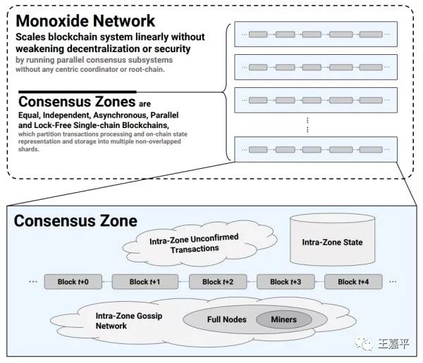
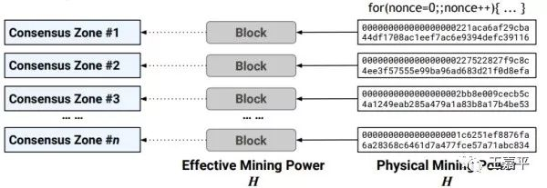
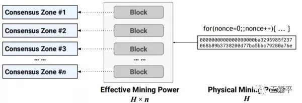

# Monoxide的简单分析和讨论

## 一、简介
这两天Monoxide火得不得了，王博士的论文把大家的热情搞了起来。看了王博士的一些介绍，对Monoxide有一个粗浅的认识。在这里对其中的一些问题进行了简单的讨论和分析，特别是在群里和朋友讨论时，对一些细节有了更深的领会。
 
毕竟没有源码，所以到真正实现，到底会是什么样子，还需要看整个项目的进展情况。
 
官方论文地址：
 
https://www.usenix.org/system/files/nsdi19-wang-jiaping.pdf

## 二、几个问题

## 1、共识分组
整个的Monoxide是一个多链系统，共识组是一个无锁（lock-free）的多链架构，独立完成共识，独立校验和执行交易，独立维护组内用户的状态和历史记录。可以把这个多链系统内的每一个链称之为“共识组”。
 
到这里大家基本应该明白了，这和分片目的基本是一致的。其实在后面的异步的异步共识组可以简单理解成异步跨链通信（更多的细节得以解释论文的人为主）。

## 2、连弩挖矿
文中提到了为了提高挖矿的效率，抵抗算力攻击，可以使用连弩挖矿的方式来提高算力。连弩挖矿允许矿工同时参与多个编号连续的共识组 (例如从编号b到b+m-1)，每次出块的时候哈希函数将覆盖多个将要出块的块头进行计算，同时这些块头将共用一个Nonce。

## 3、算力攻击
算力攻击的主要原因是因为存在了共识分组，就会导致可能有恶意的攻击方将自己的算力倾注到某一个具体的共识组上，导致极有可能达到百分之五十一的算力控制。而比特币等，由于没有分组，算力攻击其实是对抗的整个网络的算力。而在Monoxide中如果有十个分组，那么，整体的算力就会分成原来的十分之一。随着分组的增多，算力的下降就会下降到危险的地步。

 
为了解决这个问题，就是引入了连弩挖矿，即：
 
前面提到的算力分散问题是这样的一个攻击模型: 在有n个共识组的Monoxide系统中，全网有效算力为H，每个共识组的有效算力为H/n。攻击者在实施攻击的时候，将其所有物理算力T分配到一个特定共识组，在这个共识组中获得有效算力T。那边当其物理算力超过 T > H/n × 51% 的时候，攻击将可以成功，并构造不一致交易(例如双花交易)。
 
为了抵御这个算力聚焦的攻击模型，我们的思路是强制矿工将算力分散到各个共识组，使其无法集中算力攻击特定共识组。但在一个去中心化的permissionless系统中，我们无法控制矿工如何分配其物理算力。Monoxide引入了连弩挖矿，其效果是将使得全网的有效算力放大为物理算力的n倍，并且在协议的数据结构层面约束了这种放大后的有效算力必须平均分配到各个共识组，从而规避了这种算力聚焦的攻击模型。

## 三、问题的分析讨论
在上面的三个问题中，其实是互相影响的。正是因为共识分组，才引出算力攻击，然后才出现了连弩挖矿。具体的细节目前还不太清楚，但从目前得到的资料来看，Monoxide所谓的解决了不可能三角问题，还是有值得商榷的地方。
首先，共识组的划分如果过于弱小，且在最恶劣的情况下（所有的交易都跨链）。文章中说会减半，但是这里说得不太明白，会不会异步的网络交易导致大规模的交易失败，这个还得看具体的说明。
 
其次,算力的分散和聚焦，按文章中解释其实是一个动态的适应过程，这个过程在运行当中，其实是有风险的。它可能在某个时间段仍会导致算力的聚焦攻击。
 
最后，在群中和朋友讨论时，还有一个问题不太明白，就是如果多个并发挖矿中（有交集），如果其中一个已经挖矿成功，那么连弩挖矿中的默克尔树是定死的，此时如何进行更换？更换的时机如何确定。在最恶劣的情况下，会不会导致网络算力的大规模浪费？

## 四、总结
通过上述的分手，从目前的情况来看Monoxide更象是一个工程化的解决办法————动态适应的分片多链架构，在这其中，通过实际情况的调整，来达到对不可能三角的动态伸缩，实现在某种场景下的最优化，从而提高性能。
有兴趣的同学们可以看一下论文原文，欢迎大家一起讨论分析。Monoxide的有益探索应该值得肯定和学习。
