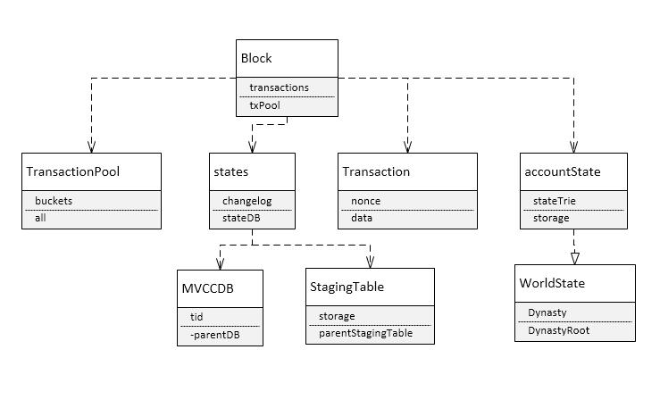

# 星云链的并行交易分析

## 一、并行交易的分类
</br>
在当前主流的分片技术中，有网络分片，交易分片和状态分片。网络分片，以太坊的casper（正在开发中）,状态分片目前是公认最难也最麻烦的。虽然有一些链做了有益的尝试（如trias等），但整体来说还处于研究中。只有交易分片相对来说比较容易，在老的EOS版本中，也使用过交易分片，而星云链中，则实现了一种交易分片的机制。
</br>
交易分片的难点在于处理交易的关系，或者说判断交易的关联性。而区块链的传输的性能和全节点备份机制导致不同节点间对交易处理状态有较大的不同，这也是导致交易分片不容易处理的一个原因。
</br>
在星云链中，采用交易的版本比较等方法来实现了一个交易并行的方法。其下将对其源码进行分析，并针对其中的一些具体的问题进行展开描述。
</br>

## 二、星云链的并行交易
</br>
星云链的并行交易在出块的时间进行，当dpos决定产生一个块的时候，会调用交易收集器来决定打包入块的相关的交易。在这其中，为提高速度，使用了多协程并行处理交易的方式。
</br>

### 1、类图
</br>


</br>

### 2、源码分析
</br>
从出块开始看下面的代码
</br>

``` go
//出块代码
func (dpos *Dpos) newBlock(tail *core.Block, consensusState state.ConsensusState, deadlineInMs int64) (*core.Block, error) {
......

	block.WorldState().SetConsensusState(consensusState)
	block.SetTimestamp(consensusState.TimeStamp())
	block.CollectTransactions(deadlineInMs)
......

	return block, nil
}
//交易并行代码
// CollectTransactions and add them to block.
func (block *Block) CollectTransactions(deadlineInMs int64) {
	metricsBlockPackTxTime.Update(0)
	if block.sealed {
		logging.VLog().WithFields(logrus.Fields{
			"block": block,
		}).Fatal("Sealed block can't be changed.")
	}

	secondInMs := int64(1000)
	elapseInMs := deadlineInMs - time.Now().Unix()*secondInMs
	logging.VLog().WithFields(logrus.Fields{
		"elapse": elapseInMs,
	}).Info("Time to pack txs.")
	metricsBlockPackTxTime.Update(elapseInMs)
	if elapseInMs <= 0 {
		return
	}
	deadlineTimer := time.NewTimer(time.Duration(elapseInMs) * time.Millisecond)

	pool := block.txPool

	packed := int64(0)
	unpacked := int64(0)

	dag := dag.NewDag()
	transactions := []*Transaction{}
	fromBlacklist := new(sync.Map)
	toBlacklist := new(sync.Map)

	// parallelCh is used as access tokens here
	parallelCh := make(chan bool, ParallelNum)
	// mergeCh is used as lock here
	mergeCh := make(chan bool, 1)
	over := false

	try := 0
	fetch := 0
	failed := 0
	conflict := 0
	expired := 0
	bucket := len(block.txPool.all)
	packing := int64(0)
	prepare := int64(0)
	execute := int64(0)
	update := int64(0)
	parallel := 0
	beginAt := time.Now().UnixNano()

	go func() {
		for {
			mergeCh <- true // lock
			if over {
				<-mergeCh // unlock
				return
			}
			try++
			tx := pool.PopWithBlacklist(fromBlacklist, toBlacklist)
			if tx == nil {
				<-mergeCh // unlock
				continue
			}

			logging.VLog().WithFields(logrus.Fields{
				"tx.hash": tx.hash,
			}).Debug("Pop tx.")

			fetch++
			fromBlacklist.Store(tx.from.address.Hex(), true)
			fromBlacklist.Store(tx.to.address.Hex(), true)
			toBlacklist.Store(tx.from.address.Hex(), true)
			toBlacklist.Store(tx.to.address.Hex(), true)
			<-mergeCh // lock

			parallelCh <- true // fetch access token
			go func() {
				parallel++
				startAt := time.Now().UnixNano()
				defer func() {
					endAt := time.Now().UnixNano()
					packing += endAt - startAt
					<-parallelCh // release access token
				}()

				// step1. prepare execution environment
				mergeCh <- true // lock
				if over {
					expired++
					<-mergeCh // unlock
					if err := pool.Push(tx); err != nil {
						logging.VLog().WithFields(logrus.Fields{
							"block": block,
							"tx":    tx,
							"err":   err,
						}).Info("Failed to giveback the tx.")
					}
					return
				}

				prepareAt := time.Now().UnixNano()
				txWorldState, err := block.WorldState().Prepare(tx.Hash().String())
				preparedAt := time.Now().UnixNano()
				prepare += preparedAt - prepareAt
				if err != nil {
					logging.VLog().WithFields(logrus.Fields{
						"block": block,
						"tx":    tx,
						"err":   err,
					}).Info("Failed to prepare tx.")
					failed++

					if err := pool.Push(tx); err != nil {
						logging.VLog().WithFields(logrus.Fields{
							"block": block,
							"tx":    tx,
							"err":   err,
						}).Info("Failed to giveback the tx.")
					}

					fromBlacklist.Delete(tx.from.address.Hex())
					fromBlacklist.Delete(tx.to.address.Hex())
					toBlacklist.Delete(tx.from.address.Hex())
					toBlacklist.Delete(tx.to.address.Hex())
					<-mergeCh // unlock
					return
				}
				<-mergeCh // unlock

				defer func() {
					if err := txWorldState.Close(); err != nil {
						logging.VLog().WithFields(logrus.Fields{
							"block": block,
							"tx":    tx,
							"err":   err,
						}).Info("Failed to close tx.")
					}
				}()

				// step2. execute tx.
				executeAt := time.Now().UnixNano()
				giveback, err := block.ExecuteTransaction(tx, txWorldState)
				executedAt := time.Now().UnixNano()
				execute += executedAt - executeAt
				if err != nil {
					logging.VLog().WithFields(logrus.Fields{
						"tx":       tx,
						"err":      err,
						"giveback": giveback,
					}).Debug("invalid tx.")
					unpacked++
					failed++

					/* 					if err := txWorldState.Close(); err != nil {
						logging.VLog().WithFields(logrus.Fields{
							"block": block,
							"tx":    tx,
							"err":   err,
						}).Debug("Failed to close tx.")
					} */

					if giveback {
						if err := pool.Push(tx); err != nil {
							logging.VLog().WithFields(logrus.Fields{
								"block": block,
								"tx":    tx,
								"err":   err,
							}).Info("Failed to giveback the tx.")
						}
					}
					if err == ErrLargeTransactionNonce {
						// as for the transactions from a same account
						// we will pop them out of transaction pool order by nonce ascend
						// thus, when we find a transaction with a very large nonce
						// we won't try to pack other transactions from the same account in the block
						// the account will be in our from blacklist util the block is sealed
						if !byteutils.Equal(tx.to.address, tx.from.address) {
							fromBlacklist.Delete(tx.to.address.Hex())
						}
						toBlacklist.Delete(tx.to.address.Hex())
					} else {
						fromBlacklist.Delete(tx.from.address.Hex())
						fromBlacklist.Delete(tx.to.address.Hex())
						toBlacklist.Delete(tx.from.address.Hex())
						toBlacklist.Delete(tx.to.address.Hex())
					}
					return
				}

				// step3. check & update tx
				mergeCh <- true // lock
				if over {
					expired++
					<-mergeCh // unlock
					if err := pool.Push(tx); err != nil {
						logging.VLog().WithFields(logrus.Fields{
							"block": block,
							"tx":    tx,
							"err":   err,
						}).Info("Failed to giveback the tx.")
					}
					return
				}
				updateAt := time.Now().UnixNano()
				dependency, err := txWorldState.CheckAndUpdate()
				updatedAt := time.Now().UnixNano()
				update += updatedAt - updateAt
				if err != nil {
					logging.VLog().WithFields(logrus.Fields{
						"tx":         tx,
						"err":        err,
						"giveback":   giveback,
						"dependency": dependency,
					}).Info("CheckAndUpdate invalid tx.")
					unpacked++
					conflict++

					if err := pool.Push(tx); err != nil {
						logging.VLog().WithFields(logrus.Fields{
							"block": block,
							"tx":    tx,
							"err":   err,
						}).Info("Failed to giveback the tx.")
					}

					fromBlacklist.Delete(tx.from.address.Hex())
					fromBlacklist.Delete(tx.to.address.Hex())
					toBlacklist.Delete(tx.from.address.Hex())
					toBlacklist.Delete(tx.to.address.Hex())

					<-mergeCh // unlock
					return
				}
				logging.VLog().WithFields(logrus.Fields{
					"tx": tx,
				}).Debug("packed tx.")
				packed++

				transactions = append(transactions, tx)
				txid := tx.Hash().String()
				dag.AddNode(txid)
				for _, node := range dependency {
					dag.AddEdge(node, txid)
				}
				fromBlacklist.Delete(tx.from.address.Hex())
				fromBlacklist.Delete(tx.to.address.Hex())
				toBlacklist.Delete(tx.from.address.Hex())
				toBlacklist.Delete(tx.to.address.Hex())

				<-mergeCh // unlock
				return
			}()

			if over {
				return
			}
		}
	}()

	<-deadlineTimer.C
	mergeCh <- true // lock
	over = true
	block.transactions = transactions
	block.dependency = dag
	<-mergeCh // unlock

	overAt := time.Now().UnixNano()
	size := int64(len(block.transactions))
	if size == 0 {
		size = 1
	}
	averPacking := packing / size
	averPrepare := prepare / size
	averExecute := execute / size
	averUpdate := update / size

	logging.VLog().WithFields(logrus.Fields{
		"try":          try,
......
		"dag":          block.dependency,
	}).Info("CollectTransactions")
}
```
</br>
从上面的代码可以看出，选择交易前先处理各种参数，包括时间的更新，并行锁的生成，特别是dag的生成，它是用来判断交易的关系的一个重要的方式,弹出交易数据。这些相关参数配置完成后，启动一个协程。协程内使用一个无限循环来处理交易，在正式选择交易前要先先处理锁的状态和相关的数据的保存，更新数据抓取计算器。
</br>
再次启动一个协程，更新并行引用计数器。处理启动时间和异常机制。然后就真正开始选择入块的交易了。
</br>
交易交发的代码共分成了四步，一步一步的进行分析。
</br>
1）第一步：准备执行环境
</br>

``` go

//world_state.go
func (s *states) Prepare(txid interface{}) (*states, error) {
  //MVCCDB版本控制准备,见下面代码分析
	changelog, err := s.changelog.Prepare(txid)
	if err != nil {
		return nil, err
	}

  //状态数据库准备
	stateDB, err := s.stateDB.Prepare(txid)
	if err != nil {
		return nil, err
	}

	// Flush all changes in world state into merkle trie
	// make a snapshot of world state
  //更新世界状态到MPT同时创建一个世界状态的快照
	if err := s.Flush(); err != nil {
		return nil, err
	}

  //快照
  //创建一个新的帐户状态--会把依赖的相关TID写入新的交易映射
	accState, err := NewAccountState(s.AccountsRoot(), stateDB)
	if err != nil {
		return nil, err
	}
  //新的Tx Root MPT状态-同上
	txsState, err := trie.NewTrie(s.TxsRoot(), stateDB, true)
	if err != nil {
		return nil, err
	}
  //新的event root mpt
	eventsState, err := trie.NewTrie(s.EventsRoot(), stateDB, true)
	if err != nil {
		return nil, err
	}
  //新的共识状态
	consensusState, err := s.consensus.NewState(s.ConsensusRoot(), stateDB, true)
	if err != nil {
		return nil, err
	}

  //返回数据结构
	return &states{
		accState:       accState,
		txsState:       txsState,
		eventsState:    eventsState,
		consensusState: consensusState,

		consensus: s.consensus,
		changelog: changelog,
		stateDB:   stateDB,
		innerDB:   s.innerDB,
		txid:      txid,

		gasConsumed: make(map[string]*util.Uint128),
		events:      make(map[string][]*Event),
	}, nil
}

//mvccdb.go
// Prepare a nested transaction这里返回已有的依赖的TID，后面还会在完成后
//更新状态时更新依赖部分
func (db *MVCCDB) Prepare(tid interface{}) (*MVCCDB, error) {
	db.mutex.Lock()
	defer db.mutex.Unlock()

  //判断交易的状态
	if !db.isInTransaction {
		return nil, ErrTransactionNotStarted
	}

	if tid == nil {
		return nil, ErrTidIsNil
	}

	if db.preparedDBs[tid] != nil {
		return nil, ErrTidIsExist
	}

  //数据库中间状态数据的存储准备--与Tid相关关联
	preparedStagingTable, err := db.stagingTable.Prepare(tid)
	if err != nil {
		return nil, err
	}

  //返回MVCCDB实例
	preparedDB := &MVCCDB{
		tid:                        tid,
		storage:                    db.storage,
		stagingTable:               preparedStagingTable,
		parentDB:                   db,
		isInTransaction:            true,
		isPreparedDB:               true,
		isPreparedDBClosed:         false,
		preparedDBs:                make(map[interface{}]*MVCCDB),
		isTrieSameKeyCompatibility: db.isTrieSameKeyCompatibility,
	}

	db.preparedDBs[tid] = preparedDB
	return preparedDB, nil
}

```
</br>
2) 第二步，执行Tx
</br>

``` go
func (block *Block) ExecuteTransaction(tx *Transaction, ws WorldState) (bool, error) {
  //检查交易是否合规
	if giveback, err := CheckTransaction(tx, ws); err != nil {
		logging.VLog().WithFields(logrus.Fields{
			"tx":  tx,
			"err": err,
		}).Info("Failed to check transaction")
		return giveback, err
	}
  //检验执行
	if giveback, err := VerifyExecution(tx, block, ws); err != nil {
		logging.VLog().WithFields(logrus.Fields{
			"tx":  tx,
			"err": err,
		}).Info("Failed to verify transaction execution")
		return giveback, err
	}

  //接受交易
	if giveback, err := AcceptTransaction(tx, ws); err != nil {
		logging.VLog().WithFields(logrus.Fields{
			"tx":  tx,
			"err": err,
		}).Info("Failed to accept transaction")
		return giveback, err
	}

	return false, nil
}
// CheckTransaction in a tx world state
func CheckTransaction(tx *Transaction, ws WorldState) (bool, error) {
	// check nonce
	fromAcc, err := ws.GetOrCreateUserAccount(tx.from.address)
	if err != nil {
		return true, err
	}

	// pass current Nonce.检测随机值
	currentNonce := fromAcc.Nonce()

	if tx.nonce < currentNonce+1 {
		// Nonce is too small, won't giveback the tx
		return false, ErrSmallTransactionNonce
	} else if tx.nonce > currentNonce+1 {
		return true, ErrLargeTransactionNonce
	}

	return false, nil
}
//检测帐户状态
func (as *accountState) GetOrCreateUserAccount(addr byteutils.Hash) (Account, error) {
	acc, err := as.getAccount(addr)
	if err != nil && err != ErrAccountNotFound {
		return nil, err
	}
	if err == ErrAccountNotFound {
		acc, err = as.newAccount(addr, nil, nil)
		if err != nil {
			return nil, err
		}
		return acc, nil
	}
	return acc, nil
}
//在MVCCDB中记录相关帐户
func (s *states) recordAccount(acc Account) (Account, error) {
	if err := s.changelog.Put(acc.Address(), acc.Address()); err != nil {
		return nil, err
	}
	return acc, nil
}
```
</br>
看一下校验执行，这个比较麻烦：
</br>

``` go
// VerifyExecution transaction and return result.
//校验执行交易并返回结果--这个没有太特别的，除了和世界状态的比较
func VerifyExecution(tx *Transaction, block *Block, ws WorldState) (bool, error) {
	// step0. perpare accounts.上文解析过，查看帐户状态
	fromAcc, err := ws.GetOrCreateUserAccount(tx.from.address)
	if err != nil {
		return true, err
	}
  //同理
	toAcc, err := ws.GetOrCreateUserAccount(tx.to.address)
	if err != nil {
		return true, err
	}

	// step1. check balance >= gasLimit * gasPrice
  //同以太坊，检测Gas
	limitedFee, err := tx.gasLimit.Mul(tx.gasPrice)
	if err != nil {
		// Gas overflow, won't giveback the tx
		return false, ErrGasFeeOverflow
	}
	if fromAcc.Balance().Cmp(limitedFee) < 0 {
		// Balance is smaller than limitedFee, won't giveback the tx
		return false, ErrInsufficientBalance
	}

	// step2. check gasLimit >= txBaseGas.
  //判断块的gasLimit是不是超出
	baseGas, err := tx.GasCountOfTxBase()
	if err != nil {
		// Gas overflow, won't giveback the tx
		return false, ErrGasCntOverflow
	}
	gasUsed := baseGas
	if tx.gasLimit.Cmp(gasUsed) < 0 {
		logging.VLog().WithFields(logrus.Fields{
			"error":       ErrOutOfGasLimit,
			"transaction": tx,
			"limit":       tx.gasLimit,
			"acceptedGas": gasUsed,
		}).Debug("Failed to check gasLimit >= txBaseGas.")
		// GasLimit is smaller than based tx gas, won't giveback the tx
		return false, ErrOutOfGasLimit
	}

	// !!!!!!Attention: all txs passed here will be on chain.
  //注意：必须是链上交易
	// step3. check payload vaild.交易内容的检测
	payload, payloadErr := tx.LoadPayload()
	if payloadErr != nil {
		return submitTx(tx, block, ws, gasUsed, payloadErr, "Failed to load payload.", "")
	}

	// step4. calculate base gas of payload
	payloadGas, err := gasUsed.Add(payload.BaseGasCount())
	if err != nil {
		logging.VLog().WithFields(logrus.Fields{
			"err":            err,
			"tx":             tx,
			"gasUsed":        gasUsed,
			"payloadBaseGas": payload.BaseGasCount(),
			"block":          block,
		}).Error("Failed to add payload base gas, unexpected error")
		metricsUnexpectedBehavior.Update(1)
		return submitTx(tx, block, ws, gasUsed, ErrGasCntOverflow, "Failed to add the count of base payload gas", "")
	}
	gasUsed = payloadGas
	if tx.gasLimit.Cmp(gasUsed) < 0 {
		return submitTx(tx, block, ws, tx.gasLimit, ErrOutOfGasLimit, "Failed to check gasLimit >= txBaseGas + payloasBaseGas.", "")
	}

	// step5. check balance >= limitedFee + value. and transfer
  //帐户是否满足需求
	minBalanceRequired, balanceErr := limitedFee.Add(tx.value)
	if balanceErr != nil {
		return submitTx(tx, block, ws, gasUsed, ErrGasFeeOverflow, "Failed to add tx.value", "")
	}
	if fromAcc.Balance().Cmp(minBalanceRequired) < 0 {
		return submitTx(tx, block, ws, gasUsed, ErrInsufficientBalance, "Failed to check balance >= gasLimit * gasPrice + value", "")
	}
	var transferSubErr, transferAddErr error
	transferSubErr = fromAcc.SubBalance(tx.value)
	if transferSubErr == nil {
		transferAddErr = toAcc.AddBalance(tx.value)
	}
	if transferSubErr != nil || transferAddErr != nil {
		logging.VLog().WithFields(logrus.Fields{
			"subErr":      transferSubErr,
			"addErr":      transferAddErr,
			"tx":          tx,
			"fromBalance": fromAcc.Balance(),
			"toBalance":   toAcc.Balance(),
			"block":       block,
		}).Error("Failed to transfer value, unexpected error")
		metricsUnexpectedBehavior.Update(1)
		return submitTx(tx, block, ws, gasUsed, ErrInvalidTransfer, "Failed to transfer tx.value", "")
	}

	// step6. calculate contract's limited gas
	contractLimitedGas, err := tx.gasLimit.Sub(gasUsed)
	if err != nil {
		logging.VLog().WithFields(logrus.Fields{
			"err":     err,
			"tx":      tx,
			"gasUsed": gasUsed,
			"block":   block,
		}).Error("Failed to calculate payload's limit gas, unexpected error")
		metricsUnexpectedBehavior.Update(1)
		return submitTx(tx, block, ws, tx.gasLimit, ErrOutOfGasLimit, "Failed to calculate payload's limit gas", "")
	}

	// step7. execute contract.
  //执行合约
	gasExecution, exeResult, exeErr := payload.Execute(contractLimitedGas, tx, block, ws)
	if exeErr == ErrUnexpected {
		return false, exeErr
	}

	// step8. calculate final gas.
	allGas, gasErr := gasUsed.Add(gasExecution)
	if gasErr != nil {
		return submitTx(tx, block, ws, gasUsed, ErrGasCntOverflow, "Failed to add the fee of execution gas", "")
	}
	if tx.gasLimit.Cmp(allGas) < 0 {
		return submitTx(tx, block, ws, tx.gasLimit, ErrOutOfGasLimit, "Failed to check gasLimit >= allGas", "")
	}

	// step9. over完成
	return submitTx(tx, block, ws, allGas, exeErr, "Failed to execute payload", exeResult)
}
```
</br>
再看一下接受交易：
</br>

``` go
func AcceptTransaction(tx *Transaction, ws WorldState) (bool, error) {
	// record tx 转成原始交易
	pbTx, err := tx.ToProto()
	if err != nil {
		return true, err
	}
  //解析成字节流
	txBytes, err := proto.Marshal(pbTx)
	if err != nil {
		return true, err
	}
  //保存交易
	if err := ws.PutTx(tx.hash, txBytes); err != nil {
		return true, err
	}
	// incre nonce计算随机值
	fromAcc, err := ws.GetOrCreateUserAccount(tx.from.address)
	if err != nil {
		return true, err
	}
  //nonce +1
	fromAcc.IncrNonce()
	// No error, won't giveback the tx
	return false, nil
}
```
</br>
完成上述动作后，就可以在交易池中增加Tx了。
</br>
3） 第三步：检验并更新MVCCDB
</br>
仍然是先要控制一下锁，然后开始工作：
</br>

``` go
// Push tx into pool
func (pool *TransactionPool) Push(tx *Transaction) error {
	pool.mu.Lock()
	defer pool.mu.Unlock()
	// add tx log in super node
	if pool.bc.superNode == true {
		logging.VLog().WithFields(logrus.Fields{
			"tx": tx,
		}).Debug("Push tx to transaction pool")
	}

  //下面分两处理不支持的Tx的异常
	//if is super node and tx type is deploy, do unsupported keyword checking.
	if pool.bc.superNode == true && len(pool.bc.unsupportedKeyword) > 0 && len(tx.Data()) > 0 {
		if tx.Type() == TxPayloadDeployType {
			data := string(tx.Data())
			keywords := strings.Split(pool.bc.unsupportedKeyword, ",")
			for _, keyword := range keywords {
				keyword = strings.ToLower(keyword)
				if strings.Contains(data, keyword) {
					logging.VLog().WithFields(logrus.Fields{
						"tx.hash":            tx.hash,
						"unsupportedKeyword": keyword,
					}).Debug("transaction data has unsupported keyword")
					unsupportedKeywordError := fmt.Sprintf("transaction data has unsupported keyword(keyword: %s)", keyword)
					return errors.New(unsupportedKeywordError)
				}
			}
		}
	}

	//if is super node and tx type is deploy, do unsupported keyword checking.
	if pool.bc.superNode == true && len(pool.bc.unsupportedKeyword) > 0 && len(tx.Data()) > 0 {
		if tx.Type() == TxPayloadDeployType {
			data := string(tx.Data())
			keywords := strings.Split(pool.bc.unsupportedKeyword, ",")
			for _, keyword := range keywords {
				keyword = strings.ToLower(keyword)
				if strings.Contains(data, keyword) {
					logging.VLog().WithFields(logrus.Fields{
						"tx":                 tx,
						"unsupportedKeyword": keyword,
					}).Debug("transaction data has unsupported keyword")
					return ErrUnsupportedKeyword
				}
			}
		}
	}
	// verify non-dup tx重复判断
	if _, ok := pool.all[tx.hash.Hex()]; ok {
		metricsDuplicateTx.Inc(1)
		return ErrDuplicatedTransaction
	} // ToRefine: refine the lock scope

	// if tx's gasPrice below the pool config lowest gasPrice, return ErrBelowGasPrice
	if tx.gasPrice.Cmp(pool.minGasPrice) < 0 {
		metricsTxPoolBelowGasPrice.Inc(1)
		return ErrBelowGasPrice
	}

	if tx.gasLimit.Cmp(util.NewUint128()) <= 0 {
		metricsTxPoolGasLimitLessOrEqualToZero.Inc(1)
		return ErrGasLimitLessOrEqualToZero
	}

	if tx.gasLimit.Cmp(pool.maxGasLimit) > 0 {
		metricsTxPoolOutOfGasLimit.Inc(1)
		return ErrOutOfGasLimit
	}

	// verify hash & sign of tx
	if err := tx.VerifyIntegrity(pool.bc.chainID); err != nil {
		metricsInvalidTx.Inc(1)
		return err
	}

	// cache the verified tx
	pool.pushTx(tx)
	// drop max tx in longest bucket if full
  //如果超过极值就把最长时间的删除
	if len(pool.all) > pool.size {
		poollen := len(pool.all)
		pool.dropTx()

		logging.VLog().WithFields(logrus.Fields{
			"tx":         tx.StringWithoutData(),
			"size":       pool.size,
			"bpoolsize":  poollen,
			"apoolsize":  len(pool.all),
			"bucketsize": len(pool.buckets),
		}).Debug("drop tx")
	}

	// trigger pending transaction
	event := &state.Event{
		Topic: TopicPendingTransaction,
		Data:  tx.JSONString(),
	}
	pool.eventEmitter.Trigger(event)

	return nil
}
```
</br>
检测并更新状态：
</br>

``` go
func (tws *txWorldState) CheckAndUpdate() ([]interface{}, error) {
	dependencies, err := tws.states.CheckAndUpdateTo(tws.parent.states)
	if err != nil {
		return nil, err
	}
	tws.parent = nil
	return dependencies, nil
}
func (s *states) CheckAndUpdateTo(parent *states) ([]interface{}, error) {
	dependency, err := s.changelog.CheckAndUpdate()
	if err != nil {
		return nil, err
	}
	_, err = s.stateDB.CheckAndUpdate()
	if err != nil {
		return nil, err
	}
	if err := parent.Replay(s); err != nil {
		return nil, err
	}
	return dependency, nil
}
//MVCCDB的检测和更新--去年让他日志和MPT的更新
//dependency, err := s.changelog.CheckAndUpdate()
//_, err = s.stateDB.CheckAndUpdate()
// CheckAndUpdate merge current changes to `FinalVersionizedValues`.
func (db *MVCCDB) CheckAndUpdate() ([]interface{}, error) {
	db.mutex.Lock()
	defer db.mutex.Unlock()

	if !db.isInTransaction {
		return nil, ErrTransactionNotStarted
	}

	if !db.isPreparedDB {
		return nil, ErrDisallowedCallingInNoPreparedDB
	}

	if db.isPreparedDBClosed {
		return nil, ErrPreparedDBIsClosed
	}

	ret, err := db.stagingTable.MergeToParent()

	if err == nil {
		// cleanup.
		db.stagingTable.Purge()
	}

	return ret, err
}
// MergeToParent merge key/value pair of tid to `finalVersionizedValues` which the version of value are the same.
//关键部分：通过版本比较来合并相关的值，看上面的中间变量设置
func (tbl *StagingTable) MergeToParent() ([]interface{}, error) {
	if tbl.parentStagingTable == nil {
		return nil, ErrParentStagingTableIsNil
	}

	tbl.parentStagingTable.mutex.Lock()
	defer tbl.parentStagingTable.mutex.Unlock()

	tbl.mutex.Lock()
	defer tbl.mutex.Unlock()

	dependentTids := make(map[interface{}]bool)
	conflictKeys := make(map[string]interface{})

	// 1. check version.
	targetValues := tbl.parentStagingTable.versionizedValues

	for keyStr, fromValueItem := range tbl.versionizedValues {
		targetValueItem := targetValues[keyStr]

		if targetValueItem == nil {
			continue
		}

		// 1. record conflict.标记冲突数据
    //标准是版本号和相同的KEY
		if fromValueItem.isConflict(targetValueItem, tbl.isTrieSameKeyCompatibility) {
			conflictKeys[keyStr] = targetValueItem.tid
			continue
		}

		// 2. record dependentTids.
    //标记依赖tid
		// skip default value loaded from storage.
    //忽略默认值
		if targetValueItem.isDefault() {
			continue
		}

		// ignore same parent tid for dependentTids.
    //忽略同父路径操作
		if targetValueItem.tid == tbl.parentStagingTable.tid {
			continue
		}

		// ignore version check when TrieSameKeyCompatibility is enabled.
		if tbl.isTrieSameKeyCompatibility {
			continue
		}

		dependentTids[targetValueItem.tid] = true
	}

	if len(conflictKeys) > 0 {
		logging.VLog().WithFields(logrus.Fields{
			"tid":          tbl.tid,
			"parentTid":    tbl.parentStagingTable.tid,
			"conflictKeys": conflictKeys,
		}).Debug("Failed to be merged into parent.")
		return nil, ErrStagingTableKeyConfliction
	}

	// 2. merge to final.
  //合并
	// incr parentStagingTable.globalVersion.处理合并后的版本号
	tbl.parentStagingTable.globalVersion++

	for keyStr, fromValueItem := range tbl.versionizedValues {
		// ignore default value item.
		if fromValueItem.isDefault() {
			continue
		}

		// ignore non-dirty.
		if !fromValueItem.dirty {
			continue
		}

		// merge.
		value := fromValueItem.CloneForMerge(tbl.parentStagingTable.globalVersion)
		targetValues[keyStr] = value
	}

  //遍历增加新的tid
	tids := make([]interface{}, 0, len(dependentTids))
	for key := range dependentTids {
		tids = append(tids, key)
	}

	return tids, nil
}
```
</br>
再看最后：
</br>

``` go
txid := tx.Hash().String()
dag.AddNode(txid)
for _, node := range dependency {
  dag.AddEdge(node, txid)
}
```
</br>
将节点放入dag中，dag的特点是快速，但不容易回溯。
</br>
通过上面的源码分析，就可以清晰的看到星云链的交易并行其实思路还是比较清晰的，主要原理是利用MVCCDB记录的版本号，在MPT状态树中存储着相关的依赖的tid，在协程中执行交易时，会对其进行判断，如果交易不符合情况，就会返回错误，然后利用内存数据进行回滚。如果成功，则更新新的世界状态和相关的数据、日志。
</br>

## 三、总结
星云链从一个方向上解决了交易分片的过程，但是看起来还是略微有些简单粗暴，从源码分析来看，还是可能会产生很多的冗余操作，但这也算是对交易分片的一个非常有益的探索。
</br>
