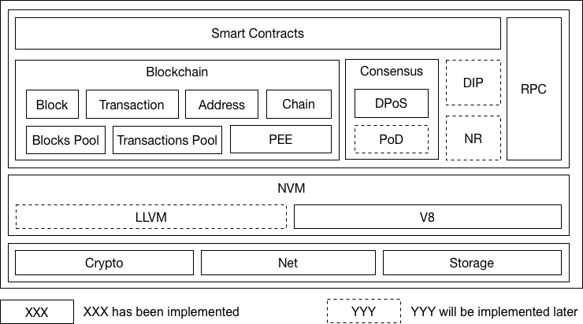
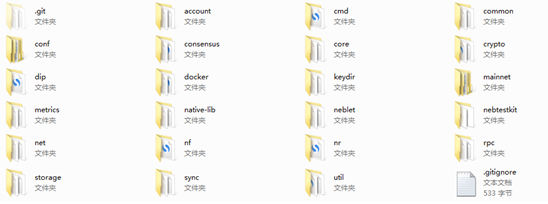
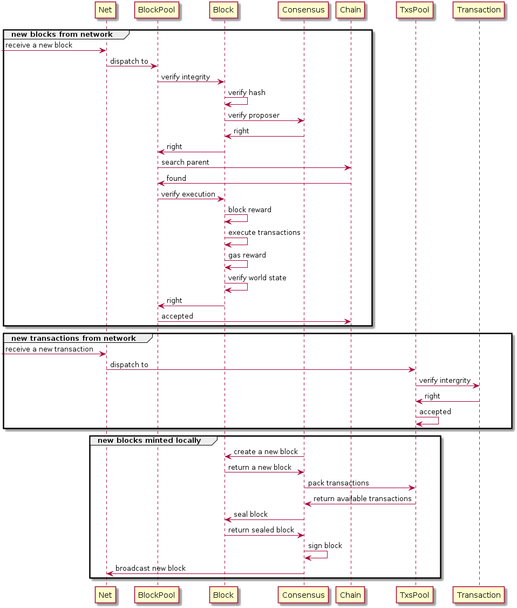
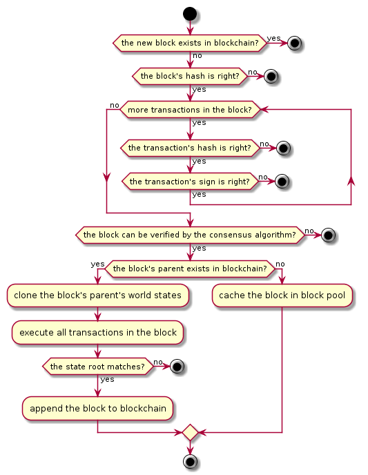
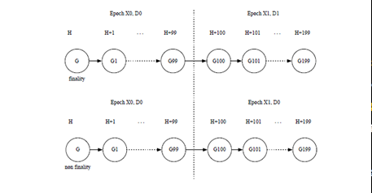
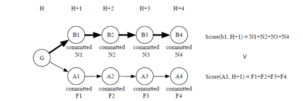
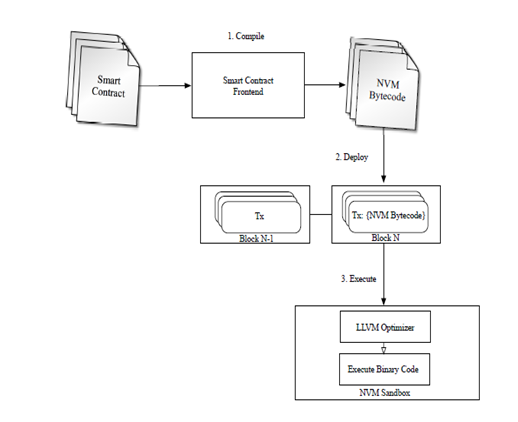
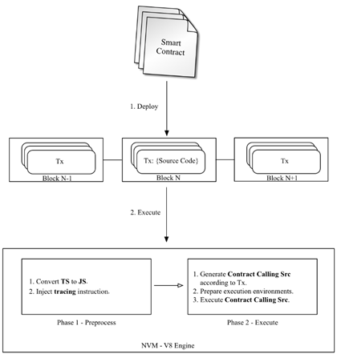

# 星云链的整体架构

</br>

## 一、整体结构
</br>
星云链是一条能够量化价值尺度、具备自进化能力，并能促进区块链生态建设的区块链系统。它有以下几个特点：
### 1、星云指数Nebulas Rank
</br>
星云指数是定义价值尺度 (NR)的指标 ，通过综合考虑链中各个账户的流动性及传播性，NR 试图为每个账户建一个个可信、可计算及可复现的普适价值尺度刻画。可以预见，在NR 之上，通过挖掘更大纵深的价值，星云链的平台上将会涌现更多、更丰富的应⽤。
### 2、星云原力Nebulas Force(NF)
</br>
描述区块链系统及应用的进化能力。星云原力做为驱动区块链系统及应用发展的第一推动力，包括三个方面：星云链虚拟机NVM(Nebulas Virtual Machine)，区块链系统中核⼼协议的升级，以及运行在区块链系统之上的智能合约的升级。
目前这块源码完成了一部分，官网的路线图是2019.Q4完成。

### 3、开发者激励协议Developer Incentive Protocol(DIP)
</br>
为了更好地建立区块链应用生态环境，星云链将通过星云币（NAS）来激励为生态助力的优秀应用开发者，促进星云链更加丰富多元的价值沉淀。
目前这块源码尚未完成，官网的路线图是2018.Q4。

### 4、贡献度证明共识算法Proof of Devotion(PoD)
</br>
星云链提出了共识算法的三个重要指标，即快速、不可逆和公平性，PoD 通过融合PoS 和PoI 的优势，结合星云链中的价值尺度，在保证快速和不可逆的前提下，率先加⼊了公平性的考量。
目前这块源码未完成，官网的路线图是2019.Q4完成。

### 5、去中心化应用的搜索引擎
</br>
基于我们所定义的价值尺度，星云链构建了⼀个针对去中⼼化应⽤的搜索引擎，帮助⽤户在海量区块链应用中，找到符合用户期望及应用场景的应用。
搜索引擎是基于星云指数的，所以目前应该也是规划中。
它的主要设计架构层次，如下图：
</br>


</br>

## 二、代码结构和数据流程
</br>

### 1、代码结构：
</br>


</br>
上面的文件夹看起来不少，其实主要分为以下几块：
</br>
帐户：
</br>
主要是用来创建操作交易的帐户，主要包括account,keydir,crypto等。
</br>
数据库：
</br>
主要用来区块数据的读写，包括storage,native-lib.
</br>
命令集：
</br>
主要用来创建控制台操作和主程序启动等。主要包括cmd等。
</br>
网络：
</br>
星云链的网络通信基础，包括net,rpc,sync等。
</br>
服务：
</br>
控制协调星云链的各个模块的服务操作。主要包括neblet等。
</br>
核心和共识：
</br>
区块链的主要功能和共识部分，主要包括core、consensus、common。
</br>
星云原力：
</br>
星云链的一个重要指标，主要在nf文件夹内，目前虚拟机部分已经初步完成。其它正在进行。
</br>

### 2、主要的数据流程

它的主要数据流程如下图：
</br>


</br>

### 3、本地矿工产生一个新区块的流程如下：
</br>



## 三、重点模块
### 1、并行交易
</br>
星云链的并发执行交易模型如下：
</br>


</br>
为了执行并发，星云链在产生区块时进行了交易的收集验证动作，其使用协程来完成：
</br>

``` go
consensus/dpos.go
func (dpos *Dpos) newBlock(tail *core.Block, consensusState state.ConsensusState, deadlineInMs int64) (*core.Block, error) {
	…….
	block.CollectTransactions(deadlineInMs)
	……

	return block, nil
}
其它调用：
core/block.go
// CollectTransactions and add them to block.
func (block *Block) CollectTransactions(deadlineInMs int64) {
	metricsBlockPackTxTime.Update(0)
…….

	pool := block.txPool
	……….

	go func() {
		for {
……
//弹出GAS最高交易
			tx := pool.PopWithBlacklist(fromBlacklist, toBlacklist)
…….

			fetch++
			fromBlacklist.Store(tx.from.address.Hex(), true)
			fromBlacklist.Store(tx.to.address.Hex(), true)
			toBlacklist.Store(tx.from.address.Hex(), true)
			toBlacklist.Store(tx.to.address.Hex(), true)
			<-mergeCh // lock

			parallelCh <- true // fetch access token
			go func() {
				parallel++
				startAt := time.Now().UnixNano()
				defer func() {
					endAt := time.Now().UnixNano()
					packing += endAt - startAt
					<-parallelCh // release access token
				}()

				// step1. prepare execution environment
				mergeCh <- true // lock
				if over {
					expired++
					<-mergeCh // unlock
					if err := pool.Push(tx); err != nil {
						…….
					}
					return
				}

				prepareAt := time.Now().UnixNano()
				txWorldState, err := block.WorldState().Prepare(tx.Hash().String())
				preparedAt := time.Now().UnixNano()
				prepare += preparedAt – prepareAt
				……
				<-mergeCh // unlock
				……

				// step2. execute tx.
				executeAt := time.Now().UnixNano()
				//此处非常重要，各种验证和合约的执行都在此函数中调用
				giveback, err := block.ExecuteTransaction(tx, txWorldState)
				executedAt := time.Now().UnixNano()
				execute += executedAt - executeAt
				……

				// step3. check & update tx
				mergeCh <- true // lock
				…….
				updateAt := time.Now().UnixNano()
				//检查更新状态参数
				dependency, err := txWorldState.CheckAndUpdate()
				updatedAt := time.Now().UnixNano()
				update += updatedAt - updateAt
				…….
				packed++
				//添加交易
				transactions = append(transactions, tx)
				txid := tx.Hash().String()
				//添加节点到DAG
				dag.AddNode(txid)
				for _, node := range dependency {
					//添加到DAG中
					dag.AddEdge(node, txid)
				}
				…….

				<-mergeCh // unlock
				return
			}()
			……
		}
	}()

	<-deadlineTimer.C
	mergeCh <- true // lock
	over = true
	block.transactions = transactions
	block.dependency = dag
	<-mergeCh // unlock
……
}

```
</br>

### 2、块池
</br>
在星云链中，目前使用DPOS通过引进伪随机来产生出块者，而设计中的POD目前尚未完成，可能是出于设计的需要一些相关的基础架构都按照POD的方式来完成。
</br>
其中朝代和epoch等相关都已经设计完成，所以通过一个blockpool来处理相关的设计要求。这也算是星云链比较独特的一个方面。
朝代更替：
 </br>

 
 </br>
上链的区块判断：
</br>


</br>

### 3、版本比较
为了保证交易等的事务并发控制，引进了版本控制数据库，MVCC支持嵌套的事务。

## 四、虚拟机引擎
</br>
虚拟机的引擎目前采用的是以LLVM为核心组件（正在开发中），目前使用V8引擎来实现对智能合约的支持。V8引擎的优点就在于对前端开发者的相对友好易用。学习成本低，更利用智能合约的推广。
LLVM其运行机制如下：
</br>


</br>
V8运行机制如下图：
</br>


</br>
目前星云链支持JavaScript或TypeScript两种语言。在星云链的智能合约中必须包含一个init函数，它只有在部署本合约时执行。
如果函数是以下划线_起始，则说明此函数为私有。

## 五、总结
</br>
整体来看，星云链的整体目标完成度还是比较少的。虽然目前可以运行，但是几个重要的核心部分或者说突出特点，都尚未完全完成。
</br>
其提出的星云原力和星云指数以及通过它们发展出来的搜索引擎，有着不同于其它链的鲜明的特点。特别是链内交易并行，EOS在原来的版本也曾经规划过，但真正实现还是在星云链上看到，具有很强的借鉴性。

</br>
