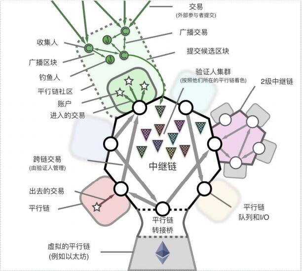
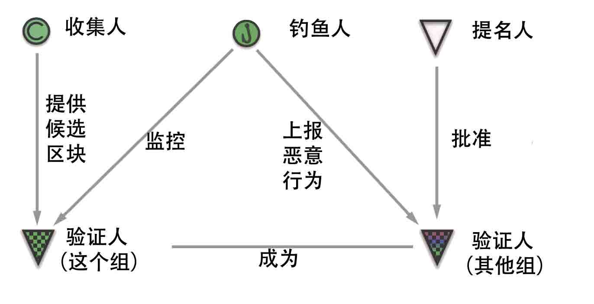
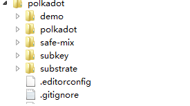
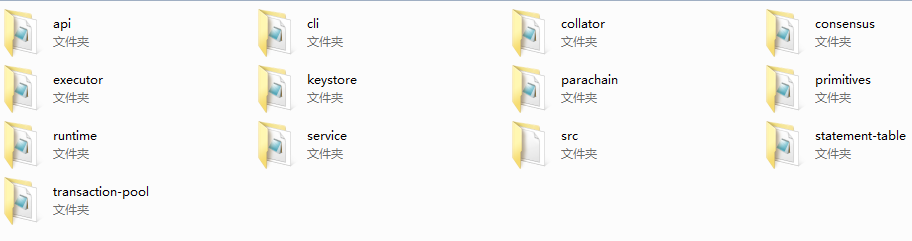
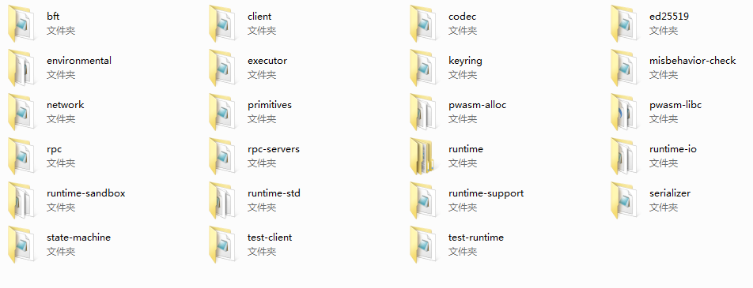

# 波卡链源码分析之一介绍和源码模块

## 一、波卡链（polkadot）介绍
波卡链是一个基于中继链的多链y系统，从它的白皮书来看，应该是非常强大，但从的研发进度来看，确实是有点慢。不过好在github上有演进的源码，就针对这些进行分析，如果有什么新版本对老版本的不同，会在看到后及时指出。

## 二、波卡链的架构
波卡链的设计架构如下图：
 

从上图可以看出，波卡链主要是由中继链为纽带，连接不同的平行公链。以桥接的方式通过队列进行数据（交易）间的传递。跨链的路由是由中继链和其验证人一起实现的核心功能，其管理以下主要逻辑：一个提交的交易（简言之为“提交”）是如何从一个来源（source）平行链的出口被强制地路由到另一个目标（destination）平行链里，而且无需任何信任人。
 
在平行链的头部都包含一个出口树根（egress-trie-root）。这个树根包含了一个路由信息的列表，列表中的每一项包含有一个串行（concatenated）结构的出口提交。为每条平行链的验证人之间提供默克尔树证明，从而能够证明某条平行链的区块对应着另一条平行链的出口队列。
通过伪随机数（CSPR）来保证对平行链的公平的配对，防止出现作弊现象。将需要处理的平行链的出口队列与本区块链的入口队列绑定，这样就可以把他们之间的数据进行交易。如果入口队列的数量超出了阈值，那么在中继链上就会被标记为满，在队列重新置空前不再接收新的数据。
 
波卡链的主要角色如下：
 

 

## 1、收集人
 
 收集人用来帮助验证人制造有效的平行区块，他们会运行一个特定平行链的全节点，可以这样认为，收集人是打入平行链内部的中继链的间谍。它可以打包一个区块，将其所得到的所有信息提供给验证人。
 

## 2、验证人
 
验证人的权限很高，它帮助在波卡链网络里打包新块。不过，这个是有代价的，需要交足够多的押金。当然，有押金的多个提名人也可以推举验证人。但这个时候儿的押金就不是验证人的。而属于提名人。
 
验证人运行一个中继链的全节点客户端，它通过收集人来得到相关平行链的信息。这里使用一个XBFT的共识算法，保证其履行责任，否则就会扣留其奖励甚至扣减押金。
 

## 3、提名人
 
类似于矿工，只能把安全性押金委托给验证人，其实没有任何权力。
 

## 4、钓鱼人
 
钓鱼人类似于赏金猎人，他们用来监控是否有恶意的行为发生。他们只要发现有抵押方想搞事情，就会得到奖励。举一个例子，重复签名。当然，为了保证一定的平衡，奖励从最小开始，逐渐递进的。
 
当然，做钓鱼人，也是要交少量的押金的，不过比当验证人要少很多。
 
关于收集人、提名人、验证人的精确关系可能还会修改。这个只是一个目前的状态。
 

# 三、波卡链的源码结构
 

## 1、波卡链的源码结构如下：
 
整体的源码结构：
 

 
demo:提供了一个客户端简单的例子，它的启动机制类似于波卡链本身的机制，也可以说是某种程度上的复用。
 
polkadot:波卡链的主文件夹，主要的代码都在这个文件夹内。
 
safe-mix:混合算法部分。
 
subkey:只有一个文件，其实就是利用种子发生器生成密钥。
 
substrate:文件夹中是创建原生平行链的基本模式（包括使用的策略。如共识、存储等）。
 

## 2、polkadot文件夹的代码结构：
 

 
api:对外的应用接口，有全节点和轻量节点两种。
 
cli:客户端
 
collator:收集者代码
 
consensus:共识部分代码。
 
excutor:WASM执行时的本地优化
 
keystory:密钥存储管理
 
parachain:平行链编译相关，包手一些数据类型的处理。
 
primitives:平行链相关的数据基础类型
 
runtime:平行链的主链的验证者内容及相关WASM的处理。
 
service:波卡链对网络的控制逻辑，包括通信、线程及网络之间的组织关系。
 
src:很简单的启动命令客户端。
 
statement-table:共识相关的存储表
 
transaction-pool:交易池。
 

## 3、substrate文件夹的代码结构：
 

 
bft:共识相关。
 
codec:简单的序列化和反序列化的编码器。
 
client:客户端。
 
ed25519:Ed25519椭圆曲线算法接口。
 
environmental:应用环境的支持，包括堆栈变量的安全引用等。
 
executor:临时的合约部分和未完成的WASM合约部分。
 
keyring:代码的运行时支持。
 
misbehavior-check:错误行为检查。
 
network:p2p网络相关。
 
primitives:相关的数据类型、宏定义及属性等。
 
pwasm-alloc:WASM中相关的分配器的处理。
 
pwasm-libc:使用标准的LIBC。
 
rpc:远程调用接口。
 
rpc-servers:RPC的服务端。
 
runtime相关:各种不同环境下的运行时支持，从模块化具体到某个功能，到整体上不同的情况，如IO，沙箱等。
 
serializer:串行化存储，暂时使用JSON，后期可能采用其它。
 
state-machine:平行链的状态机，包括状态存储等。
 

# 四、总结
 
波卡链的资料还是比较少的，特别是对源码的支持这方面，基本上没有什么资料。再加上源码由RUST编写，本身这个语言就是一个小众语言。所以从资料到源码的映射就更加复杂。
 
但是，波卡链的设计架构思想很有借鉴意义，特别是提出中继链打通各个平行链的机制，目前来看仍然很有实用性。
