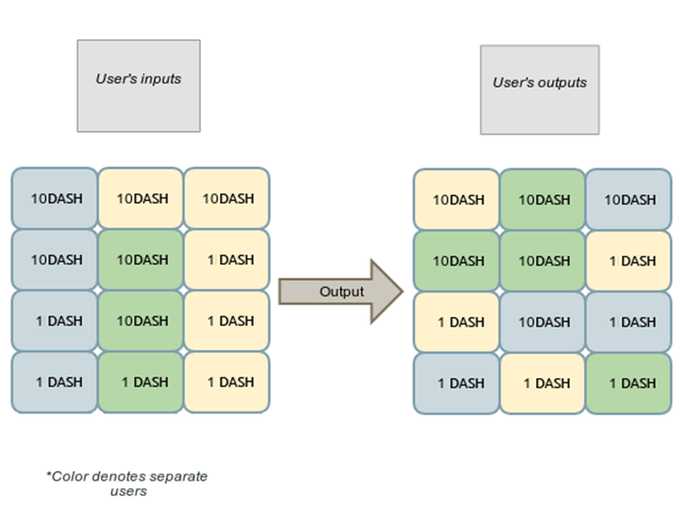

# 门罗币、ZEC和达世币的对比分析之三达世币的混币分析

## 一、达世币的匿名特点
达世币也就是原来的暗黑币，估计是觉着不太正能量，换名字了。暗黑币从一出世其实就在一些见不得人的网站上使用量非常频繁，原因大家都知道。也就是今天要分析的匿名性。
</br>
达世币的匿名性保证了买卖双方的不可见（一般情况），而它使用混币池技术来实现匿名性也算是一个不错的尝试。混币池优点是如果混合的数量足够多，那么苏匿名的安全性还是很高的， 缺点是主节点有中心化的趋势。
</br>
达世几点使用了X11的算法，什么叫X11的算法呢？就是11种加密算法混合到一起的算法，真是不嫌麻烦啊。比如有SHA256，有抵抗矿机的Scrypt等等，目的很简单，也是为了抵抗专门的挖矿矿机的迅速产生。
</br>
做为比较早期的匿名性引入的数字币，它从技术角度上来看，还是不太完美的。匿名只能算是它的一个方面，而不是全部。

## 二、混币的原理
在达世币中，大约具有2400个生效的主节点，由于它使用了和比特币类似的机制，所以需要掌握大约百分之五十的算力才攻击整个网络，而每个主节点大约需要1000 DASH担保。如果想控制整个网络还是需要很大的代价的。
</br>
因此，可以使用去中心化的混币服务（从这方面讲确实是比EOS的超级节点要多很多）。大家都知道，在比特币的网络中，理论上也是匿名的，因为你并被有注册你的真实的身份到区块链的网络上去，在交易中只是可以看到交易的哈希或者说相关的地址。
</br>
但是，如果利用大数据把与此地址相关的所有的交易进行关联、分析。就可以分析出交易发出的IP、端口，坐落的城市。理论上讲，如果使用者没有对IP进行保护的话，再通过分析此IP的相关的一些数据信息，比如此IP和其它网站通信时使用的电话号码等信息，就可以很容易的找到交易的双方。
</br>
在Dash币的白皮书上，介绍了简单的比特币的混币和coinjoin技术，它们都有着可以在某个点被破解的较大可能。而达世币的PrivateSend则可以避免上述两者的问题。
</br>
达世币的想法是如果把多个交易混合成一笔交易，那么拆分这笔交易就是一个难题了。在数学上，因式分解是不确定的，交易混合的越多，那么出现的分解的可能性越多。这样就避免上被按照交易回溯用户的信息了。
</br>

## 三、达世币中对混币的应用
在达世币中，最少要使用三个用户的资金进行混币,下图是三个用户的资金合并到一个共同交易，用户会以新的打乱过的形式对外输出资金。
</br>


</br>
如果仅仅是做上述的动作，那么仍然有三分之一的机会可以追踪使用原来的方式查的交易的双方。为了解决这个问题，达世币进行了进一步的处理，首先，它把混合的交易链接，然后由不同的主机节分别发送，这样就无法判定到底是哪个主节点发送，进一步增加查看的难度。然后，它还使用中继遮掩技术，让发送者将交易一开始不提交到交易池中，而是由随机指定的主节点输入输出转发到相关的目标节点上。
</br>
在达世币中，每轮混币的总额不超过1000个DASH且需要多轮才能达到混币的输出。为了防止攻击，达世币是以押金的方式向矿池提交交易，这样就增加了攻击的成本。
</br>
在达世币的白皮书中，有各种情况下难度的概率表，可以参看。

## 四、源码分析
这里主要分析privatesend的相关代码，看一下数据结构：

```C++
//混币的交易池看的输入，继承自比特币的普通输入交易
class CTxDSIn : public CTxIn
{
public:
    // memory only
    CScript prevPubKey;
    bool fHasSig; // flag to indicate if signed
    int nSentTimes; //times we've sent this anonymously
......
};

// 混币池的记录（条目）数据结构
class CDarkSendEntry
{
public:
    //下面两个混币的输入输出数据结构
    std::vector<CTxDSIn> vecTxDSIn;
    std::vector<CTxOut> vecTxOut;
    CTransaction txCollateral;
    // memory only
    CService addr;
.......

    bool AddScriptSig(const CTxIn& txin);
};
//正在进行的混混币的归并和相关面额信息
class CDarksendQueue
{
public:
    int nDenom;
    CTxIn vin;
    int64_t nTime;
    bool fReady; //ready for submit
    std::vector<unsigned char> vchSig;
    // memory only
    bool fTried;

......
};

/** 混币交易的帮助类
 */
class CDarksendBroadcastTx
{
private:
    // memory only
    // when corresponding tx is 0-confirmed or conflicted, nConfirmedHeight is -1
    int nConfirmedHeight;

public:
    CTransaction tx;
    CTxIn vin;
    std::vector<unsigned char> vchSig;
    int64_t sigTime;
......
};
```
</br>
上面是基本的几个数据结构，下面看一下比较主要的两个类，一个是控制私有发送交易的基础类，一个是私有发送类：

```C++
//这个类是为后面的Client和Server准备的
class CPrivateSendBase
{
protected:
    mutable CCriticalSection cs_darksend;

    //当前混币的存储数据结构
    std::vector<CDarksendQueue> vecDarksendQueue;
    //主节点和客户端的条目数据结构
    std::vector<CDarkSendEntry> vecEntries; // Masternode/clients entries

    PoolState nState; // should be one of the POOL_STATE_XXX values
    int64_t nTimeLastSuccessfulStep; // the time when last successful mixing step was performed, in UTC milliseconds

    int nSessionID; // 0 if no mixing session is active

    CMutableTransaction finalMutableTransaction; // the finalized transaction ready for signing

    void SetNull();
    void CheckQueue();

public:
    int nSessionDenom; //Users must submit an denom matching this

    CPrivateSendBase() { SetNull(); }

    int GetQueueSize() const { return vecDarksendQueue.size(); }
    int GetState() const { return nState; }
    std::string GetStateString() const;

    int GetEntriesCount() const { return vecEntries.size(); }
};

class CPrivateSend
{
private:
......
    static const CAmount COLLATERAL = 0.001 * COIN;

    // static members
    static std::vector<CAmount> vecStandardDenominations;
    static std::map<uint256, CDarksendBroadcastTx> mapDSTX;

    static CCriticalSection cs_mapdstx;

    static void CheckDSTXes(int nHeight);

public:
    static void InitStandardDenominations();
    static std::vector<CAmount> GetStandardDenominations() { return vecStandardDenominations; }
    static CAmount GetSmallestDenomination() { return vecStandardDenominations.back(); }

    //获取最大面额
    static int GetDenominationsByAmounts(const std::vector<CAmount>& vecAmount);

    static bool IsDenominatedAmount(CAmount nInputAmount);

    /// Get the denominations for a list of outputs (returns a bitshifted integer)
    static int GetDenominations(const std::vector<CTxOut>& vecTxOut, bool fSingleRandomDenom = false);
    static std::string GetDenominationsToString(int nDenom);
    static bool GetDenominationsBits(int nDenom, std::vector<int> &vecBitsRet);

    static std::string GetMessageByID(PoolMessage nMessageID);

    /// 获取混币交易池的最大数量
    static int GetMaxPoolTransactions() { return Params().PoolMaxTransactions(); }

    static CAmount GetMaxPoolAmount() { return vecStandardDenominations.empty() ? 0 : PRIVATESEND_ENTRY_MAX_SIZE * vecStandardDenominations.front(); }

    //提到过的交易即抵押，这里判断其有效性
    static bool IsCollateralValid(const CTransaction& txCollateral);
    static CAmount GetCollateralAmount() { return COLLATERAL; }
    static CAmount GetMaxCollateralAmount() { return COLLATERAL*4; }

    //抵押的数量
    static bool IsCollateralAmount(CAmount nInputAmount);
    //添加混币交易
    static void AddDSTX(const CDarksendBroadcastTx& dstx);
    static CDarksendBroadcastTx GetDSTX(const uint256& hash);

    static void UpdatedBlockTip(const CBlockIndex *pindex);
    static void SyncTransaction(const CTransaction& tx, const CBlock* pblock);
};
```
</br>
发现类中有大量的静态函数，这说明这个类被的相关接口可以直接访问而无需实例化。在chainparams.cpp中可以看到nPoolMaxTransactions=3，也就是前面提到的混币的交易是以3笔在一起的。
</br>
下面分析一下中继交易，这种可以更好的隐藏交易的内容，下面是Client部分：

```C++
/** A mutable version of CTransaction. */
struct CMutableTransaction
{
    int32_t nVersion;
    std::vector<CTxIn> vin;
    std::vector<CTxOut> vout;
    uint32_t nLockTime;

    CMutableTransaction();
    CMutableTransaction(const CTransaction& tx);
......

};
class CPrivateSendClient : public CPrivateSendBase
{
private:
    // Keep track of the used Masternodes
    std::vector<COutPoint> vecMasternodesUsed;

    std::vector<CAmount> vecDenominationsSkipped;
    std::vector<COutPoint> vecOutPointLocked;

    int nCachedLastSuccessBlock;
    int nMinBlocksToWait; // how many blocks to wait after one successful mixing tx in non-multisession mode

    // Keep track of current block height
    int nCachedBlockHeight;

    int nEntriesCount;
    bool fLastEntryAccepted;

    std::string strLastMessage;
    std::string strAutoDenomResult;

    masternode_info_t infoMixingMasternode;
    //下面这个是前面提到的以抵押的方式提交的交易,这是数据结构
    CMutableTransaction txMyCollateral; // client side collateral

    CKeyHolderStorage keyHolderStorage; // storage for keys used in PrepareDenominate

    /// Check for process
    void CheckPool();
    void CompletedTransaction(PoolMessage nMessageID);

    bool IsDenomSkipped(CAmount nDenomValue) {
        return std::find(vecDenominationsSkipped.begin(), vecDenominationsSkipped.end(), nDenomValue) != vecDenominationsSkipped.end();
    }

    bool WaitForAnotherBlock();

    // Make sure we have enough keys since last backup
    bool CheckAutomaticBackup();
    bool JoinExistingQueue(CAmount nBalanceNeedsAnonymized, CConnman& connman);
    bool StartNewQueue(CAmount nValueMin, CAmount nBalanceNeedsAnonymized, CConnman& connman);

    /// Create denominations
    bool CreateDenominated(CConnman& connman);
    bool CreateDenominated(const CompactTallyItem& tallyItem, bool fCreateMixingCollaterals, CConnman& connman);

    /// Split up large inputs or make fee sized inputs
    bool MakeCollateralAmounts(CConnman& connman);
    bool MakeCollateralAmounts(const CompactTallyItem& tallyItem, bool fTryDenominated, CConnman& connman);

    //下面是分步发送交易的过程函数
    /// As a client, submit part of a future mixing transaction to a Masternode to start the process
    bool SubmitDenominate(CConnman& connman);
    /// step 1: prepare denominated inputs and outputs
    bool PrepareDenominate(int nMinRounds, int nMaxRounds, std::string& strErrorRet, std::vector<CTxDSIn>& vecTxDSInRet, std::vector<CTxOut>& vecTxOutRet);
    /// step 2: send denominated inputs and outputs prepared in step 1
    bool SendDenominate(const std::vector<CTxDSIn>& vecTxDSIn, const std::vector<CTxOut>& vecTxOut, CConnman& connman);

    /// Get Masternode updates about the progress of mixing
    bool CheckPoolStateUpdate(PoolState nStateNew, int nEntriesCountNew, PoolStatusUpdate nStatusUpdate, PoolMessage nMessageID, int nSessionIDNew=0);
    // Set the 'state' value, with some logging and capturing when the state changed
    void SetState(PoolState nStateNew);

    /// As a client, check and sign the final transaction
    bool SignFinalTransaction(const CTransaction& finalTransactionNew, CNode* pnode, CConnman& connman);

    void RelayIn(const CDarkSendEntry& entry, CConnman& connman);

    void SetNull();

public:
    int nPrivateSendRounds;
    int nPrivateSendAmount;
    int nLiquidityProvider;
    bool fEnablePrivateSend;
    bool fPrivateSendMultiSession;

    int nCachedNumBlocks; //used for the overview screen
    bool fCreateAutoBackups; //builtin support for automatic backups

    CPrivateSendClient() :
        nCachedLastSuccessBlock(0),
        nMinBlocksToWait(1),
        txMyCollateral(CMutableTransaction()),
        nPrivateSendRounds(DEFAULT_PRIVATESEND_ROUNDS),
        nPrivateSendAmount(DEFAULT_PRIVATESEND_AMOUNT),
        nLiquidityProvider(DEFAULT_PRIVATESEND_LIQUIDITY),
        fEnablePrivateSend(false),
        fPrivateSendMultiSession(DEFAULT_PRIVATESEND_MULTISESSION),
        nCachedNumBlocks(std::numeric_limits<int>::max()),
        fCreateAutoBackups(true) { SetNull(); }

    void ProcessMessage(CNode* pfrom, std::string& strCommand, CDataStream& vRecv, CConnman& connman);

    void ClearSkippedDenominations() { vecDenominationsSkipped.clear(); }

    void SetMinBlocksToWait(int nMinBlocksToWaitIn) { nMinBlocksToWait = nMinBlocksToWaitIn; }

    //在这个函数里可以看到对Pool的操作，其实主要还是操作上面的变量
    void ResetPool();

    void UnlockCoins();

    std::string GetStatus();

    bool GetMixingMasternodeInfo(masternode_info_t& mnInfoRet);
    bool IsMixingMasternode(const CNode* pnode);

    /// Passively run mixing in the background according to the configuration in settings
    bool DoAutomaticDenominating(CConnman& connman, bool fDryRun=false);

    void CheckTimeout();

    void UpdatedBlockTip(const CBlockIndex *pindex);
};
```
</br>
如果有比特币相关的知识会轻松不少，这里不展开分析具体的过程，只分析整体的流程。这里需要注意的是，一定是在masternode中进行交易的混合的，包括中继发送，都是一样的，这个一定不要弄混。
</br>
下面看一下Server部分：

```C++
class CPrivateSendServer : public CPrivateSendBase
{
private:
    // Mixing uses collateral transactions to trust parties entering the pool
    // to behave honestly. If they don't it takes their money.
    std::vector<CTransaction> vecSessionCollaterals;

    bool fUnitTest;

    /// Add a clients entry to the pool将交易添加到混币池
    bool AddEntry(const CDarkSendEntry& entryNew, PoolMessage& nMessageIDRet);
    /// Add signature to a txin
    bool AddScriptSig(const CTxIn& txin);

    /// Charge fees to bad actors (Charge clients a fee if they're abusive)
    //在前面提到过交易的FEE是单独计算的
    void ChargeFees(CConnman& connman);
    /// Rarely charge fees to pay miners
    void ChargeRandomFees(CConnman& connman);

    /// Check for process
    void CheckPool(CConnman& connman);
    //创建和提交最终的交易
    void CreateFinalTransaction(CConnman& connman);
    void CommitFinalTransaction(CConnman& connman);

    // 是否接受交易的抵押？
    bool IsAcceptableDenomAndCollateral(int nDenom, CTransaction txCollateral, PoolMessage &nMessageIDRet);
    //创建一个新的会话
    bool CreateNewSession(int nDenom, CTransaction txCollateral, PoolMessage &nMessageIDRet, CConnman& connman);
    bool AddUserToExistingSession(int nDenom, CTransaction txCollateral, PoolMessage &nMessageIDRet);
    /// Do we have enough users to take entries?
    bool IsSessionReady() { return (int)vecSessionCollaterals.size() >= CPrivateSend::GetMaxPoolTransactions(); }

    /// Check that all inputs are signed. (Are all inputs signed?)
    bool IsSignaturesComplete();
    /// Check to make sure a given input matches an input in the pool and its scriptSig is valid
    bool IsInputScriptSigValid(const CTxIn& txin);
    /// Are these outputs compatible with other client in the pool?
    bool IsOutputsCompatibleWithSessionDenom(const std::vector<CTxOut>& vecTxOut);

    // Set the 'state' value, with some logging and capturing when the state changed
    void SetState(PoolState nStateNew);

    /// Relay mixing Messages
    void RelayFinalTransaction(const CTransaction& txFinal, CConnman& connman);
    void PushStatus(CNode* pnode, PoolStatusUpdate nStatusUpdate, PoolMessage nMessageID, CConnman& connman);
    void RelayStatus(PoolStatusUpdate nStatusUpdate, CConnman& connman, PoolMessage nMessageID = MSG_NOERR);
    void RelayCompletedTransaction(PoolMessage nMessageID, CConnman& connman);

    void SetNull();

public:
    CPrivateSendServer() :
        fUnitTest(false) { SetNull(); }

    void ProcessMessage(CNode* pfrom, std::string& strCommand, CDataStream& vRecv, CConnman& connman);

    void CheckTimeout(CConnman& connman);
    void CheckForCompleteQueue(CConnman& connman);
};
```
</br>
客户端和服务端的交互，互相传递相关的私有的发送交易和相关的签名，从而达到进一步的匿名的效果，这个确实是一个比较好的想法，应该是从工程上解决了算法上的一些遗憾。
</br>
混币的细节这里就不详细阐述了，没有什么复杂之处。

## 五、总结
通过上述的分析，可以看到，达世币在原有的混币的基础上，改进和完善了coinjoin的机制，使用得其混币技术更加完善。从理论上讲，追踪达世币的交易的路径比之简单的混币后的追踪，成本高出了很多，成本其实就决定了对匿名性的保护。
</br>
