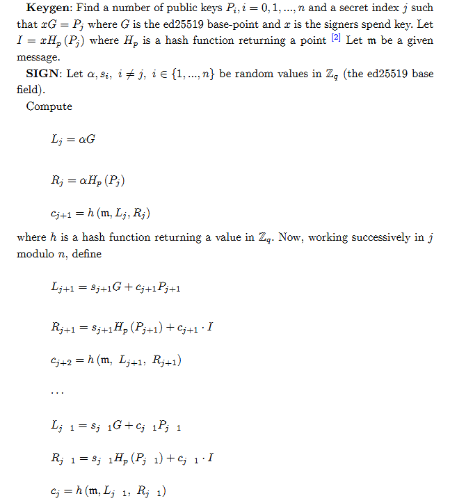
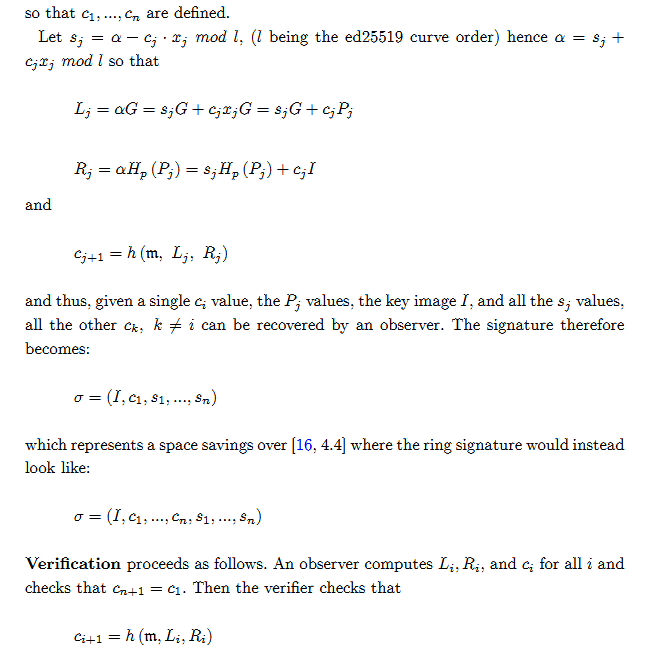
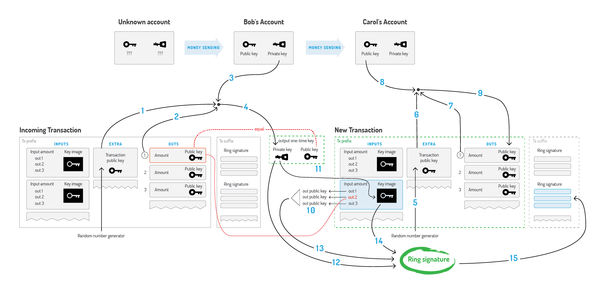
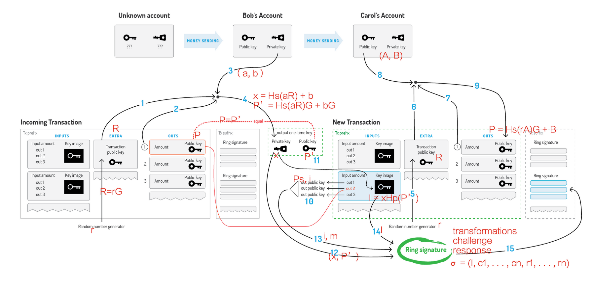

# 门罗币、ZEC和达世币的对比分析之二门罗的环签名分析

## 一、环签名的数学解析
其实按照门罗币的加密机制，是分为环签名和环签名机密交易这两部分的，但是由于它们有很多的相关信息，所以它们的实现是写在了一起，这也导致了人们提及门罗币的匿名性就只提环签名。
</br>


</br>


</br>
上面的算法是从门罗币的Ring Confidential Transactions中截取出来的。它主要有以下几个步骤来完成 ：
</br>
1、首先是产生数据，也就是keygen的过程，注意G是一个ed25519的基础数据（基域），然后利用Hp这个Keccak（P）哈希函数来生成数据。
</br>
2、生成随机值。其值域在Zq(ed25519的基础域)
</br>
3、计算L,R和c，其实就是不断的利用哈希函数和相关的公式进行计算和签名（sj = a-cj*xj），在这个计算的过程中，计算的输入和计算的输出形成一个环。
</br>
4、得到最终的签名-σ(小写的西格马)。
</br>
这其中有两个重要的公式： y^2 = x^3 + 486662^2 + x,这个椭圆曲线函数和SHA-512
</br>
当验证者进行环签名验证时：
</br>
1、计算c = h(m，Li,Ri)。
</br>
3、计算Ck,v(y1,y2,…yr)，并验证其结果是否等于v。
</br>
从上面的过程来看，其实大多数的算法过程都是成熟的算法，只是在签名过程中，使用数组
</br>
在最新的门罗币中环签名使用了增强的Ring CT：
</br>
Ring CT 在链上隐藏了交易的数额即所有的交易输入都不需要再被拆分为已知的面额（早期的门罗币是要拆成固定的金额份数的），钱包现在可以从任意的 Ring CT 输出中选择 ring 成员。
</br>
具体内容可以查看一下论文。https://eprint.iacr.org/2015/1098.pdf
</br>
更详细的相关资料请查看
</br>
https://lab.getmonero.org/pubs/MRL-0004.pdf
https://lab.getmonero.org/pubs/MRL-0005.pdf

## 二、门罗币中对环签名的使用流程

环签名的使用流程可以借用网上的两张图片来展示：
</br>


</br>
“交易”分为两部分：交易前缀、交易后缀。
</br>
“交易前缀”分为四部分：输入、额外数据、输出及交易元数据。
</br>
“交易前缀”是除“签名”外的全部数据，即“交易后缀”包含的是“签名”相关数据。
</br>
上一次交易的“额外数据”、“输出”会在下一次进行交易时用到。
</br>
接收方仅需要提供自己的地址，用于生成一次性地址，其它步骤均不参与。
</br>
“交易后缀”主要就是签名数据，包括原来的“环签”，和新的“环机密交易”
</br>
“额外数据”，除了 R 之外，还有“Transaction padding”和“ nonce”，这里没有表现出来，并且也不参与整个交易过程。
</br>
1 之前的公开交易钥匙，即 R
</br>
2 之前的一次性公钥，即 P
</br>
3 发送的私钥，用于签名
</br>
1、2、3 生成一次性公钥、私钥。私钥是 x，公钥是 P'
</br>
x 用于下面的钥匙镜像和环签。
</br>
P' 和之前的 P 验证。
</br>
12、13、14 参与环签。新的签名数据放到新的”交易后缀“。
</br>
10 -> 13 包含了索引和金额数据。
</br>
5 随机数 r 到 R
</br>
输入包含：发送金额和发送钥匙。都是处理过的
</br>
输出包含：接收金额和接收钥匙。都是处理过的
</br>
额外数据：交易公钥 R
</br>
交易后缀：就是签名数据
</br>


</br>
门罗中用linkability来避免双花。交易的输入对应一个一次性私钥，当持有一次性私钥的人花费这笔钱时，需要提供证明的签名，签名内容包含是密钥图像（key image），它的计算与私钥有关，所以当验证者发现两笔交易的密钥图像一致即可判断为双花交易。
</br>

## 三、门罗币中环签名代码分析
在门罗币的代码中，ringct的代码量并不很多，功能接口也比较直观：
</br>
首先创建一个Rct的签名
</br>

``` C++
rctSig genRct(const key &message, const ctkeyV & inSk, const keyV & destinations, const vector<xmr_amount> & amounts, const ctkeyM &mixRing, const keyV &amount_keys, const multisig_kLRki *kLRki, multisig_out *msout, unsigned int index, ctkeyV &outSk, bool bulletproof, hw::device &hwdev) {
    CHECK_AND_ASSERT_THROW_MES(amounts.size() == destinations.size() || amounts.size() == destinations.size() + 1, "Different number of amounts/destinations");
    CHECK_AND_ASSERT_THROW_MES(amount_keys.size() == destinations.size(), "Different number of amount_keys/destinations");
    CHECK_AND_ASSERT_THROW_MES(index < mixRing.size(), "Bad index into mixRing");
    for (size_t n = 0; n < mixRing.size(); ++n) {
      CHECK_AND_ASSERT_THROW_MES(mixRing[n].size() == inSk.size(), "Bad mixRing size");
    }
    CHECK_AND_ASSERT_THROW_MES((kLRki && msout) || (!kLRki && !msout), "Only one of kLRki/msout is present");

    //输入参数的匹配
    rctSig rv;
    rv.type = bulletproof ? RCTTypeFullBulletproof : RCTTypeFull;
    rv.message = message;
    rv.outPk.resize(destinations.size());
    if (bulletproof)
      rv.p.bulletproofs.resize(destinations.size());
    else
      rv.p.rangeSigs.resize(destinations.size());
    rv.ecdhInfo.resize(destinations.size());

    size_t i = 0;
    keyV masks(destinations.size()); //sk mask..
    outSk.resize(destinations.size());
    for (i = 0; i < destinations.size(); i++) {
        //add destination to sig
        rv.outPk[i].dest = copy(destinations[i]);
        //数据的验证
        //compute range proof
        if (bulletproof)
            rv.p.bulletproofs[i] = proveRangeBulletproof(rv.outPk[i].mask, outSk[i].mask, amounts[i]);
        else
            rv.p.rangeSigs[i] = proveRange(rv.outPk[i].mask, outSk[i].mask, amounts[i]);
        #ifdef DBG
        if (bulletproof)
            CHECK_AND_ASSERT_THROW_MES(verBulletproof(rv.p.bulletproofs[i]), "verBulletproof failed on newly created proof");
        else
            CHECK_AND_ASSERT_THROW_MES(verRange(rv.outPk[i].mask, rv.p.rangeSigs[i]), "verRange failed on newly created proof");
        #endif

        //mask amount and mask
        rv.ecdhInfo[i].mask = copy(outSk[i].mask);
        rv.ecdhInfo[i].amount = d2h(amounts[i]);
        hwdev.ecdhEncode(rv.ecdhInfo[i], amount_keys[i]);
    }

    //set txn fee
    if (amounts.size() > destinations.size())
    {
      rv.txnFee = amounts[destinations.size()];
    }
    else
    {
      rv.txnFee = 0;
    }
    key txnFeeKey = scalarmultH(d2h(rv.txnFee));

    rv.mixRing = mixRing;
    if (msout)
      msout->c.resize(1);
    rv.p.MGs.push_back(proveRctMG(get_pre_mlsag_hash(rv, hwdev), rv.mixRing, inSk, outSk, rv.outPk, kLRki, msout ? &msout->c[0] : NULL, index, txnFeeKey,hwdev));
    return rv;
}

```
</br>
这段代码产生一个相关的签名，其中必须包含相关rangeProofs验证需要的数据。签名者相关的数据必须在输入数据中。而且要保证输入集数据之和与输出集数据之和相等。
</br>
真正的处理在：
</br>

``` C++
mgSig proveRctMG(const key &message, const ctkeyM & pubs, const ctkeyV & inSk, const ctkeyV &outSk, const ctkeyV & outPk, const multisig_kLRki *kLRki, key *mscout, unsigned int index, key txnFeeKey, hw::device &hwdev) {
    mgSig mg;
    //setup vars
    size_t cols = pubs.size();
    CHECK_AND_ASSERT_THROW_MES(cols >= 1, "Empty pubs");
    size_t rows = pubs[0].size();
    CHECK_AND_ASSERT_THROW_MES(rows >= 1, "Empty pubs");
    for (size_t i = 1; i < cols; ++i) {
      CHECK_AND_ASSERT_THROW_MES(pubs[i].size() == rows, "pubs is not rectangular");
    }
    CHECK_AND_ASSERT_THROW_MES(inSk.size() == rows, "Bad inSk size");
    CHECK_AND_ASSERT_THROW_MES(outSk.size() == outPk.size(), "Bad outSk/outPk size");
    CHECK_AND_ASSERT_THROW_MES((kLRki && mscout) || (!kLRki && !mscout), "Only one of kLRki/mscout is present");

    keyV sk(rows + 1);
    keyV tmp(rows + 1);
    size_t i = 0, j = 0;
    for (i = 0; i < rows + 1; i++) {
        sc_0(sk[i].bytes);
        identity(tmp[i]);
    }
    keyM M(cols, tmp);
    //create the matrix to mg sig
    for (i = 0; i < cols; i++) {
        M[i][rows] = identity();
        for (j = 0; j < rows; j++) {
            M[i][j] = pubs[i][j].dest;
            addKeys(M[i][rows], M[i][rows], pubs[i][j].mask); //add input commitments in last row
        }
    }
    sc_0(sk[rows].bytes);
    for (j = 0; j < rows; j++) {
        sk[j] = copy(inSk[j].dest);
        sc_add(sk[rows].bytes, sk[rows].bytes, inSk[j].mask.bytes); //add masks in last row
    }
    for (i = 0; i < cols; i++) {
        for (size_t j = 0; j < outPk.size(); j++) {
            subKeys(M[i][rows], M[i][rows], outPk[j].mask); //subtract output Ci's in last row
        }
        //subtract txn fee output in last row
        subKeys(M[i][rows], M[i][rows], txnFeeKey);
    }
    for (size_t j = 0; j < outPk.size(); j++) {
        sc_sub(sk[rows].bytes, sk[rows].bytes, outSk[j].mask.bytes); //subtract output masks in last row..
    }
    return MLSAG_Gen(message, M, sk, kLRki, mscout, index, rows, hwdev);
}
```
</br>
这段代码是环签名的重要环节，它通过对KEY的反复处理，达到最终的求σ。这里的细节就不展开了。
</br>
如果需要对签名进行验证使用下面的代码：
</br>

``` C++

bool verRct(const rctSig & rv, bool semantics) {
    PERF_TIMER(verRct);
    CHECK_AND_ASSERT_MES(rv.type == RCTTypeFull || rv.type == RCTTypeFullBulletproof, false, "verRct called on non-full rctSig");
    if (semantics)
    {
      if (rv.type == RCTTypeFullBulletproof)
        CHECK_AND_ASSERT_MES(rv.outPk.size() == rv.p.bulletproofs.size(), false, "Mismatched sizes of outPk and rv.p.bulletproofs");
      else
        CHECK_AND_ASSERT_MES(rv.outPk.size() == rv.p.rangeSigs.size(), false, "Mismatched sizes of outPk and rv.p.rangeSigs");
      CHECK_AND_ASSERT_MES(rv.outPk.size() == rv.ecdhInfo.size(), false, "Mismatched sizes of outPk and rv.ecdhInfo");
      CHECK_AND_ASSERT_MES(rv.p.MGs.size() == 1, false, "full rctSig has not one MG");
    }
    else
    {
      // semantics check is early, we don't have the MGs resolved yet
    }

    // some rct ops can throw
    try
    {
      if (semantics) {
        tools::threadpool& tpool = tools::threadpool::getInstance();
        tools::threadpool::waiter waiter;
        std::deque<bool> results(rv.outPk.size(), false);
        DP("range proofs verified?");
        for (size_t i = 0; i < rv.outPk.size(); i++) {
          tpool.submit(&waiter, [&, i] {
            if (rv.p.rangeSigs.empty())
              results[i] = verBulletproof(rv.p.bulletproofs[i]);
            else
              results[i] = verRange(rv.outPk[i].mask, rv.p.rangeSigs[i]);
          });
        }
        waiter.wait();

        for (size_t i = 0; i < rv.outPk.size(); ++i) {
          if (!results[i]) {
            LOG_PRINT_L1("Range proof verified failed for output " << i);
            return false;
          }
        }
      }

      if (!semantics) {
        //compute txn fee
        key txnFeeKey = scalarmultH(d2h(rv.txnFee));
        bool mgVerd = verRctMG(rv.p.MGs[0], rv.mixRing, rv.outPk, txnFeeKey, get_pre_mlsag_hash(rv, hw::get_device("default")));
        DP("mg sig verified?");
        DP(mgVerd);
        if (!mgVerd) {
          LOG_PRINT_L1("MG signature verification failed");
          return false;
        }
      }

      return true;
    }
......
}

```

</br>
从源码中可以看到，RCT中使用的相关的加密的很多相关算法都是使用用的标准的加密的方法，这也说明RCT只是对原有环签名的一个改进而不是革命。在验证的接口中，主要是对前面提到的签名完成后的验证环节的实现。

## 四、总结
门罗币的环机密交易签名机制虽然在匿名交易中有着快速安全的特点，但是参与者的选取等问题，仍然存在着可能泄露交易信息的情况。但是相对于比特币和以太坊，门罗币则要安全许多，这也导致很多的灰色交易转到了以门罗币的支付上来。
</br>
其实分析下来发现，数学还是基础，没有数学的证明，都是浮云。
</br>
