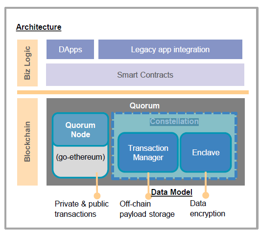
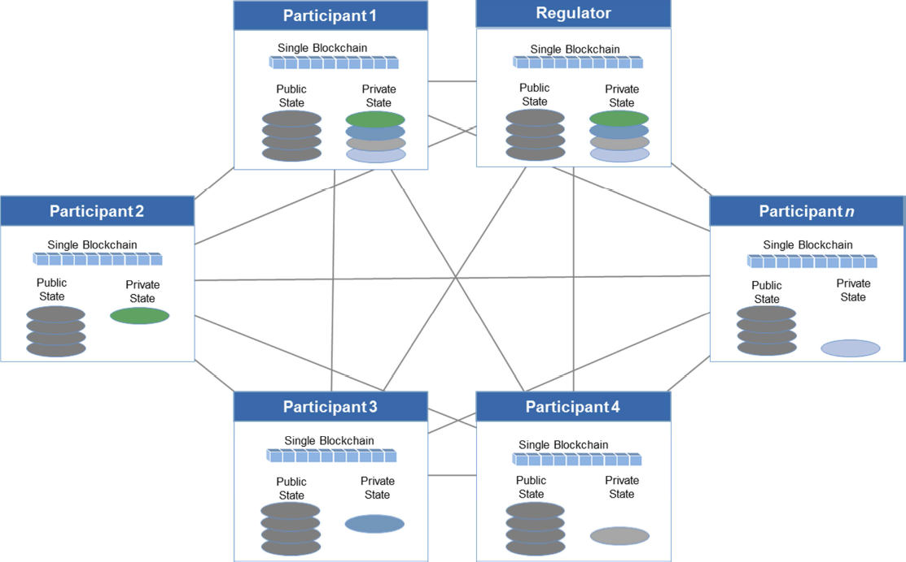
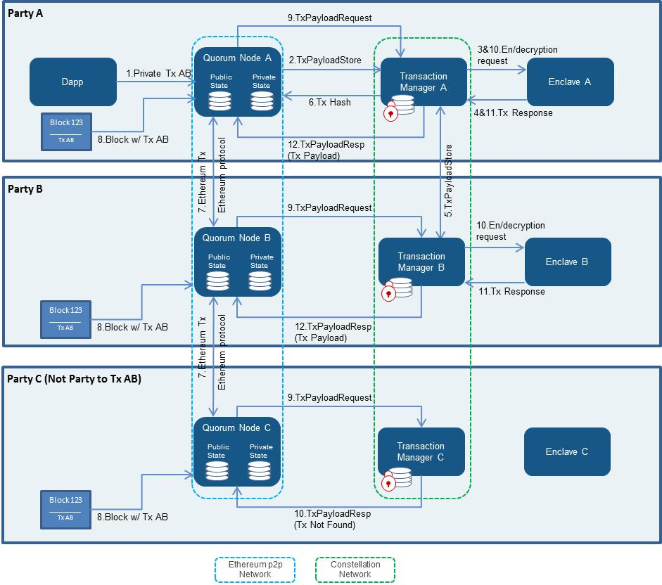

# J.P.Morgan Quorum 介绍

## 简介

Quorum是是一个联盟链方案，由摩根大通开发的企业级分布式账本和智能合约平台，它是在以太坊(Ethereum)的基础上开发的，提供私有智能合约执行方案，并满足企业级的性能要求。适用于需要高速交易以及高吞吐量处理联盟间进行私有交易的应用场景，主要是为了解决了区块链技术在金融及其他行业应用的特殊挑战而设计。

Quorum是基于以太坊的Golang版本(go-ethereum)开发而成，为金融服务行业提供以太坊许可链方案，可以方便的支持交易与合约的隐私性。在go-ethereum的基础上，主要的改动点有如下几项：

- 添加了交易与合约的隐私性：对于一笔交易来说，只有交易的相关方才能看到交易的细节，非相关方是看不到交易细节的
- 网络/节点的许可管理：由于Quorum不是公链，而是联盟链，这个特点决定了不是任何节点都是能够随意加入区块链的，只有经过授权的节点才能够加入区块链
- 调整了共识机制：把以太坊原有的PoW调整为基于Raft的共识机制
- 更高性能：由于共识算法的调整，创建新块的步骤和整个区块链对新块达成共识的速度大大提高

## Quorum的系统架构

如下图所示，这是Quorum企业级区块链的系统架构图：

从架构图中我们可以看到，Quorum是基于以太坊的Golang版本开发。Quorum做设计之初就确定尽可能避免重复造轮子，尽量复用更多的已有技术，尽可能的减少对以太坊的修改，以便于未来合并以太坊升级之后的代码更容易。

整个Quorum的系统架构分为上下两层，

##### 下层是传统的区块链层

这一层为整个Quorum提供基础的区块链功能服务，作为上层应用层的基础设施，为上层提供相应的编程接口，使得应用层能够充分的利用底层的区块链功能。

从图中可以明显的看出来，这一层包含了三大组件：
1. 基于以太坊的Quorum节点
2. 事物管理器(Transaction Manager)
3. 飞地(Enclave)

Quorum节点，就是修改后的以太坊的Golang版本实现，用以存储公共的交易和私有交易。Quorum对geth做了以下改动：

- 把PoW共识算法，修改成基于Raft的共识算法
- P2P网络层，修改成只有授权节点才能加入网络
- 区块生成逻辑，由检查“全局状态root”改为检查“全局公开状态root”
- 区块验证逻辑，在区块头，将“全局状态root”替换成“全局公开状态root”
- 状态树，分成公开状态树和私有状态树
- 区块链验证逻辑，修改成处理“私有事务”
- 创建事务，修改成允许交易数据被加密哈希替代，以维护必需的隐私数据
- 删除以太坊中Gas的定价，尽管保留Gas本身

另外就是包含了Quorum添加进来的最重要的Constellation模块，这个模块我们可以想象它是一个分布式的密钥服务器，等同于用PGP加密消息的MTA（消息传输代理）网络，做为一个独立的模块，它可以适用于包括区块链在内的许多类型的应用程序，它是实现Quorum的“隐私引擎”，目前的版本使用Haskell语言编写。

Constellation模块又进一步的细分为两个子模块：

1. 事务管理器（Transaction Manager）：
允许访问私有事务的加密交易数据、管理本地数据存储以及与其他事务管理器的通信。它做隐私数据的数据层，提供数据的安全访问并利用Enclave来实现数据的安全加密。

2. 飞地（Enclave）
Enclave就是为了解决区块链中记帐的真实性和安全性而实现的一个模块。它通过事务隔离和特定的加密措施来提供并行操作，大大提高了性能。正如上面所讲，隐私数据的安全处理基本都是通过Enclave来实现的。

##### 上层是商业逻辑层

具体的业务应用程序全部都在这一层，应用层使用底层提供的区块链功能来实现传统的商业业务到区块链系统的移植。这一层又细分为三个子模块：

1. 智能合约模块(Smart Contracts)：
2. DApps模块
3. 已有的App集成模块

Quorum的解决方案，是使用密码学技术来对私有交易数据加密，以防止交易方以外的人看到敏感数据。这种方案使用一个单独的共享区块链，一个智能合约框架，以及修改后的以太坊；其中智能合约框架对隐私数据进行了隔离。对go-ethereum代码库进行的修改，包括区块提案和验证过程的修改。区块验证过程，是通过执行交易合约代码来进行的，比如所有节点都对公开交易、和与交易方相关的私有交易进行验证；对于其他私有交易，节点将会忽略合约代码的执行过程。

这种设计，把状态数据库切分成为了两部分，一部分是公开状态数据库，一部分是私有状态数据库。其中公开状态数据库存储所有公开的数据，比如原始以太坊的所有交易信息都是公开数据。而私有状态数据库则只保存私有的交易信息，而且这类交易信息只有交易的相关方才能对其解密和查看，非交易相关方则无法查看交易的详细信息，这都是通过Constellation模块的加密所完成的。另外，链上所有的事物仍然可以同步到所有节点，为防止篡改和隐私而做了安全加密处理。如下图所示：

## 交易隐私性

交易隐私性是Quorum的独有特点，是其核心功能之一。为此，Quorum引入“公开交易”和“私有交易”这两个概念。注意，这只是一个理论上的概念，实际上Quorum并未引入新的事务类型；只是在以太坊事务模型的基础上扩展包含一个可选的privateFor参数，这个私有参数会使得Quorum把这一类事务当做私有事务，另外加入一个IsPrivate方法来识别交易是否是私有事务类型。

下面我们以处理私有交易的流程为例解释Quorum的事务流程，如下图所示：

在这个案例中，A和B构成了私有交易AB的交易双方，而C机构不参与该交易。

1. A将隐私交易发送到Quorum节点，节点指定交易的有效载荷（内容），并为A和B指定PrivateFor参数为A和B的公钥。
2. 节点将Tx发送到对应的Transaction Manager并存储相关的交易数据。
3. Transaction Manager调用加密的Enclave模块相关函数请求对Tx加密。
4. 节点A的Enclave检验A的私钥，如果验证通过，就进行下列动作：
 1. 第一步，生成一个对称密钥和随机值（说明一下这里使用对称密钥的作用是为了加快速度）。
 2. 第二步，使用上一步生成的密钥加密Tx及相关内容。
 3. 第三步，由SHA3-512来计算加密后的Tx的内容的HASH值。
 4. 第四步，遍历交易方列表（此处为A和B）使用第一步产生的密钥对用第一步中的public key加密，然后生成一个新的值（加密方法PGP）。
 5. 第五步，将上述二三四步的结果返回给Transaction Manager.
5. A的Transaction Manager使用从 Enclave 中获取的 hash 值作为索引把加密后的TX以及加密后的密钥保存到本地。同时，Transaction Manager会把hash值，加密后的Tx，public_key_B加密的密钥这三项通过HTTPS发送给PartyB的Transaction Manager。PartyB的Transaction Manager收到数据后，会进行ACK/NACK的应答。需要注意的是，如果A没有收到应答，那么交易不会在网上传播，也就是说，接收人存储通信的有效载荷是网络传播的前提条件。
6.  一旦发往B的Transaction Manager的交易成功，A的事务管理器便将hash值返回给其对应的Quorum节点。该节点用hash值来替换原来Tx的交易内容（有效载荷）。修改Tx的V值为37或者38（Private Transaction的标识）。其他节点可以通过这个V的值来判断其是否为已加密交易内容的相关私有交易；否则，即为一个无意义的字节码相关的公开交易。
7. 使用标准的以太坊的通信协议将节点通过P2P方式广播给整个网络。
8. 此交易被打包到区块中，并分发到各个网络用户。
9. 节点收到这个Tx的区块后，发现这个Tx的V值为37或38。表明这个Tx是隐私的交易，需要解密，需要调用本地的事务管理器，最终决定是否同意这笔交易（使用hash索引查找）。
10. 因为用户C的节点不能控制这笔Tx，所以它只会接收到一个NotARecipient的消息，从而忽略这笔交易——c用户不会更新自己的私有状态数据库。A和B将会在自己的事务管理器中查找哈希值，识别他们的确同意该交易，然后它们调用对应的Enclave模块，传递已加密交易内容和加密的系统密钥和签名。
11. Enclave模块验证签名，然后使用在Enclave中保存的该用户的私钥解密对称密钥，使用解密的密钥对交易内容进行解密，然后将解密的交易内容返回给事务管理器。
12. 用户A和B的事务管理器，将解密的Tx后通过EVM执行。执行完成后将执行结果返回给Quorum节点，并更新Quorum节点的私有状态。注意：一旦代码被执行后将会被抛弃，因此在不经过上述过程的情况下，它无法被读取。

## 基于Raft的共识机制

Quorum放弃了以太坊本身的PoW共识算法，而是使用了基于Raft的共识机制，其使用了etcd的Raft实现源代码。Quorum认为对于这类联盟链来说，不存在作恶节点，所以不需要拜占庭容错并且需要更快的出块时间（以毫秒而非秒为单位）和事务最终确认（不存在分叉）。还有一个特点是，这种共识机制不会去创建空白区块，而是按照需要更快、更有效的创建新区块。

在geth命令添加 --raft 标志，就会使得geth节点运行raft共识算法。

Raft和Ethereum都有自己的“节点”概念，但它们稍微有点儿不一样。

在Raft里面，一个“节点”在正常操作的时候，要么是Leader，要么是Follower。在整个集群里面，只有一个Leader，所有其他的节点都要从这个Leader来获取日志数据。这里还有一个Candidate的概念，不过仅仅是在Leader选举期间才有。

但是在Ethereum里面却没有Leader和Follower这样的概念，对于任何一个节点来说，都可以创建一个新块(只要计算足够快)，这就类似于Raft里面的Leader。

在基于Raft的共识算法中，在Raft和Ethereum节点之间做了一对一的对应关系，每个Ethereum节点也是Raft节点，并且按照约定，Raft集群的Leader是产生新块的唯一Ethereum节点。这个Leader负责将交易打包成一个区块，但不提供工作量证明(PoW)。

| Ethereum | Raft |
| :-: | :-: |
| minter(旷工) | leader(领导者) |
| verifier(验证者) | follower(追随者) |

在这里把Leader和产生新块的节点绑定到一起的主要原因有两点：第一是为了方便，因为Raft确保一次只有一个Leader，第二是为了避免从节点创建新块到Leader的网络跳转，所有的Raft写入操作都必须通过该跳转。Quorum的实现关注Raft Leader的变化——如果一个节点成为Leader，它将开始产生新块，如果一个节点失去Leader地位，它将停止产生新块。

Quorum使用现有的Etherum P2P传输层来负责在节点之间的通讯，但是只通过Raft的传输层来传输Block。它们是由Leader创造的，并从那里传输到集群的其余部分，总是以相同的顺序通过Raft传输。

当Leader创建新块时，不像在Ethereum中，块被写入数据库并立即成为链的新Head，只在新块通过Raft传输之后才插入块或将其设置为链的新Head。所有节点都会在锁定步骤中将链扩展到新的状态，就好像是他们在Raft中同步日志。

## 节点授权与安全

节点授权，是用来控制哪些节点可以连接到指定节点、以及可以从哪些指定节点移除的功能。目前，当启动节点的时候，通过指定--permissioned参数在节点级别处进行管理。

如果指定了--permissioned参数，节点将查找名为permissioned-nodes.json的文件。此文件包含此节点可以连接并接受来自其连接的enodes白名单。因此，启用权限后，只有permissioned-nodes.json文件中列出的节点成为网络的一部分。 如果指定了--permissioned参数，但没有节点添加到permissioned-nodes.json文件，则该节点既不能连接到任何节点也不能接受任何接入的连接。

## 总结
Quorum通过对网络节点的授权管理，使得只有被授权的节点才能够加入网络；对共识算法的调整，使得Quorum拥有更高的速度和性能；创新的隐私模型，尤其私有交易的处理，使得交易的隐私性大大加强。这一切都使得Quorum非常适合为金融场景服务。
