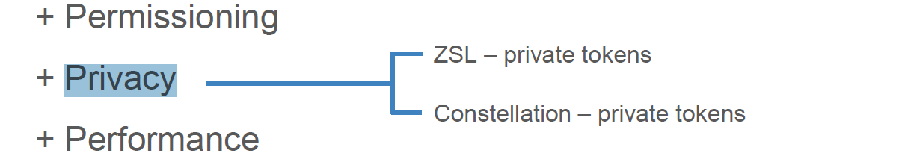
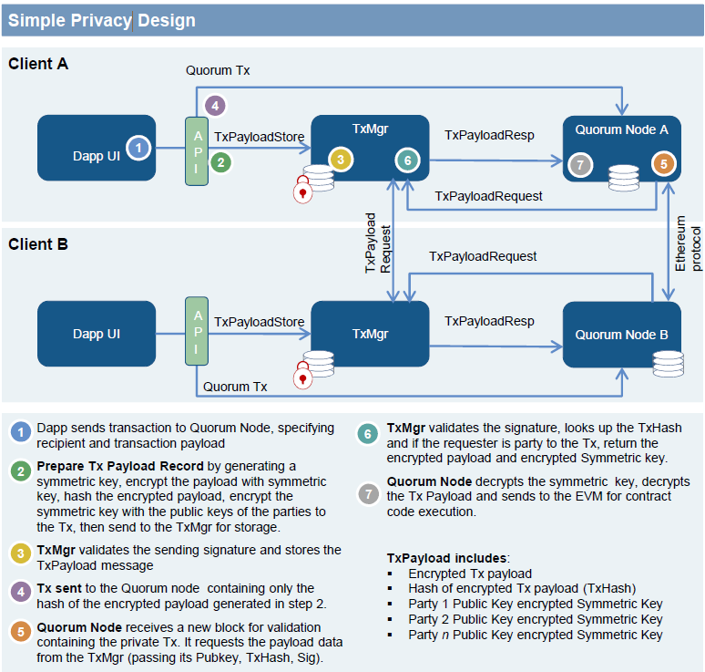
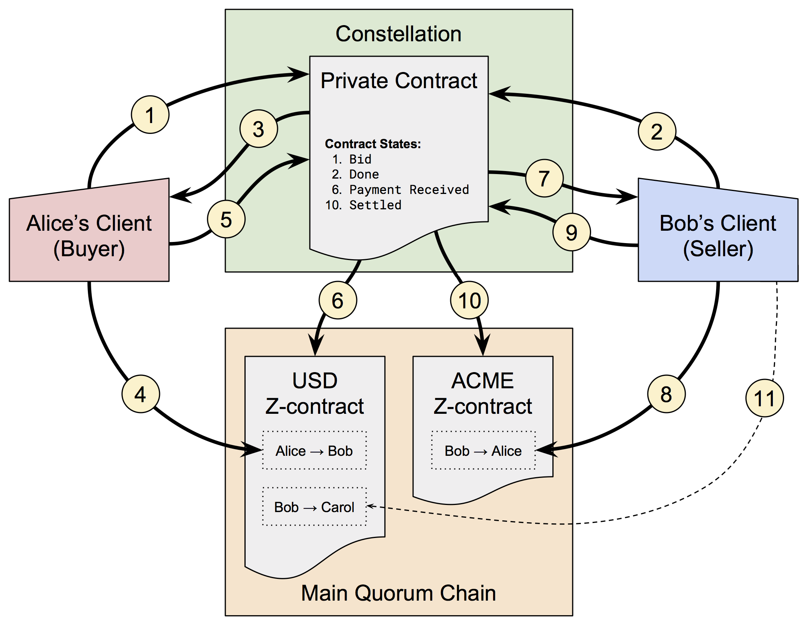

# quorum 的隐私分析

# 一、隐私性设计
privacy（隐私性）是Quorum的重要的部分，Quorum的一个重要特点就是在以太坊的基础上增加了隐私性（参看白皮书）。将交易和数据进行了隐私性隔离，包括加密和零知识证明等。在将隐私性相关抽象出来以后，导致的一个结果就是，状态数据库的分裂。
</br>
在以太坊中，MTP主宰的状态树控制着整个以太坊的世界，任何的风吹草动，都必须纳入状态数据库的更新。但是在Quorum中，公有的数据仍然保持在全局状态的更新，但是私有的数据不被更新到全局状态中，而是被加密保存到节点上，同样通过分布式的事务等同步到所有的节点上。
</br>


</br>
通过上图可以看到，隐私分成了两部分即 ZSL和Constellation两部分。
</br>
ZSL：Zero-knowledge Security Layer，即零知识证明安全层。它主要使用ZCASH的零知识证明的zk-SNARKs来增强Constellation机制。
</br>
Constellation:P2P的加密消息交换系统，提供整个Quorum的信息安全交换的模块。\
</br>
一个私有交易的简单流程：
</br>


</br>
合约交易状态：
</br>
下面的交易是允许的:
</br>
1) S -> A -> B
</br>
2) S -> (A) -> (B)
</br>
3) S -> (A) -> [B -> C]
</br>

而下面的交易是不支持的:
</br>
1) (S) -> A
</br>
2) (S) -> (A)

说明：
    S = sender
    </br>  
    (X) = private
    </br>
    X = public
    </br>
    -> = direction
    </br>
    [] = read only mode

</br>
通过上述的分析可以看出，Quorum的隐私设计是基于加密的安全算法来实现的。不管是在ZSL还是在Constellation，它都提供了相关的Token来进行相应的支持。
</br>

## 二、Constellation
</br>
Constellation模块
</br>
在Quorum的架构文档中可以看到，Constellation是其重要的一个模块。你可以想象它是一个分布式的密钥服务器，等同于用PGP加密消息的MTA（消息传输代理）网络，做为一个独立的模块，它可以适用于包括区块链在内的许多类型的应用程序，它是实现Quorum的“隐私引擎”，目前使用的版本是使用Haskell实现。
</br>
Constellation模块由两个子模块组成：
</br>


</br>

### 1、事务管理器（Transaction Manager）：
</br>
事务管理器，允许访问私有事务的加密交易数据、管理器本地数据存储以及与其他事务管理器的通信。它做隐私数据的数据层，提供数据的安全访问并利用Enclave来实现数据的安全加密。
</br>

### 2、飞地（Enclave）
</br>
Enclave就是为了解决区块链中记帐的真实性和安全性而实现的一个模块。它通过事务隔离和特定的加密措施来提供并行操作，大大提高了性能。正如上面所讲，隐私的数据的安全处理基本都是通过Enclave来实现的。
</br>

## 三、ZSL
</br>
ZSL在Quorum中是单独提供的，它提供了两种支持的方法，一种是直接在其JS平台中调用相关的接口，另外一种是使用C++ libsnark library提供的基本库来供Golang使用。具体的使用办法和接口参看下面的地址：
</br>
（https://github.com/jpmorganchase/zsl-q/blob/master/README.md）
</br>
在Quorum中，1.5和1.6版本都提供了对ZSL的支持，但在最新的版本中，没有提供对ZSL的支持。猜测可能是JP想把ZSL专门做为一个特别的部分来提供相应的服务，而不是广泛的集成到整体的Quorum这个项目中去。
</br>
下图是一个相关的简单股权交易用例：
</br>



</br>
ZSL的使用还是比较复杂的，需要下载相关的库和相关的模块。如果想完整运行一个ZSL的Quorum项目，请参照下面的地址：
</br>
https://github.com/jpmorganchase/zsl-q/blob/master/README.md
</br>

## 四、源码分析

### 1、隐私交易流程介绍
</br>
Quorum的交易有两类即”Public Transaction” 和 “Privat Transaction”，也就是公共交易类型和隐私交易类型。在实际的交易中，前者完全兼容以太坊的交易。而在后者的隐私交易中，在原有以太坊的 Transaction 模型上，进行了部分修改。在Quorum 交易tx 模型基础上增加了 “privateFor” 字段。另外在还其内部增加了一个判断是否公共或者隐私交易类型的方法 “IsPrivate”。
</br>
先看一个官方WIKI上的隐私交易的流程图，这个图中，一笔交易与用户A和用户B有关系，但是和用户C没有关系：
</br>


</br>
说明：
</br>
1）、用户A将隐私交易发送到Quorum节点，节点指定交易的有效载荷（内容），并为A和B指定PrivateFor参数为A和B的公钥。
</br>
2）、节点将Tx发送到对应的Transaction Manager并存储相关的交易数据。
</br>
3）、Transaction Manager调用加密的Enclave模块相关函数请求对Tx加密。
</br>
4）、节点A的Enclave检验A的私钥，如果验证通过，就进行下列动作：
</br>
第一步，生成一个对称密钥和随机值（说明一下这里使用对称密钥的作用是为了加快速度）。
</br>
第二步，使上一步生成的密钥加密Tx及相关内容。
</br>
第三步，由SHA3-512来计算加密后的Tx的内容的HASH值。
</br>
第四步，遍历交易方列表（此处为A和B）使用第一步产生的密钥对用第一步中的public key加密，然后生成一个新的值（加密方法PGP）。
</br>
第五步，将上述二三四步的结果返回给Transaction Manager.
</br>
5）、A的Transaction Manager使用从 Enclave 中获取的 hash 值作为索引把加密后的TX以及加密后的密钥保存到本地。同时，Transaction Manager会把hash值，加密后的TX，public_key_B加密的密钥这三项通过HTTPS发送给PartyB的Transaction Manager。PartyB的Tx Manager收到数据后，会进行ACK/NACK的应答。需要注意的同如果A没有收到应答，那么交易不会在网上传播，也就是说，接收人存储通信的有效载荷是网络传播的前提条件。
</br>
6）、一旦发往B的Transaction Manager的交易成功，A的事务管理器便将hash值返回给其对应的Quorum节点。该节点用hash值来替换原来TX的交易内容（有效载荷）。修改TX的 V 值为 37 或者 38（Private Transaction的标识）。其他节点可以通过这个 V 的值来判断其是否为已加密交易内容的相关私有交易；否则，即为一个无意义的字节码相关的公开交易。
</br>
7）、使用标准的以太坊的通信协议将节点通过P2P方式广播给整个网络。
</br>
8）、此交易被打包到区块中，并分发到各个网络用户。
</br>
9）、节点收到这个TX的区块后，发现这个TX的 V 值为37或38。表明这个Tx是隐私的交易，需要解密，需要调用本地的事务管理器，最终决定是否同意这笔交易（使用hash索引查找）。
</br>
10）、因为用户C的节点不能控制这笔TX，所以它只会接收到一个NotARecipient的消息，从而忽略这笔交易——c用户不会更新自己的私有状态数据库。A和B将会在自己的事务管理器中查找哈希值，识别他们的确同意该交易，然后它们调用对应的Enclave模块，传递已加密交易内容和加密的系统密钥和签名。
</br>
11）、Enclave模块验证签名，然后使用在Enclave中保存的该用户的私钥解密对称密钥，使用解密的密钥对交易内容进行解密，然后将解密的交易内容返回给事务管理器。
</br>
12）、用户A和B的事务管理器，将解密的TX后通过EVM执行。执行完成后将执行结果返回给Quorum节点，并更新Quorum节点的私有状态。注意：一旦代码被执行将会无效，因此在不经过上述过程的情况下，它无法被读取。
</br>

### 2、隐私交易流程的源码
</br>
隐私交易的部分在Quorum中只有Transaction Manager部分，Enclave部分是在另外的项目constellation中，用haskell语言编写完成。下面分别介绍这两个部分。
</br>
在了解了私有交易的流程后，看一下相关的代码：
</br>
1）、隐私交易
</br>

``` go
func (s *PublicTransactionPoolAPI) SendTransaction(ctx context.Context, args SendTxArgs) (common.Hash, error) {
......
	isPrivate := args.PrivateFor != nil

	if isPrivate {
    //判断私有交易
		//Send private transaction to local Constellation node
		log.Info("sending private tx", "data", fmt.Sprintf("%x", data), "privatefrom", args.PrivateFrom, "privatefor", args.PrivateFor)
    //这里会调用下面的PrivateTransactionManager的Send，二者就联系到一起了
		data, err = private.P.Send(data, args.PrivateFrom, args.PrivateFor)
		log.Info("sent private tx", "data", fmt.Sprintf("%x", data), "privatefrom", args.PrivateFrom, "privatefor", args.PrivateFor)
		if err != nil {
			return common.Hash{}, err
		}
		args.Data = data
	}

......
  //处理Quorum交易相关值，见上面流程说明
	isQuorum := tx.IsPrivate()
......
//签名和加密
	signed, err := wallet.SignTx(account, tx, chainID, isQuorum)
......
	return submitTransaction(ctx, s.b, signed, isPrivate)
}

//交易相关
// SendTxArgs represents the arguments to sumbit a new transaction into the transaction pool.
type SendTxArgs struct {
	From     common.Address  `json:"from"`
	To       *common.Address `json:"to"`
	Gas      *hexutil.Big    `json:"gas"`
	GasPrice *hexutil.Big    `json:"gasPrice"`
	Value    *hexutil.Big    `json:"value"`
	Data     hexutil.Bytes   `json:"data"`
	Nonce    *hexutil.Uint64 `json:"nonce"`

	PrivateFrom string   `json:"privateFrom"`
  //PrivateFor这个关键字段
	PrivateFor  []string `json:"privateFor"`
}
//增加的是否为私有交易判断
func (m Message) IsPrivate() bool {
	return m.isPrivate
}

func (tx *Transaction) IsPrivate() bool {
	if tx.data.V == nil {
		return false
	}
	return tx.data.V.Uint64() == 37 || tx.data.V.Uint64() == 38
}

func (tx *Transaction) SetPrivate() {
  //设置V的值，见上面的流程
	if tx.data.V.Int64() == 28 {
		tx.data.V.SetUint64(38)
	} else {
		tx.data.V.SetUint64(37)
	}
}
```
</br>

2）、Transaction Manager模块
</br>
这个模块包含private.go和node.go以及constellation.go几个模块。在private.go中实现了：
</br>

``` go
type PrivateTransactionManager interface {
	Send(data []byte, from string, to []string) ([]byte, error)
	Receive(data []byte) ([]byte, error)
}
```
</br>
而在Constellation这个结构体中实现了这个接口：
</br>

``` go
func (g *Constellation) Send(data []byte, from string, to []string) (out []byte, err error) {
	if g.isConstellationNotInUse {
		return nil, ErrConstellationIsntInit
	}
	out, err = g.node.SendPayload(data, from, to)
	if err != nil {
		return nil, err
	}
	g.c.Set(string(out), data, cache.DefaultExpiration)
	return out, nil
}

func (g *Constellation) Receive(data []byte) ([]byte, error) {
	if g.isConstellationNotInUse {
		return nil, nil
	}
	if len(data) == 0 {
		return data, nil
	}
	// Ignore this error since not being a recipient of
	// a payload isn't an error.
	// TODO: Return an error if it's anything OTHER than
	// 'you are not a recipient.'
	dataStr := string(data)
	x, found := g.c.Get(dataStr)
	if found {
		return x.([]byte), nil
	}
	pl, _ := g.node.ReceivePayload(data)
	g.c.Set(dataStr, pl, cache.DefaultExpiration)
	return pl, nil
}
```
</br>
Constellation通过RPC调用Haskell的接口：
</br>

``` go
type Client struct {
	httpClient *http.Client
}
func (c *Client) SendPayload(pl []byte, b64From string, b64To []string) ([]byte, error) {
	buf := bytes.NewBuffer(pl)
	req, err := http.NewRequest("POST", "http+unix://c/sendraw", buf)
	if err != nil {
		return nil, err
	}
	if b64From != "" {
		req.Header.Set("c11n-from", b64From)
	}
	req.Header.Set("c11n-to", strings.Join(b64To, ","))
	req.Header.Set("Content-Type", "application/octet-stream")
	res, err := c.httpClient.Do(req)

	if res != nil {
		defer res.Body.Close()
	}
	if err != nil {
		return nil, err
	}
	if res.StatusCode != 200 {
		return nil, fmt.Errorf("Non-200 status code: %+v", res)
	}

	return ioutil.ReadAll(base64.NewDecoder(base64.StdEncoding, res.Body))
}
```
</br>
通过上述的一系列调用，就产生一个RPC的请求，传递到Enclave.
</br>
3）、Enclave模块
</br>
在Haskell的项目中主要有以下几个模块：主模块、Enclave模块、Node模块和相关的工具模块，这里重点介绍Enclave模块。
</br>

``` haskell
--加密交易内容数据结构
data EncryptedPayload = EncryptedPayload
    { eplSender    :: Box.PublicKey
    , eplCt        :: ByteString
    , eplNonce     :: SBox.Nonce
    , eplRcptBoxes :: [ByteString]
    , eplRcptNonce :: Box.Nonce
    } deriving Eq
--实例化为Show类型
instance Show EncryptedPayload where
    show = show . encodeable

--Hahkell语法，类似数据学函数语法，=号后即为函数体
--交易内容的加密，包括下面的重载
encodeable :: EncryptedPayload
           -> (ByteString, ByteString, ByteString, [ByteString], ByteString)
encodeable EncryptedPayload{..} =
    ( S.encode eplSender
    , eplCt
    , S.encode eplNonce
    , eplRcptBoxes
    , S.encode eplRcptNonce
    )
instance Binary EncryptedPayload where
    put = put . encodeable
    --后面以\表示lambda表达式
    get = get >>= \(sender, ct, nonce, rcptBoxes, rcptNonce) -> return EncryptedPayload
        { eplSender    = fromJust $ S.decode sender
        , eplCt        = ct
        , eplNonce     = fromJust $ S.decode nonce
        , eplRcptBoxes = rcptBoxes
        , eplRcptNonce = fromJust $ S.decode rcptNonce
        }
encrypt :: ByteString
          -> Box.PublicKey
          -> Box.SecretKey
          -> [Box.PublicKey]
          -> IO EncryptedPayload    --IO表示不纯函数，即非重入函数
encrypt pl sender pk rcpts = encrypt' pl sender cks
      where
      cks = map (safeBeforeNM sender pk) rcpts


```

``` haskell
--重载函数
encrypt' :: ByteString
         -> Box.PublicKey
         -> [Box.CombinedKey]
         -> IO EncryptedPayload
encrypt' pl eplSender cks = do
    (mk, eplNonce, eplCt) <- sboxSeal pl
    eplRcptNonce          <- Box.newNonce
    let eplRcptBoxes = map (\ck -> Box.boxAfterNM ck eplRcptNonce emk) cks
        emk          = S.encode mk
    return EncryptedPayload{..}
```
</br>
相关的RPC：
</br>

``` haskell
--主线程启动监听网络
defaultMain :: IO ()
defaultMain = do
    args     <- getArgs
    --通过配置文件来配置网线参数
    (cfg, _) <- extractConfig args
    if cfgJustShowVersion cfg
        then putStrLn ("Constellation Node " ++ version)
        else do
            _ <- case cfgWorkDir cfg of
                Nothing -> return ()
                Just wd -> do
                    createDirectoryIfMissing True wd
                    setCurrentDirectory wd
            case cfgJustGenerateKeys cfg of
                 [] -> withStderrLogging $ run cfg
                 ks -> mapM_ generateKeyPair ks
--启动并开户线程处理
run :: Config -> IO ()
run cfg@Config{..} = do
    setupLogging cfgVerbosity
    debugf' "Configuration: {}" [pShowNoColor cfg]
    sanityCheckConfig cfg
    setupParallelism
    logf' "Constructing Enclave using keypairs {}"
        [show $ zip cfgPublicKeys cfgPrivateKeys]
    (crypt, pubs) <- setupCrypt cfgPublicKeys cfgPrivateKeys cfgPasswords
    ast           <- mustLoadPublicKeys cfgAlwaysSendTo
    (selfPub, _)  <- newKeyPair
    logf' "Throwaway public key for self-sending: {}" [show selfPub]
    storage                  <- setupStorage cfgStorage
    (warpFunc, m, setSecure) <- setupTls cfg
    nvar <- newTVarIO =<<
        newNode crypt storage cfgUrl pubs ast selfPub cfgOtherNodes m
        setSecure
        --启动线程处理监听
    _    <- forkIO $ do
        let mwl = if null cfgIpWhitelist
                then Nothing
                else Just $ whitelist cfgIpWhitelist
        logf' "Public API listening on 0.0.0.0 port {} with whitelist: {}"
            ( cfgPort
            , Shown $ if isNothing mwl then ["Disabled"] else cfgIpWhitelist
            )
        warpFunc (Warp.setPort cfgPort Warp.defaultSettings) $
            apiApp mwl Public nvar
    _       <- case cfgSocket of
        Just sockPath -> void $ forkIO $ runPrivateApi sockPath nvar
        Nothing       -> return ()
    registerAtExit $ do
        log "Shutting down... (Interrupting this will cause the next startup to take longer)"
        case cfgSocket of
            Just sockPath -> resetSocket sockPath
            Nothing       -> return ()
        readTVarIO nvar >>= closeStorage . nodeStorage
    log "Node started"
    withAtExit $ runNode nvar
```
</br>
API接口消息处理：
</br>
``` haskell
--request的接口处理
request :: ApiType -> TVar Node -> Wai.Application
request apiType nvar req resp = do
    b <- Wai.lazyRequestBody req
    let h    = Wai.requestHeaders req
        path = Wai.pathInfo req
    case parseRequest path b h of
        Left err     -> do
            warnf "Failed to decode '{}' ({}) request: {}"
                ( TE.decodeUtf8 $ Wai.rawPathInfo req
                , TE.decodeUtf8 $ Wai.requestMethod req
                , err
                )
            resp badRequest
        Right apiReq -> if authorizedRequest apiType apiReq
            then do
                eapiRes <- performRequest nvar apiReq
                case eapiRes of
                    Left err     -> do
                        warnf "Error performing API request: {}; {}" (Shown apiReq, err)
                        resp internalServerError
                    Right apiRes -> do
                        debugf "Request from {}: {}; Response: {}"
                            ( Shown $ Wai.remoteHost req
                            , Shown apiReq
                            , Shown apiRes
                            )
                        resp $ ok $ response apiRes
            else do
                warnf "Blocked unauthorized request from {}: {}"
                    (Shown $ Wai.remoteHost req, Shown apiReq)
                resp unauthorized

parseRequest :: [Text] -> BL.ByteString -> RequestHeaders -> Either String ApiRequest
-----
-- Node client
-----
parseRequest ["send"]       b _ = ApiSend       <$> AE.eitherDecode' b
parseRequest ["receive"]    b _ = ApiReceive    <$> AE.eitherDecode' b
parseRequest ["sendraw"]    b h = ApiSendRaw    <$> decodeSendRaw b h
parseRequest ["receiveraw"] _ h = ApiReceiveRaw <$> decodeReceiveRaw h
parseRequest ["delete"]     b _ = ApiDelete     <$> AE.eitherDecode' b
```

</br>
逻辑节点的消息处理：
</br>

``` haskell
refreshLoop :: StdGen -> TVar Node -> IO ()
refreshLoop g nvar = do
    nodeRefresh nvar
    -- Wait approximately five minutes
    let (jitteredDelay, ng) = randomR (280, 320) g
    threadDelay (seconds jitteredDelay) >> refreshLoop ng nvar

nodeRefresh :: TVar Node -> IO ()
nodeRefresh nvar = do
    node <- readTVarIO nvar
    let PartyInfo{..} = nodePi node
    epis <- mapM
        (getRemotePartyInfo nvar)
        (HS.toList $ HS.delete piUrl piParties)
    let (ls, rs) = partitionEithers epis
    --符号‘$’的优先级最低的意义就是：它和附近的元素发生结合是最晚的。等价于其后跟()
    forM_ ls $ \err -> warnf "Synchronization failed: {}" [err]
    atomically $ mergePartyInfos nvar rs
--读取IO消息
getRemotePartyInfo :: TVar Node -> Text -> IO (Either String PartyInfo)
getRemotePartyInfo nvar url = trys $ do
    logf "Starting synchronization with {}" [url]
    Node{..} <- atomically $ readTVar nvar
    res      <- simplePostLbs nodeManager nodeSetSecure
        (T.unpack url ++ "partyinfo") (encode nodePi)
    logf "Finished synchronization with {}" [url]
    evaluate $ decode (responseBody res)
```
</br>
haskell的代码纯数学的，理解起来有点头大啊，又回到从前的感觉。
</br>

### 2、ZSL的分析
</br>
在Quorum中，ZSL是定位于增强Constellation模块的。下面简要的分析一下ZSL的代码：
</br>
1）、在Quorum中增加的ZSL部分
</br>
在1.6版本中，core,internal,params,eth中都增加ZSL的相关代码或者模块，在vendor的引用库中，也增加了相关的zsl的库的引用。
</br>
其中主要的代码在core/zsl/api.go中，它主要引用了用GO封装的ZSL相关的接口，在代码中有一个注释说明：
</br>
```
Example to generate a proof in geth:

sk = "0xf0f0f0f00f0f0ffffffffff000000f0f0f0f0f00f0000f0f00f00f0f0f0f00ff"
pk = "0xe8e55f617b4b693083f883f70926dd5673fa434cefa3660828759947e2276348"
rho = "0xdedeffdddedeffdddedeffdddedeffdddedeffdddedeffdddedeffdddedeffdd"
value = 2378237
zsl.createShielding(rho, pk, value);

Results in:
cm = "0x58e38183982c6f7981e9f3ce0a735fdd4ca2f0cd88db6ee608c2fe1e84142d0d"
send_nf = "0xc813e257232fae0fee5244aadf98d7ab7a676724c128cd3c0d52d3a01739a3da"
ztoken.addCommitment(cm, {from:eth.accounts[0], gas:470000})
rt = ztoken.root()
treeIndex = ztoken.getWitness(cm)[0]
authPath = ztoken.getWitness(cm)[1]
zsl.createUnshielding(rho, sk, value, treeIndex, authPath)
Verify with:
zsl.verifyUnshielding(proof, spend_nf, rt, value)
```

``` go
//生成接口实例
func NewPublicZSLAPI() *PublicZSLAPI {
	return &PublicZSLAPI{}
}
func (api *PublicZSLAPI) CreateShielding(rho common.Hash, pk common.Hash, value float64) (map[string]interface{}, error) {
	result := make(map[string]interface{})

	snark.Init()
	proof := snark.ProveShielding(rho, pk, uint64(value))
	send_nf := computeSendNullifier(rho[:])
	cm := computeCommitment(rho, pk, uint64(value))
	result["proof"] = "0x" + hex.EncodeToString(proof[:])
	result["cm"] = common.BytesToHash(cm)
	result["send_nf"] = common.BytesToHash(send_nf)
	return result, nil
}
func (api *PublicZSLAPI) CreateUnshielding(rho common.Hash, sk common.Hash, value float64, treeIndex float64, authPath []string) (map[string]interface{}, error) {
	result := make(map[string]interface{})

	// copy authentication path array into two dimensional array (as required by snark.ProveUnshielding())
	if len(authPath) != ZSL_TREE_DEPTH {
		return result, errors.New(fmt.Sprintf("Authentiction path must be %d in length", ZSL_TREE_DEPTH))
	}
	var authenticationPath [ZSL_TREE_DEPTH][32]byte
	for i := 0; i < ZSL_TREE_DEPTH; i++ {
		b, err := hex.DecodeString(strings.TrimPrefix(authPath[i], "0x"))
		if err != nil {
			return result, err
		}
		var uncle [32]byte
		copy(uncle[:], b[:32])
		authenticationPath[i] = uncle
	}
  //初始化snark库，这个是零知识证明的必须
	snark.Init()
	proof := snark.ProveUnshielding(rho, sk, uint64(value), uint64(treeIndex), authenticationPath)
	send_nf := computeSendNullifier(rho[:])
	spend_nf := computeSpendNullifier(rho[:], sk)
	result["proof"] = "0x" + hex.EncodeToString(proof[:])
	result["send_nf"] = common.BytesToHash(send_nf)
	result["spend_nf"] = common.BytesToHash(spend_nf)
	return result, nil
}
func (api *PublicZSLAPI) VerifyShielding(proofHex string, send_nf common.Hash, cm common.Hash, value float64) (bool, error) {

	proof, err := getProofFromHex(proofHex)
	if err != nil {
		return false, err
	}

	snark.Init()
	result := snark.VerifyShielding(proof, send_nf, cm, uint64(value))
	return result, nil
}
```
</br>
说明一下，这里只简要说明一下零知识证明，不详细阐述零知识证明的相关算法，如果对其有兴趣，可在网上查找相关的资料。
</br>
零知识证明过程即参与的一方向另一方证明自己掌握某个秘密（或者说证明者向验证者证明自己掌握某个秘密）。在这个过程中，证明的一方并不想让另外一方知道这个秘密是什么。所以二者要按照一个约定，进行一系列的交互，然后最终由另外一方验证一方确实知道某个秘密。
</br>
在计算机领域，一般做法是把原始问题映射到NP问题。验证者只要验证证明者给出的NP问题的解即可，这个计算量需求不大。Quorum是和zcash合作，在Zash中使用的NP问题是QAP（把向量表达式表示为多项式，从而把向量的验证转化为多项式的验证，这个过程称为QAP（Quadratic Arithmetic Programs））
</br>
零知识证明的缺点，就在交互上，交互就意味着时间的延长，所以目前使用零知识证明的相关的程序，耗时都是一个瓶颈。
</br>
其它的几个模块中，也增加了相应的接口说明和相关的模块，但基本都是给这个API接口做服务的。
</br>
2）零知识证明的snark相关
</br>
在Quorum中，使用Golang封装了相关的库。形成了一个单独的项目zsl-q（还有一个与其相关的zsl-q-params项目）。
</br>
在封装的snark.go中：
</br>

``` go
func Init() {
	onceInit.Do(func() {
		C.zsl_initialize()
	})
}

func VerifyTransfer(...) bool {
	ret := C.zsl_verify_transfer(unsafe.Pointer(&proof[0]),
		unsafe.Pointer(&anchor[0]),
		unsafe.Pointer(&spend_nf_1[0]),
		unsafe.Pointer(&spend_nf_2[0]),
		unsafe.Pointer(&send_nf_1[0]),
		unsafe.Pointer(&send_nf_2[0]),
		unsafe.Pointer(&cm_1[0]),
		unsafe.Pointer(&cm_2[0]))

......
}

func ProveShielding(rho [32]byte, pk [32]byte, value uint64) [584]byte {
	var proof_buf [584]byte
......
	C.zsl_prove_shielding(rho_ptr, pk_ptr, C.uint64_t(value), unsafe.Pointer(&proof_buf[0]))

.......
}

func VerifyShielding(proof [584]byte, send_nf [32]byte, cm [32]byte, value uint64) bool {
	send_nf_ptr := C.CBytes(send_nf[:])
	cm_ptr := C.CBytes(cm[:])
	ret := C.zsl_verify_shielding(unsafe.Pointer(&proof[0]), send_nf_ptr, cm_ptr, C.uint64_t(value))

.......
}

func VerifyUnshielding(proof [584]byte, spend_nf [32]byte, rt [32]byte, value uint64) bool {
	ret := C.zsl_verify_unshielding(unsafe.Pointer(&proof[0]),
		unsafe.Pointer(&spend_nf[0]),
		unsafe.Pointer(&rt[0]),
		C.uint64_t(value))
......
}
```
</br>
这些代码和在Quorum中的Golang代码互相响应，但是真正的算法调用在下面：
</br>

``` c++
void zsl_initialize()
{
    default_r1cs_ppzksnark_pp::init_public_params();
    inhibit_profiling_info = true;
    inhibit_profiling_counters = true;
}

bool zsl_verify_unshielding(
    void *proof_ptr,
    void *spend_nf_ptr,
    void *rt_ptr,
    uint64_t value
)
{
......

    auto witness_map = UnshieldingCircuit<FieldT>::witness_map(
        std::vector<unsigned char>(spend_nf, spend_nf+32),
        std::vector<unsigned char>(rt, rt+32),
        value
    );

    r1cs_ppzksnark_verification_key<default_r1cs_ppzksnark_pp> verification_key;
    loadFromFile("unshielding.vk", verification_key);

    if (!r1cs_ppzksnark_verifier_strong_IC<default_r1cs_ppzksnark_pp>(verification_key, witness_map, proof_obj)) {
        return false;
    } else {
        return true;
    }
}

void zsl_prove_unshielding(
    void *rho_ptr,
    void *pk_ptr,
    uint64_t value,
    uint64_t tree_position,
    void *authentication_path_ptr,
    void *output_proof_ptr
)
{
......

    g.generate_r1cs_witness(
        std::vector<unsigned char>(rho, rho + 32),
        std::vector<unsigned char>(pk, pk + 32),
        value,
        tree_position,
        auth_path
    );
    pb.constraint_system.swap_AB_if_beneficial();
    assert(pb.is_satisfied());

    r1cs_ppzksnark_proving_key<default_r1cs_ppzksnark_pp> proving_key;
    loadFromFile("unshielding.pk", proving_key);

    auto proof = r1cs_ppzksnark_prover<default_r1cs_ppzksnark_pp>(proving_key, pb.primary_input(), pb.auxiliary_input(), pb.constraint_system);

......
}
```
</br>
在向下的代码，就是零知识证明的c++实现和库了，这里就不再分析，有兴趣的可以将源码下来，学习一下。
</br>
</br>

# 五、总结
</br>
通过上述的分析，可以看到，Quorum把privacy独立出来，确实想法比较不错，既可以依赖以太坊的公网技术实现区块链的功能，又可以在其基础上开发相应的专门的联盟链的分支，达到自己的目的。
</br>
不管是从设计上还是技术的实现上，Quorum力求简单明了，在整个源码的阅读过程中，看不到什么特别的设计技巧，显得非常的接地气。
</br>
