#  RSA累加器的论文简要说明

## 一、目前对RSA累加器的相关论文
目前RSA累加器的论文有好多，前面也介绍过，从1994年，RSA相关的研究就展开了。这里只介绍一篇斯坦福大学的针对区块链的默克尔树的相关的这方面的论文，即《Batching Techniques for Accumulators with Applications to IOPs and Stateless Blockchains》，中文《用于IOP和无状态区块链的累加器批处理技术》。这篇论文的地址在：
 
https://eprint.iacr.org/eprint-bin/getfile.pl?entry=2018/1188&version=20190314:012023&file=1188.pdf
 
需要说明的是，这篇论文的的版本有好几个，更新的频率还是挺快的，大家需要根据实际情况来分析。

## 二、概要
在这篇论文中主要介绍了以下几个方面：
#### 1、提出一个在去中心化的场景下使用的批处理的累加器。
#### 2、使用非交互的方式以恒定大小进行成员和非成员的证明。
#### 3、未知顺序组的证明（求幂和零知识证明及两组元素间离散对数知识证明）
#### 4、无状态区块的构造和批处理。

## 三、内容分析
先说明一下，可能因为个人的能力和数学水平，有些知识点不一定准确，如果有疑问，请大家参考上面的论文。
下面就分段进行分析：
## 1、介绍
这部分主要是介绍了累加器的定义和静态动态累加器。同时以比特币为一个例子，通过UTXO来构建交互式 oracle 证明 (IOPs)和概率可检证明 (PCPs)。通过扩展RSA累加器来进行批量的成员和非成员证明。其实这就类似于默克尔树的作用了。
## 2、前提条件
论文中给定了六个定义：自适应假设，强RSA假设，完整性，论点（知识），零知识和非交互式参数。
这一部分的比较麻烦，好多的数学理论，需要一定的数学功底。这里不展开说了，有兴趣仔细看看论文。

## 3、隐序组的简洁证明
这部分分成了以下几个证明方式：
求幂证明(POE)：
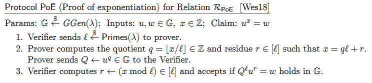

同态原像的简洁证明：
 

 
离散对数知识证明（POKE）：
 

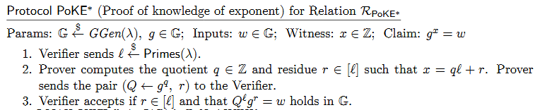
 
同态原像知识的简洁证明：
 

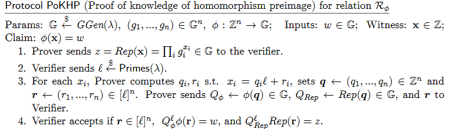
 
离散对数的简洁零知识证明：
 

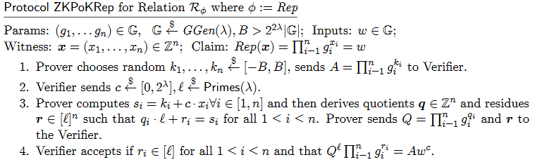
 

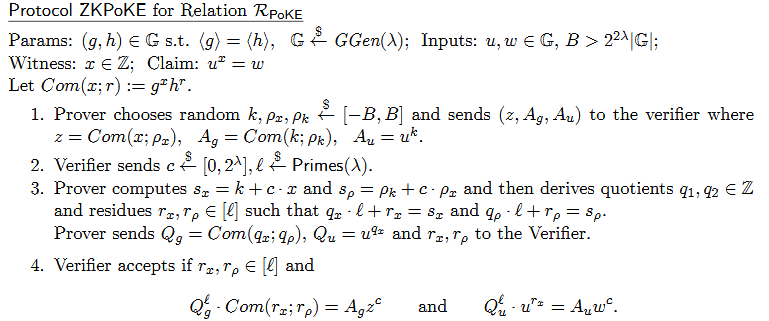
 
Aggregating Knowledge of Co-prime Roots（）：
 

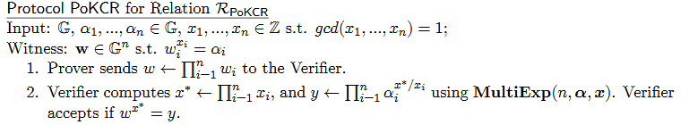
 

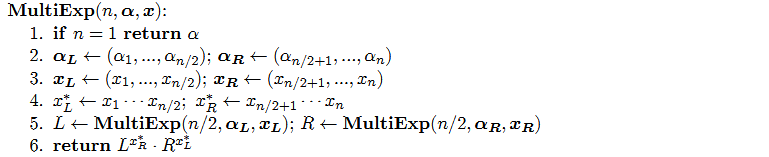
## 4、通用累加器
这节主要是讲通用累加器的构建：
 

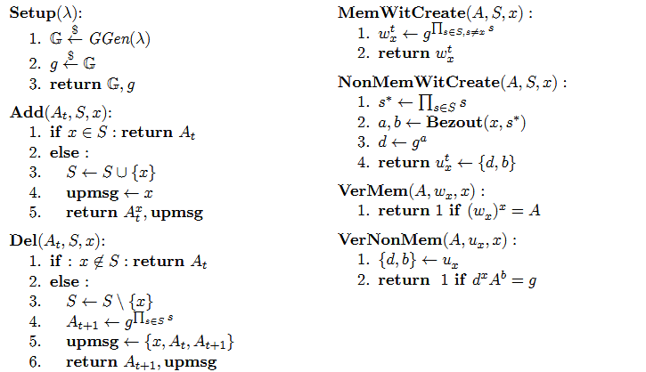
 
累加器的构建步骤在论文上有详细的描述，在4.1节：
 

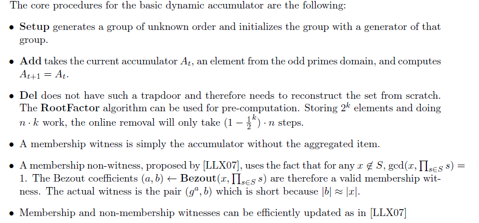
 
下面是非交互式的证明：
 

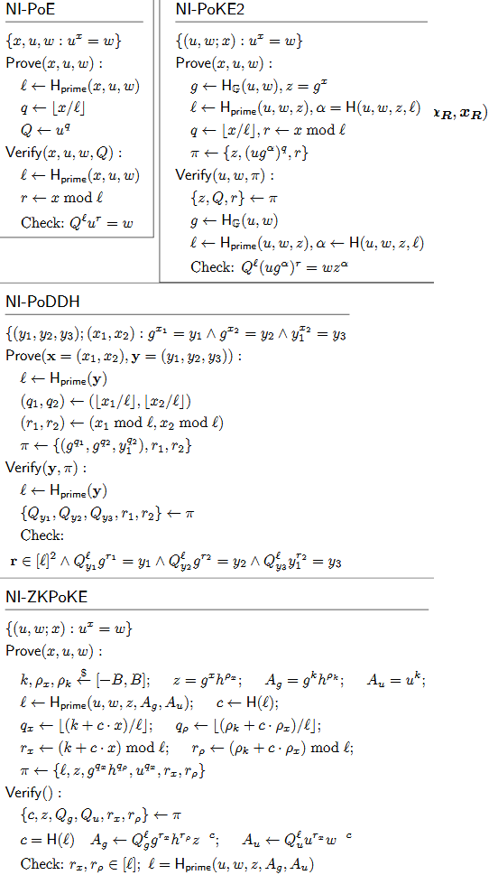
在累加器的构造过程中，如果使用非交互式的方法可以大幅提高效率，正如在零知识证明之中一样，在累加器的
## 5、少量参数批向量承诺
这节主要利用批处理来进行类似于默克尔树的验证方案：
 

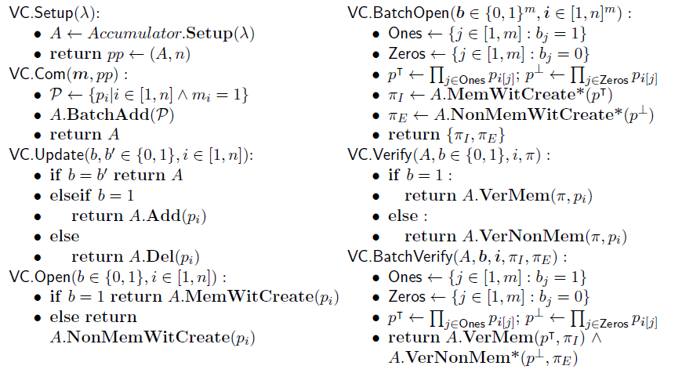
使用bezout是用来进行非成员函数证明的。通过增加NI-POKE2来确保安全性。
## 6、哈希素数
在前面提到过质数的相关定义，在累加器中，为了安全起见，需要处理累积的值来判断是否为质数，抵抗协同因子的攻击。所以在在本文中通过一系列的防碰撞的哈希函数的简单算法，在素数域内处理累加器的计数。
 
同样，在累加器的创建和使用过程中，对相关的数据也要求处理成素数。

## 7、应用程序
这部分主要是进行一个无状态的区块链的创建，利用累加器实现高效的UTXO承诺，允许用用户在非完整的UTXO集合时进行交易。为了达到这个目的，为RSA累加器的批处理技术创建了新的简洁的零知识证明来处理未知顺序的组的证明。

## 8、安全证明
此部分是提供上应用到的证明过程，可以忽略。

## 四、总结
这篇文章主要是抛砖引玉，毕竟对数学加密这一块还是初学者，希望能通过这篇短文和大家一起探讨累加器在区块链上的应用场景。
