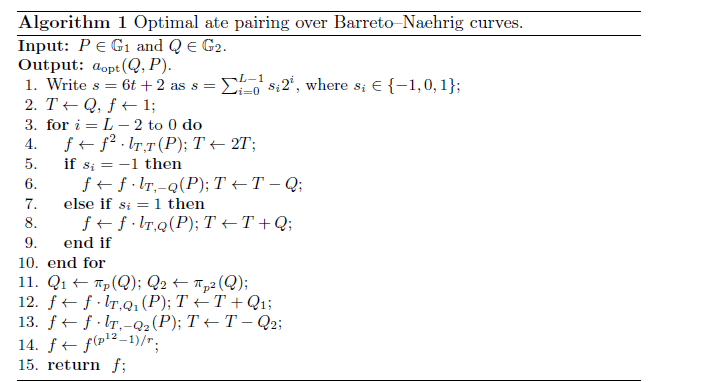

# 一个pairing库的介绍

## 一、论文及相关库的介绍
这是一篇改进BN曲线算法的论文，相关论文《High-Speed Software Implementation of the Optimal Ate Pairing over Barreto–Naehrig Curves》的地址：
https://eprint.iacr.org/2010/354.pdf
它原来提供的源码的地址已经经失效，但是在Github上可以找到这个源码库地址：
https://github.com/herumi/ate-pairing
这个库是用c++实现的，一般来看，算法这一块的源码用c/c++实现的还是比较多的。毕竟都在抢效率。

## 二、特点
这篇论文及开源的代码主要是针对X86-64平台设计的Optimal Ate Pairing，所以可能在嵌入式的应用上不妥。其采用通过的蒙哥马利素域乘法器精心实现了基域的各种算法，效率相当高。在i7 2.8G的单核处理器上实现了消耗233万时钟周期（0.832毫秒）计算出254bit素数域Fp上的Optimal AtePairing。
 
其实最大的特点是有开源代码啊，这省了国人多少事。

## 三、相关内容
## 1、首先介绍了传统的双线性配对。
## 2、对Barreto-Naehrig曲线的最佳配对进行了说明：
follows [5]:
p(t) = 36t4 + 36t3 + 24t2 + 6t + 1,
r(t) = 36t4 + 36t3 + 18t2 + 6t + 1, (1)
tr(t) = 6t2 + 1,
其中 t∈Z是任意整数，使得p = p （ t ）和r = r （ t ）都是 质数。 另外， t必须足够大以保证足够 安全级别。

## 3、具体的算法步骤

## 4、对算法的说明
主要是Tower Extension Field Arithmetic从两个方面阐述，Computational Costs of the Tower Extension Field Arithmetic、Frobenius Operator，具体的说明参看论文。

## 5、对Optimal Ate Pairing的成本计算
这里面介绍了米勒循环等，重点分析了算法的计算方式和步骤中对计算的要求量。
## 6、得出结果
通过上面的过程，在前面提到的机器配置上得到了结果，不过这个不具有普遍意义还需要进一步的完善和修改。

## 四、总结
这个论文是专门针对PC设计的，所以效率还是相当高的。但是具体的一些细节，需要大家认真看论文和相关的代码。
