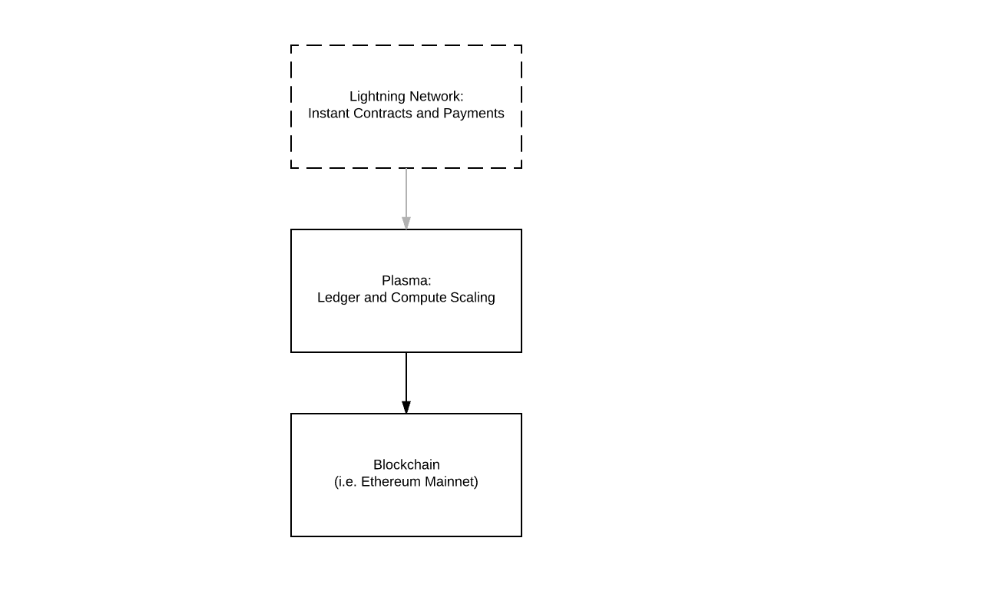
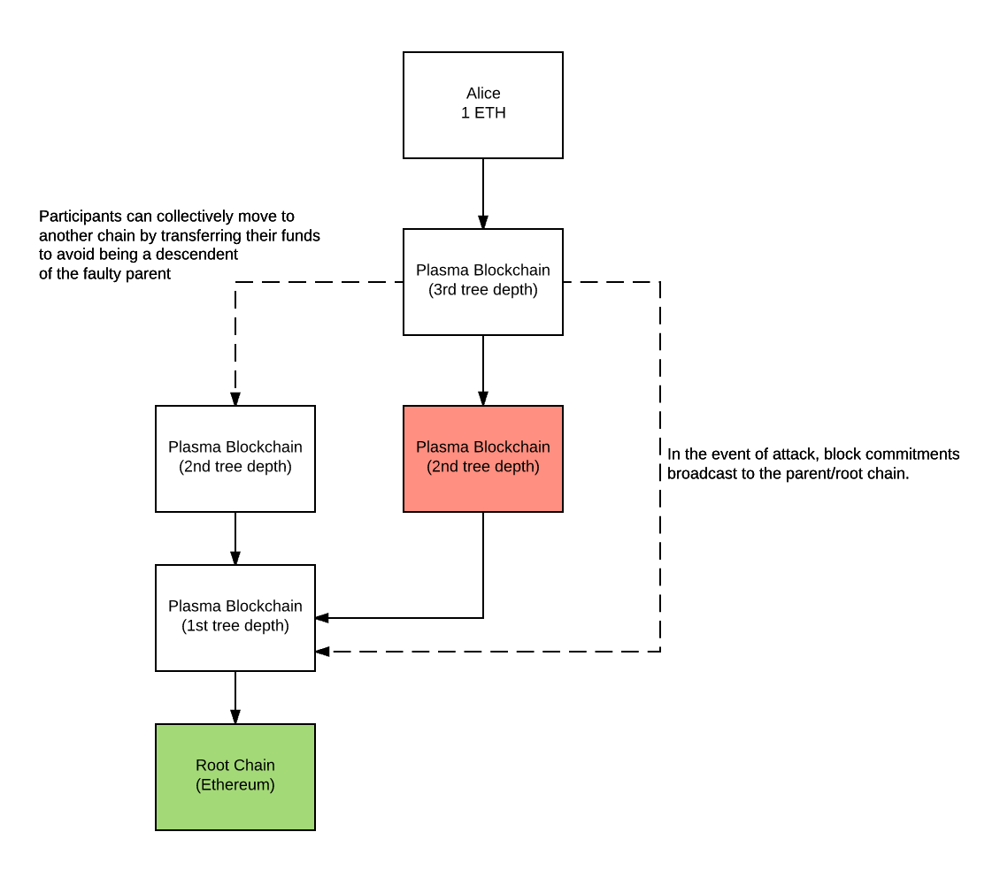

# 10分钟介绍Plasma
今天 Vitalik Buterin 和 Joseph Poon 发布了一个关于[Plasma项目](http://plasma.io/)的工作计划。

让我来解释下这个项目是如何工作的。我希望这会给你节约一点时间。

以太坊目前已经有一个Lightning Network（闪电网络）应用（还未发布为产品）叫做[Raiden（雷电网络）](https://github.com/raiden-network/raiden)

> 其基本思想是两种模式的转换，从所有的交易都放到区块链上的共享账本（这是瓶颈）的模型，切换到用户可以私下交换转账消息的模型。  
>    
> Raiden 使用点对点支付（P2P pay）通道和保证金的方式，实现了区块链一样的安全保证。  
>    
> Raiden 是以太坊的一个扩展的实施方案。一个 Raiden 节点同以太坊的节点一起运行，当 Raiden 节点与其他 Raiden 节点进行通信时，用来完成转账；当 Raiden 节点与以太坊节点进行通信时，用来管理保证金。  

即使你在链下发送数百万交易，你的 gas 费用还是会非常的低，因为你只需要少量的燃料费用来确保上链成功（例如，你可以在24小时内发送一笔交易到链上）。

欢迎Plasma加入到以太坊架构

## 区块链中的区块链
同 Lightning Network 相似，Plasma 是由一系列运行在主区块链（译者：root blockchain）（即Mainnet 以太坊区块链）上的合约。主网络合约运行只需要处理少量子区块链的交易请求，这些交易请求能够执行令人难以置信的大量计算。交易请求会定期从子区块链上向主区块链上进行广播。人们可以将主区块链视为最高法院，其他所有下级法院都从中获取权力。

然而，由于并非所有数据都被传播给所有人（只会传播那些希望得到验证状态的人被指定特殊状态的人），所以大家只会负责去定期监控自己指定的感兴趣的特定链，用来防止欺诈等行为。当发生攻击时，参与者能快速的用低廉的代价，将大部分撤回到主链中。

区块链可以分层排列在树形结构中。这将会使得它创造较好的平衡系统，以最大的限度提高数据可用性、安全性并降低成本。完全安全的挖矿工作只会在主链上完成，只有主链才具有安全性和证明的工作。

额外的扩展性来自于消除了那些不受经济条件影响的链，而专注于会执行正确行为的链。

_目前有很多系统，像 Cosmos_Polkadot 等都采用了分层的区块链。/

每一条子链都用自己的token（就像是加密货币支付给矿工的奖励一样），用来激励这条链的验证器继续运行，并提供保护，防止出现由作弊证明（Fraud Proofs）规则检查出错误状态。一旦发现作弊（“扣留攻击”或者“数据可用性问题”）-> 作弊的验证者将会被扣除存款（即债务）。

##  欺诈证明
假设区块数据是有效的，每个子链的所有状态都会通过欺诈证明（智能合约的逻辑）来执行，欺诈证明允许任何执行者执行无效的区块。欺诈证明需要确定所有状态转换都是验证过的。另外，这些欺诈证明还执行了一个资金提现的互动协议。就像 Lightning Network 提款的时候需要过一段时间才能完成。

## 小结
Plasma是区块链众多可扩展性解决方案之一（分片、PoS、LN等）。我希望它能够尽快发布。一些公司已经宣布他们将使用Plasma —— [OmiseGo](https://twitter.com/omise_go)

原文：https://medium.com/chain-cloud-company-blog/plasma-in-10-minutes-c856da94e339

#翻译/Plasma

