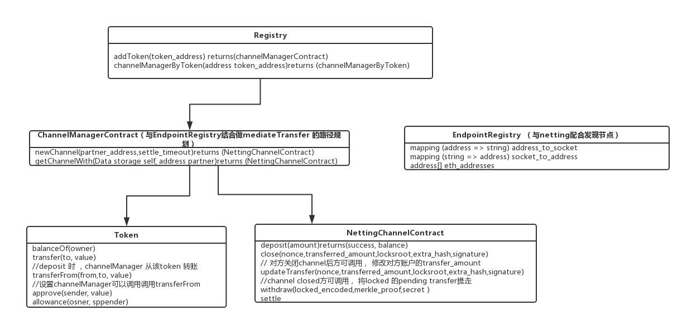

### 为什么使用 raiden-network 
1. 小额高频交易
2. 支持ERC20token交易
### 实现的原理
1. 请先阅读 [What is the Raiden Network?](https://raiden.network/101.html)
2. 想要参与交易的双方在主网创建chennel， 并各自在chennel中质押一笔资金， 

### A给B的最大可转账金额
```python
def get_balance(sender, receiver): 
    return  sender的质押金额 - 转出去的金额 + 收到的金额
def get_amount_locked(end_state):
    return 所有解锁了的锁定金额 + 所有锁定的金额    
def get_distributable(sender, receiver): // sender的可转账资金
    return get_balance(sender, receiver) - get_amount_locked(sender)
```

### 处理转账类消息
```python

```


### blockchain event的处理流程（处理partner deposit事件）
```python
event_callbacks= []

def poll_contract_new_balance(from, to, channel_addr):
    events = eth.filter({from, to, addr}) 
def reg_callbacks(cb):
    event_callbacks.append(cb)

def alarm():
   current_block_blocknum = snap.current_blocknum
   while True:
        num = poll_block_num()
        if num > current_block_blocknum:
              run_at_new_thread(event_callbacks)
        sleep(0.5)
reg_callbacks(poll_contract_new_balance) 
alarm()
```

### 雷电网络的转账模式：direcr_transfer & mediated_transfer
1. direct_transfer
... 

#### 合约
##### 类图
</br>


</br>

