## 学习使用IPFS在区块链上安全分享文件 ##

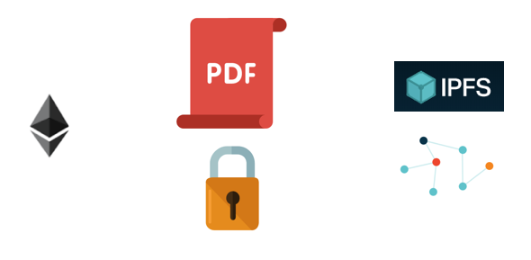

在阅读本篇文章之前，建议先阅读我们的另外一篇文章，”用少于200行Go代码来编写一个你的区块链“。

近一段时间，大家对区块链的兴趣已经达到了狂热的阶段。
尽管目前有很多来自例如加密货币和ICO等区块链应用的讨论，
但是，技术本身还是让人感觉到兴奋的。
区块链提供了一个民主化的信任和验证协议，这个协议已经打破了传统的银行体系，
并且还给其他行业带来了巨大的变革，如医疗保健，金融服务，社交应用软件等。

然而，从技术角度看，区块链并非没有瑕疵。
当前的工作量证明共识算法已经交易速度放缓到几近瘫痪的水平了。
等待比特币的交易成功，让它基本不能出现在平台系统上，
而加密猫同样使得以太坊的网络近乎停滞。

这就使得在区块链上存储数据变得没有机会成为可能。
如果区块链仅仅支持少量的关于交易双方的余额转移信息，
我们究竟如何将大文件或者是图片存放到区块链中呢？
我们是否必须将区块链的作用范围限制到小小的文本字符串的范围内？

**了解IPFS**

目前最具有前途的解决方案是由Protocol Labs提出的 [IPFS](http://ipfs.io/), 又名 Interplanetary File System.
这是一种点对点的协议，协议定义了每个节点存贮哈希文件的集合。
想要检索这些文件的客户可以访问一个抽象的很好的结构来实现，
只需要调用想要得到的文件的哈希值即可。IPFS会仔细查找节点并将文件返回给客户端。

你可以认为它与BitTorrent相似。它是一种分布式存储和引用文件的方式，
但是给你提供了更多控制方式，还可以通过哈希来引用文件，
从而实现更丰富的程序化交互模式。

通过下面这个简单的图，你可以了解到IPFS的工作流。

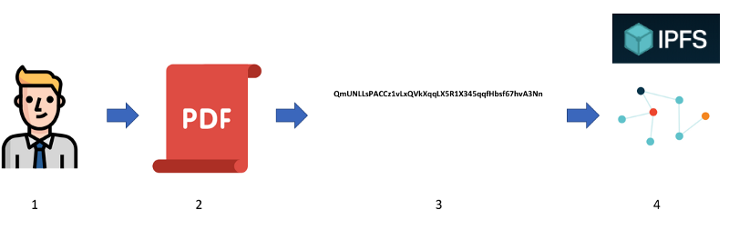

1. John想要将一份PDF文件上传到IPFS中
1. 他把他的PDF放到他的工作目录中
1. 他告诉IPFS，他想要添加这份文件到IPFS里，它会生成文件的哈希值
（因为哈希值总是以Qm开头，所以你可以告诉IPFS）
1. 他的文件现在就可以在IPFS网络中得到了

现在假设John想要通过IPFS与他的同事Mary分享这个文件。
他只需要告诉Mary从上面第三步中得到的哈希值。
然后，Mary在反向操作1-4的步骤。
Mary所需要做的就是从IPFS调用哈希，并获取PDF文件的副本。好帅气。

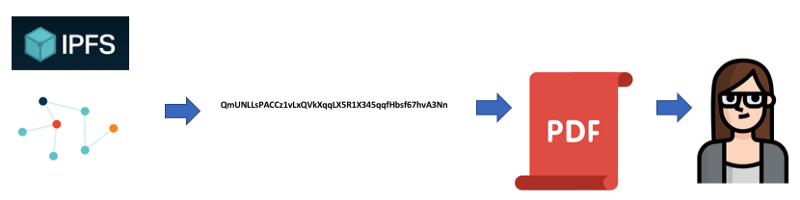

**安全漏洞**

然而，这有一个显而易见的安全漏洞。
任何人得到了PDF文件的哈希值，那就可以随意的在IPFS中获取文件副本。
因此，敏感文件不合适存放在IPFS的生态中。
在我们不做任何处理的情况下，
分享类似于健康记录或者图片之类的敏感文件是不合适的。

**应用非对称加密**

幸运的是，我们有一次性的工具，可以很好的与IPFS配套使用，
在文件上传到IPFS之前就得到保护。
非对称加密允许我们通过一个只有收件人才有的公钥来加密这份文件，
所以也就只有收件人才能从IPFS取回文件并解密。
如果一个恶意的部分从IPFS中获取到文件，也不能做什么，以为他没办法解密。
本教程中，我们将使用[GPG](https://www.gnupg.org/)非对称加密算法。
让我们修改下带有加密解密的流程图，如下：

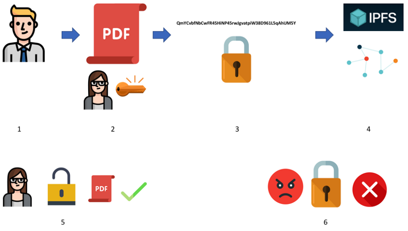

1. John上传一份文件到IPFS，但是只希望Mary可以查看到
1. 他使用了Mary提供的公钥将文件在本地目录中进行加密
1. 他告诉IPFS，他想要添加这份*加密*文件到IPFS，同时生成了加密文件的哈希
1. 他加密过的文件已经存放到IPFS网络中了
1. Mary可以获取到文件，并因为她拥有公钥生成的私钥可以用来解密这份文件
1. 其他恶意部分人员因为没有Mary的私钥不能够解密这份文件

## 区块链 ##

那么区块链怎么适合呢？在我们继续之前，我们建议你选阅读下我们之前的文章：
”使用少于200行的GO代码编写你自己的区块链“。

如下的图非常重要：

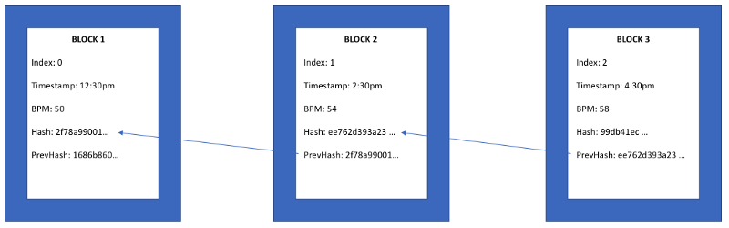

请注意BPM部分。这种简单的文本记录是目前所有区块链都可以处理的。
也是为什么加密货币很适合区块链的原因。你只需要记录交易的发送方，接收方
和开始交易的比特币（包括以太坊等等）数量。
因为所有这些哈希值都需要计算和验证以保持链的完整性，所以区块链很*可怕*，
在将文件或者大量数据存储到块中的时候将会变得非常*可怕*。

这也是为什么IPFS和区块链相结合的时候就会变得强大的原因。
替换掉前面的BPM，我们只存储IPFS文件的哈希值！真的是太cool了。
我们只在区块链中存储简单的数据，
同时我们享受了IPFS提供的文件存储和分散式点对点的特性。真是两全其美。
由于我们同时使用非对称加密的方式（GPG)增加了安全性,
因此，我们在区块链中”存储“，加密，共享大量数据和文件的方式将会变得非常优雅。

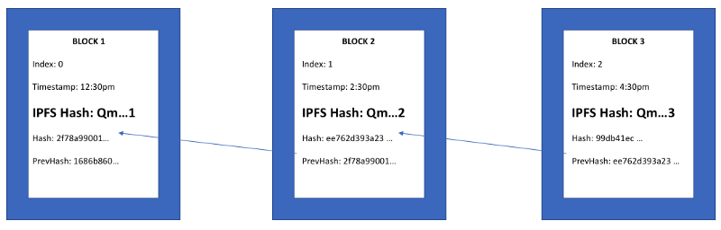

一个现实世界的应用就是在每一个区块中存储我们的健康记录和实验结果。
当我们获得新的实验结果时，我们只需要创建一个新块，
它的内容指向IPFS中的加密图像或者实验结果的PDF文件。

## 了解的已经足够多。我们开始展示如何做的吧！ ##

记下来的教程中我将会执行如下步骤：

* 设置GPG
* 设置IPFS
* 通过别人的公钥来加密文件
* 上传文件到IPFS
* 在另外一台机器（或者虚拟机）上下载文件，并且使用确定的私钥进行解密并查看内容

### 你需要如下东西 ###

* 另外一台计算机或者一个虚拟机。
*另外一台计算机模拟另外一个你需要通过安全方式进行分享文件的人*
* 一个测试文件。我们建议下载这份[文件](https://s3.amazonaws.com/myriad-web/Managed+Care/IntegratedBRAC_Negative-SampleReport.pdf)，
这是一份PDF版本的实验报告。
这是一个很好又切合实际的例子，因为我们是一家医疗保健公司，
我们需要保护敏感的个人信息。**把这份文件放到你的本地文件夹中**

好了！我们开始吧！

## 创建 ##
### GPG ###

首先让我们在两台电脑上都下载GPG.

挑选与你相同的操作系统，按照[安装文章](http://blog.ghostinthemachines.com/2015/03/01/how-to-use-gpg-command-line/)中的说明进行操作。
如果你是Mac，假设你安装了Homebrew，
最简单的方法就是打开你终端执行`brew install gnupg`命令。

在每一台电脑安装完GPG之后生成一个key。使用如下步骤：

`gpg --gen-key` 根据提示选择默认的方式。确保你的用户名和电子邮箱选择的密码都已经安全的记录或者存储下来了。

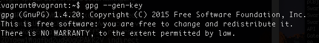

（译者注：我自己试验了下，如下图）
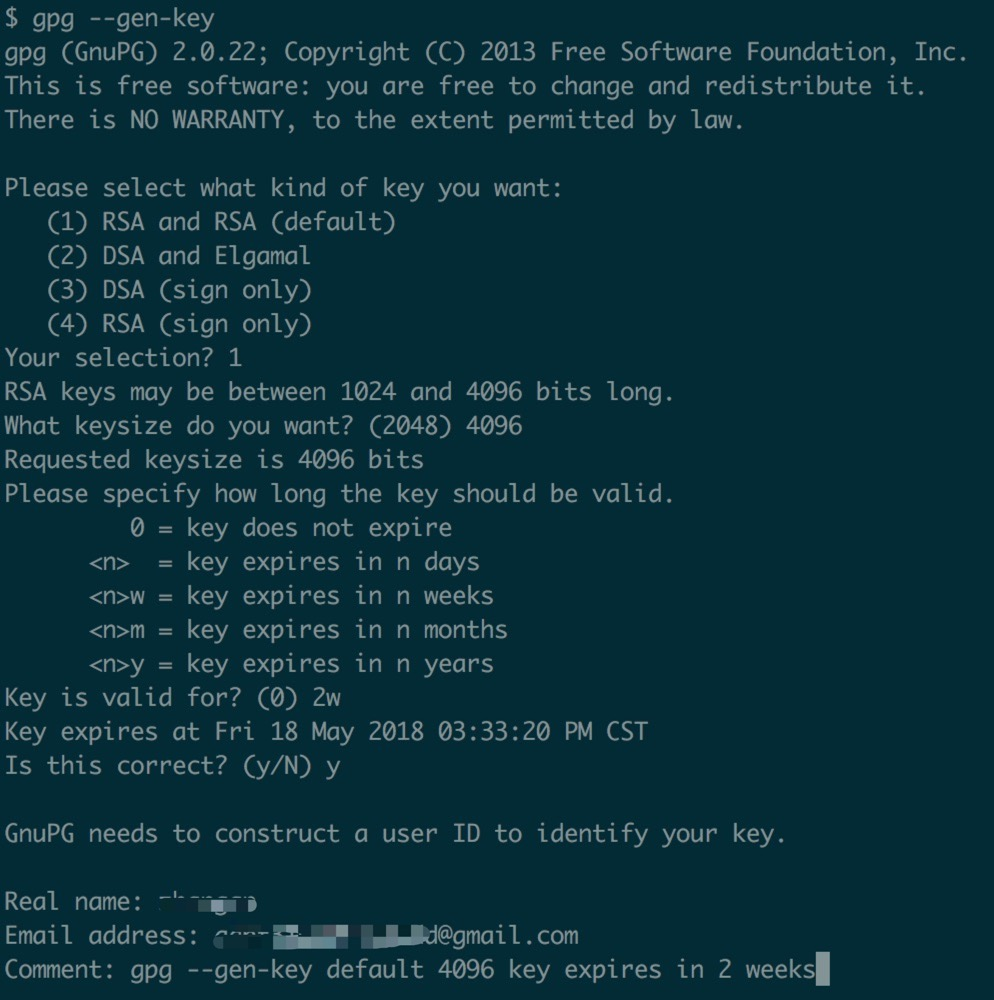

到这个阶段，gpg会要求你做一些随机的事情来生成加密使用的熵。
我只是输入一堆随机字符，直到生成完成。

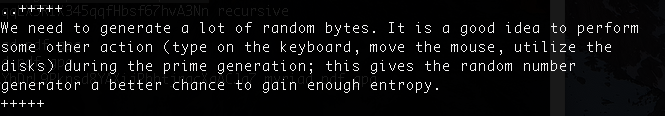

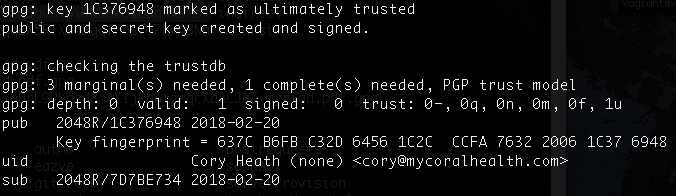

当第二台电脑上的key也创建完成后，
我们需要将生成key添加到第一台电脑的Keyring（译者注：秘钥环）中，
以便我们可以加密之后第二台电脑可以解密的文件。

使用你在创建 key 的时候选择的电子邮件地址
将第二台电脑上 public key 导出到一个二进制形式文件中。

`gpg --export --armor -email > pubkey.asc`

将文件`pubkey.asc`移动到你的第一台电脑里。并确定是安全的转移。
例如使用U盘会比使用邮件更好。

当文件`pubkey.asc`迁移到你的本地文件目录后，使用如下方法导入到秘钥环中：

`gpg --import pubkey.asc`

使用`gpg --list-kyes`的命令来检查导入是否正确。
我的第二台电脑就叫做 Cory Heath，看起来是正确的：

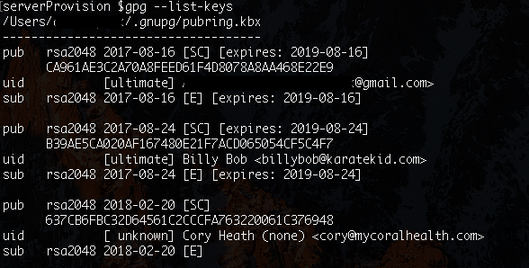

好极了！我们已经完成GPG的配置，现在我们去配置IPFS。

### IPFS ###

根据你的系统选择合适的[文档](https://ipfs.io/docs/install/)在你准备使用的两台电脑上进行安装IPFS。
当安装完成，使用命令`ipfs init`在两台电脑上进行初始化，
并使用命令`ipfs daemon`让两台电脑上的IPFS都在后台运行起来。

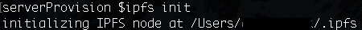

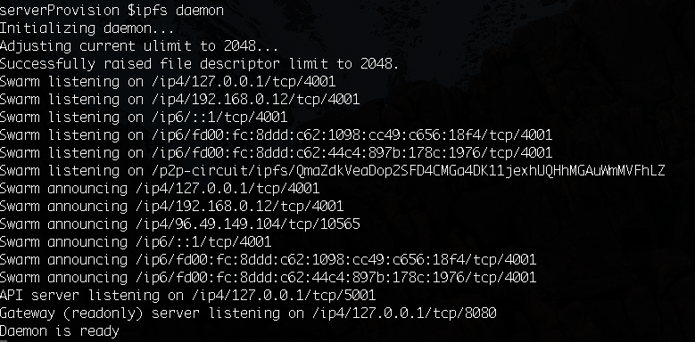

非常好！现在我们的准备工作完成了。我们要开始加密文件和上传文件了。

### 加密 ###

还记得刚刚我们下载的实验报告么？请将这个文件移动到你的第一台电脑的本地工作区。

让我们开始加密文件（因为文件来自于Myriad Genetics，我先将文件的名字修改成`myriad.pdf`），加密使用的是第二台电脑的公钥（在这个例子中，叫做Cory Heath)

`gpg --encrypt --recipient "Cory Heath" myriad.pdf`

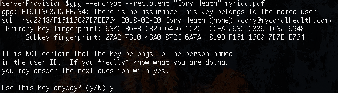

如果使用`ls`命令来查看文件夹，你会发现一个加密后的文件，叫做`myriad.pdf.gpg`

现在只有你的第二台电脑可以解密并查看这个文件。试一试！
通过Email发送给其他朋友，让他们试着解开，你会发现他们并不能打开文件！
即使将文件修改回原来为`myriad.pdf`的名字。

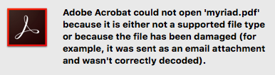

我们已经得到了加密的文件，接下来让我们把它传到IPFS上。

### 上传到IPFS ###

在第一台电脑中使用如下命令将文件上传到IPFS中

`ipfs add myriad.pdf.gpg`

我们应该得到如下的显示内容：

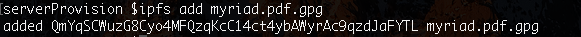

Qm...开头的字符串就是文件的哈希值。
你可以将这个哈希值分享给你朋友们，或者任何一个希望通过IPFS查看文件的人。

让我们再一次确认，保证文件已经在IPFS上了，可以使用`ipfs pin ls`命令：

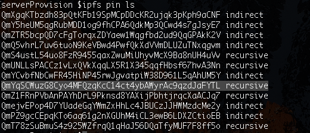

你可以看到，我们的文件哈希值确实存在，现在可以在IPFS上使用了！

### 从IPFS下载 ###

我们切换到第二台电脑上。记住，我们是在模拟另外一个人。
为了让其更加真实，可以与朋友分享这篇教程后交换电脑使用。

在我们这个例子中，我们使用的是带有vagrant的 Ubuntu VM,
而不是第二台电脑。
这*不*是要求。

在第二台电脑中，使用相同的哈希值下载你从第一台电脑中上传的加密文件：

`ipfs get QmYqSCWuzG8Cyo4MFQzqKcC14ct4ybAWyrAc9qzdJaFYTL`

如下图就是已经下载成功了：

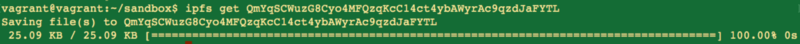

### 解密 ###

由于我们现在在第二台电脑上，我们使用的是第二台电脑的公钥进行的加密，
理论上，我们可以使在这台电脑上进行解密，并查看文件内容。

我们试一试。

解密下载的文件，让我们修改他的名字为`myriad.pdf`

`gpg --decrypt QmYqSCWuzG8Cyo4MFQzqKcC14ct4ybAWyrAc9qzdJaFYTL > myriad.pdf`

**见证奇迹的时刻：**

如果一切运行正常，当我们在另外一个台电脑上打开文件时，我们会看到文件内容。

`open myriad.pdf`

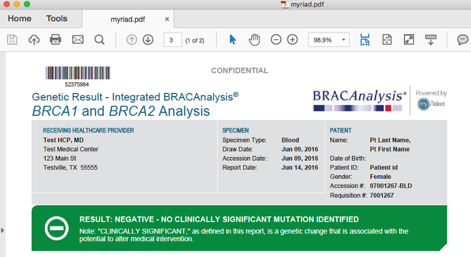

TADA!我们成功下载，解密并打开了我们的文件，该文件在IPFS上是完全加密存储的，
并且对于访问内容的任何人来说都是被保护起来的。

### 总结和下一步 ###

先鼓励下自己。我们刚刚完成的功能非常强大，解决了当今区块链中一些关键问题。

让我们快速回顾下我们刚做的事情：

* 意识到区块链中存储大量数据和文件会及其不美观
* 设置IPFS，并运行，连接成网络
* 使用GPG保护敏感文件，并将文件存储到IPFS上
* 了解IPFS中的哈希值，以及我们如何在区块链中使用分布式文件系统，使得二者更有力的融合

之前的内容能学到多少全完取决你自己。其中有很多可以单独成为分支的部分。
可以考虑将这些例子部署到你们自己的IPFS活跃节点上，用以存放重要数据。
IPFS的缺点是，当你的文件不是足够的流行，当你的节点停止服务，
那么文件也将从IPFS的网络上消失。你可以使用云服务器来当做一个IPFS节点，
先让自己存储，直到更多节点对你的文件感兴趣并存储了它们。

再次查看我们之前的”编写你自己的区块链“教程，一、二、三、四 4个部分。
一点都完成，你可以试着将IPFS和你自己大型加密文件区块链相结合。

同时，告诉我们接下来你想看到的内容！我们非常喜欢这些区块链相关的技术教程。
与我们联系的最好方式是我们的 [telegram](https://t.me/joinchat/FX6A7UThIZ1WOUNirDS_Ew) 
和 [twitter](https://twitter.com/myCoralHealth)！
我们很乐意听取到你的意见！

要了解更多的关于 Coral Health 的相关内容以及我们是如何使用区块链推进个性化医学眼角的，
请访问我们的[网站](https://mycoralhealth.com/)。

原文地址：https://medium.com/@mycoralhealth/learn-to-securely-share-files-on-the-blockchain-with-ipfs-219ee47df54c