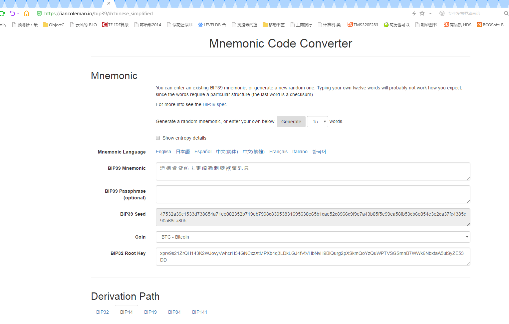
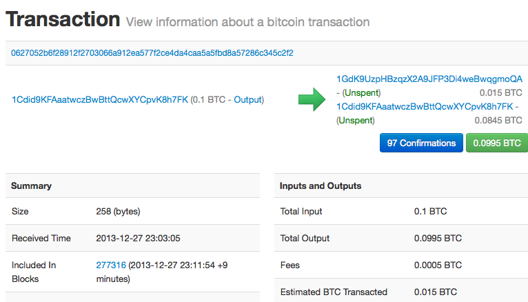

# 精通比特币三钱包和交易
***
 
# 一、钱包的种类
  
 1.非确定性钱包  
 早期的钱包基本都是由随机种子随机发生，所以每次都会产生完全没关系的互相独立的私钥。
  
 2.确定性钱包  
 确定性，或者“种子”钱包包含通过使用单项离散函数而可从公共的种子生成的私钥。
  主要是指分层确定性钱包（BIP-32/BIP-44），它由助词词(BIP-39)生成随机种子来产生一系列的密钥。使用助词词的优势就在于可以把钱包固化到硬件中。这样就不容易因为遗忘等原因千万密钥的丢失。当然，在某种程度上也提高了安全性。
  
# 二、创建钱包  

    **助词的产生**
   在github上可以看到有八种语言（英、日、韩、西班牙、中繁、简、法和意大利）基本词， **助记词经常与“脑钱包”混淆** 。 他们不一样。主要区别在于脑钱包由用户选择的单词组成，而助记符是由钱包随机创建的，并呈现给用户。  
  中文的开头几个：的 一 是 在 不 了......
  英文的开头几个：abandon ability able about above  
 
  助词词和种子产生的过程：
  1)创建一个128到256位的随机序列（熵）。
  2)提出SHA256哈希前几位（熵长/ 32），就可以创造一个随机序列的校验和。
  3)将校验和添加到随机序列的末尾。
  4)将序列划分为包含11位的不同部分。
  5)将每个包含11位部分的值与一个已经预先定义2048个单词的字典做对应。
  6)生成的有顺序的单词组就是助记码。
  7)PBKDF2密钥延伸函数的第一个参数是从步骤6生成的助记符。
  8)PBKDF2密钥延伸函数的第二个参数是盐。 由字符串常数“助记词”与可选的用户提供的密码字符串连接组成。
  9)PBKDF2使用HMAC-SHA512算法，使用2048次哈希来延伸助记符和盐参数，产生一个512位的值作为其最终输出。 这个512位的值就是种子。
    **可选密码短语**
   觉得类似于密码，但是又比密码功能多。
  BIP-39标准允许在推导种子时使用可选的密码短语。 如果没有使用密码短语，助记词是用由常量字符串“助记词”构成的盐进行延伸，从任何给定的助记词产生一个特定的512位种子。 如果使用密码短语，密钥延伸函数使用同样的助记词也会产生不同的种子。事实上，给予一个单一的助记词，每一个可能的密码短语都会导致不同的种子。 基本上没有“错误”的密码短语， 所有密码短语都是有效的，它们都会导致不同的种子，形成一大批可能未初始化的钱包。这批钱包非常之大（2^512），使用暴力破解或随机猜测基本不可能。
  不过这个容易引起不可逆转的密钥丢失，比如短语知晓人突然因为各种情况失忆或者去世。那么钱包中的币就没了。
    **从种子创建钱包** ：
  以libbitcoin为例，它实现了两种方法即书讲的早期的electrum方法和BIP-39事实上的标准方法，只介绍后者，前者大家去看书
  
//dictionary:助记词的字典
 word_list create_mnemonic(data_slice entropy, const dictionary &lexicon)
 {
     if ((entropy.size() % mnemonic_seed_multiple) != 0)
         return {};

     const size_t entropy_bits = (entropy.size() * byte_bits);
     const size_t check_bits = (entropy_bits / entropy_bit_divisor);
     const size_t total_bits = (entropy_bits + check_bits);
     const size_t word_count = (total_bits / bits_per_word);

     BITCOIN_ASSERT((total_bits % bits_per_word) == 0);
     BITCOIN_ASSERT((word_count % mnemonic_word_multiple) == 0);

     const auto data = build_chunk({entropy, sha256_hash(entropy)});

     size_t bit = 0;
     word_list words;

     for (size_t word = 0; word < word_count; word++)
     {
         size_t position = 0;
         for (size_t loop = 0; loop < bits_per_word; loop++)
         {
             bit = (word * bits_per_word + loop);
             position <<= 1;

             const auto byte = bit / byte_bits;

             if ((data[byte] & bip39_shift(bit)) > 0)
                 position++;
         }

         BITCOIN_ASSERT(position < dictionary_size);
         words.push_back(lexicon[position]);
     }

     BITCOIN_ASSERT(words.size() == ((bit + 1) / bits_per_word));
     return words;
 }
  重点看一下如何生成种子：
>   
long_hash decode_mnemonic(const word_list& mnemonic)
 {
     const auto sentence = join(mnemonic);
     const std::string salt(passphrase_prefix);//加盐
      //PBKDF2哈希算法
     return pkcs5_pbkdf2_hmac_sha512(to_chunk(sentence), to_chunk(salt),
         hmac_iterations);
 }   
 >   
 long_hash pkcs5_pbkdf2_hmac_sha512(data_slice passphrase,
     data_slice salt, size_t iterations)
 {
     long_hash hash;
     const auto result = pkcs5_pbkdf2(passphrase.data(), passphrase.size(),
         salt.data(), salt.size(), hash.data(), hash.size(), iterations);

     if (result != 0)
         throw std::bad_alloc();

     return hash;
 }   
 >   
 void HMACSHA512(const uint8_t* input, size_t length, const uint8_t* key,
    size_t key_length, uint8_t digest[HMACSHA512_DIGEST_LENGTH])
{
    HMACSHA512CTX context;
    HMACSHA512Init(&context, key, key_length);
    HMACSHA512Update(&context, input, length);
    HMACSHA512Final(&context, digest);
}   

内部会调用相关的哈希算法，HMAC-SHA512算法，使用2048次哈希来延伸助记符和盐参数，产生一个512位的值作为其最终输出。 这个512位的值就是种子。
算法的具体流程大家看相关的代码。在hmac_sha512.c sha512.c pkcs5_pbkdf2.c三个主要的文件中。
   **从种子创建钱包**
  有了种子就可以创建钱包相关的私钥和公钥了。如下图
   
  
>   
hd_private hd_private::from_seed(data_slice seed, uint64_t prefixes)
{
     // This is a magic constant from BIP32.
     static const data_chunk magic(to_chunk("Bitcoin seed"));

     const auto intermediate = split(hmac_sha512_hash(seed, magic));

     // The key is invalid if parse256(IL) >= n or 0://判断左侧的256
     if (!verify(intermediate.left))
         return {};

     const auto master = hd_lineage
     {
         prefixes,
         0x00,
         0x00000000,
         0x00000000
     };
     //返回两部分，即左侧为私钥，右侧为CHAIN，各256
     return hd_private(intermediate.left, intermediate.right, master);
 }
  //导出私钥
>   
hd_private hd_private::derive_private(uint32_t index) const
{
    constexpr uint8_t depth = 0;

    const auto data = (index >= hd_first_hardened_key) ?
        splice(to_array(depth), secret_, to_big_endian(index)) :
        splice(point_, to_big_endian(index));

    const auto intermediate = split(hmac_sha512_hash(data, chain_));

    // The child key ki is (parse256(IL) + kpar) mod n:
    auto child = secret_;
    if (!ec_add(child, intermediate.left))
        return {};

    if (lineage_.depth == max_uint8)
        return {};

    const hd_lineage lineage
    {
        lineage_.prefixes,
        static_cast<uint8_t>(lineage_.depth + 1),
        fingerprint(),
        index
    };

    return hd_private(child, intermediate.right, lineage);
}
 //产生公钥
>   
hd_public hd_public::from_secret(const ec_secret& secret,
    const hd_chain_code& chain_code, const hd_lineage& lineage)
{
    ec_compressed point;
    return secret_to_public(point, secret) ?
        hd_public(point, chain_code, lineage) : hd_public{};
}
 //导出公钥
 hd_public hd_public::derive_public(uint32_t index) const
{
  //
   if (index >= hd_first_hardened_key)
       return {};

         //static BC_CONSTEXPR size_t ec_compressed_size = 33;
         //typedef byte_array<ec_compressed_size> ec_compressed;
         //point_是一个压缩格式的公钥看上面的定义33个BYTE，66个十六进制数
   const auto data = splice(point_, to_big_endian(index));
   const auto intermediate = split(hmac_sha512_hash(data, chain_));

   // The returned child key Ki is point(parse256(IL)) + Kpar.
   auto combined = point_;
    //调用哈希算法
   if (!ec_add(combined, intermediate.left))
       return {};

   if (lineage_.depth == max_uint8)
       return {};

   const hd_lineage lineage
   {
       lineage_.prefixes,
       static_cast<uint8_t>(lineage_.depth + 1),
       fingerprint(),
       index
   };

   return hd_public(combined, intermediate.right, lineage);
}
 //回到了类似比特币源码中创建公钥的过程
>   
template <size_t Size>
bool ec_add(const secp256k1_context* context, byte_array<Size>& in_out,
    const ec_secret& secret)
{
    secp256k1_pubkey pubkey;
    return parse(context, pubkey, in_out) &&
        secp256k1_ec_pubkey_tweak_add(context, &pubkey, secret.data()) == 1 &&
        serialize(context, in_out, pubkey);
}
 
# 三、密钥的衍生  

  强化衍生和正常衍生：一个是从母公钥衍生子链码，一个是从母私钥衍生子链码。为了区别二者，产生的索引号区分了范围：
 前者是0\~2\^31-1，后者是2\^31\~3\^32-1
  由主私钥衍生出的私钥起始以“m”打头。由主公钥衍生的公钥起始以“M“打头。因此，母密钥生成的第一个子私钥是m/0。第一个公钥是M/0。第一个子密钥的子密钥就是m/0/1，以此类推。
   **钱包树状结构的导航**
  钱包树太灵活了，不容易控制。所以BIP-43，44提出了多帐户结构。
  BIP-43提出使用第一个强化子索引作为特殊的标识符表示树状结构的“purpose”。基于BIP-43，HD钱包应该使用且只用第一层级的树的分支，而且有索引号码去识别结构并且有命名空间来定义剩余的树的目的地。举个例子，HD钱包只使用分支m/i'/是 为了表明那个被索引号“i”定义的特殊为目地。

在BIP-43标准下，为了延长的那个特殊规范，BIP-44提议了多账户结构作为“purpose”。所有遵循BIP-44的HD钱包依据只使用树的第一个分支的要求而被定义：m/44'/。 BIP-44指定了包含5个预定义树状层级的结构：
 
m / purpose' / coin_type' / account' / change / address_index
 
第一层的purpose总是被设定为44'。
 
第二层的“coin_type”特指币种并且允许多元货币HD钱包中的货币在第二个层级下有自己的亚树状结构。目前有三种货币被定义：Bitcoin is m/44'/0'、Bitcoin Testnet is m/44'/1'，以及 Litecoin is m/44'/2'。
 
树的第三层级是“account”，这可以允许使用者为了会计或者组织目的，而去再细分他们的钱包到独立的逻辑性亚账户。 举个例子，一个HD钱包可能包含两个比特币“账户”：m/44'/0'/0' 和 m/44'/0'/1'。每个账户都是它自己亚树的根。
 
第四层级就是“change”。每一个HD钱包有两个亚树，一个是用来接收地址一个是用来创造找零地址。注意无论先前的层级是否使用强化衍生，这一层级使用的都是常规衍生。这是为了允许这一层级的树可以在不安全环境下，输出扩展公钥。
 
被HD钱包衍生的可用的地址是第四层级的子级，就是第五层级的树的“address_index”。
  
# 四、交易  

  还是得先上一章交易图  
 
  来查看一下比特币的发送代码：
  sendcoinsdialog.cpp:这个是钱包的发送界面类
>   
void SendCoinsDialog::on_sendButton_clicked()
 {
     if(!model || !model->getOptionsModel())
         return;

......
     // prepare transaction for getting txFee earlier
     WalletModelTransaction currentTransaction(recipients);
     WalletModel::SendCoinsReturn prepareStatus;
     if (model->getOptionsModel()->getCoinControlFeatures()) // coin control enabled
         prepareStatus = model->prepareTransaction(currentTransaction, CoinControlDialog::coinControl);
     else
         prepareStatus = model->prepareTransaction(currentTransaction);

     // process prepareStatus and on error generate message shown to user
     processSendCoinsReturn(prepareStatus,
         BitcoinUnits::formatWithUnit(model->getOptionsModel()->getDisplayUnit(), currentTransaction.getTransactionFee()));

     if(prepareStatus.status != WalletModel::OK) {
         fNewRecipientAllowed = true;
         return;
     }

     CAmount txFee = currentTransaction.getTransactionFee();
 ......

     // now send the prepared transaction
     WalletModel::SendCoinsReturn sendStatus = model->sendCoins(currentTransaction);
     // process sendStatus and on error generate message shown to user
     processSendCoinsReturn(sendStatus);
......
 }   
  继续看sendCoins这个函数：   
>   
WalletModel::SendCoinsReturn WalletModel::sendCoins(WalletModelTransaction &transaction)
{
    QByteArray transaction_array; // store serialized transaction

    {
        LOCK2(cs_main, wallet->cs_wallet);
        CWalletTx \*newTx = transaction.getTransaction();

        Q_FOREACH(const SendCoinsRecipient &rcp, transaction.getRecipients())
        {
....
                rcp.paymentRequest.SerializeToString(&value);
                newTx->vOrderForm.push_back(make_pair(key, value));
            }
            else if (!rcp.message.isEmpty()) // Message from normal bitcoin:URI (bitcoin:123...?message=example)
                newTx->vOrderForm.push_back(make_pair("Message", rcp.message.toStdString()));
        }

        CReserveKey \*keyChange = transaction.getPossibleKeyChange();
        if(!wallet->CommitTransaction(\*newTx, \*keyChange))
            return TransactionCommitFailed;

        CTransaction\* t = (CTransaction*)newTx;
        CDataStream ssTx(SER_NETWORK, PROTOCOL_VERSION);
        ssTx << \*t;
        transaction_array.append(&(ssTx[0]), ssTx.size());
    }

    // Add addresses / update labels that we've sent to to the address book,
    // and emit coinsSent signal for each recipient
    Q_FOREACH(const SendCoinsRecipient &rcp, transaction.getRecipients())
    {
        // Don't touch the address book when we have a payment request
.....
        Q_EMIT coinsSent(wallet, rcp, transaction_array);
    }
    checkBalanceChanged(); // update balance immediately, otherwise there could be a short noticeable delay until pollBalanceChanged hits

    return SendCoinsReturn(OK);
}
 
>   
bool CWallet::CommitTransaction(CWalletTx& wtxNew, CReserveKey& reservekey)
{
    {
        LOCK2(cs_main, cs_wallet);
        LogPrintf("CommitTransaction:\n%s", wtxNew.ToString());
        {
            // This is only to keep the database open to defeat the auto-flush for the
            // duration of this scope.  This is the only place where this optimization
            // maybe makes sense; please don't do it anywhere else.
            CWalletDB* pwalletdb = fFileBacked ? new CWalletDB(strWalletFile,"r+") : NULL;

            // Take key pair from key pool so it won't be used again
            reservekey.KeepKey();

            // Add tx to wallet, because if it has change it's also ours,
            // otherwise just for transaction history.
            AddToWallet(wtxNew, false, pwalletdb);
...
        }

        // Track how many getdata requests our transaction gets
        mapRequestCount[wtxNew.GetHash()] = 0;

        if (fBroadcastTransactions)
        {
            // Broadcast
            if (!wtxNew.AcceptToMemoryPool(false))
            {...
            }
            wtxNew.RelayWalletTransaction();
        }
    }
    return true;
}

 RelayWalletTransaction调用RelayTransaction  
 
>   
void RelayTransaction(const CTransaction& tx)
{
    CDataStream ss(SER_NETWORK, PROTOCOL_VERSION);
    ss.reserve(10000);
    ss << tx;
    RelayTransaction(tx, ss);
}
 
void RelayTransaction(const CTransaction& tx, const CDataStream& ss)
{
  //初始化一个INV，供下面发送
    CInv inv(MSG_TX, tx.GetHash());
    {
        LOCK(cs_mapRelay);
        // Expire old relay messages
        while (!vRelayExpiration.empty() && vRelayExpiration.front().first < GetTime())
        {
            mapRelay.erase(vRelayExpiration.front().second);
            vRelayExpiration.pop_front();
        }
 
        // Save original serialized message so newer versions are preserved
        mapRelay.insert(std::make_pair(inv, ss));
        vRelayExpiration.push_back(std::make_pair(GetTime() + 15 * 60, inv));
    }
    LOCK(cs_vNodes);
    BOOST_FOREACH(CNode* pnode, vNodes)
    {
        if(!pnode->fRelayTxes)
            continue;
        LOCK(pnode->cs_filter);
        if (pnode->pfilter)
        {
            if (pnode->pfilter->IsRelevantAndUpdate(tx))
                pnode->PushInventory(inv);
        } else
            pnode->PushInventory(inv);//到这里基本发送的INV数据准备完成。
    }
}
void PushInventory(const CInv& inv)
{
    {
        LOCK(cs_inventory);
        if (!setInventoryKnown.count(inv))
            vInventoryToSend.push_back(inv);
    }
}
下面是驱动本节点数据向外分发交易数据的部分，即把vInventoryToSend中的数据发送P2P网络：
 在前面的启动分析过程中知道，在aapinit2中会调用StartNode--ThreadMessageHandler：在其中通过BOOST的信号连接：
 g_signals.SendMessages(pnode, pnode == pnodeTrickle || pnode->fWhitelisted);调用SendMessages
  

 
>   
bool SendMessages(CNode* pto, bool fSendTrickle)
 {

 ......
         //
         // Message: inventory
         //
         vector<CInv> vInv;
         vector<CInv> vInvWait;
         {
             LOCK(pto->cs_inventory);
             vInv.reserve(pto->vInventoryToSend.size());
             vInvWait.reserve(pto->vInventoryToSend.size());
             BOOST_FOREACH(const CInv& inv, pto->vInventoryToSend)
             {
                 if (pto->setInventoryKnown.count(inv))
                     continue;

                 // trickle out tx inv to protect privacy
                 if (inv.type == MSG_TX && !fSendTrickle)
                 {
                     // 1/4 of tx invs blast to all immediately
                     static uint256 hashSalt;
                     if (hashSalt.IsNull())
                         hashSalt = GetRandHash();
                     uint256 hashRand = ArithToUint256(UintToArith256(inv.hash) ^ UintToArith256(hashSalt));
                     hashRand = Hash(BEGIN(hashRand), END(hashRand));
                     bool fTrickleWait = ((UintToArith256(hashRand) & 3) != 0);

                     if (fTrickleWait)
                     {
                         vInvWait.push_back(inv);
                         continue;
                     }
                 }
                 // returns true if wasn't already contained in the set
                 if (pto->setInventoryKnown.insert(inv).second)
                 {
                     vInv.push_back(inv);
                     if (vInv.size() >= 1000)
                     {
                         pto->PushMessage("inv", vInv);
                         vInv.clear();
                     }
                 }
             }
             pto->vInventoryToSend = vInvWait;
         }
         if (!vInv.empty())
             pto->PushMessage("inv", vInv);

 ......

         //同步区块
         // Message: getdata (blocks)
         //
         vector<CInv> vGetData;
         if (!pto->fDisconnect && !pto->fClient && (fFetch || !IsInitialBlockDownload()) && state.nBlocksInFlight < MAX_BLOCKS_IN_TRANSIT_PER_PEER) {
             vector<CBlockIndex*> vToDownload;
             NodeId staller = -1;
             FindNextBlocksToDownload(pto->GetId(), MAX_BLOCKS_IN_TRANSIT_PER_PEER - state.nBlocksInFlight, vToDownload, staller);
             BOOST_FOREACH(CBlockIndex \*pindex, vToDownload) {
                 vGetData.push_back(CInv(MSG_BLOCK, pindex->GetBlockHash()));
                 MarkBlockAsInFlight(pto->GetId(), pindex->GetBlockHash(), consensusParams, pindex);
    ...
         }

         //
         // Message: getdata (non-blocks)
         //
         while (!pto->fDisconnect && !pto->mapAskFor.empty() && (\*pto->mapAskFor.begin()).first <= nNow)
         {
             const CInv& inv = (\*pto->mapAskFor.begin()).second;
             if (!AlreadyHave(inv))
             {
                 if (fDebug)
                     LogPrint("net", "Requesting %s peer=%d\n", inv.ToString(), pto->id);
                 vGetData.push_back(inv);
                 if (vGetData.size() >= 1000)
                 {
                     pto->PushMessage("getdata", vGetData);
                     vGetData.clear();
                 }
             }
             pto->mapAskFor.erase(pto->mapAskFor.begin());
         }
         if (!vGetData.empty())
             pto->PushMessage("getdata", vGetData);

     }
     return true;
 }
  来看一下那个PushMessage：   
 
>   
template<typename T1>
 void PushMessage(const char* pszCommand, const T1& a1)
 {
     try
     {
         BeginMessage(pszCommand);
         ssSend << a1;
         EndMessage();
     }
     catch (...)
     {
         AbortMessage();
         throw;
     }
 }
重点在EndMessage中：   
void CNode::EndMessage() UNLOCK_FUNCTION(cs_vSend)
{
...
    std::deque<CSerializeData>::iterator it = vSendMsg.insert(vSendMsg.end(), CSerializeData());
    ssSend.GetAndClear(\*it);
    nSendSize += (\*it).size();

    // If write queue empty, attempt "optimistic write"
    if (it == vSendMsg.begin())
        SocketSendData(this);//通过这个函数用SOCKET发送到了相应的节点上。

    LEAVE_CRITICAL_SECTION(cs_vSend);
}

  
  
  
  
  
  
  
  
  
  
  
  
  
  
  
  
  
  
  
  
  
  
  
  
